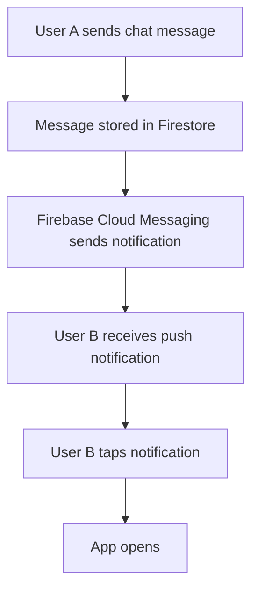
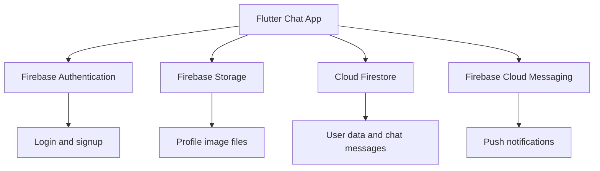
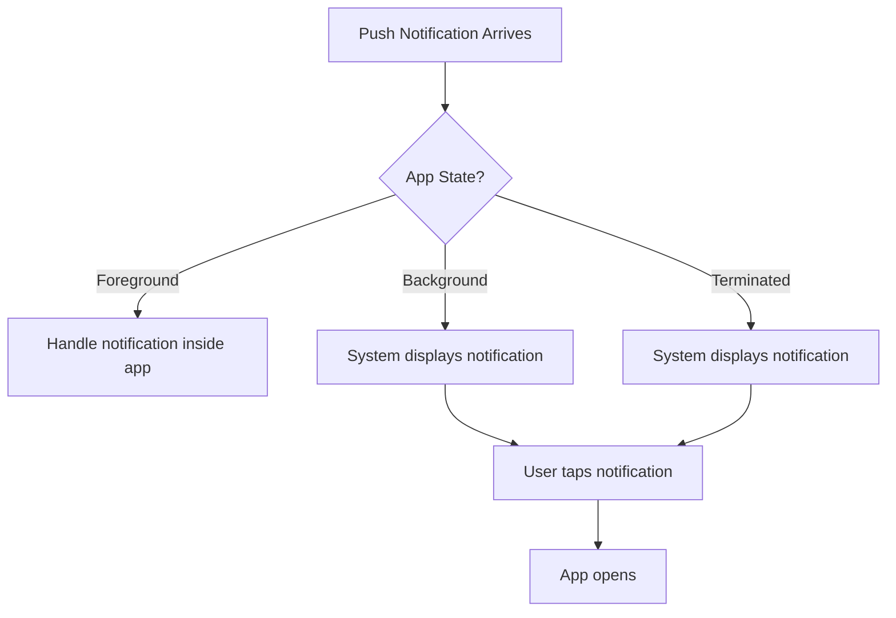
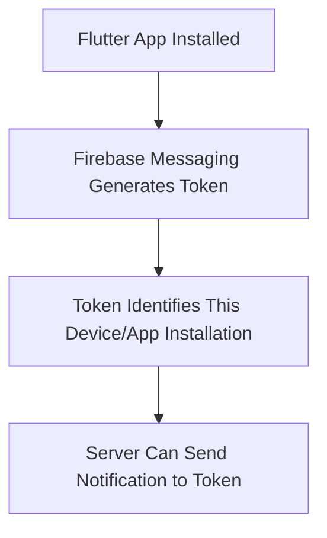
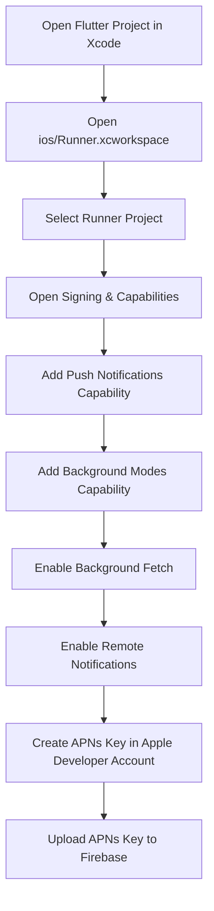
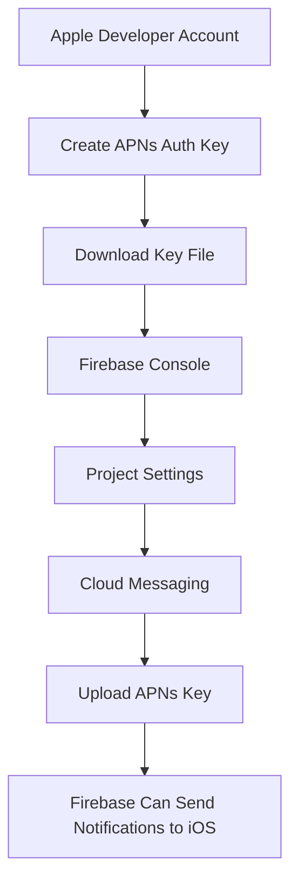
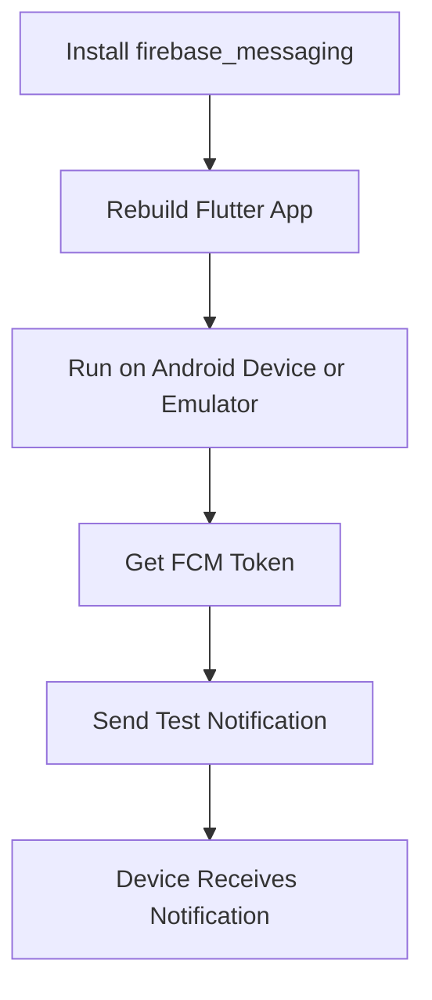
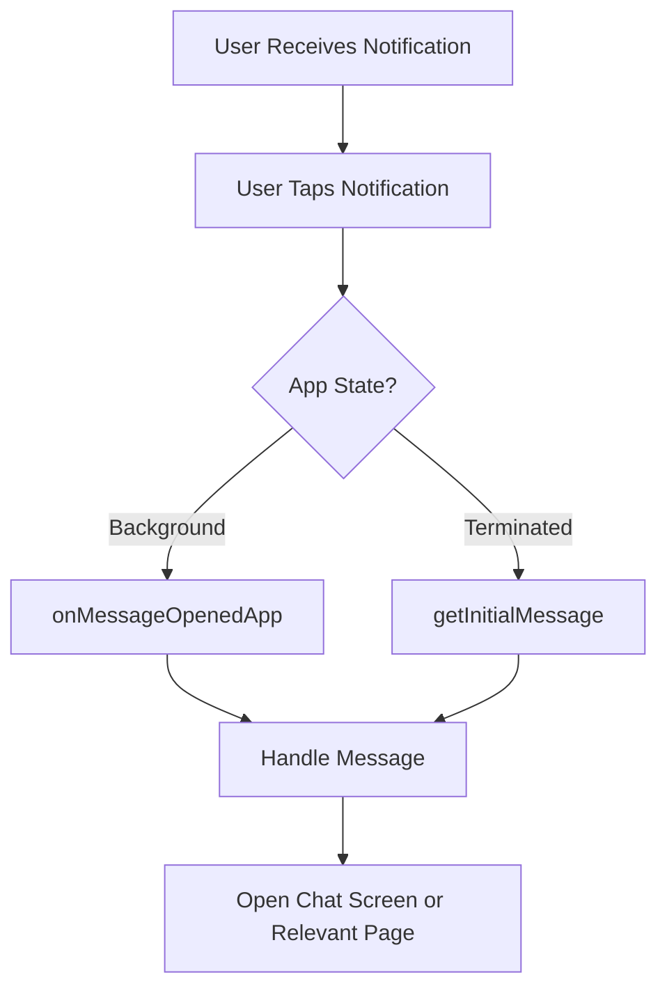
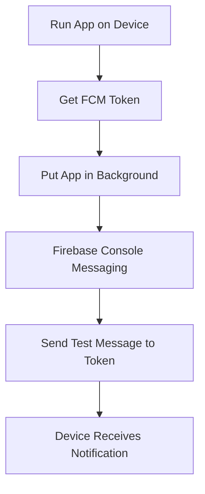

# Push Notifications Setup and First Steps

## Overview

This lecture introduces push notifications for the Flutter chat app.

The app already supports:

* User authentication
* Image upload
* Firestore user profiles
* Real-time chat messages
* Styled chat bubbles

The next major feature is push notifications.

The goal is to notify users whenever a new chat message arrives, especially when the app is not currently open.

Firebase provides this feature through **Firebase Cloud Messaging**, also known as **FCM**.

---

## What Are Push Notifications?

Push notifications are messages sent from a server to a user's device.

They can appear even when the app is:

* Open
* Minimized
* Running in the background
* Fully closed

For this chat app, push notifications should be sent when a new chat message is created.

Example:

```text
New message from Max:
"Hey, are you there?"
```

When the user taps the notification, the app should open.

---

## Why Use Firebase Cloud Messaging?

Firebase Cloud Messaging is Firebase's service for sending push notifications.

It works across multiple platforms, including:

* Android
* iOS
* Web
* Flutter apps

Since this app already uses Firebase Authentication, Firebase Storage, and Firestore, FCM fits naturally into the project.

---

## Push Notification Goal



---

## Firebase Services Used in the App



---

## Notification App States

Push notifications behave differently depending on the app state.

There are three important states:

| State      | Meaning                            |
| ---------- | ---------------------------------- |
| Foreground | App is open and visible            |
| Background | App is minimized but still running |
| Terminated | App is fully closed                |

Each state may require different handling code.

---

## Notification State Flow



---

## Foreground Notifications

When the app is open, push notifications are usually not automatically displayed as system notifications.

Instead, the app can handle them manually.

For example, the app may:

* Show a local notification
* Show an in-app banner
* Update the UI directly
* Ignore the notification if the user is already viewing the chat

---

## Background Notifications

When the app is in the background, the operating system can display the push notification.

If the user taps the notification, the app is brought back to the foreground.

Flutter can then react to that notification interaction.

---

## Terminated Notifications

When the app is fully closed, the operating system can still display the notification.

If the user taps it, the app launches.

Flutter can then inspect the notification that caused the app to open.

---

## Installing Firebase Messaging

To use Firebase Cloud Messaging in Flutter, install the Firebase Messaging package.

Run this command from the root of the Flutter project:

```bash
flutter pub add firebase_messaging
```

Then rebuild the app:

```bash
flutter run
```

A hot reload is not enough after adding a native plugin.

Stop the running app and start it again.

---

## Required Package

After installation, `pubspec.yaml` will include:

```yaml
dependencies:
  firebase_messaging: ^latest
```

The exact version may depend on the latest package version available when you install it.

---

## Importing Firebase Messaging

Later, the app will use:

```dart
import 'package:firebase_messaging/firebase_messaging.dart';
```

This gives access to:

```dart
FirebaseMessaging.instance
```

---

## Device Registration Tokens

FCM uses registration tokens to identify app installations.

Each app installation on a device can receive a unique token.

That token can be used to send a notification to one specific device.



---

## Getting the FCM Token

Later, the app can retrieve the device token with:

```dart
final fcmToken = await FirebaseMessaging.instance.getToken();
```

This token can be printed during development:

```dart
print(fcmToken);
```

For production apps, the token is usually stored in a backend or Firestore so messages can be sent to the correct users.

---

## Token Refresh

FCM tokens can change.

The app can listen for token updates:

```dart
FirebaseMessaging.instance.onTokenRefresh.listen((fcmToken) {
  // Store or update the token on your backend.
});
```

This is useful because the old token may become invalid.

---

## iOS Setup Overview

iOS requires additional setup for push notifications.

To configure push notifications for iOS, you need:

* A macOS device
* Xcode
* An Apple Developer account
* Push Notifications capability enabled
* Background Modes enabled
* An APNs authentication key uploaded to Firebase

Push notifications on iOS must be tested on a real device, not the iOS simulator.

---

## iOS Setup Flow



---

## Opening the iOS Project in Xcode

Open Xcode and choose:

```text
Open Existing Project or File
```

Then navigate to the Flutter project:

```text
ios/Runner.xcworkspace
```

Open this file in Xcode.

Do not open only the `.xcodeproj` file.

For Flutter iOS projects, the `.xcworkspace` file should be used.

---

## Enabling Push Notifications in Xcode

In Xcode:

1. Select the `Runner` project.
2. Open **Signing & Capabilities**.
3. Click **+ Capability**.
4. Search for **Push Notifications**.
5. Add it to the project.

This allows the iOS app to receive push notifications.

---

## Apple Developer Account

To enable push notifications on iOS, you need an Apple Developer account.

For local testing on a real device, a free Apple Developer account may be enough.

For publishing apps to the App Store, a paid Apple Developer membership is required.

---

## Bundle Identifier Issues

Xcode may show an error if the bundle identifier is already taken.

The bundle identifier must be unique.

Example:

```text
com.example.flutterChatTest
```

If Xcode reports that the identifier is unavailable, change it to something unique.

---

## Enabling Background Modes

In Xcode:

1. Go to **Signing & Capabilities**.
2. Click **+ Capability**.
3. Add **Background Modes**.
4. Enable:

   * Background Fetch
   * Remote Notifications

These settings allow the app to receive and handle remote notifications properly.

---

## Creating an APNs Authentication Key

For iOS push notifications, Firebase needs permission to communicate with Apple's Push Notification service.

This is done with an APNs authentication key.

In the Apple Developer account:

1. Go to **Certificates, Identifiers & Profiles**.
2. Open **Keys**.
3. Create a new key.
4. Enable **Apple Push Notifications service**.
5. Register the key.
6. Download the key file.

The downloaded file is uploaded to Firebase.

---

## Uploading the APNs Key to Firebase

In Firebase Console:

1. Open your Firebase project.
2. Go to **Project Settings**.
3. Open the **Cloud Messaging** tab.
4. Find the iOS app configuration.
5. Upload the APNs authentication key.
6. Enter the Key ID.
7. Enter the Team ID.
8. Save the configuration.

This allows Firebase Cloud Messaging to send notifications to iOS devices.

---

## iOS Push Notification Setup



---

## iOS Permission Request

iOS requires explicit user permission before notifications can be received.

Later, the app will request permission with:

```dart
final notificationSettings =
    await FirebaseMessaging.instance.requestPermission();
```

The user must allow notifications.

If the user denies permission, the app will not receive visible push notifications.

---

## APNs Token Note

On Apple platforms, an APNs token may be required before making some FCM plugin API calls.

Example:

```dart
final apnsToken = await FirebaseMessaging.instance.getAPNSToken();

if (apnsToken != null) {
  // APNs token is available.
  // FCM plugin API calls can be made.
}
```

---

## Android Setup Overview

Android setup is easier than iOS.

For Android, FCM generally works once:

* Firebase is connected to the Flutter project
* `google-services.json` is configured
* `firebase_messaging` is installed
* The device or emulator has Google Play Services

Push notifications can be tested on a real Android device or an emulator with Google APIs.

---

## Android Requirements

Android devices must have:

* Android 4.4 or newer
* Google Play Services installed
* A Firebase-connected app
* The `firebase_messaging` package

For Android emulators, use an emulator image that includes Google APIs or Google Play.

---

## Android 13+ Notification Permission

Android 13 and newer require runtime permission to show notification banners.

This permission is:

```text
POST_NOTIFICATIONS
```

The `firebase_messaging` package can help request notification permission, similar to iOS.

---

## Android Setup Flow



---

## Foreground, Background, and Terminated Handling

Firebase Messaging provides different APIs for different cases.

| Situation                                        | Common API                  |
| ------------------------------------------------ | --------------------------- |
| App opened from terminated state by notification | `getInitialMessage()`       |
| App opened from background by notification tap   | `onMessageOpenedApp`        |
| App receives message while foregrounded          | `onMessage`                 |
| Background message processing                    | background handler function |

---

## Handling Notification Interaction

If a user taps a notification, the app can respond.

For example, it can open the chat screen.

```dart
FirebaseMessaging.onMessageOpenedApp.listen((message) {
  // Handle notification tap when app was in background.
});
```

If the app was terminated and opened from a notification:

```dart
final initialMessage =
    await FirebaseMessaging.instance.getInitialMessage();

if (initialMessage != null) {
  // Handle notification that opened the app.
}
```

---

## Notification Interaction Flow



---

## Background Message Handler

On Android, background messages require a top-level function.

Example:

```dart
@pragma('vm:entry-point')
Future<void> firebaseMessagingBackgroundHandler(RemoteMessage message) async {
  // Handle background message.
}
```

This function must not be inside a class.

It must be a top-level function so Firebase can call it when the app is in the background.

---

## Sending a Test Notification

Firebase Console can send test notifications.

General steps:

1. Run the app on a device.
2. Get the FCM registration token.
3. Put the app in the background.
4. Open Firebase Console.
5. Go to **Messaging**.
6. Create a notification campaign.
7. Choose **Send test message**.
8. Paste the FCM token.
9. Send the test notification.

The device should receive the notification.

---

## Test Notification Flow



---

## Important iOS Testing Note

iOS push notifications cannot be tested on the iOS simulator.

You need a real iPhone or iPad.

Android push notifications can be tested on real devices and supported emulators.

---

## Common Mistakes

### 1. Forgetting to install `firebase_messaging`

```bash
flutter pub add firebase_messaging
```

---

### 2. Not rebuilding the app

After adding a native plugin, stop and restart the app.

```bash
flutter run
```

Hot reload is not enough.

---

### 3. Testing iOS notifications on a simulator

iOS push notifications require a real device.

---

### 4. Forgetting APNs setup for iOS

For iOS, Firebase needs an APNs authentication key.

Without it, push notifications will not reach iOS devices.

---

### 5. Forgetting notification permissions

iOS and Android 13+ require notification permission.

Without permission, notifications may not be shown.

---

### 6. Using an Android emulator without Google Play Services

FCM requires Google Play Services on Android.

Use an emulator image with Google APIs or Google Play.

---

## Summary

This lecture begins the push notification setup for the Flutter chat app.

Firebase Cloud Messaging is used to send notifications when new chat messages arrive.

The first setup steps are:

1. Enable or use Firebase Cloud Messaging in Firebase Console.
2. Install the Flutter package:

```bash
flutter pub add firebase_messaging
```

3. Rebuild the app.
4. Configure iOS in Xcode if targeting Apple devices.
5. Upload an APNs authentication key to Firebase for iOS.
6. Test on a real iOS device or a supported Android emulator/device.

The next step is to add Flutter code that requests notification permission, retrieves the FCM token, and handles incoming notifications.
