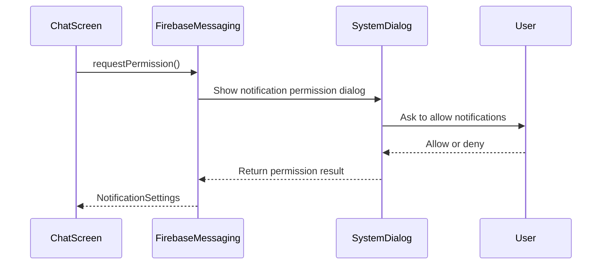
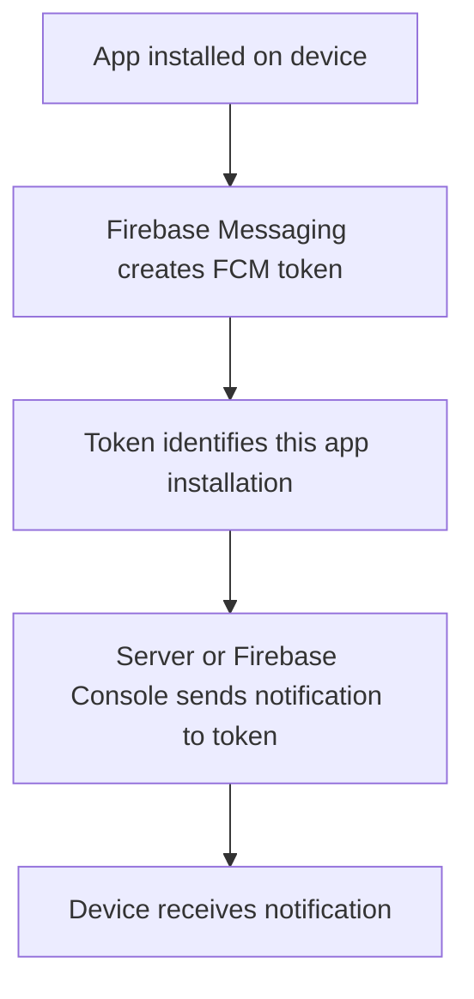
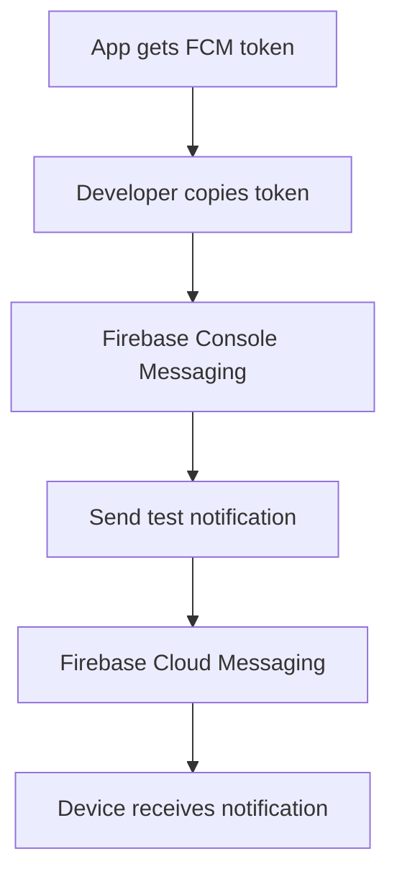
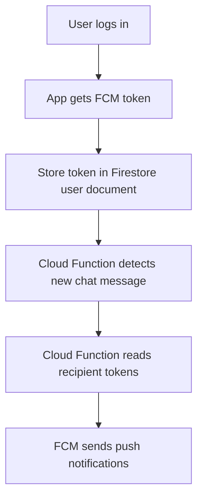

# Requesting Permissions and Getting an Address Token

## Overview

This lecture adds the first Flutter code needed for push notifications.

The app already has Firebase Cloud Messaging installed. Now the app needs to:

1. Ask the user for notification permission.
2. Get the device's FCM token.

The FCM token is like the address of the app installation on a specific device. Firebase Cloud Messaging uses this token to know where a notification should be sent.

---

## Why Set Up Push Notifications in `ChatScreen`?

Push notifications only matter after a user has logged in.

In this app, notifications are sent when new chat messages are created. Since only authenticated users can access the chat, it makes sense to set up notifications inside the `ChatScreen`.

This avoids asking users for notification permission before they even log in.

---

## Push Notification Setup Flow

```mermaid id="push-permission-flow"
flowchart TD
    A[User logs in] --> B[ChatScreen opens]
    B --> C[Initialize Firebase Messaging]
    C --> D[Request notification permission]
    D --> E{Permission granted?}

    E -->|Yes| F[Get FCM token]
    F --> G[Print token or store it]
    E -->|No| H[Do not continue notification setup]
```



---

## Why Convert `ChatScreen` to a StatefulWidget?

Previously, `ChatScreen` could be a `StatelessWidget`.

But now we need to run setup code once when the screen is loaded.

That setup code should run inside `initState()`.

Since `initState()` is only available in a `StatefulWidget`, the `ChatScreen` must be converted from a `StatelessWidget` to a `StatefulWidget`.

---

## Stateful ChatScreen Structure

```dart id="e1q8sr"
class ChatScreen extends StatefulWidget {
  const ChatScreen({super.key});

  @override
  State<ChatScreen> createState() {
    return _ChatScreenState();
  }
}

class _ChatScreenState extends State<ChatScreen> {
  @override
  void initState() {
    super.initState();
    setupPushNotifications();
  }

  void setupPushNotifications() async {
    // Push notification setup code goes here.
  }

  @override
  Widget build(BuildContext context) {
    return Scaffold(
      // Chat screen UI
    );
  }
}
```

---

## Why Use `initState()`?

`initState()` runs once when the state object is first created.

That makes it a good place for one-time setup logic.

For example:

* Requesting notification permission
* Getting the FCM token
* Registering notification listeners

```dart id="m11ub5"
@override
void initState() {
  super.initState();
  setupPushNotifications();
}
```

---

## Do Not Make `initState()` Async

`initState()` should not be marked as `async`.

This is not recommended because Flutter expects `initState()` to complete synchronously.

Instead, create a separate async helper method.

```dart id="z4rs3w"
void setupPushNotifications() async {
  // Async code is allowed here.
}
```

Then call it inside `initState()`:

```dart id="h9lp4w"
@override
void initState() {
  super.initState();
  setupPushNotifications();
}
```

---

## Required Import

To use Firebase Cloud Messaging, import the Firebase Messaging package.

```dart id="kacfo6"
import 'package:firebase_messaging/firebase_messaging.dart';
```

This gives access to:

```dart id="t7qpa6"
FirebaseMessaging.instance
```

---

## Creating a Firebase Messaging Instance

Inside `setupPushNotifications()`, get the Firebase Messaging instance.

```dart id="9z6cpk"
final fcm = FirebaseMessaging.instance;
```

This object allows the app to:

* Request notification permission
* Get the FCM token
* Listen for token refresh events
* Handle incoming messages

---

## Requesting Notification Permission

The first important step is to request permission.

```dart id="edn2b4"
final notificationSettings = await fcm.requestPermission();
```

On iOS, this shows the native permission dialog.

On Android, permission behavior depends on the Android version. Android 13 and newer also require notification permission.

---

## Permission Request Flow



---

## NotificationSettings

`requestPermission()` returns a `NotificationSettings` object.

This object contains information about what kind of notification permission the user granted.

```dart id="t4nduq"
final notificationSettings = await fcm.requestPermission();
```

You can inspect the authorization status:

```dart id="rrm2sm"
notificationSettings.authorizationStatus
```

---

## Authorization Status

Common authorization statuses include:

| Status                              | Meaning                                 |
| ----------------------------------- | --------------------------------------- |
| `AuthorizationStatus.granted`       | User allowed notifications              |
| `AuthorizationStatus.denied`        | User denied notifications               |
| `AuthorizationStatus.provisional`   | User allowed quiet notifications on iOS |
| `AuthorizationStatus.notDetermined` | User has not chosen yet                 |

---

## Example Permission Check

```dart id="vws35s"
final settings = await fcm.requestPermission();

if (settings.authorizationStatus == AuthorizationStatus.granted) {
  print('User granted permission.');
} else if (settings.authorizationStatus == AuthorizationStatus.provisional) {
  print('User granted provisional permission.');
} else {
  print('User declined or has not accepted permission.');
  return;
}
```

This makes the setup safer because the app only continues if notification permission is available.

---

## Getting the FCM Token

After requesting permission, get the FCM token.

```dart id="ff5rfw"
final token = await fcm.getToken();
```

This token is a long string that uniquely identifies this app installation on this device.

For development, we can print it:

```dart id="cgiluz"
print(token);
```

---

## What Is the FCM Token?

The FCM token is like a notification address.

Firebase uses it to send a notification to a specific device.



---

## Important Token Notes

An FCM token is tied to:

* A specific device
* A specific app
* A specific app installation

The token can change when:

* The app is reinstalled
* App data is cleared
* Firebase refreshes the token
* The device restores from backup
* The token expires or is rotated

Because tokens can change, production apps should listen for token refresh events.

---

## Listening for Token Refresh

Firebase Messaging provides an `onTokenRefresh` stream.

```dart id="hnj6gh"
FirebaseMessaging.instance.onTokenRefresh.listen((fcmToken) {
  // Store or update the token on your backend.
});
```

For this course step, printing the token is enough.

In a real app, the updated token should be stored in a backend or Firestore.

---

## Storing the Token in Firestore

A production app may store the token in the current user's Firestore document.

```dart id="s6s3mt"
await FirebaseFirestore.instance
    .collection('users')
    .doc(FirebaseAuth.instance.currentUser!.uid)
    .update({
  'fcmToken': token,
});
```

This allows a backend or Cloud Function to send targeted notifications to specific users.

---

## Complete `setupPushNotifications()` Method

```dart id="bnv429"
void setupPushNotifications() async {
  final fcm = FirebaseMessaging.instance;

  final notificationSettings = await fcm.requestPermission();

  if (notificationSettings.authorizationStatus ==
      AuthorizationStatus.granted) {
    print('User granted permission.');
  } else if (notificationSettings.authorizationStatus ==
      AuthorizationStatus.provisional) {
    print('User granted provisional permission.');
  } else {
    print('User declined or has not accepted permission.');
    return;
  }

  final token = await fcm.getToken();

  print('FCM Token: $token');
}
```

---

## Complete `ChatScreen` Example

```dart id="ru9854"
import 'package:firebase_auth/firebase_auth.dart';
import 'package:firebase_messaging/firebase_messaging.dart';
import 'package:flutter/material.dart';

import 'package:flutter_chat/widgets/chat_messages.dart';
import 'package:flutter_chat/widgets/new_message.dart';

class ChatScreen extends StatefulWidget {
  const ChatScreen({super.key});

  @override
  State<ChatScreen> createState() {
    return _ChatScreenState();
  }
}

class _ChatScreenState extends State<ChatScreen> {
  void setupPushNotifications() async {
    final fcm = FirebaseMessaging.instance;

    final notificationSettings = await fcm.requestPermission();

    if (notificationSettings.authorizationStatus ==
        AuthorizationStatus.granted) {
      print('User granted permission.');
    } else if (notificationSettings.authorizationStatus ==
        AuthorizationStatus.provisional) {
      print('User granted provisional permission.');
    } else {
      print('User declined or has not accepted permission.');
      return;
    }

    final token = await fcm.getToken();

    print('FCM Token: $token');
  }

  @override
  void initState() {
    super.initState();
    setupPushNotifications();
  }

  @override
  Widget build(BuildContext context) {
    return Scaffold(
      appBar: AppBar(
        title: const Text('FlutterChat'),
        actions: [
          IconButton(
            onPressed: () {
              FirebaseAuth.instance.signOut();
            },
            icon: Icon(
              Icons.exit_to_app,
              color: Theme.of(context).colorScheme.primary,
            ),
          ),
        ],
      ),
      body: const Column(
        children: [
          Expanded(
            child: ChatMessages(),
          ),
          NewMessage(),
        ],
      ),
    );
  }
}
```

---

## Testing the Permission Request

To test this feature:

1. Stop the app.
2. Run the app again.
3. Log in.
4. Open the chat screen.
5. The notification permission dialog may appear.
6. Allow notifications.
7. Check the debug console.
8. You should see the FCM token printed.

Example output:

```text id="xwdm6t"
FCM Token: eW91cl9kZXZpY2VfdG9rZW5fZXhhbXBsZQ...
```

The real token will be a long cryptic string.

---

## Why the Token Might Not Appear Immediately

Sometimes the token does not appear right after hot reload.

If that happens:

* Stop the app completely
* Run it again with `flutter run`
* Make sure the device or emulator has Google Play Services
* Make sure Firebase is configured correctly

After restarting, the token should usually appear in the debug console.

---

## Android Behavior

On Android, the permission dialog depends on the Android version.

Older Android versions may not show a notification permission dialog.

Android 13 and newer require runtime permission before notification banners can appear.

The FCM token can still be generated after Firebase Messaging is initialized.

---

## iOS Behavior

On iOS, calling `requestPermission()` triggers the native permission dialog.

The user must allow notifications before visible push notifications can be received.

iOS push notifications should be tested on a real device, not the iOS simulator.

---

## Why Print the Token?

For development, printing the token is useful because it can be copied into Firebase Console to send a test notification.

The token is pasted into the **Send test message** field in Firebase Cloud Messaging.

---

## Token Usage Flow



---

## Production Token Flow

In a real app, the token should not only be printed.

Instead, it should be stored on a backend.



---

## Common Mistakes

### 1. Making `initState()` async

Avoid this:

```dart id="g3zle3"
@override
void initState() async {
  super.initState();
}
```

Instead, call an async helper method:

```dart id="jdchb2"
@override
void initState() {
  super.initState();
  setupPushNotifications();
}
```

---

### 2. Forgetting the Firebase Messaging import

```dart id="s9gz5e"
import 'package:firebase_messaging/firebase_messaging.dart';
```

---

### 3. Requesting permission before login

For this chat app, permissions are requested after the user reaches `ChatScreen`.

This avoids asking unauthenticated users for notification permission too early.

---

### 4. Assuming the token never changes

FCM tokens can change.

Use `onTokenRefresh` in production apps.

```dart id="o64o9g"
FirebaseMessaging.instance.onTokenRefresh.listen((fcmToken) {
  // Update stored token.
});
```

---

### 5. Not restarting the app after adding Firebase Messaging

After adding `firebase_messaging`, stop and restart the app.

Hot reload may not be enough.

---

## Summary

This lecture sets up the first push notification code inside the `ChatScreen`.

The screen is converted into a `StatefulWidget` so setup code can run once inside `initState()`.

The app uses:

```dart id="pb37h8"
FirebaseMessaging.instance.requestPermission()
```

to request notification permission.

Then it uses:

```dart id="d4fydl"
FirebaseMessaging.instance.getToken()
```

to retrieve the FCM token.

That token is the device's notification address and can be used to send test notifications or targeted push notifications.

In this lecture, the token is printed to the debug console. In a real app, it would usually be stored in Firestore or sent to a backend.
