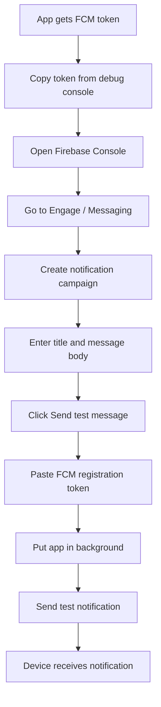
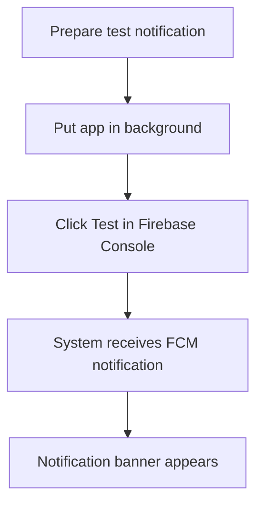
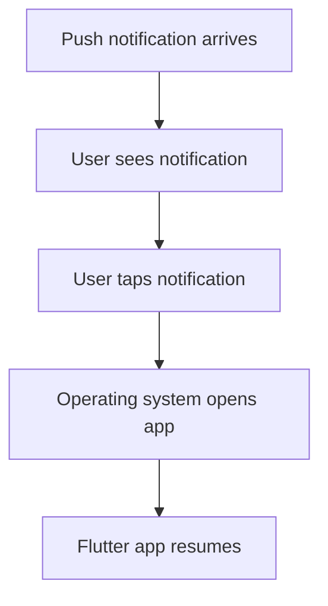
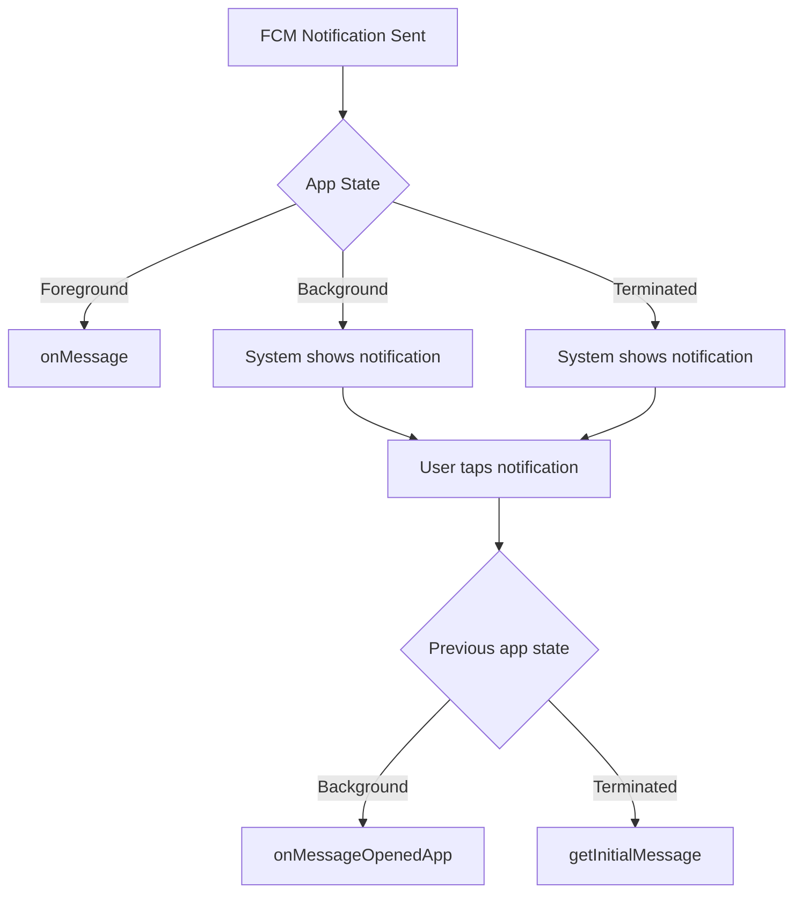
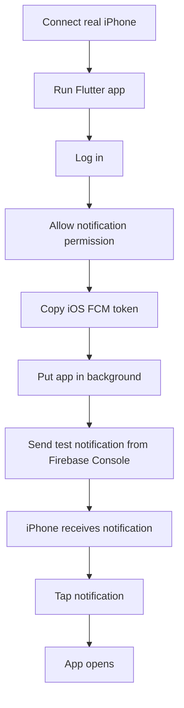
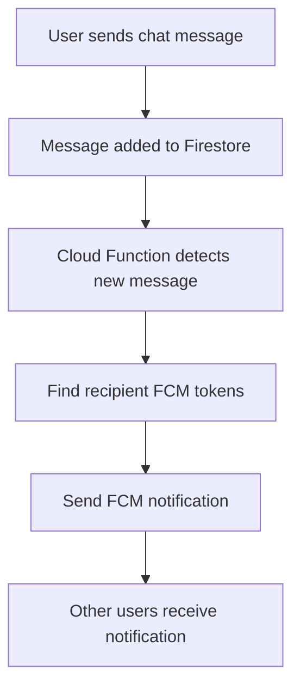

# Testing Push Notifications

## Overview

This lecture demonstrates how to test Firebase Cloud Messaging push notifications.

In the previous lecture, the app requested notification permission and printed the device's FCM token. That token can now be used to send a test notification from the Firebase Console to one specific device.

This step verifies that the push notification setup works before implementing automatic push notifications later.

---

## Goal

The goal is to test whether the app can receive push notifications.

To do this, we will:

1. Copy the FCM token from the debug console.
2. Open Firebase Console.
3. Go to Firebase Messaging.
4. Create a test notification.
5. Paste the device token.
6. Send the test message.
7. Confirm that the device receives the notification.

---

## Push Notification Test Flow



---

## What the FCM Token Is Used For

The FCM token is the address of a specific app installation on a specific device.

When Firebase Cloud Messaging sends a notification to that token, only that device receives the message.

Example:

```text id="9lg4aw"
FCM Token → Specific app installation → Specific device
```

This is useful for testing because we can target exactly one device.

---

## Getting the Token

The token is obtained with:

```dart id="bg0fzr"
final token = await FirebaseMessaging.instance.getToken();
print(token);
```

The printed token appears in the Flutter debug console.

It usually looks like a long cryptic string.

---

## Sending a Test Notification From Firebase Console

In Firebase Console:

1. Open your Firebase project.
2. Go to **Engage**.
3. Open **Messaging**.
4. Click **Create your first campaign**.
5. Choose **Firebase Notification messages**.
6. Enter a notification title.
7. Enter notification text.
8. Click **Send test message**.
9. Paste the FCM registration token.
10. Click **Test**.

Example notification:

```text id="8iocey"
Title: Test
Body: Some test message
```

---

## Important: Put the App in the Background

Before sending the test notification, put the app in the background.

For example, press the home button on the device or emulator.

This is important because background notifications are normally displayed by the operating system.



---

## What Happens When the Notification Arrives?

When the app is in the background, the operating system displays the notification.

If the user taps the notification, the app opens.

This confirms that:

* Firebase Messaging is configured correctly
* The device token is valid
* The device can receive notifications
* Notification tap opens the app

---

## Notification Tap Flow



---

## Testing Different App States

Push notifications should be tested in three states.

| App State  | Meaning                 | Expected Behavior                              |
| ---------- | ----------------------- | ---------------------------------------------- |
| Foreground | App is open and visible | Notification is not always shown automatically |
| Background | App is minimized        | System usually displays notification           |
| Terminated | App is closed           | System usually displays notification           |

---

## Foreground Notifications

When the app is open, push notifications are not always shown as visible system banners automatically.

To handle foreground notifications, listen to:

```dart id="iwy3hh"
FirebaseMessaging.onMessage.listen((RemoteMessage message) {
  // Handle foreground message.
});
```

If you want a visible banner while the app is open, you often need a local notification package such as `flutter_local_notifications`.

---

## Background Notifications

When the app is minimized, notifications are usually shown by the operating system.

This is the easiest state to test.

Steps:

1. Run the app.
2. Log in.
3. Go to the home screen.
4. Send a test notification from Firebase Console.
5. Wait for the notification banner.
6. Tap the notification.
7. Confirm that the app opens.

---

## Terminated Notifications

When the app is fully closed, the system can still display notifications.

If the user taps the notification, the app starts.

To handle notification taps from a terminated state, use:

```dart id="4hpd90"
final initialMessage =
    await FirebaseMessaging.instance.getInitialMessage();
```

This is useful if you want to navigate to a specific screen after the app opens.

---

## Handling Background Notification Taps

If the app was in the background and the user taps the notification, use:

```dart id="i76wi9"
FirebaseMessaging.onMessageOpenedApp.listen((RemoteMessage message) {
  // Handle notification tap.
});
```

This allows the app to react when the user opens it from a push notification.

---

## Notification Handling APIs

| Scenario                                                     | API                                              |
| ------------------------------------------------------------ | ------------------------------------------------ |
| App receives notification while open                         | `FirebaseMessaging.onMessage`                    |
| User taps notification while app was in background           | `FirebaseMessaging.onMessageOpenedApp`           |
| User opens app from terminated state by tapping notification | `FirebaseMessaging.instance.getInitialMessage()` |

---

## Notification State Diagram



---

## Testing on Android

Android push notifications can be tested on:

* A real Android device
* An Android emulator with Google Play Services

For reliable testing, a real device is usually better.

If testing on an emulator, make sure it uses a system image with Google APIs or Google Play.

---

## Testing on iOS

iOS push notifications require a real iPhone or iPad.

They cannot be tested on the iOS simulator.

Before testing on iOS, make sure:

* The app is configured in Xcode
* Push Notifications capability is enabled
* Background Modes are enabled
* APNs key is uploaded to Firebase
* The app runs on a real iOS device
* The user allows notification permission

---

## iOS Preparation Steps

Before running the app on a real iOS device, these steps may help avoid setup problems:

```bash id="nps55c"
flutter clean
flutter packages get
flutterfire configure
```

Then update CocoaPods:

```bash id="30uhfk"
cd ios
pod repo update
cd ..
```

Then build the iOS app:

```bash id="f3mvgp"
flutter build ios
```

After the build succeeds, connect a real iOS device and run the app.

---

## Why Run `flutter clean`?

`flutter clean` removes old build artifacts.

This is useful after changing native configuration, bundle identifiers, Firebase settings, or push notification capabilities.

It does not delete your Dart source code or dependencies from `pubspec.yaml`.

---

## Why Run `flutterfire configure` Again?

If you changed the iOS bundle identifier, you should run:

```bash id="3jftdy"
flutterfire configure
```

again.

This ensures the Firebase configuration matches the current Android and iOS app identifiers.

---

## iOS APNs Key Reminder

If a new iOS app entry was created in Firebase, make sure the APNs key is uploaded for that iOS app too.

In Firebase Console:

```text id="s59t8f"
Project Settings → Cloud Messaging → iOS app → Upload APNs key
```

You will need:

* The APNs key file
* The Key ID
* The Apple Team ID

---

## iOS Testing Flow



---

## Manual Testing vs Production Notifications

In this lecture, notifications are sent manually from Firebase Console.

That is useful for testing.

In a production app, notifications are usually sent automatically.

For example:

1. A user sends a new chat message.
2. Firestore stores the message.
3. A backend or Cloud Function detects the new document.
4. The backend finds recipient FCM tokens.
5. The backend sends push notifications programmatically.

---

## Production Push Notification Flow



---

## Why Store Tokens in a Backend?

During testing, we manually copy and paste the token.

In a real app, that is not practical.

Instead, the app should store the token in Firestore or send it to a backend.

Example:

```dart id="6kkspy"
await FirebaseFirestore.instance
    .collection('users')
    .doc(FirebaseAuth.instance.currentUser!.uid)
    .update({
  'fcmToken': token,
});
```

Then the backend can look up that token when it needs to send a notification.

---

## Common Issues

### 1. Notification does not arrive immediately

FCM notifications may take a short time to arrive.

Wait a little before assuming the setup is broken.

---

### 2. App is in foreground

Foreground notifications may not show as system banners automatically.

Use `FirebaseMessaging.onMessage` and optionally local notifications.

---

### 3. Wrong token copied

Make sure you copy the full FCM token from the correct device.

A token from an Android emulator will not send to an iPhone, and vice versa.

---

### 4. iOS simulator used for testing

Push notifications on iOS require a real device.

---

### 5. APNs key missing for iOS

If iOS notifications do not arrive, check whether the APNs authentication key is uploaded in Firebase Console.

---

### 6. App not rebuilt after configuration changes

After native setup changes, run a full rebuild.

```bash id="0gd7pj"
flutter clean
flutter packages get
flutter run
```

---

## Test Checklist

Use this checklist when testing push notifications:

```text id="pykq8w"
[ ] firebase_messaging installed
[ ] App fully restarted after package installation
[ ] Notification permission requested
[ ] Permission accepted by user
[ ] FCM token printed in debug console
[ ] Correct token pasted into Firebase Console
[ ] App placed in background before test
[ ] Test notification sent
[ ] Notification received on device
[ ] App opens when notification is tapped
```

---

## Summary

This lecture tests push notifications with Firebase Cloud Messaging.

The FCM token printed by the app is copied from the debug console and pasted into Firebase Console's test notification tool.

When the app is in the background, Firebase sends a test notification to that specific device.

If the notification appears and opens the app when tapped, the basic push notification setup is working.

Manual test notifications are useful during development, but real apps should send notifications programmatically through a backend or Cloud Functions.
