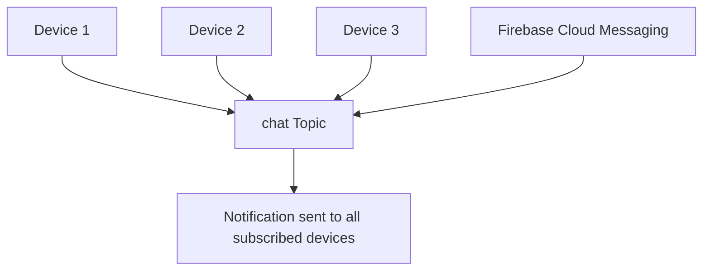
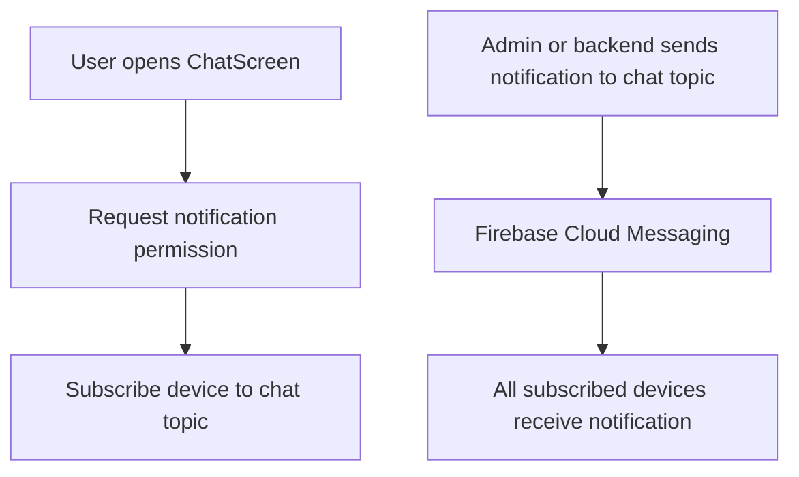
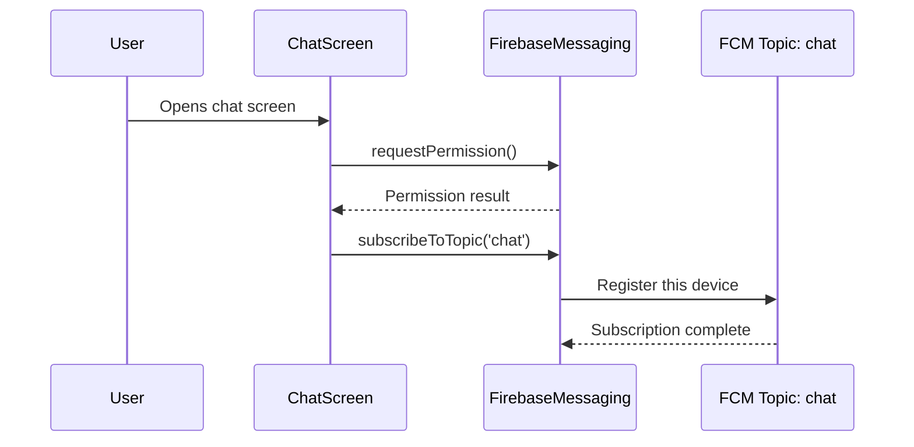
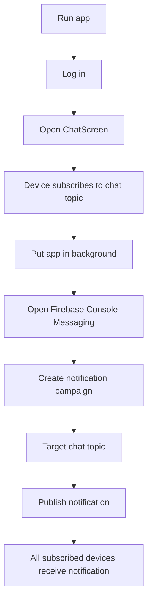
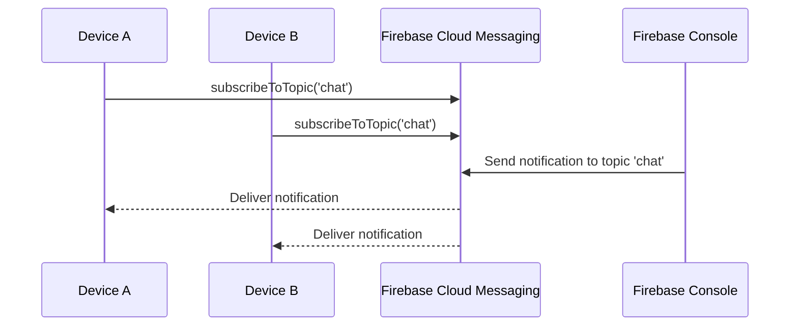
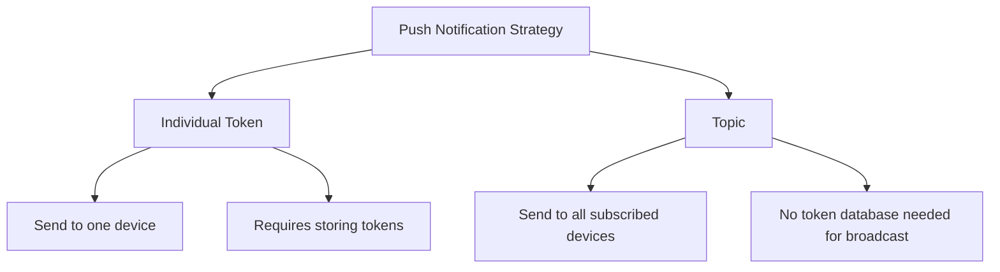

# Working with Notification Topics

## Overview

This lecture explains how to use **Firebase Cloud Messaging topics**.

So far, the app can request notification permission and retrieve an FCM token. That token can be used to send a notification to one specific device.

However, this chat app has one shared global chat room. Every authenticated user participates in the same chat.

Because of that, it is not necessary to target individual devices one by one.

Instead, all devices can subscribe to a shared topic, such as:

```text id="z5rxz8"
chat
```

Then, Firebase Cloud Messaging can send one notification to that topic, and all subscribed devices will receive it.

---

## What Is an FCM Topic?

An FCM topic is like a notification channel.

Devices can subscribe to a topic, and notifications can be sent to that topic.

Every device subscribed to that topic receives the notification.



---

## Why Use Topics?

In the previous lecture, notifications were sent to one device using a device token.

That works well for targeted notifications.

However, for this demo chat app, every user should receive notifications about new chat messages.

Instead of storing and managing every user's FCM token manually, the app can subscribe every logged-in user to the same topic.

---

## Token-Based Notifications vs Topic Notifications

| Approach  | Target                  | Best For                    |
| --------- | ----------------------- | --------------------------- |
| FCM token | One specific device     | User-specific notifications |
| FCM topic | Many subscribed devices | Broadcast notifications     |

---

## Example Use Cases

### Use Device Tokens For

* Private messages
* Account alerts
* Order updates
* Notifications for one specific user
* Notifications for one specific device

### Use Topics For

* Group announcements
* Global chat notifications
* News updates
* App-wide broadcasts
* Shared room notifications

---

## Topic Notification Flow



---

## Subscribing to a Topic

To subscribe a device to a topic, use:

```dart id="subscribe-basic"
await FirebaseMessaging.instance.subscribeToTopic('chat');
```

This tells Firebase Cloud Messaging that this app installation should receive notifications sent to the `chat` topic.

---

## Where to Subscribe

For this app, topic subscription can happen inside `setupPushNotifications()` in the `ChatScreen`.

This makes sense because users only reach the chat screen after logging in.

```dart id="setup-push-topic"
void setupPushNotifications() async {
  final fcm = FirebaseMessaging.instance;

  await fcm.requestPermission();

  await fcm.subscribeToTopic('chat');

  print('Subscribed to chat topic');
}
```

---

## Complete `setupPushNotifications()` Example

```dart id="complete-setup-topic"
void setupPushNotifications() async {
  final fcm = FirebaseMessaging.instance;

  final notificationSettings = await fcm.requestPermission();

  if (notificationSettings.authorizationStatus ==
      AuthorizationStatus.granted) {
    print('User granted permission.');
  } else if (notificationSettings.authorizationStatus ==
      AuthorizationStatus.provisional) {
    print('User granted provisional permission.');
  } else {
    print('User declined or has not accepted permission.');
    return;
  }

  await fcm.subscribeToTopic('chat');

  print('Subscribed to chat topic');
}
```

---

## Why This Works Well for the Chat App

This app has one general chat room.

That means all users should receive the same kind of notification when a new message arrives.

Using a topic avoids the need to:

* Store every device token manually
* Fetch all user tokens from Firestore
* Send many individual notifications
* Manage token refreshes for basic broadcast use

For this simple global chat app, a topic is a good fit.

---

## Topic Subscription Flow in the App



---

## Topic Names

Topic names should be simple.

Allowed topic name characters generally include:

* Letters
* Numbers
* Hyphens
* Underscores

Good examples:

```text id="topic-good-examples"
chat
general_chat
global-chat
news_updates
```

Avoid spaces and special characters.

Bad examples:

```text id="topic-bad-examples"
general chat
chat/topic
chat!
```

---

## Sending a Notification to a Topic From Firebase Console

To send a topic notification from Firebase Console:

1. Open Firebase Console.
2. Go to **Engage**.
3. Open **Messaging**.
4. Create a new campaign.
5. Choose **Firebase Notification messages**.
6. Enter a title and message body.
7. Click **Next**.
8. Under target, choose **Topic**.
9. Enter the topic name, for example `chat`.
10. Continue through the steps.
11. Review and publish the notification.

---

## Firebase Console Topic Target

When sending a notification to the topic, the target is:

```text id="topic-target"
chat
```

In some FCM API contexts, topic targets may be written as:

```text id="topic-path"
/ topics / chat
```

or conceptually:

```text id="topic-target-api"
/topics/chat
```

The Firebase Console usually asks for the topic name directly.

---

## Manual Topic Notification Test Flow



---

## Topic Subscription Is Managed by FCM

You do not need to create a topic manually in Firestore.

You also do not need to create a topic manually in Firebase Console before subscribing.

When the app calls:

```dart id="topic-managed-by-fcm"
await FirebaseMessaging.instance.subscribeToTopic('chat');
```

Firebase Cloud Messaging handles the subscription.

---

## Topic Subscription Persists

Topic subscriptions are stored by FCM and usually persist across app restarts.

That means the app does not need to subscribe again every second or every time the user sends a message.

However, it is safe to call `subscribeToTopic()` during app startup or chat screen setup because the operation is idempotent.

If the device is already subscribed, calling it again will not create duplicate subscriptions.

---

## Unsubscribing From a Topic

To unsubscribe from a topic, use:

```dart id="unsubscribe-topic"
await FirebaseMessaging.instance.unsubscribeFromTopic('chat');
```

This can be useful when the user logs out.

---

## Example: Unsubscribe on Logout

If you only want logged-in users to receive chat notifications, unsubscribe when the user logs out.

```dart id="logout-unsubscribe"
void _logout() async {
  await FirebaseMessaging.instance.unsubscribeFromTopic('chat');
  await FirebaseAuth.instance.signOut();
}
```

Then use this logout function in the logout button:

```dart id="logout-button-topic"
IconButton(
  onPressed: _logout,
  icon: const Icon(Icons.exit_to_app),
)
```

---

## Full `ChatScreen` Example With Topic Subscription

```dart id="full-chat-screen-topic"
import 'package:firebase_auth/firebase_auth.dart';
import 'package:firebase_messaging/firebase_messaging.dart';
import 'package:flutter/material.dart';

import 'package:flutter_chat/widgets/chat_messages.dart';
import 'package:flutter_chat/widgets/new_message.dart';

class ChatScreen extends StatefulWidget {
  const ChatScreen({super.key});

  @override
  State<ChatScreen> createState() {
    return _ChatScreenState();
  }
}

class _ChatScreenState extends State<ChatScreen> {
  void setupPushNotifications() async {
    final fcm = FirebaseMessaging.instance;

    final notificationSettings = await fcm.requestPermission();

    if (notificationSettings.authorizationStatus ==
        AuthorizationStatus.granted) {
      print('User granted permission.');
    } else if (notificationSettings.authorizationStatus ==
        AuthorizationStatus.provisional) {
      print('User granted provisional permission.');
    } else {
      print('User declined or has not accepted permission.');
      return;
    }

    await fcm.subscribeToTopic('chat');

    print('Subscribed to chat topic');
  }

  void _logout() async {
    await FirebaseMessaging.instance.unsubscribeFromTopic('chat');
    await FirebaseAuth.instance.signOut();
  }

  @override
  void initState() {
    super.initState();
    setupPushNotifications();
  }

  @override
  Widget build(BuildContext context) {
    return Scaffold(
      appBar: AppBar(
        title: const Text('FlutterChat'),
        actions: [
          IconButton(
            onPressed: _logout,
            icon: Icon(
              Icons.exit_to_app,
              color: Theme.of(context).colorScheme.primary,
            ),
          ),
        ],
      ),
      body: const Column(
        children: [
          Expanded(
            child: ChatMessages(),
          ),
          NewMessage(),
        ],
      ),
    );
  }
}
```

---

## Topic-Based Notification Delivery



---

## Sending to a Topic Programmatically

Later, notifications can also be sent programmatically from a backend or Cloud Function.

Conceptually, the target would be:

```text id="programmatic-topic-target"
/topics/chat
```

A backend could send:

```json id="topic-rest-concept"
{
  "to": "/topics/chat",
  "notification": {
    "title": "New message",
    "body": "Someone posted a new chat message."
  }
}
```

In newer FCM HTTP v1 APIs, the message can target a topic with a `topic` field.

The exact server-side format depends on the FCM API version being used.

---

## Topic Broadcast vs Individual Targeting



---

## Advantages of Topics

FCM topics are useful because they:

* Are easy to set up
* Do not require storing device tokens manually
* Work well for group notifications
* Allow one notification to reach many devices
* Are managed by Firebase Cloud Messaging

---

## Limitations of Topics

Topics are not always the right solution.

They are less suitable when:

* Only one user should receive the notification
* Notifications are private
* Users need fine-grained notification preferences
* Different users should receive different message content

For private or targeted notifications, device tokens or user-specific token lists are better.

---

## Common Use in This Chat App

For this app, the topic can represent the global chat room.

```text id="global-chat-topic"
Topic: chat
```

Every logged-in user subscribes to this topic.

When a new message is created, a notification can be sent to the topic.

All subscribed users receive the notification.

---

## Important Note About Self-Notifications

If all users subscribe to the same `chat` topic, the sender may also receive the notification.

For a simple demo app, this may be acceptable.

For a production chat app, you may want to prevent sending notifications to the user who created the message.

That usually requires more advanced backend logic with individual device tokens.

---

## Topic Testing Checklist

```text id="topic-test-checklist"
[ ] firebase_messaging package installed
[ ] App requests notification permission
[ ] User accepts notification permission
[ ] App calls subscribeToTopic('chat')
[ ] App is restarted after code changes
[ ] App is placed in the background
[ ] Firebase Console notification targets topic chat
[ ] Notification is published
[ ] Subscribed device receives the notification
[ ] Tapping notification opens the app
```

---

## Why Topic Messages May Be Slower

Topic notifications can sometimes take longer to arrive than direct token-based test messages.

That is normal.

When sending to a topic, Firebase Cloud Messaging has to deliver the notification to all subscribed devices, not just one token.

For testing, wait a little before assuming something is wrong.

---

## Testing on iOS and Android

Topic notifications work on both Android and iOS.

However:

* iOS still requires a real device.
* iOS still requires APNs setup.
* Android requires Google Play Services.
* Android emulators should use Google APIs or Google Play images.
* Notification permission is required on iOS and Android 13+.

---

## Common Mistakes

### 1. Forgetting to subscribe to the topic

Make sure this code runs:

```dart id="mistake-subscribe-topic"
await FirebaseMessaging.instance.subscribeToTopic('chat');
```

---

### 2. Sending to the wrong topic name

The topic name in Firebase Console must match the code exactly.

```dart id="topic-code-name"
subscribeToTopic('chat')
```

Target:

```text id="topic-console-name"
chat
```

---

### 3. Testing immediately before the subscription finishes

Make sure the app has run through the subscription code before sending the notification.

Restart the app and open the chat screen if needed.

---

### 4. Expecting instant delivery

Topic notification delivery may take a little longer than direct token test messages.

---

### 5. Using topics for private notifications

Topics are best for broadcast-style notifications.

For private messages or user-specific alerts, use device tokens.

---

## Summary

This lecture introduces Firebase Cloud Messaging topics.

Instead of sending notifications to one device token, the app subscribes each device to a shared topic:

```dart id="summary-subscribe-topic"
await FirebaseMessaging.instance.subscribeToTopic('chat');
```

Then Firebase Cloud Messaging can send one notification to the `chat` topic, and all subscribed devices receive it.

Topics are ideal for this demo chat app because all users participate in one shared chat.

This avoids manually storing and managing FCM tokens for every device.

The next step is to send these notifications automatically when a new chat message is created.
