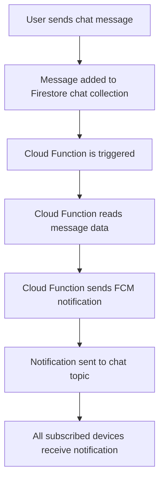
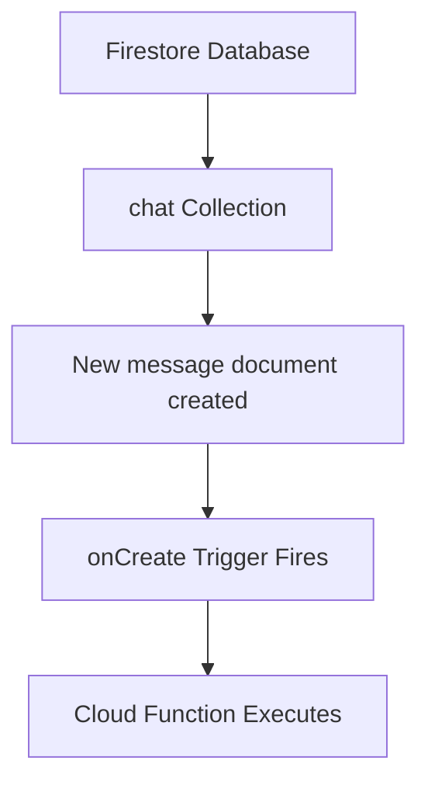
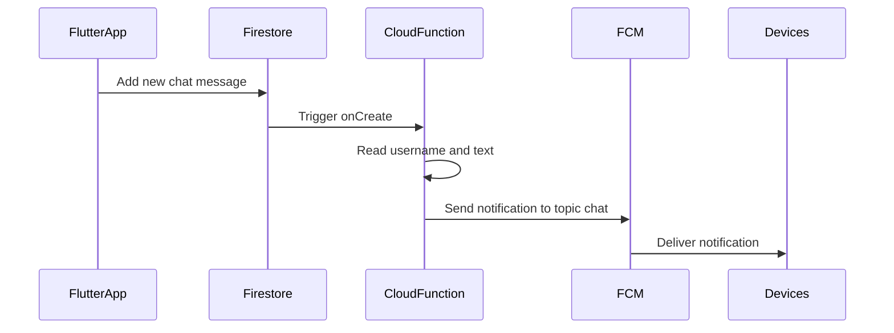
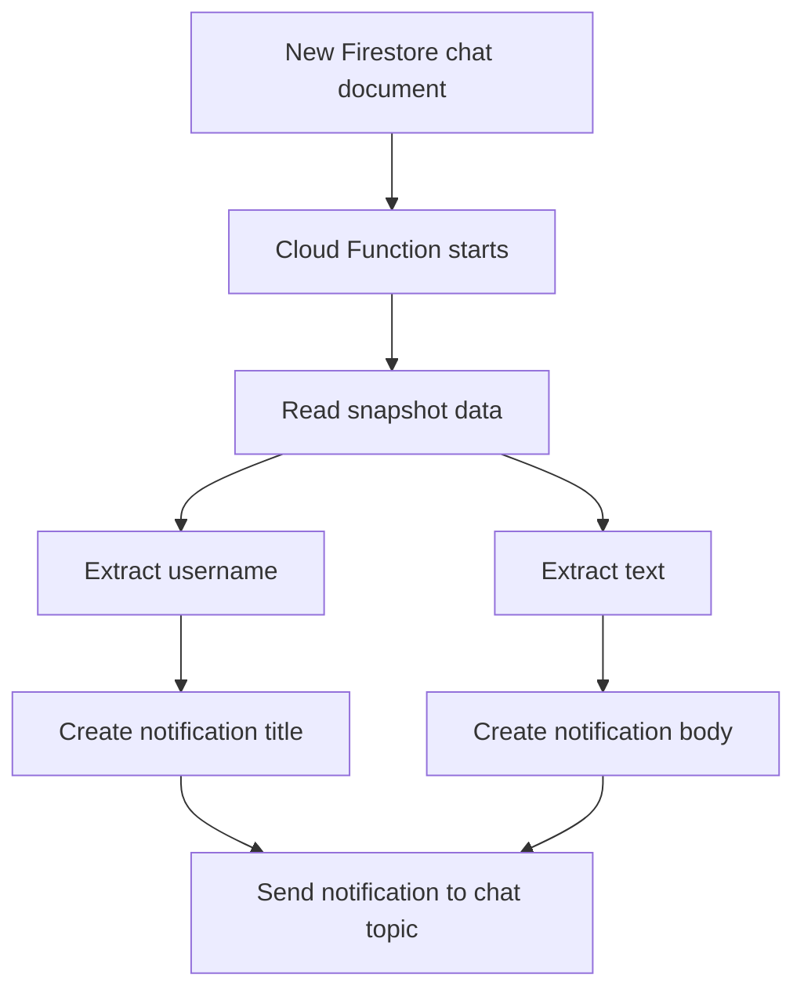
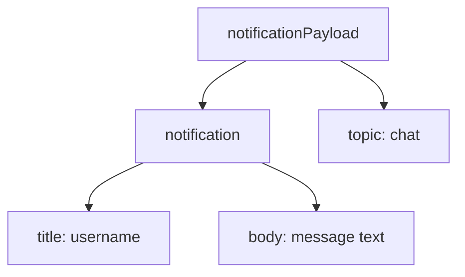
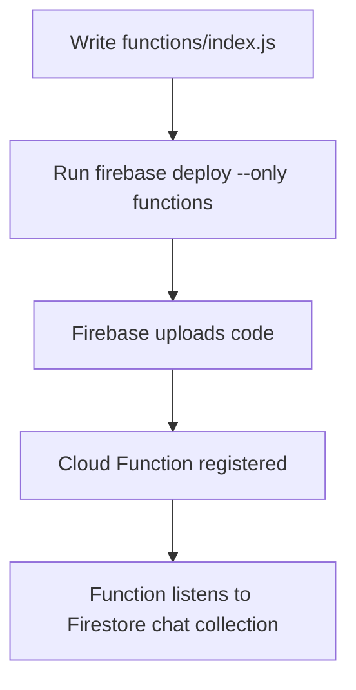
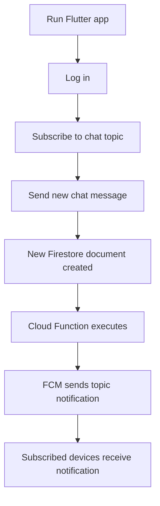
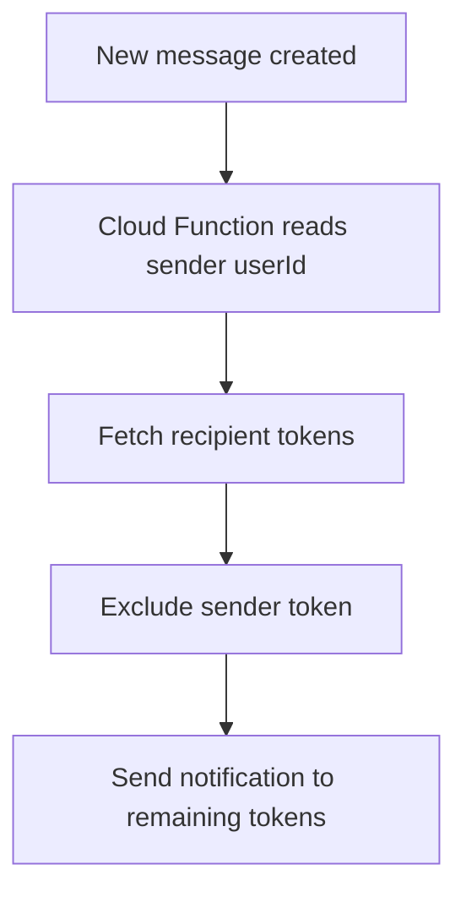
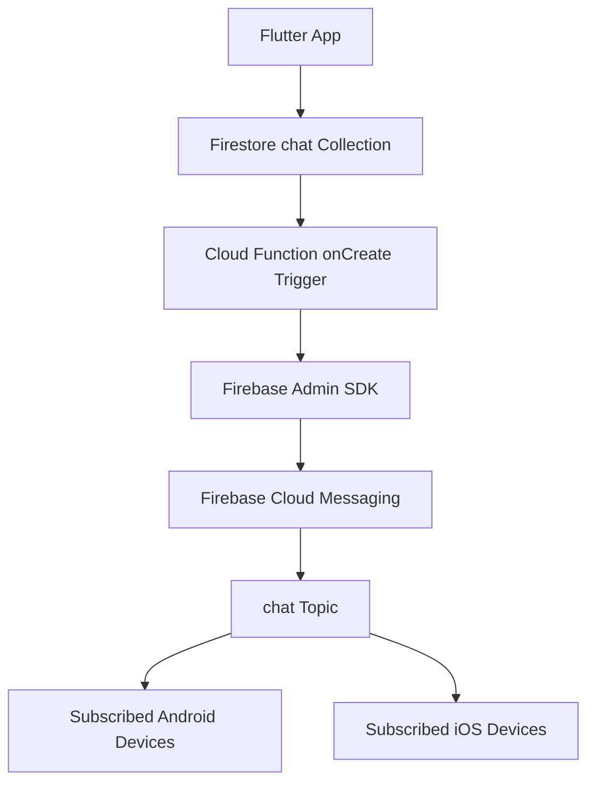

# Sending Push Notifications Automatically via Cloud Functions

## Overview

This lecture implements automatic push notifications for the Flutter chat app by using **Firebase Cloud Functions**.

So far, push notifications were sent manually from the Firebase Console. That is useful for testing, but it is not how a real chat app should work.

In a real app, a push notification should be sent automatically whenever a new chat message is created.

To achieve this, we add backend code with Firebase Cloud Functions.

The Cloud Function listens for new documents inside the Firestore `chat` collection. Whenever a new message document is created, the function sends a Firebase Cloud Messaging notification to the `chat` topic.

---

## Why Automatic Notifications Are Needed

Manual notifications are useful during development.

For example, we previously tested notifications by:

1. Copying the FCM token.
2. Opening Firebase Console.
3. Creating a test notification.
4. Sending it manually.

However, a real chat app should not require the developer to manually send a notification every time someone writes a message.

Instead, the notification should be sent automatically.

---

## Automatic Notification Flow



---

## Why This Code Must Run on the Backend

Push notifications should not be sent directly from the Flutter app.

The Flutter app is client-side code. It runs on the user's device and cannot safely contain privileged server credentials.

Sending push notifications requires backend access through the Firebase Admin SDK.

That means the notification-sending logic must run on a trusted backend.

Firebase Cloud Functions provide that backend environment.

---

## Client Code vs Backend Code

| Code Location            | Responsibility                                      |
| ------------------------ | --------------------------------------------------- |
| Flutter app              | Sends chat messages to Firestore                    |
| Firestore                | Stores chat message documents                       |
| Cloud Functions          | Reacts to new messages and sends push notifications |
| Firebase Cloud Messaging | Delivers notifications to devices                   |

---

## What Are Firebase Cloud Functions?

Firebase Cloud Functions let you run server-side code in response to Firebase events.

A function can be triggered by events such as:

* A Firestore document being created
* A Firestore document being updated
* A Firebase Auth user being created
* An HTTP request
* A scheduled event

In this lecture, the function is triggered when a new Firestore document is added to the `chat` collection.

---

## Cloud Function Trigger

The function listens to this Firestore path:

```text id="chat-trigger-path"
chat/{messageId}
```

This means:

* `chat` is the Firestore collection
* `{messageId}` is a wildcard for any document ID inside that collection

Whenever a new document is created there, the function runs.

---

## Firestore Trigger Flow



---

## Why Use a Topic?

Earlier, every device subscribed to the `chat` topic.

```dart id="subscribe-chat-topic"
await FirebaseMessaging.instance.subscribeToTopic('chat');
```

This means we can send one notification to the topic and all subscribed devices receive it.

For this demo app, that works well because there is one shared global chat room.

---

## Topic Notification Flow



---

## Requirements

To use Cloud Functions, you need:

* Node.js installed
* Firebase CLI installed
* A Firebase project
* Firebase Functions initialized in the project
* A billing-enabled Firebase plan for Cloud Functions
* A `functions` folder in the Flutter project
* JavaScript or TypeScript function code

---

## Important Billing Note

Firebase Cloud Functions usually require the project to be upgraded to the **Blaze** pay-as-you-go plan.

There is typically a free usage tier, but the project still needs billing enabled.

For development, you can set a budget alert in Google Cloud or Firebase to avoid unexpected spending.

---

## Installing Node.js

Firebase Cloud Functions use Node.js.

Even though the Flutter app is written in Dart, Cloud Functions are written in JavaScript or TypeScript.

Install the LTS version of Node.js from the official Node.js website.

After installation, you should be able to run:

```bash id="check-node"
node --version
npm --version
```

---

## Installing Firebase CLI

After installing Node.js, install the Firebase CLI.

```bash id="install-firebase-tools"
npm install -g firebase-tools
```

On macOS or Linux, you may need:

```bash id="install-firebase-tools-sudo"
sudo npm install -g firebase-tools
```

On Windows, do not use `sudo`.

---

## Logging In to Firebase

After installing Firebase CLI, log in to your Firebase account.

```bash id="firebase-login"
firebase login
```

This connects the CLI to your Firebase account.

---

## Initializing Cloud Functions

From the root of the Flutter project, run:

```bash id="firebase-init"
firebase init
```

When prompted, choose:

```text id="select-functions"
Functions
```

You do not need to select Firestore here if the Flutter app already uses Firestore through the Flutter Firebase SDK.

Then choose:

```text id="existing-project"
Use an existing project
```

Select the Firebase project used by the Flutter chat app.

---

## Function Setup Choices

During setup, Firebase may ask:

| Question                  | Recommended Answer for This Lecture |
| ------------------------- | ----------------------------------- |
| JavaScript or TypeScript? | JavaScript                          |
| Use ESLint?               | No                                  |
| Install dependencies now? | Yes                                 |

After setup, a new folder is created:

```text id="functions-folder"
functions/
```

---

## Functions Folder Structure

After initialization, the project contains a folder like this:

```text id="functions-structure"
functions
├── index.js
├── package.json
├── package-lock.json
└── node_modules
```

The most important file for this lecture is:

```text id="index-js"
functions/index.js
```

This is where the Cloud Function code is written.

---

## What the Cloud Function Does

The Cloud Function should:

1. Listen for new documents in `chat/{messageId}`.
2. Extract the new message data.
3. Read the sender's username.
4. Read the message text.
5. Send a push notification to the `chat` topic.

---

## Cloud Function Logic



---

## Firebase Admin SDK

Cloud Functions use the Firebase Admin SDK to access Firebase services with backend privileges.

In JavaScript, import and initialize it like this:

```javascript id="admin-init"
const admin = require('firebase-admin');

admin.initializeApp();
```

The Admin SDK can send FCM messages from trusted backend code.

---

## Cloud Functions Import

The function also imports Firebase Functions:

```javascript id="functions-import"
const functions = require('firebase-functions');
```

This package provides the Firestore trigger API.

---

## Complete `functions/index.js`

```javascript id="complete-index-js"
const functions = require('firebase-functions');
const admin = require('firebase-admin');

admin.initializeApp();

exports.sendChatNotification = functions.firestore
  .document('chat/{messageId}')
  .onCreate(async (snapshot, context) => {
    const newMessage = snapshot.data();

    const notificationPayload = {
      notification: {
        title: newMessage['username'],
        body: newMessage['text'],
      },
      topic: 'chat',
    };

    try {
      await admin.messaging().send(notificationPayload);
      console.log('Notification sent successfully');
    } catch (error) {
      console.error('Error sending notification:', error);
    }

    return null;
  });
```

---

## Understanding the Trigger

```javascript id="on-create-trigger"
functions.firestore
  .document('chat/{messageId}')
  .onCreate(...)
```

This listens for new documents in the `chat` collection.

The function runs only when a document is created.

It does not run when:

* A message is updated
* A message is deleted
* A different collection changes

---

## Understanding the Snapshot

```javascript id="snapshot-data"
const newMessage = snapshot.data();
```

The `snapshot` contains the Firestore document that was just created.

Calling `.data()` gives access to the document fields.

For example, a chat document may contain:

```json id="chat-message-document"
{
  "text": "Hello everyone!",
  "createdAt": "Timestamp",
  "userId": "abc123",
  "username": "Max",
  "userImage": "https://..."
}
```

---

## Reading Message Fields

The function reads the username and text from the message document.

```javascript id="read-message-fields"
title: newMessage['username'],
body: newMessage['text'],
```

This means the notification title will be the sender's username.

The notification body will be the chat message text.

---

## Notification Payload

The notification payload defines what the user sees.

```javascript id="notification-payload"
const notificationPayload = {
  notification: {
    title: newMessage['username'],
    body: newMessage['text'],
  },
  topic: 'chat',
};
```

This sends the notification to the `chat` topic.

---

## Payload Structure



---

## Sending the Notification

The notification is sent with:

```javascript id="send-notification"
await admin.messaging().send(notificationPayload);
```

This uses Firebase Cloud Messaging through the Admin SDK.

If the send succeeds, the function logs:

```text id="send-success-log"
Notification sent successfully
```

If it fails, the error is logged.

---

## Error Handling

The function uses a `try-catch` block.

```javascript id="try-catch-notification"
try {
  await admin.messaging().send(notificationPayload);
  console.log('Notification sent successfully');
} catch (error) {
  console.error('Error sending notification:', error);
}
```

This helps diagnose problems in Firebase Function logs.

---

## Deploying the Function

After writing the function code, deploy it to Firebase.

From the project root, run:

```bash id="deploy-functions"
firebase deploy --only functions
```

This uploads the function code to Firebase.

Firebase then registers the Firestore trigger.

---

## Deployment Flow



---

## Testing the Automatic Notification

After deployment:

1. Restart the Flutter app.
2. Log in.
3. Make sure the device is subscribed to the `chat` topic.
4. Put another device or emulator in the background.
5. Send a new chat message.
6. Firestore creates a new document.
7. The Cloud Function runs.
8. A push notification should arrive on subscribed devices.

---

## Automatic Notification Test Flow



---

## Viewing Function Executions

In Firebase Console:

1. Go to your Firebase project.
2. Open **Build**.
3. Go to **Functions**.
4. Select the deployed function.
5. Check execution count and logs.

This helps verify that the function runs when a new chat message is added.

---

## Viewing Logs

If notifications do not arrive, check the function logs.

Logs can show errors such as:

* Permission problems
* Missing fields
* Messaging API errors
* Function deployment issues
* Topic send failures

Example logs:

```text id="function-logs"
Notification sent successfully
```

or:

```text id="function-error-log"
Error sending notification: ...
```

---

## Common Error: Permission or 401 Error

If the function runs but fails to send the notification, you may see a `401` or permission-related error.

Possible fixes include:

* Make sure Firebase Cloud Messaging is enabled.
* Check the Cloud Messaging settings in Firebase Console.
* Make sure the correct Firebase project is selected.
* Check whether any required messaging API is enabled.
* Redeploy the function after fixing project settings.

In the lecture, enabling the Cloud Messaging API Legacy option fixed a permission-related issue.

---

## Important Note About Sender Receiving Notifications

Because the function sends to the entire `chat` topic, all subscribed users receive the notification.

That may include the user who sent the message.

For a demo app, this is acceptable.

For a production chat app, you may want to avoid notifying the sender.

That usually requires a more advanced backend setup using individual FCM tokens instead of only a shared topic.

---

## Topic Notifications vs Token Notifications

| Strategy             | Pros                              | Cons                                  |
| -------------------- | --------------------------------- | ------------------------------------- |
| Topic notification   | Simple broadcast to all users     | Sender may also receive notification  |
| Token notification   | Can target specific users/devices | Requires storing and managing tokens  |
| User-specific topics | Easier grouping per user or room  | Needs careful subscription management |

---

## Production Improvement: Avoid Notifying the Sender

A more advanced version could:

1. Store each user's FCM token in Firestore.
2. When a message is created, read all tokens except the sender's token.
3. Send notifications only to other users.

Conceptual flow:



---

## Why Cloud Functions Are Useful

Cloud Functions remove the need to build and host a custom backend server.

They are useful because they:

* Run in the cloud
* React to Firebase events
* Scale automatically
* Can use Firebase Admin SDK
* Keep sensitive credentials away from the client app
* Work well with Firestore and FCM

---

## Complete Notification Architecture



---

## Commands Summary

Install Firebase CLI:

```bash id="cmd-install-cli"
npm install -g firebase-tools
```

Log in:

```bash id="cmd-login"
firebase login
```

Initialize functions:

```bash id="cmd-init"
firebase init
```

Deploy functions:

```bash id="cmd-deploy"
firebase deploy --only functions
```

---

## Project Structure After Adding Functions

```text id="project-structure-functions"
flutter_chat/
├── lib/
│   ├── screens/
│   └── widgets/
├── android/
├── ios/
├── functions/
│   ├── index.js
│   ├── package.json
│   └── node_modules/
├── pubspec.yaml
└── firebase.json
```

---

## Common Mistakes

### 1. Trying to send push notifications from Flutter

Do not put Admin SDK notification-sending logic in the Flutter app.

The notification send operation should run on the backend.

---

### 2. Forgetting to enable billing

Cloud Functions may require the Blaze plan.

Without billing enabled, deployment or execution may fail.

---

### 3. Selecting the wrong Firebase project

During `firebase init`, make sure you select the same Firebase project used by the Flutter app.

---

### 4. Forgetting to deploy

Writing `index.js` locally is not enough.

You must deploy it:

```bash id="mistake-deploy"
firebase deploy --only functions
```

---

### 5. Using the wrong Firestore collection name

The function listens to:

```javascript id="wrong-collection-check"
.document('chat/{messageId}')
```

This must match the collection used in Flutter:

```dart id="flutter-chat-collection"
FirebaseFirestore.instance.collection('chat').add(...)
```

---

### 6. Missing expected Firestore fields

The function expects message documents to contain:

```text id="expected-fields"
username
text
```

If these fields are missing, the notification title or body may be empty or invalid.

---

### 7. Forgetting topic subscription in Flutter

The function sends to:

```javascript id="function-topic"
topic: 'chat'
```

So Flutter devices must subscribe to:

```dart id="flutter-topic"
FirebaseMessaging.instance.subscribeToTopic('chat')
```

---

### 8. Expecting instant topic delivery

Topic notifications can take a little longer than direct token notifications.

Wait a bit before assuming the setup failed.

---

## Debugging Checklist

```text id="debugging-checklist-functions"
[ ] Firebase project is on a plan that supports Cloud Functions
[ ] Node.js is installed
[ ] Firebase CLI is installed
[ ] firebase login completed
[ ] firebase init selected Functions
[ ] functions/index.js contains the notification function
[ ] firebase deploy --only functions completed successfully
[ ] Flutter app subscribes to the chat topic
[ ] New messages are added to the Firestore chat collection
[ ] Function execution appears in Firebase Console
[ ] Function logs show success or useful error details
[ ] Cloud Messaging settings are enabled correctly
```

---

## Summary

This lecture automates push notifications with Firebase Cloud Functions.

Instead of manually sending notifications from Firebase Console, a backend function now runs whenever a new message document is created in Firestore.

The function listens to:

```javascript id="summary-trigger"
.document('chat/{messageId}')
```

Then it sends a Firebase Cloud Messaging notification to the `chat` topic:

```javascript id="summary-send"
await admin.messaging().send(notificationPayload);
```

This creates an automated notification pipeline:

```text id="summary-pipeline"
New chat message → Firestore document → Cloud Function → FCM topic notification → Devices
```

With this setup, users can receive push notifications automatically whenever a new chat message is sent.
