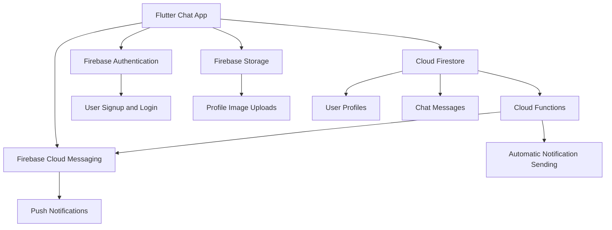
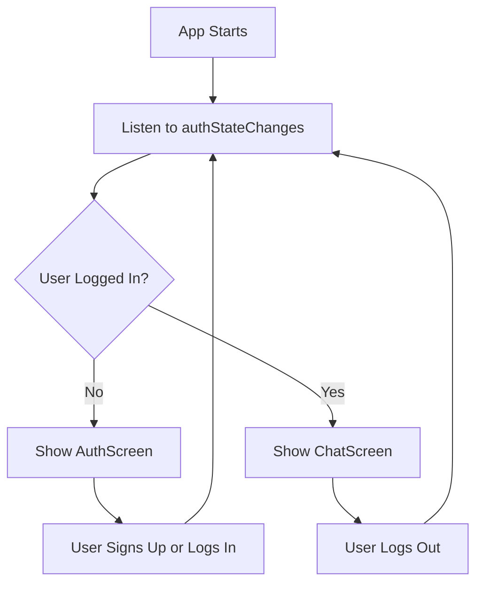
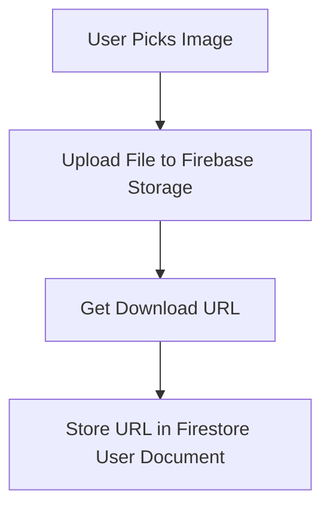
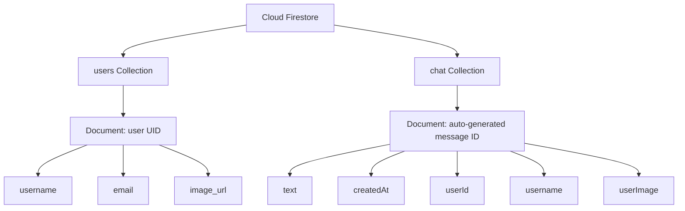
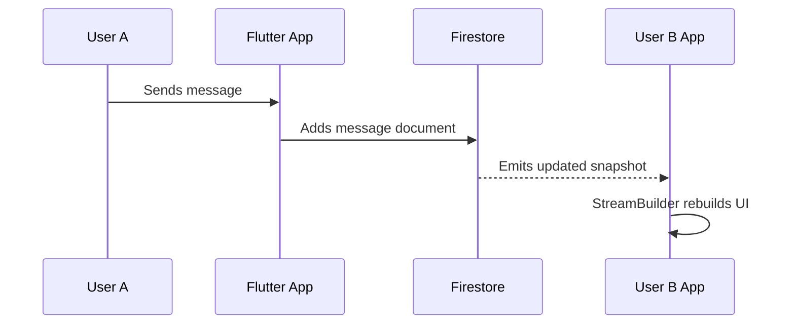
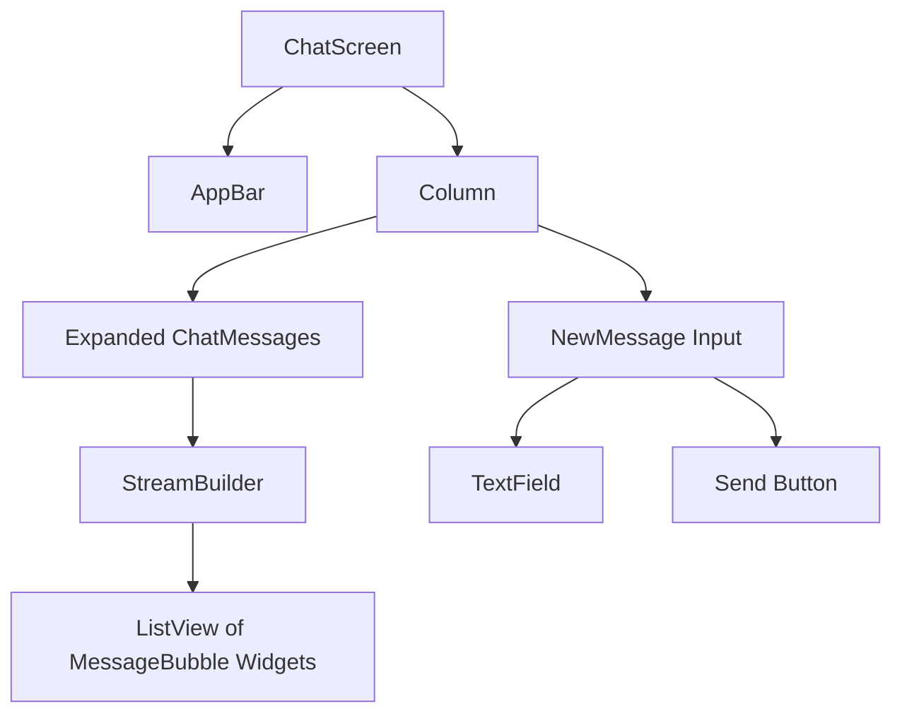
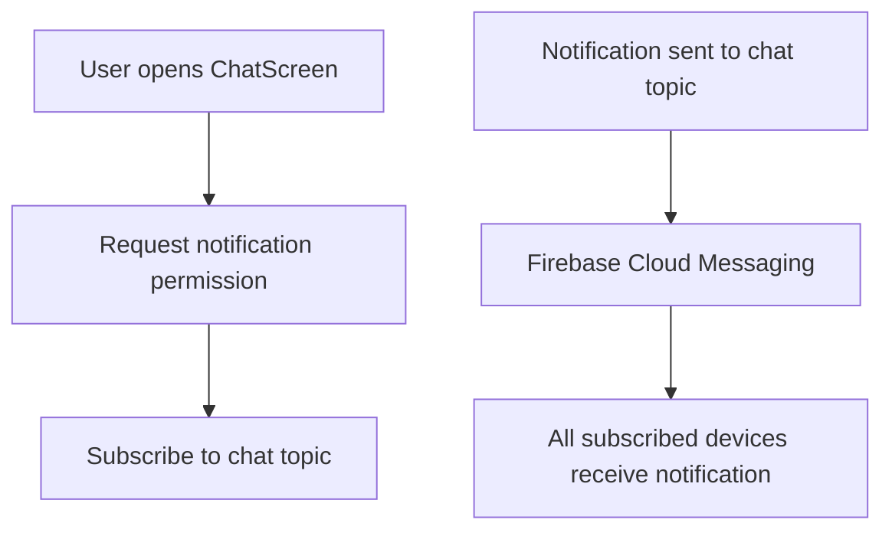
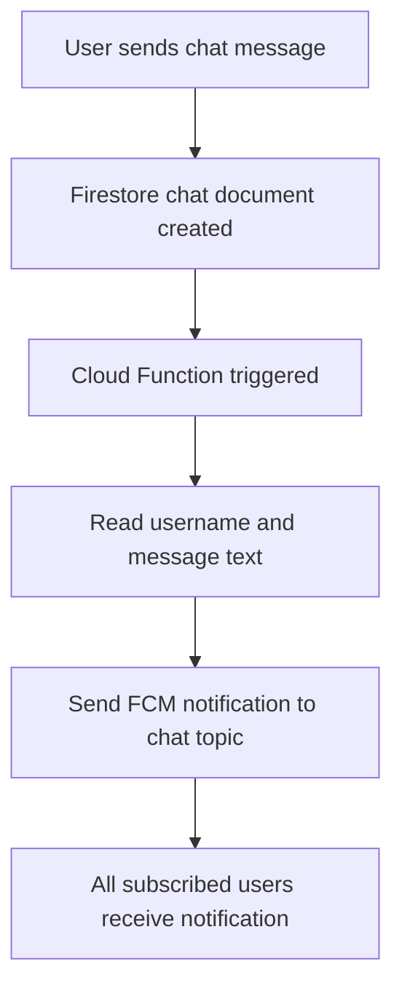
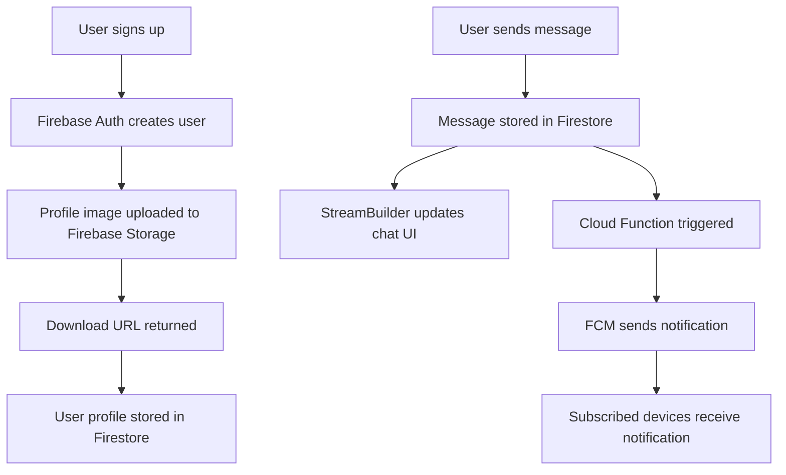
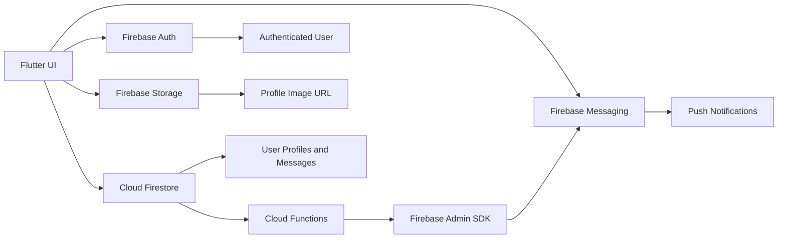

# Module Summary

## Overview

This module completed a full Firebase-powered Flutter chat application.

Throughout the module, the app evolved from a basic Flutter UI into a real-time chat app with:

* User authentication
* Profile image uploads
* Remote user data storage
* Real-time chat messages
* Styled message bubbles
* Push notifications
* Automated server-side notification logic

Firebase was used as the backend platform, and FlutterFire packages connected the Flutter app to different Firebase services.

---

## What This Module Covered

This module introduced several major Firebase services:

| Firebase Service         | Purpose in the App                    |
| ------------------------ | ------------------------------------- |
| Firebase Authentication  | Sign up, log in, log out users        |
| Firebase Storage         | Store uploaded profile images         |
| Cloud Firestore          | Store user profiles and chat messages |
| Firebase Cloud Messaging | Send push notifications               |
| Firebase Cloud Functions | Automatically trigger backend logic   |

Together, these services form the backend architecture of the chat app.

---

## Final App Architecture



---

## Firebase Authentication

Firebase Authentication was used to handle user accounts.

The app supports:

* Signup
* Login
* Logout
* Auth state monitoring

Signup is handled with:

```dart id="auth-signup"
await FirebaseAuth.instance.createUserWithEmailAndPassword(
  email: _enteredEmail,
  password: _enteredPassword,
);
```

Login is handled with:

```dart id="auth-login"
await FirebaseAuth.instance.signInWithEmailAndPassword(
  email: _enteredEmail,
  password: _enteredPassword,
);
```

Logout is handled with:

```dart id="auth-logout"
await FirebaseAuth.instance.signOut();
```

---

## Auth State Handling

The app uses `authStateChanges()` to automatically show the correct screen.

```dart id="auth-state"
FirebaseAuth.instance.authStateChanges()
```

This stream emits a new value whenever:

* A user logs in
* A user logs out
* The authentication state changes

---

## Authentication Flow



---

## Firebase Storage

Firebase Storage was used to store profile image files.

The image is uploaded after a user successfully signs up.

```dart id="storage-upload"
final storageRef = FirebaseStorage.instance
    .ref()
    .child('user_images')
    .child('${userCredentials.user!.uid}.jpg');

await storageRef.putFile(_selectedImage!);

final imageUrl = await storageRef.getDownloadURL();
```

The user's UID is used as the image filename.

This ensures that each user has a unique image path.

---

## Why Use Firebase Storage?

Firestore is for structured data.

Firebase Storage is for files.

Profile images are binary files, so they should be stored in Firebase Storage.

The image URL is then stored in Firestore.



---

## Cloud Firestore

Cloud Firestore was used as the app's real-time NoSQL database.

The app stores two main types of data:

1. User profile data
2. Chat messages

Example user document:

```json id="user-doc"
{
  "username": "max1",
  "email": "max@example.com",
  "image_url": "https://..."
}
```

Example chat message document:

```json id="chat-doc"
{
  "text": "Hello!",
  "createdAt": "Timestamp",
  "userId": "firebase-user-id",
  "username": "max1",
  "userImage": "https://..."
}
```

---

## Firestore Data Structure



---

## Writing User Data to Firestore

After signup and image upload, the app stores user data in Firestore.

```dart id="write-user-data"
await FirebaseFirestore.instance
    .collection('users')
    .doc(userCredentials.user!.uid)
    .set({
  'username': _enteredUsername,
  'email': _enteredEmail,
  'image_url': imageUrl,
});
```

Using the UID as the document ID makes it easy to retrieve user data later.

---

## Writing Chat Messages to Firestore

When a user sends a message, the app writes a new document to the `chat` collection.

```dart id="write-chat-message"
await FirebaseFirestore.instance.collection('chat').add({
  'text': enteredMessage,
  'createdAt': Timestamp.now(),
  'userId': user.uid,
  'username': userData.data()!['username'],
  'userImage': userData.data()!['image_url'],
});
```

The `add()` method creates a new document with an automatically generated ID.

This is useful because every chat message should be a separate document.

---

## `set()` vs `add()`

| Method                | Document ID                | Used For               |
| --------------------- | -------------------------- | ---------------------- |
| `.doc(id).set({...})` | You choose the ID          | User profile documents |
| `.add({...})`         | Firestore generates the ID | Chat message documents |

---

## Real-Time Message Loading

The app uses Firestore streams to load messages in real time.

```dart id="message-stream"
FirebaseFirestore.instance
    .collection('chat')
    .orderBy('createdAt', descending: true)
    .snapshots()
```

This returns a stream that emits new data whenever the `chat` collection changes.

The UI listens to that stream with `StreamBuilder`.

---

## StreamBuilder Pattern

```dart id="streambuilder-pattern"
StreamBuilder(
  stream: FirebaseFirestore.instance
      .collection('chat')
      .orderBy('createdAt', descending: true)
      .snapshots(),
  builder: (ctx, chatSnapshots) {
    if (chatSnapshots.connectionState == ConnectionState.waiting) {
      return const Center(
        child: CircularProgressIndicator(),
      );
    }

    final loadedMessages = chatSnapshots.data!.docs;

    return ListView.builder(
      itemCount: loadedMessages.length,
      itemBuilder: (ctx, index) {
        final chatMessage =
            loadedMessages[index].data() as Map<String, dynamic>;

        return Text(chatMessage['text']);
      },
    );
  },
);
```

---

## Real-Time Chat Flow



---

## Chat UI Widgets

The chat screen was split into multiple widgets.

| Widget          | Responsibility              |
| --------------- | --------------------------- |
| `ChatScreen`    | Main chat screen layout     |
| `ChatMessages`  | Loads and displays messages |
| `NewMessage`    | Handles message input       |
| `MessageBubble` | Styles each chat message    |

This separation keeps the code organized and easier to maintain.

---

## Chat Screen Structure



---

## Message Bubble Styling

Messages were styled with a reusable `MessageBubble` widget.

The widget supports:

* Right alignment for messages from the current user
* Left alignment for messages from other users
* Sender username
* Sender profile image
* Grouped message sequences
* Different bubble shapes

```dart id="message-bubble-usage"
MessageBubble.first(
  userImage: chatMessage['userImage'],
  username: chatMessage['username'],
  message: chatMessage['text'],
  isMe: authenticatedUser.uid == currentMessageUserId,
)
```

For repeated messages from the same user:

```dart id="message-bubble-next"
MessageBubble.next(
  message: chatMessage['text'],
  isMe: authenticatedUser.uid == currentMessageUserId,
)
```

---

## Push Notifications

Firebase Cloud Messaging was added to support push notifications.

The app requests notification permission and subscribes users to a topic.

```dart id="request-permission"
final fcm = FirebaseMessaging.instance;

await fcm.requestPermission();

await fcm.subscribeToTopic('chat');
```

The `chat` topic allows all users in the global chat to receive the same notifications.

---

## FCM Token

The app can retrieve the device's FCM token.

```dart id="get-fcm-token"
final token = await FirebaseMessaging.instance.getToken();
print(token);
```

This token identifies a specific app installation on a specific device.

Tokens are useful for targeted notifications.

Topics are useful for broadcast notifications.

---

## Token vs Topic Notifications

| Notification Target      | Best For                       |
| ------------------------ | ------------------------------ |
| FCM token                | One specific device            |
| FCM topic                | Many subscribed devices        |
| User-specific token list | Private user notifications     |
| Shared topic             | Global broadcast notifications |

---

## Topic Notification Flow



---

## Firebase Cloud Functions

Cloud Functions were used to automate push notifications.

Instead of manually sending notifications from the Firebase Console, a Cloud Function runs whenever a new chat message is created.

The function listens to:

```javascript id="function-trigger"
functions.firestore
  .document('chat/{messageId}')
  .onCreate(...)
```

When a new chat document is created, the function sends a notification to the `chat` topic.

---

## Cloud Function Example

```javascript id="cloud-function-example"
const functions = require('firebase-functions');
const admin = require('firebase-admin');

admin.initializeApp();

exports.sendChatNotification = functions.firestore
  .document('chat/{messageId}')
  .onCreate(async (snapshot, context) => {
    const newMessage = snapshot.data();

    const notificationPayload = {
      notification: {
        title: newMessage['username'],
        body: newMessage['text'],
      },
      topic: 'chat',
    };

    await admin.messaging().send(notificationPayload);

    return null;
  });
```

---

## Automated Notification Pipeline



---

## Packages Used in This Module

| Package              | Purpose                                 |
| -------------------- | --------------------------------------- |
| `firebase_core`      | Initialize Firebase in Flutter          |
| `firebase_auth`      | User authentication                     |
| `firebase_storage`   | File uploads                            |
| `cloud_firestore`    | Firestore database access               |
| `firebase_messaging` | Push notifications                      |
| `image_picker`       | Pick profile images from device         |
| `firebase-tools`     | Deploy Firebase Cloud Functions         |
| `firebase-admin`     | Send notifications from Cloud Functions |

---

## Important Flutter Concepts Practiced

This module also reinforced many Flutter concepts:

* `StatefulWidget` and `StatelessWidget`
* `initState()`
* `TextEditingController`
* `Form` and `TextFormField`
* Validation with `validator`
* Saving form input with `onSaved`
* Conditional rendering with `if`
* Loading state with `CircularProgressIndicator`
* `StreamBuilder`
* `ListView.builder`
* `Future` and `async` / `await`
* `Image.network`
* `CircleAvatar`
* Custom reusable widgets

---

## Firebase Setup Concepts

This module also covered important project setup tasks:

* Creating a Firebase project
* Connecting Flutter to Firebase
* Running `flutterfire configure`
* Adding FlutterFire packages
* Configuring Android and iOS
* Setting Firestore rules
* Setting Storage rules
* Setting up Firebase Cloud Messaging
* Uploading APNs keys for iOS
* Initializing Cloud Functions with Firebase CLI
* Deploying backend functions

---

## Complete Data Flow



---

## Security Notes

During development, broad security rules may be acceptable for learning.

For production, rules must be tightened.

Important production security tasks include:

* Restrict Firestore reads and writes
* Restrict Storage uploads and downloads
* Validate user ownership
* Prevent users from overwriting other users' data
* Prevent unauthenticated access
* Avoid exposing server credentials in client code
* Use Cloud Functions for privileged backend logic

---

## Example Firestore Rule Idea

A safer user document rule could ensure that users only write their own profile.

```text id="firestore-rule"
match /users/{userId} {
  allow read: if request.auth != null;
  allow write: if request.auth != null
               && request.auth.uid == userId;
}
```

This is more secure than allowing every authenticated user to write every document.

---

## Development Tips

When working with Firebase in Flutter:

* Restart the app after adding native Firebase packages.
* Use Firebase Console to inspect Auth, Storage, Firestore, and Messaging.
* Check Flutter debug logs for errors.
* Check Cloud Function logs when backend logic fails.
* Test push notifications on real devices when possible.
* Use the Firebase Emulator Suite for safer local testing.
* Review official FlutterFire documentation when package APIs change.

---

## Common Problems Reviewed

| Problem                        | Possible Cause                                |
| ------------------------------ | --------------------------------------------- |
| Firebase package not found     | App not fully restarted                       |
| Android build fails            | `minSdkVersion` too low                       |
| Firestore write denied         | Security rules blocking request               |
| Image upload denied            | Storage rules blocking request                |
| Push notification not received | Permission denied, wrong token, or APNs issue |
| Cloud Function not running     | Function not deployed or wrong Firestore path |
| Notification send fails        | Messaging API or permissions issue            |

---

## What the Final App Can Do

By the end of this module, the chat app can:

* Register new users
* Log users in
* Log users out
* Pick and upload profile images
* Store user profiles in Firestore
* Send chat messages
* Display chat messages in real time
* Style messages as chat bubbles
* Subscribe users to a notification topic
* Send automatic push notifications when new messages are created

---

## Final Architecture Summary



---

## Key Takeaways

Firebase can provide a complete backend for many Flutter apps.

In this module, Firebase handled:

* Authentication
* File storage
* Real-time database updates
* Push notifications
* Server-side automation

The most reusable pattern from this module is:

```text id="reusable-pattern"
Flutter UI → Firebase SDK → Firebase Service → Real-time updates or backend trigger
```

This pattern can be reused in many apps, including:

* Chat apps
* Social apps
* Collaborative tools
* Task management apps
* Real-time dashboards
* Community apps

---

## Summary

This module completed a full Firebase integration stack for Flutter.

The app started with authentication and ended with automated push notifications powered by Cloud Functions.

The final result is a strong foundation for building real-time, Firebase-powered Flutter applications.

The most important concepts were:

* Firebase Authentication for user accounts
* Firebase Storage for profile images
* Cloud Firestore for structured and real-time data
* Firebase Cloud Messaging for push notifications
* Firebase Cloud Functions for backend automation
* `StreamBuilder` for live UI updates

With these tools, the app now has a complete backend-driven architecture that can serve as a template for more advanced Flutter projects.
