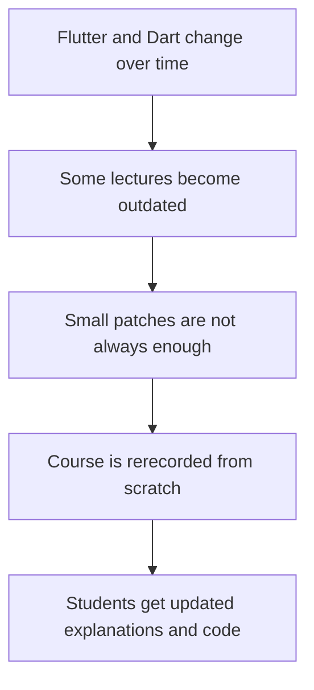
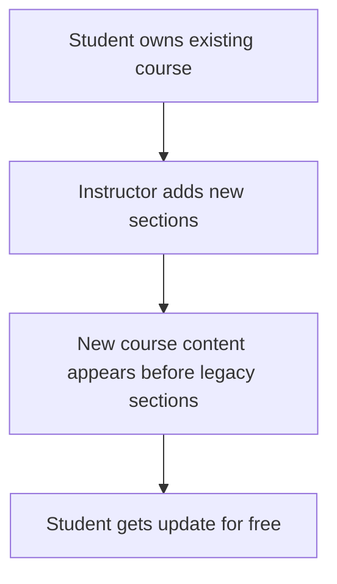
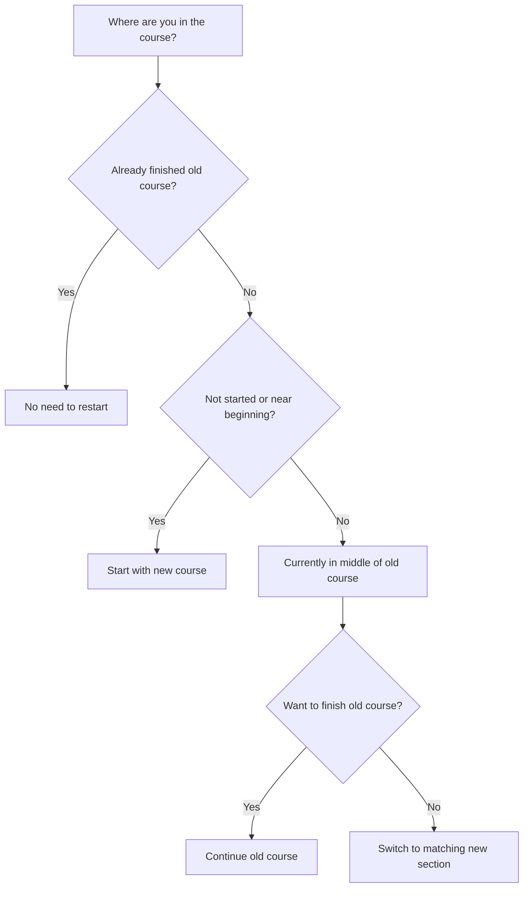
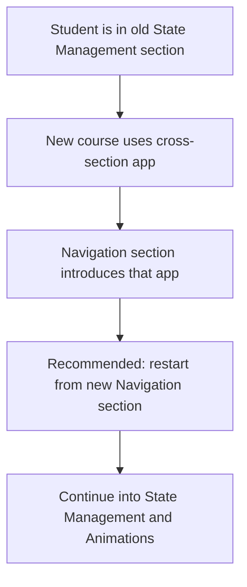
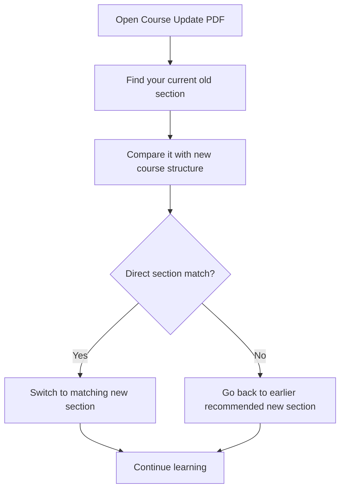
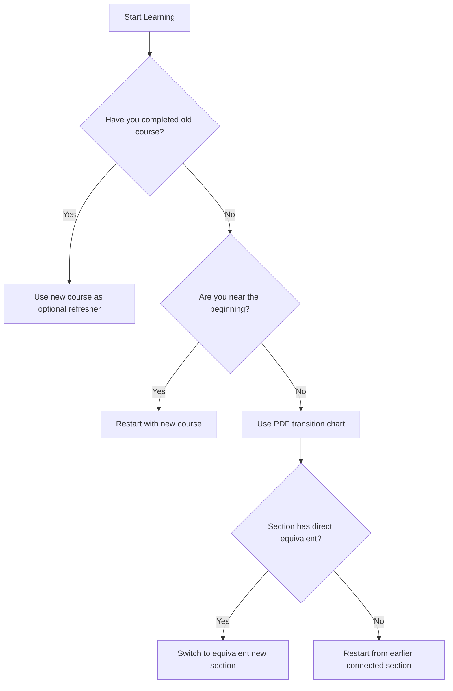
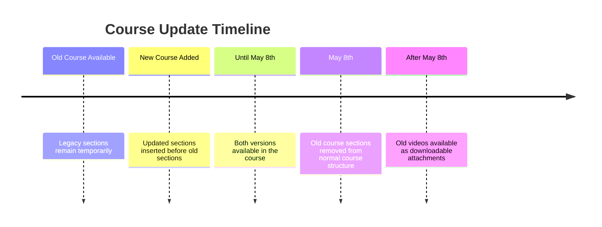

# About the Course Update and How To Proceed

## Overview

This lecture explains why the Flutter and Dart course was updated and how students should continue depending on their current progress.

Like all technologies, Flutter and Dart change over time. These changes are usually not massive, but there are small syntax updates, deprecations, tooling changes, package updates, and improved best practices.

Because of that, the instructor decided to rerecord the course from scratch instead of only updating individual lectures.

The updated course provides:

* Newer Flutter and Dart syntax
* Better explanations
* Updated apps and projects
* Cleaner course structure
* Current best practices
* A smoother learning experience

---

## Why the Course Was Updated

Flutter and Dart evolve over time.

Even if the core ideas stay the same, some details change.

For example:

* Some APIs become deprecated
* Package versions change
* Project setup steps change
* Flutter tooling improves
* Recommended patterns evolve
* Explanations can be improved with hindsight

Instead of patching too many individual lectures, the instructor rerecorded the full course to make the learning path clearer and more up to date.

---

## Main Reason for the Update



---

## What Changed?

The entire course was rerecorded from the ground up.

However, the general section structure stayed mostly the same.

Some changes include:

* Updated lectures
* Updated projects
* Updated syntax
* Better explanations
* Some sections reordered
* Some sections merged
* Old sections marked as legacy
* New sections inserted before the old ones

The core concepts of Flutter did not completely change, but the course was refreshed to match current development practices.

---

## Old Course vs New Course

At the time described in the lecture, both the old and new course versions existed inside the same Udemy course.

The old course sections were marked as:

```text id="legacy-label"
Legacy
```

This helped students quickly identify which sections were old and which sections were new.

---

## Important Date: May 8th

The instructor explained that the old course would be removed on **May 8th**.

Until that date, both the old and new course versions were available inside the course.

After that date, the old course sections would no longer remain as normal course sections.

However, the instructor planned to make the old lecture videos downloadable as attachments in a separate lecture.

---

## Why the Old Course Was Removed

Keeping both full course versions inside one Udemy course would create problems.

It would:

* Make the course unnecessarily large
* Confuse new students
* Make the learning path harder to follow
* Force students to go through too much content
* Affect the course completion flow
* Make the certificate path unnecessarily long

Therefore, the old course was kept temporarily and then removed.

---

## How Students Get the Update

Students do not need to buy the new course separately.

The updated content was inserted into the existing Udemy course.

That means existing students receive the update for free.



---

## Should You Restart the Course?

The answer depends on your current progress.

There are three main situations:

1. You already finished the old course.
2. You have not started yet or are near the beginning.
3. You are currently in the middle of the old course.

Each situation has a different recommended path.

---

## Recommended Path Decision



---

## Case 1: You Already Finished the Old Course

If you already completed the old course, you do not have to restart.

Flutter has not fundamentally changed.

The general way of building Flutter apps is still the same.

You may still benefit from the updated course, but it is optional.

Recommended approach:

* Do not restart from the beginning unless you want a full review.
* Skim the new sections.
* Watch interesting updated lectures.
* Watch at double speed if the content feels familiar.
* Focus on sections with new apps, updated syntax, or unfamiliar topics.

---

## Why Finished Students Do Not Need to Restart

The core concepts are still valid.

For example, these Flutter fundamentals have not changed:

* Widgets
* Build methods
* State management basics
* Navigation concepts
* Forms
* Lists
* Async programming
* Flutter project structure
* Dart fundamentals

The update improves the course, but it does not make everything from the old course useless.

---

## Case 2: You Have Not Started Yet

If you have not started the course yet, start with the new course.

Do not go through both versions.

The new version is the recommended learning path.

You should ignore the legacy sections unless the instructor specifically tells you to reference them.

---

## Case 3: You Are Near the Beginning

If you are only in the first few sections of the old course, restart with the new course.

This is the simplest and cleanest option.

The new course will give you:

* Updated syntax
* Updated project setup
* Updated explanations
* Better structure
* Fewer outdated details

---

## Case 4: You Are in the Middle of the Old Course

If you are currently taking the old course, you have two options.

### Option 1: Finish the Old Course

You can continue with the old course and finish it.

This is especially reasonable if you are already far along.

The old lectures will also be made downloadable after the old course sections are removed.

---

### Option 2: Switch to the New Course

You can switch to the new course.

In many cases, you can switch to the matching section in the new course.

For example:

```text id="switch-example-1"
Old Flutter Internals section
→ New Flutter Internals section
```

But in some cases, switching directly may not work well because the new course may build one app across multiple sections.

---

## Important Switching Warning

Some new sections are connected through one larger project.

For example, the new course may build one app across:

* Navigation
* State management
* Animations

If you are in the old state management section, switching directly into the new state management section may be confusing.

In that case, it is better to go back to the new navigation section and continue from there.

---

## Example Switching Recommendation



---

## Why Some Sections Require Going Back

The new course may use a continuous project across multiple sections.

That means one section depends on code written in earlier sections.

If you skip directly into the middle, you may miss:

* App setup
* Data models
* Navigation structure
* Previous widgets
* Earlier refactors
* Important project context

Therefore, restarting from an earlier connected section may save confusion.

---

## How to Use the Attached PDF

The instructor provides an attached PDF document.

The PDF answers questions such as:

* Why was the course updated?
* How do students get the update?
* What changed?
* Should students restart?
* Which old sections match which new sections?
* How should students switch between versions?

The PDF also includes a chart comparing the old and new course structures.

---

## Course Update Navigation Flow



---

## What If You Want the Certificate?

One reason the old course cannot stay forever is that course completion becomes confusing.

If both full versions remain, students may need to go through too many lectures to reach full completion.

Removing the old course sections helps keep the certificate path cleaner.

---

## Legacy Sections

Legacy sections are older course sections.

They may still contain useful explanations, but they may also include:

* Older Flutter syntax
* Deprecated APIs
* Older package setup
* Older project structures
* Different course flow

New students should prioritize the updated sections.

---

## Should You Watch Both Old and New Courses?

In most cases, no.

Watching both versions from start to finish is unnecessary.

Recommended:

| Student Situation           | Recommended Action                           |
| --------------------------- | -------------------------------------------- |
| Already finished old course | Skim new content if interested               |
| Not started yet             | Start new course only                        |
| Near beginning              | Restart with new course                      |
| Middle of old course        | Either finish old course or switch carefully |
| Far into old course         | Consider finishing old course                |

---

## What Stayed the Same?

Even though the course was updated, many Flutter fundamentals stayed the same.

The main ideas are still valid:

* Flutter apps are built from widgets.
* UI is described declaratively.
* State changes trigger rebuilds.
* Dart is the programming language.
* Navigation uses screens and routes.
* Async code uses `Future`, `async`, and `await`.
* Layout is built with widgets like `Column`, `Row`, `Stack`, and `ListView`.

---

## What May Have Changed?

Some details may have changed over time.

Examples include:

* Package versions
* Firebase setup steps
* Flutter project templates
* Deprecated widgets or APIs
* Recommended syntax
* Tooling commands
* Platform setup steps

That is why the updated course is recommended for new learners.

---

## Why Course Updates Matter

Technology courses can become outdated if they are not maintained.

Even if the concepts remain correct, small changes can make following along difficult.

For example:

```text id="outdated-example"
Lecture code uses an old API
→ Student uses newer Flutter version
→ Code produces warning or error
→ Student gets confused
```

The updated course reduces these problems.

---

## Best Strategy for Learning

If you are starting now, use the newest course sections.

If you already know the old material, use the new version as a refresher.

If you are switching from old to new, use the attached PDF chart to find the best transition point.

---

## Recommended Learning Strategy



---

## Practical Advice

When following the updated course:

* Use the new sections as your main path.
* Avoid mixing old and new code unless necessary.
* Check whether the section is marked as legacy.
* Use the attached PDF to decide where to continue.
* Watch familiar sections faster if you are reviewing.
* Do not worry if old and new app projects differ.
* Focus on understanding the concepts, not only copying code.

---

## If Code From an Old Lecture Does Not Work

If code from a legacy lecture does not work, possible reasons include:

* The Flutter SDK changed.
* A package version changed.
* A method was deprecated.
* Android or iOS setup changed.
* The project template changed.
* Null safety or syntax rules changed.

In that case, check the updated section first.

---

## Course Update Timeline



---

## Key Takeaways

The course was updated because Flutter and Dart continue to evolve.

The new course is not a completely different subject. It teaches the same core Flutter ideas with updated syntax, improved explanations, and refreshed projects.

Students should choose their path based on their current progress.

The most important recommendations are:

* New students should start with the updated course.
* Students near the beginning should restart with the updated course.
* Students who already finished the old course do not need to restart.
* Students in the middle should use the PDF chart to decide where to switch.
* Legacy sections are useful but should not be the default path for new learners.

---

## Summary

This lecture explains how to handle the course update.

The course was rerecorded to keep up with Flutter and Dart changes and to provide better explanations.

Existing students receive the update for free because the new sections were inserted into the existing Udemy course.

The old sections are marked as legacy and were planned to be removed from the main course structure after May 8th, though the old videos would remain available as downloadable attachments.

If you are new to the course, start with the updated sections.

If you already completed the old course, you do not need to restart.

If you are currently in the middle of the old course, either finish it or use the attached PDF chart to find the best point to switch into the new course.
