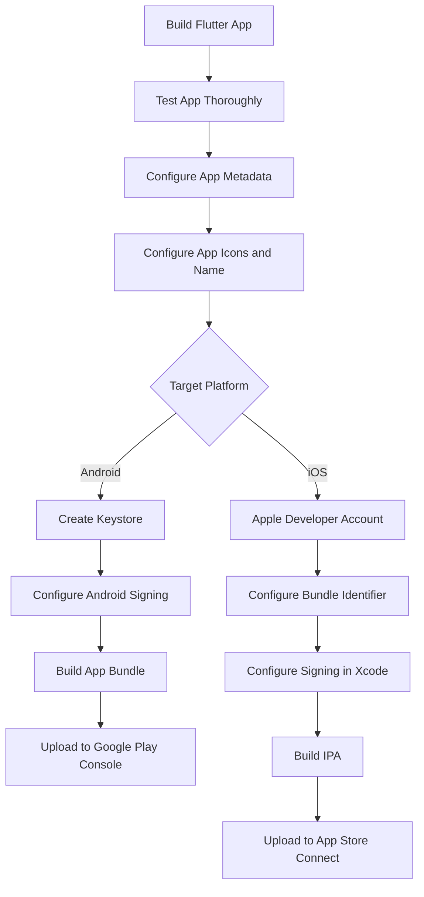
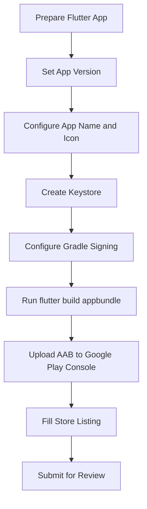
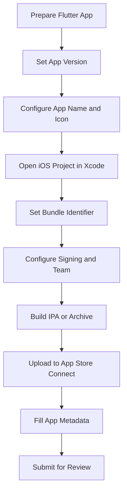
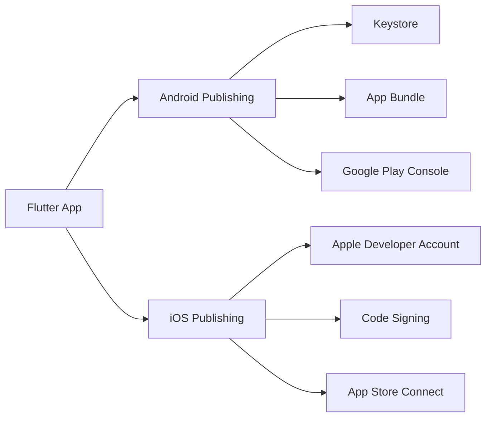

# Publishing iOS and Android Apps

## Overview

This lecture introduces the process of publishing a Flutter app to the two major mobile app stores:

* Google Play Store for Android
* Apple App Store for iOS

After building and testing a Flutter application, the final step is often releasing it so real users can download and install it.

Publishing is not extremely difficult, but it requires several platform-specific steps. Because the process can change over time, the best approach is to follow Flutter's official deployment guides.

---

## Official Flutter Deployment Guides

Flutter provides official step-by-step guides for publishing apps.

### Android

```text
https://docs.flutter.dev/deployment/android
```

### iOS

```text
https://docs.flutter.dev/deployment/ios
```

These guides explain how to:

* Build release versions
* Configure app signing
* Set app icons
* Set app names
* Configure package names and bundle identifiers
* Prepare store assets
* Upload the app to the store

---

## Publishing Flow



---

## Why Publishing Requires Extra Steps

During development, Flutter apps usually run in debug mode.

Debug builds are useful for testing, but they are not suitable for store release.

Before publishing, the app must be prepared as a release build.

Release builds are:

* Optimized for performance
* Signed with platform-specific credentials
* Configured with production metadata
* Built in the required store format
* Ready for review by Google or Apple

---

## Android Publishing Overview

Publishing an Android app usually involves creating an **Android App Bundle**.

The App Bundle file has this extension:

```text
.aab
```

Google Play recommends app bundles because they allow Google Play to generate optimized APKs for different devices.

---

## Android Release Build Command

To build a release Android App Bundle, run:

```bash
flutter build appbundle --release
```

The output is usually located in:

```text
build/app/outputs/bundle/release/app-release.aab
```

This `.aab` file is uploaded to Google Play Console.

---

## Android Signing

Android release apps must be signed.

Signing proves that the app comes from the correct developer and allows future updates to be trusted.

To sign an Android app, you need:

* A keystore file
* A key alias
* A key password
* A store password
* Signing configuration in Gradle

---

## Android Keystore

A keystore is a secure file that contains the signing key for your app.

Example command:

```bash
keytool -genkey -v -keystore upload-keystore.jks -keyalg RSA -keysize 2048 -validity 10000 -alias upload
```

The exact command and configuration should follow the official Flutter Android deployment guide.

---

## Important Keystore Warning

Do not lose your Android keystore.

If you lose the signing key, you may not be able to publish updates to the same app listing.

Store it safely in a secure location.

Recommended practices:

* Back it up securely
* Do not commit it to Git
* Do not share it publicly
* Store passwords in a safe password manager

---

## Android Publishing Steps



---

## iOS Publishing Overview

Publishing an iOS app requires Apple's developer tools and services.

You need:

* macOS
* Xcode
* Apple Developer account
* App Store Connect access
* Bundle identifier
* Signing certificate
* Provisioning profile
* Release archive or IPA

iOS publishing is usually more complex than Android publishing because Apple has stricter signing and review requirements.

---

## iOS Release Build Command

To build an iOS release app, run:

```bash
flutter build ipa --release
```

This creates an iOS build that can be uploaded to App Store Connect.

In many workflows, Xcode is also used to archive and upload the app.

---

## Apple Developer Account

To publish on the App Store, you need a paid Apple Developer account.

This account allows you to:

* Register app identifiers
* Create certificates
* Manage provisioning profiles
* Access App Store Connect
* Submit apps for review
* Publish apps to the App Store

---

## iOS Code Signing

iOS apps must be signed before they can run on real devices or be uploaded to the App Store.

Xcode usually manages much of this signing process.

Important iOS signing items include:

* Team
* Bundle Identifier
* Signing Certificate
* Provisioning Profile

---

## iOS Publishing Steps



---

## App Versioning

Flutter app versions are configured in `pubspec.yaml`.

Example:

```yaml
version: 1.0.0+1
```

This contains two parts:

```text
1.0.0 + 1
```

| Part    | Meaning                  |
| ------- | ------------------------ |
| `1.0.0` | User-visible app version |
| `+1`    | Internal build number    |

When uploading updates, the build number must increase.

---

## App Metadata

Before submitting an app, both stores require metadata.

This may include:

* App name
* App description
* App category
* App icon
* Screenshots
* Privacy policy
* Support URL
* Contact details
* Age rating
* Content declarations

This information is entered in Google Play Console or App Store Connect.

---

## App Icon

A production app should have a proper launcher icon.

Flutter apps use platform-specific icon files for Android and iOS.

You can configure icons manually, or use a helper package such as:

```yaml
flutter_launcher_icons
```

This package can generate the required icon sizes from one source image.

---

## App Name

The app name shown on the device can be configured separately for Android and iOS.

For Android, this is usually configured in Android resources.

For iOS, this is configured in Xcode or the iOS project files.

The official Flutter deployment guides explain where these values are configured.

---

## Package Name and Bundle Identifier

Each published app needs a unique identifier.

| Platform | Identifier                    |
| -------- | ----------------------------- |
| Android  | Application ID / package name |
| iOS      | Bundle identifier             |

Examples:

```text
com.yourcompany.yourapp
```

These identifiers should be chosen carefully because changing them later can be difficult.

---

## Android Package Name

The Android package name identifies the app on Android and Google Play.

Example:

```text
com.example.myflutterapp
```

For a real published app, avoid using:

```text
com.example
```

Use a unique identifier based on your domain, company, or project.

---

## iOS Bundle Identifier

The iOS bundle identifier identifies the app in Apple's ecosystem.

Example:

```text
com.yourcompany.myflutterapp
```

It must match the identifier configured in Xcode and App Store Connect.

---

## Release Build vs Debug Build

| Build Type    | Purpose                  |
| ------------- | ------------------------ |
| Debug build   | Development and testing  |
| Profile build | Performance testing      |
| Release build | Publishing to app stores |

Publishing requires a release build.

---

## Build Commands Summary

```bash
# Android App Bundle
flutter build appbundle --release

# Android APK
flutter build apk --release

# iOS IPA
flutter build ipa --release
```

For Google Play, an App Bundle is usually preferred.

For iOS, use the official iOS deployment process and App Store Connect.

---

## Android vs iOS Publishing



---

## Store Review Process

Both Google and Apple review submitted apps.

The review process checks for:

* Policy violations
* Crashes
* Broken features
* Misleading content
* Privacy issues
* Incomplete metadata
* Permission misuse

Approval is required before the app becomes publicly available.

---

## Before Publishing Checklist

```text
[ ] App tested on real devices
[ ] App icon configured
[ ] App name configured
[ ] Version number updated
[ ] Android package name finalized
[ ] iOS bundle identifier finalized
[ ] Release build tested
[ ] Firebase production configuration checked
[ ] Privacy policy prepared if needed
[ ] Store screenshots prepared
[ ] App signing configured
[ ] Store listing completed
```

---

## Firebase Production Checklist

If the app uses Firebase, also check:

```text
[ ] Firestore rules secured
[ ] Storage rules secured
[ ] Firebase Auth providers configured
[ ] Push notifications tested
[ ] Firebase project set to production-ready rules
[ ] No test-only data or debug code left
[ ] API keys and configuration files are correct
```

---

## Common Mistakes

### 1. Publishing with test rules

Do not publish with insecure Firestore or Storage rules.

Development rules may allow too much access.

---

### 2. Losing the Android keystore

The Android keystore is required for publishing updates.

Keep it safe.

---

### 3. Forgetting to update the version number

Stores require new builds to have updated version or build numbers.

---

### 4. Using `com.example` as the final app ID

Use a unique package name or bundle identifier before publishing.

---

### 5. Only testing on emulator

Always test production builds on real devices before release.

---

### 6. Ignoring official deployment guides

Publishing steps can change.

Always check the official Flutter deployment guides before submitting.

---

## Why Use the Official Guides?

Publishing is platform-specific and changes over time.

The official guides are the safest source because they are maintained by the Flutter team.

Use them for the exact latest steps:

```text
Android:
https://docs.flutter.dev/deployment/android

iOS:
https://docs.flutter.dev/deployment/ios
```

---

## Summary

Publishing a Flutter app means preparing platform-specific release builds and submitting them to the app stores.

For Android, the main output is usually an Android App Bundle built with:

```bash
flutter build appbundle --release
```

For iOS, the app is prepared with Xcode and can be built with:

```bash
flutter build ipa --release
```

Android publishing requires a keystore and Google Play Console.

iOS publishing requires an Apple Developer account, code signing, and App Store Connect.

The process is not overly difficult, but it includes many important steps, so the official Flutter deployment guides should be followed carefully.
