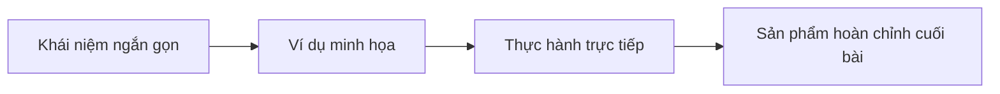

# Bài 1: Giới Thiệu Giảng Viên

## Mục Tiêu Bài Học

Sau bài này, bạn sẽ:

* Biết giảng viên là ai, xuất phát điểm và hành trình đến với Vibe Coding.
* Hiểu vì sao một người **không xuất thân từ dân lập trình chuyên nghiệp** vẫn có thể dạy bạn tạo ra ứng dụng thật bằng AI.
* Nắm được cách tiếp cận giảng dạy xuyên suốt khóa học: **thực hành trước, lý thuyết vừa đủ, sản phẩm thật ở cuối mỗi bài**.

---

## 1. Giảng Viên Là Ai?

Giảng viên khóa học này là người đã tự học và tự xây dựng nhiều sản phẩm số — website, công cụ nội bộ, ứng dụng nhỏ phục vụ công việc — bằng cách kết hợp tư duy sản phẩm với các công cụ AI hỗ trợ lập trình (ChatGPT, Claude, Google AI Studio, Google Stitch, Antigravity...).

Điểm khác biệt của giảng viên không nằm ở việc thuộc lòng cú pháp lập trình, mà ở khả năng:

* **Mô tả rõ ràng** điều mình muốn cho AI hiểu.
* **Tư duy sản phẩm**: biết người dùng cần gì, luồng sử dụng ra sao.
* **Kiểm tra và tinh chỉnh** kết quả AI tạo ra cho đến khi đúng ý.

Đây chính là bộ kỹ năng cốt lõi mà khóa học sẽ truyền tải cho bạn — không phải "học lập trình", mà là **học cách làm việc cùng AI để tạo ra sản phẩm**.

## 2. Vì Sao Giảng Viên Chọn Dạy Vibe Coding?

| Lý do                                   | Giải thích                                                                 |
| ---------------------------------------- | --------------------------------------------------------------------------- |
| Rào cản kỹ thuật đã giảm mạnh            | AI hiện có thể viết phần lớn code, người học chỉ cần biết mô tả và kiểm tra |
| Nhu cầu thực tế rất lớn                  | Nhiều người muốn có app/công cụ riêng nhưng không có thời gian học code lâu dài |
| Kinh nghiệm thực chiến, không chỉ lý thuyết | Giảng viên tự tay xây nhiều sản phẩm bằng chính quy trình sẽ dạy trong khóa học |
| Phù hợp người mới bắt đầu                | Không yêu cầu nền tảng lập trình, chỉ cần biết dùng máy tính cơ bản        |

## 3. Cách Tiếp Cận Giảng Dạy

Khóa học được thiết kế theo triết lý: **"Học bằng cách làm ra sản phẩm thật"**.

Mỗi bài học đều cố gắng cân bằng ba yếu tố:

1. **Lý thuyết vừa đủ** — không sa đà vào thuật ngữ kỹ thuật phức tạp.
2. **Ví dụ thực tế** — prompt mẫu, ảnh chụp màn hình quy trình, ứng dụng cụ thể.
3. **Sản phẩm đầu ra rõ ràng** — sau mỗi phần thực hành, bạn có một ứng dụng chạy được, không phải chỉ có lý thuyết suông.

## 4. Bạn Sẽ Học Được Gì Từ Giảng Viên?

* Cách tư duy như một **product owner** trước khi nhờ AI viết code.
* Cách viết **prompt** và **PRD** để AI hiểu đúng ý ngay từ lần đầu.
* Cách dùng thành thạo các công cụ: ChatGPT, Claude, Google AI Studio, Google Stitch, Vercel, Antigravity.
* Cách biến một ý tưởng cá nhân thành **ứng dụng thật, chạy được, có thể chia sẻ cho người khác dùng**.

---

## Điều Cần Ghi Nhớ

* Bạn không cần là lập trình viên để học khóa này.
* Giảng viên tiếp cận Vibe Coding từ góc độ người dùng thực tế, tự học và tự xây sản phẩm.
* Triết lý giảng dạy: thực hành trước, có sản phẩm thật sau mỗi bài.

## Tóm Tắt Bài Học

Bài học này giúp bạn hiểu giảng viên là ai và vì sao cách tiếp cận Vibe Coding trong khóa học này phù hợp với người mới bắt đầu. Trong bài tiếp theo, bạn sẽ được giới thiệu toàn bộ lộ trình khóa học — từ tư duy sản phẩm, viết PRD, đến việc build ra những ứng dụng thật.
