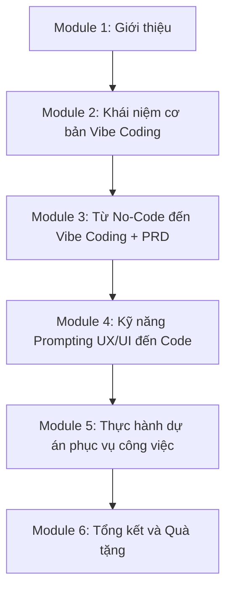

# Bài 2: Giới Thiệu Nội Dung Khóa Học

## Mục Tiêu Bài Học

Sau bài này, bạn sẽ:

* Nắm được **lộ trình tổng thể** của khóa học: từ tư duy, prompt, PRD đến build app thật.
* Biết rõ **6 module** và **20 bài học** sẽ đưa bạn đi qua những giai đoạn nào.
* Hiểu được **kết quả đầu ra** bạn sẽ có sau khi hoàn thành khóa học.

---

## 1. Lộ Trình Tổng Thể

Khóa học được chia thành 6 module, đi theo đúng trình tự một người mới bắt đầu cần trải qua để tự tạo được ứng dụng bằng AI: từ hiểu khái niệm, đến viết yêu cầu (PRD), đến thực hành build nhiều app thật, rồi đưa app lên internet.

## 2. Chi Tiết 6 Module

| Module | Tên module                                                        | Bài học   | Trọng tâm                                              |
| ------ | -------------------------------------------------------------------| --------- | ------------------------------------------------------- |
| 1      | Giới thiệu                                                        | Bài 1–2   | Làm quen giảng viên và lộ trình khóa học                |
| 2      | Tổng Quan Và Các Khái Niệm Cơ Bản Về Vibe Coding                  | Bài 4–5   | Hiểu Vibe Coding là gì, tạo app đầu tiên                |
| 3      | Các Khái Niệm Lập Trình Cơ Bản Từ No-Code Đến Vibe Coding         | Bài 6–9   | Quy trình sản phẩm số, viết PRD, chatbot tạo PRD        |
| 4      | Kỹ Năng Prompting Vibe Code                                       | Bài 10–14 | Build nhiều app thật: học tiếng Anh, ảnh sản phẩm, thumbnail, UI chuyên nghiệp |
| 5      | Thực Hành Dự Án Vibe Code Phục Vụ Công Việc                       | Bài 15–18 | Build app soạn văn bản, deploy, kết nối API key, AI Agent |
| 6      | Tổng Kết Và Quà Tặng                                              | Bài 19–20 | Tổng kết kiến thức, tài nguyên bổ sung                  |

## 3. Ba Kỹ Năng Cốt Lõi Bạn Sẽ Có

| Kỹ năng            | Bạn sẽ làm được gì                                                        |
| ------------------- | --------------------------------------------------------------------------- |
| **Tư duy sản phẩm**  | Biến một ý tưởng mơ hồ thành yêu cầu rõ ràng (PRD) mà AI hiểu đúng ngay lần đầu |
| **Prompting**        | Viết prompt hiệu quả cho ChatGPT, Claude, Google AI Studio để tạo giao diện và logic ứng dụng |
| **Vận hành sản phẩm**| Kết nối API key, deploy ứng dụng lên Vercel, chia sẻ app cho người khác dùng thật |

## 4. Các Dự Án Thực Hành Trong Khóa Học

Xuyên suốt khóa học, bạn sẽ tự tay build ra nhiều ứng dụng thật, không chỉ học lý thuyết:

* **App học tiếng Anh** — xây dựng bằng Google AI Studio (Bài 10).
* **App tối ưu hình ảnh sản phẩm thương mại** — phục vụ bán hàng online (Bài 11–12).
* **App tạo Thumbnail YouTube tự động** — ứng dụng AI tạo hình ảnh (Bài 13).
* **App soạn văn bản** — nhập thông tin, xuất văn bản hoàn chỉnh (Bài 15).
* Tất cả các app trên đều được **deploy thật lên Vercel** và **kết nối API key AI** để hoạt động như sản phẩm hoàn chỉnh (Bài 16–17).

## 5. Kết Quả Sau Khi Hoàn Thành Khóa Học

Sau khi hoàn thành khóa học, bạn sẽ:

* Biết cách biến một ý tưởng thành PRD rõ ràng để AI hiểu đúng.
* Tự tay build được nhiều ứng dụng thật bằng các công cụ AI phổ biến.
* Biết cách đưa ứng dụng lên internet miễn phí bằng Vercel.
* Biết cách dùng AI Agent (Antigravity) để hỗ trợ code và tự động hóa công việc.
* Có sẵn một quy trình lặp lại được để tự tạo ra bất kỳ ứng dụng nào mình cần trong tương lai.

---

## Điều Cần Ghi Nhớ

* Khóa học đi theo trình tự: tư duy → prompt → PRD → build app → deploy → vận hành.
* Bạn sẽ có nhiều sản phẩm thật, không chỉ lý thuyết.
* Mỗi module xây dựng trên nền tảng của module trước, nên hãy học theo đúng thứ tự.

## Tóm Tắt Bài Học

Khóa học "Vibe Coding Cơ Bản Cho Người Mới Bắt Đầu" đưa bạn đi từ con số 0 đến việc tự tay tạo ra và vận hành các ứng dụng thật bằng AI. Trong bài tiếp theo (Module 2), bạn sẽ bắt đầu tìm hiểu sâu về khái niệm Vibe Coding và cách AI hỗ trợ lập trình.
