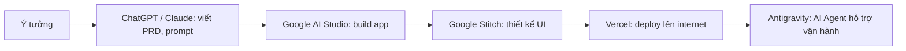
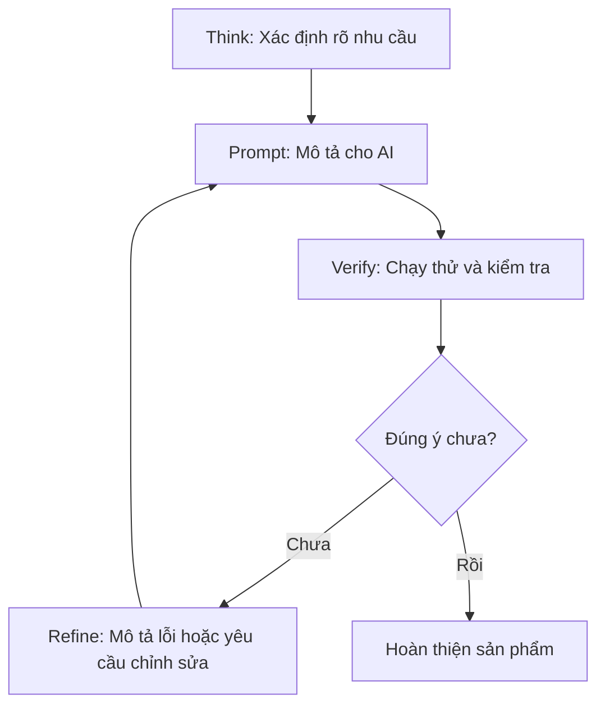

# Bài 4: Tổng Quan Và Các Khái Niệm Cơ Bản Về Vibe Coding

## Mục Tiêu Bài Học

Sau bài này, bạn sẽ:

* Hiểu **Vibe Coding là gì** và vì sao nó khác với lập trình truyền thống.
* Hiểu **AI hỗ trợ lập trình như thế nào** — vai trò của các công cụ AI trong quy trình tạo app.
* Nắm được **quy trình làm app bằng prompt** từ đầu đến cuối.

---

## 1. Vibe Coding Là Gì?

**Vibe Coding** là cách tạo phần mềm bằng việc **mô tả điều bạn muốn bằng ngôn ngữ tự nhiên**, sau đó để AI viết code, tạo giao diện và hỗ trợ sửa lỗi thay bạn.

```text
Vibe Coding = Ý tưởng + Mô tả rõ ràng + AI tạo sản phẩm + Kiểm tra + Tinh chỉnh
```

Bạn không cần viết từng dòng code. Thay vào đó, bạn nói với AI điều bạn muốn, giống như đang trao đổi với một lập trình viên thật:

> "Tôi muốn tạo một website landing page giới thiệu quán cà phê, có ảnh menu, form đặt bàn và thông tin liên hệ."

AI sẽ dựa vào mô tả đó để tạo giao diện, cấu trúc trang và logic cơ bản.

## 2. Vibe Coding Khác Gì So Với Lập Trình Truyền Thống?

| Lập trình truyền thống                  | Vibe Coding                                    |
| ----------------------------------------- | ------------------------------------------------ |
| Phải học cú pháp ngôn ngữ lập trình lâu dài | Mô tả bằng ngôn ngữ tự nhiên                     |
| Tự gõ từng dòng code                      | AI viết phần lớn code thay bạn                   |
| Debug dựa vào kinh nghiệm cá nhân         | Copy lỗi, gửi cho AI để AI tự sửa                |
| Cần nhiều kỹ năng kỹ thuật                | Người mới cũng có thể tạo ra sản phẩm chạy được  |
| Tốc độ phụ thuộc khả năng viết code       | Tốc độ phụ thuộc khả năng mô tả yêu cầu rõ ràng  |

## 3. AI Hỗ Trợ Lập Trình Như Thế Nào?

Các công cụ AI mà khóa học sẽ dùng đóng vai trò khác nhau trong quy trình tạo sản phẩm:

| Công cụ                | Vai trò chính                                             |
| ------------------------ | ------------------------------------------------------------ |
| **ChatGPT / Claude**     | Trò chuyện, lên ý tưởng, viết PRD, viết prompt chi tiết cho app |
| **Google AI Studio**     | Build ứng dụng thật từ prompt, có giao diện chạy thử ngay    |
| **Google Stitch**        | Thiết kế giao diện (UI/UX) chuyên nghiệp bằng AI              |
| **Vercel**                | Đưa ứng dụng lên internet (deploy) miễn phí                   |
| **Antigravity**           | AI Agent hỗ trợ code, tự động hóa các tác vụ lặp lại          |



## 4. Quy Trình Làm App Bằng Prompt

Vibe Coding không phải là viết một prompt duy nhất rồi có ngay sản phẩm hoàn hảo. Đó là một **vòng lặp** gồm 4 bước:

| Bước | Tên bước    | Việc cần làm                                                |
| ---- | ------------ | -------------------------------------------------------------- |
| 1    | **Think**    | Xác định rõ bạn muốn app làm gì, cho ai dùng, cần dữ liệu gì   |
| 2    | **Prompt**   | Mô tả yêu cầu đó rõ ràng cho AI (lý tưởng nhất là dùng PRD)    |
| 3    | **Verify**   | Chạy thử app, kiểm tra xem có đúng ý mình muốn không            |
| 4    | **Refine**   | Nếu chưa đúng hoặc bị lỗi, mô tả lại cho AI để AI sửa            |



## 5. Vì Sao Người Mới Bắt Đầu Nên Học Vibe Coding?

* **Không cần nền tảng lập trình** — chỉ cần biết mô tả yêu cầu rõ ràng.
* **Tạo ra sản phẩm thật, nhanh** — có thể có app chạy được chỉ sau vài giờ thực hành.
* **Ứng dụng ngay vào công việc** — tạo công cụ hỗ trợ công việc cá nhân mà không cần thuê lập trình viên.
* **Tư duy có thể tái sử dụng** — một khi hiểu quy trình, bạn có thể tự tạo bất kỳ app nào mình cần trong tương lai.

---

## Điều Cần Ghi Nhớ

* Vibe Coding là mô tả ý tưởng bằng ngôn ngữ tự nhiên để AI viết code.
* Prompt càng rõ ràng, sản phẩm AI tạo ra càng gần đúng ý ngay từ đầu.
* Quy trình gồm 4 bước lặp lại: Think → Prompt → Verify → Refine.
* Bạn không cần giỏi code, nhưng cần biết kiểm tra và mô tả lại kết quả.

## Tóm Tắt Bài Học

Vibe Coding mở ra cách làm phần mềm mới: bắt đầu bằng ý tưởng và ngôn ngữ tự nhiên thay vì cú pháp lập trình. Trong bài tiếp theo, bạn sẽ thực hành tạo ra ứng dụng đầu tiên của mình để trải nghiệm trực tiếp vòng lặp Think → Prompt → Verify → Refine.
