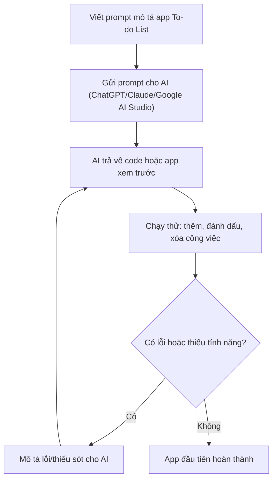

# Bài 5: Thực Hành Vibe Coding — Tạo Ra App Đầu Tiên

## Mục Tiêu Bài Học

Sau bài này, bạn sẽ:

* Tự tay tạo ra **app đầu tiên** bằng AI để hiểu rõ vòng lặp: ý tưởng → prompt → kiểm tra → chỉnh sửa.
* Biết cách chọn công cụ phù hợp cho người mới bắt đầu.
* Có kinh nghiệm thực tế về việc prompt "không hoàn hảo ngay từ lần đầu" là chuyện bình thường.

---

## 1. Chuẩn Bị Trước Khi Bắt Đầu

Trước khi viết prompt đầu tiên, hãy chuẩn bị:

| Việc cần chuẩn bị     | Ghi chú                                                          |
| ----------------------- | -------------------------------------------------------------------- |
| Tài khoản công cụ AI     | ChatGPT, Claude, hoặc Google AI Studio (tài khoản Google miễn phí)   |
| Ý tưởng app đơn giản     | Chọn thứ nhỏ, quen thuộc — ví dụ: To-do list, trang giới thiệu cá nhân |
| Tâm lý sẵn sàng thử sai  | Lần đầu ít khi ra đúng 100% — đó là điều bình thường trong Vibe Coding |

## 2. Chọn Ý Tưởng App Đầu Tiên

Với người mới, nên chọn app **nhỏ, rõ ràng, ít tính năng** để dễ kiểm soát kết quả. Một số gợi ý:

* **To-do list cá nhân** — thêm, xóa, đánh dấu hoàn thành công việc.
* **Trang giới thiệu bản thân (Landing page cá nhân)** — ảnh đại diện, giới thiệu ngắn, liên kết mạng xã hội.
* **Máy tính đơn giản** — cộng trừ nhân chia cơ bản.

Trong bài này, ta sẽ thực hành với ví dụ: **App To-do List cá nhân**.

## 3. Viết Prompt Đầu Tiên

So sánh giữa prompt yếu và prompt tốt:

Prompt yếu:

```text
Làm cho tôi một app to-do list.
```

Prompt tốt hơn:

```text
Hãy đóng vai một lập trình viên frontend giỏi.

Tôi muốn tạo một ứng dụng web To-do List đơn giản với các yêu cầu sau:
- Có ô nhập công việc và nút "Thêm".
- Danh sách công việc hiển thị bên dưới.
- Mỗi công việc có nút đánh dấu "Hoàn thành" và nút "Xóa".
- Công việc đã hoàn thành hiển thị gạch ngang chữ.
- Giao diện đơn giản, màu sắc nhẹ nhàng, dễ nhìn.
- Chỉ cần chạy được trên trình duyệt, không cần lưu dữ liệu vào server.
```

Nguyên tắc: càng mô tả rõ **tính năng, giao diện và giới hạn phạm vi**, AI càng tạo đúng ý ngay từ đầu.

## 4. Thực Hành: Từ Prompt Đến App Chạy Được



Các bước cụ thể:

1. Mở công cụ AI (ChatGPT, Claude, hoặc Google AI Studio).
2. Dán prompt đã chuẩn bị ở trên.
3. Nhận kết quả — có thể là code hoặc bản xem trước trực tiếp (tùy công cụ).
4. Chạy thử app: thử thêm một công việc, đánh dấu hoàn thành, xóa một công việc.
5. Nếu có lỗi (ví dụ nút Xóa không hoạt động), mô tả lại chính xác điều đang xảy ra cho AI.

## 5. Cách Mô Tả Lỗi Hiệu Quả Cho AI

| Cách mô tả kém                  | Cách mô tả tốt                                                         |
| ---------------------------------- | -------------------------------------------------------------------------- |
| "Nó bị lỗi."                        | "Khi tôi bấm nút Xóa, công việc không biến mất khỏi danh sách."             |
| "Giao diện xấu."                    | "Chữ trong danh sách quá nhỏ, khó đọc. Hãy tăng cỡ chữ và thêm khoảng cách giữa các dòng." |
| "Sửa lại đi."                       | "Hãy giữ nguyên các tính năng hiện tại, chỉ sửa lỗi nút Xóa không hoạt động." |

Nguyên tắc vàng: **mô tả hiện tượng cụ thể, kèm theo điều bạn mong muốn xảy ra.**

## 6. Kết Quả Mong Đợi Sau Bài Học

Sau khi hoàn thành bài thực hành, bạn nên có:

* Một app To-do List (hoặc app đơn giản khác) chạy được trên trình duyệt.
* Kinh nghiệm thực tế về việc viết prompt, kiểm tra và chỉnh sửa.
* Sự tự tin rằng: **không cần biết code vẫn tạo ra được sản phẩm chạy thật**.

---

## Điều Cần Ghi Nhớ

* Chọn app nhỏ và rõ ràng cho lần thực hành đầu tiên.
* Prompt càng chi tiết về tính năng, giao diện và giới hạn phạm vi, kết quả càng chính xác.
* Mô tả lỗi cụ thể, không mơ hồ, để AI sửa đúng chỗ.
* Vòng lặp Prompt → Verify → Refine là điều bình thường và cần thiết, không phải dấu hiệu thất bại.

## Tóm Tắt Bài Học

Qua bài thực hành này, bạn đã trải nghiệm trực tiếp vòng lặp cốt lõi của Vibe Coding: mô tả ý tưởng, nhận kết quả từ AI, kiểm tra và tinh chỉnh cho đến khi đúng ý. Đây là nền tảng cho mọi dự án tiếp theo trong khóa học. Ở Module 3, bạn sẽ học cách chuyên nghiệp hóa quy trình này bằng việc viết PRD — bản thiết kế giúp AI hiểu đúng ý bạn ngay từ lần đầu.
