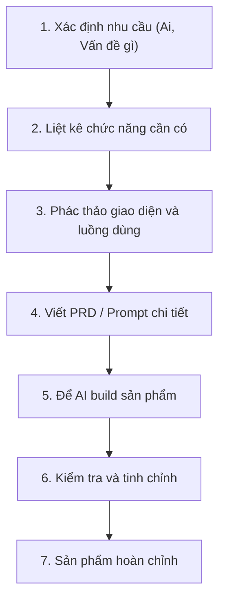

# Bài 6: Từ Ý Tưởng Đến Sản Phẩm — Quy Trình Phát Triển Sản Phẩm Số Với AI

## Mục Tiêu Bài Học

Sau bài này, bạn sẽ:

* Biết cách **biến một ý tưởng mơ hồ thành sản phẩm cụ thể**: xác định nhu cầu, chức năng, giao diện, luồng sử dụng.
* Hiểu quy trình phát triển sản phẩm số cơ bản mà người không chuyên vẫn áp dụng được nhờ AI.
* Chuẩn bị nền tảng tư duy trước khi học viết PRD ở bài tiếp theo.

---

## 1. Vì Sao Cần Quy Trình, Không Chỉ Có Ý Tưởng?

Nhiều người có ý tưởng hay nhưng khi đưa thẳng cho AI lại nhận về sản phẩm không đúng ý. Nguyên nhân thường không phải vì AI kém, mà vì **ý tưởng chưa được làm rõ đủ** trước khi mô tả.

```text
Ý tưởng mơ hồ → Prompt mơ hồ → Sản phẩm không đúng ý
Ý tưởng rõ ràng → Prompt rõ ràng → Sản phẩm đúng ý ngay từ đầu
```

Vì vậy, trước khi prompt, cần có một bước trung gian: **làm rõ ý tưởng bằng quy trình phát triển sản phẩm cơ bản**.

## 2. Bốn Câu Hỏi Làm Rõ Ý Tưởng

Trước khi viết bất kỳ prompt nào, hãy trả lời 4 câu hỏi sau:

| Câu hỏi                         | Mục đích                                                          |
| ---------------------------------- | ---------------------------------------------------------------------- |
| **Ai** sẽ dùng sản phẩm này?         | Xác định đối tượng người dùng (chính mình, khách hàng, đồng nghiệp...) |
| Sản phẩm giải quyết **vấn đề gì**?  | Xác định lý do sản phẩm tồn tại — tránh làm tính năng thừa            |
| Sản phẩm cần **chức năng gì**?      | Liệt kê các tính năng cụ thể, tránh mô tả chung chung                 |
| Sản phẩm **trông như thế nào**?     | Hình dung giao diện, luồng thao tác của người dùng                    |

### Ví dụ minh họa: App quản lý chi tiêu cá nhân

| Câu hỏi   | Trả lời                                                        |
| ---------- | ------------------------------------------------------------------ |
| Ai dùng?   | Chính bản thân người dùng, dùng hằng ngày trên điện thoại/máy tính |
| Vấn đề gì? | Không nhớ đã tiêu bao nhiêu tiền mỗi tháng, mỗi khoản               |
| Chức năng? | Thêm khoản chi, phân loại (ăn uống, di chuyển...), xem tổng theo tháng |
| Giao diện? | Trang chủ hiển thị tổng chi tháng này, danh sách các khoản chi bên dưới |

## 3. Quy Trình Phát Triển Sản Phẩm Số Với AI



So với quy trình phát triển phần mềm truyền thống (vốn cần nhiều vai trò: product manager, designer, developer, tester), quy trình này **rút gọn lại còn một người**: chính bạn, với sự hỗ trợ của AI ở các bước 5 và 6.

## 4. Xác Định Chức Năng: Nguyên Tắc "Đủ Dùng, Không Dư Thừa"

Người mới bắt đầu thường mắc lỗi liệt kê quá nhiều chức năng ngay từ phiên bản đầu tiên. Nguyên tắc nên áp dụng:

* Bắt đầu với **chức năng cốt lõi** — thứ mà thiếu nó, sản phẩm không còn ý nghĩa.
* Các chức năng "có thì tốt" nên để lại cho **phiên bản sau**.
* Ưu tiên sản phẩm **chạy được, đơn giản** hơn là sản phẩm "đầy đủ nhưng chưa xong".

### Ví dụ: App quản lý chi tiêu cá nhân

| Chức năng cốt lõi (làm trước)      | Chức năng mở rộng (làm sau)              |
| ------------------------------------- | -------------------------------------------- |
| Thêm khoản chi                        | Biểu đồ thống kê chi tiêu                     |
| Xem danh sách khoản chi               | Đặt ngân sách giới hạn mỗi tháng              |
| Xem tổng chi trong tháng              | Xuất báo cáo ra file Excel/PDF                |

## 5. Phác Thảo Giao Diện Và Luồng Sử Dụng

Không cần biết thiết kế chuyên nghiệp, chỉ cần mô tả **luồng thao tác** theo trình tự người dùng sẽ trải qua:

```text
Người dùng mở app
  → Thấy tổng chi tiêu tháng này ở đầu trang
  → Bấm nút "Thêm khoản chi"
  → Nhập số tiền, chọn danh mục, bấm Lưu
  → Khoản chi mới xuất hiện trong danh sách
  → Tổng chi tiêu tự động cập nhật
```

Luồng sử dụng này chính là nguyên liệu quan trọng để viết PRD và prompt ở các bài tiếp theo.

---

## Điều Cần Ghi Nhớ

* Ý tưởng rõ ràng là nền tảng để prompt hiệu quả — đừng bỏ qua bước làm rõ ý tưởng.
* Luôn trả lời 4 câu hỏi: Ai dùng, vấn đề gì, chức năng gì, giao diện ra sao.
* Ưu tiên chức năng cốt lõi trước, mở rộng sau.
* Mô tả luồng sử dụng theo trình tự thao tác thực tế của người dùng.

## Tóm Tắt Bài Học

Trước khi nhờ AI viết code, một sản phẩm tốt luôn bắt đầu từ một ý tưởng được làm rõ: ai dùng, vấn đề gì, chức năng gì, giao diện ra sao. Đây là bước nền tảng của quy trình phát triển sản phẩm số. Trong bài tiếp theo, bạn sẽ học cách đóng gói toàn bộ những gì đã làm rõ ở bài này thành một tài liệu gọi là **PRD** — công cụ giúp AI hiểu đúng ý bạn ngay từ lần đầu.
