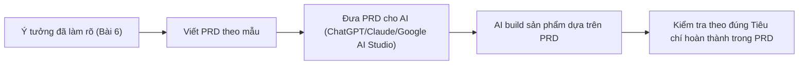

# Bài 7: PRD Là Gì — Bản Thiết Kế Giúp AI Hiểu Đúng Ý Bạn & Tự Động Code Ngay Lần Đầu

## Mục Tiêu Bài Học

Sau bài này, bạn sẽ:

* Hiểu **PRD (Product Requirements Document)** là gì và vì sao nó quan trọng trong Vibe Coding.
* Biết cách viết PRD để AI hiểu yêu cầu rõ hơn, giảm lỗi khi sinh code.
* Có sẵn một **mẫu PRD** có thể áp dụng ngay cho bất kỳ dự án nào.

---

## 1. PRD Là Gì?

**PRD (Product Requirements Document)** — Tài liệu Yêu Cầu Sản Phẩm — là bản mô tả chi tiết về một sản phẩm: nó là gì, dành cho ai, có những chức năng nào, giao diện ra sao, và tiêu chí để biết sản phẩm đã hoàn thành.

Trong môi trường phát triển phần mềm truyền thống, PRD là tài liệu để đội ngũ (product manager, designer, developer) cùng hiểu và làm theo. Trong Vibe Coding, **PRD chính là "bản tóm tắt" bạn đưa cho AI** để AI đóng vai trò toàn bộ đội ngũ đó.

```text
PRD tốt = AI hiểu đúng ý bạn ngay từ lần đầu = Ít phải sửa đi sửa lại
```

## 2. Vì Sao Không Prompt Trực Tiếp Mà Cần PRD?

| Prompt ngắn, không có PRD                          | Có PRD trước khi prompt                                |
| ----------------------------------------------------- | ---------------------------------------------------------- |
| AI phải tự đoán nhiều chi tiết còn thiếu               | AI có đầy đủ thông tin cần thiết để tạo đúng ngay từ đầu   |
| Dễ phải sửa đi sửa lại nhiều lần                       | Giảm đáng kể số vòng lặp sửa lỗi                            |
| Khó tái sử dụng cho lần sau                            | PRD có thể lưu lại, chỉnh sửa và tái sử dụng cho phiên bản sau |
| Khó giữ nhất quán khi làm nhiều tính năng             | PRD giúp AI giữ nhất quán về tên gọi, cấu trúc dữ liệu, giao diện |

## 3. Cấu Trúc Một PRD Cơ Bản

Một PRD dành cho Vibe Coding không cần phức tạp như PRD doanh nghiệp. Cấu trúc tối giản nhưng đủ dùng gồm 6 phần:

| Phần                | Nội dung                                                             |
| --------------------- | ------------------------------------------------------------------------ |
| 1. Tổng quan sản phẩm | Tên sản phẩm, mô tả ngắn gọn trong 1–2 câu                              |
| 2. Đối tượng người dùng | Ai sẽ dùng sản phẩm này                                                |
| 3. Vấn đề cần giải quyết | Vì sao sản phẩm này cần tồn tại                                       |
| 4. Danh sách chức năng | Liệt kê từng chức năng cụ thể, có thể chia mức độ ưu tiên              |
| 5. Yêu cầu giao diện  | Mô tả bố cục, phong cách thiết kế, các màn hình chính                   |
| 6. Tiêu chí hoàn thành | Điều kiện để biết sản phẩm đã đúng yêu cầu (ví dụ: các thao tác phải chạy được) |

## 4. Mẫu PRD Có Thể Áp Dụng Ngay

```text
# PRD: [Tên sản phẩm]

## 1. Tổng quan
[Mô tả ngắn gọn sản phẩm trong 1-2 câu]

## 2. Đối tượng người dùng
[Ai sẽ dùng sản phẩm này]

## 3. Vấn đề cần giải quyết
[Vì sao sản phẩm này cần tồn tại]

## 4. Danh sách chức năng
- [Chức năng 1 - mô tả cụ thể]
- [Chức năng 2 - mô tả cụ thể]
- [Chức năng 3 - mô tả cụ thể]

## 5. Yêu cầu giao diện
- Bố cục: [mô tả các khu vực chính trên màn hình]
- Phong cách: [ví dụ: tối giản, hiện đại, màu sắc chủ đạo]
- Các màn hình: [liệt kê từng màn hình/trang]

## 6. Tiêu chí hoàn thành
- [Điều kiện 1 để coi là hoàn thành]
- [Điều kiện 2 để coi là hoàn thành]
```

## 5. Ví Dụ PRD Thực Tế: App To-Do List

```text
# PRD: To-Do List Cá Nhân

## 1. Tổng quan
Ứng dụng web quản lý công việc cá nhân đơn giản, chạy trên trình duyệt.

## 2. Đối tượng người dùng
Cá nhân dùng để ghi nhớ và theo dõi công việc hằng ngày.

## 3. Vấn đề cần giải quyết
Người dùng dễ quên công việc cần làm nếu không ghi lại ở một nơi cố định.

## 4. Danh sách chức năng
- Thêm công việc mới qua ô nhập liệu và nút "Thêm".
- Đánh dấu công việc đã hoàn thành (gạch ngang chữ).
- Xóa công việc khỏi danh sách.
- Hiển thị số lượng công việc chưa hoàn thành.

## 5. Yêu cầu giao diện
- Bố cục: ô nhập liệu ở trên cùng, danh sách công việc bên dưới.
- Phong cách: tối giản, màu sắc nhẹ nhàng (trắng/xanh nhạt).
- Chỉ có một màn hình duy nhất.

## 6. Tiêu chí hoàn thành
- Có thể thêm, đánh dấu hoàn thành và xóa công việc mà không bị lỗi.
- Giao diện hiển thị đúng trên trình duyệt máy tính.
```

## 6. Quy Trình Dùng PRD Trong Vibe Coding



---

## Điều Cần Ghi Nhớ

* PRD là bản tóm tắt yêu cầu sản phẩm — giúp AI hiểu đúng ý ngay từ lần đầu.
* PRD tốt gồm 6 phần: tổng quan, người dùng, vấn đề, chức năng, giao diện, tiêu chí hoàn thành.
* PRD có thể lưu lại và tái sử dụng, không cần viết lại từ đầu mỗi lần.
* Viết PRD trước khi prompt giúp tiết kiệm thời gian sửa lỗi về sau.

## Tóm Tắt Bài Học

PRD chính là cầu nối giữa ý tưởng trong đầu bạn và sản phẩm mà AI tạo ra. Một PRD rõ ràng giúp giảm đáng kể số lần phải sửa đi sửa lại. Trong bài tiếp theo, bạn sẽ thực hành dùng ChatGPT và Claude để tạo PRD thực tế cho một app cụ thể của chính mình.
