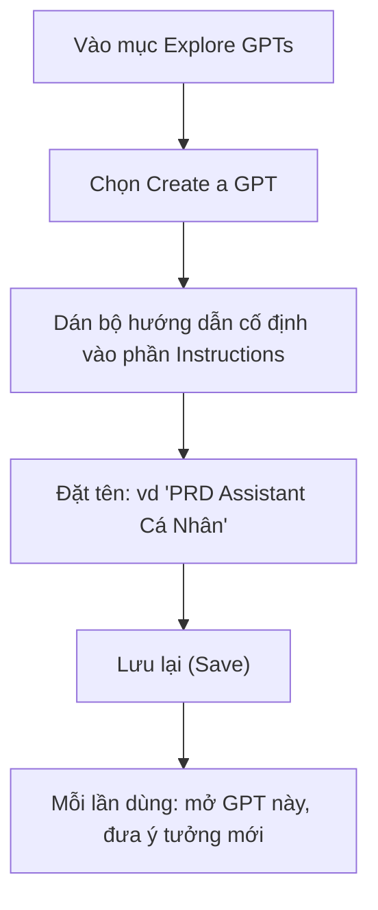
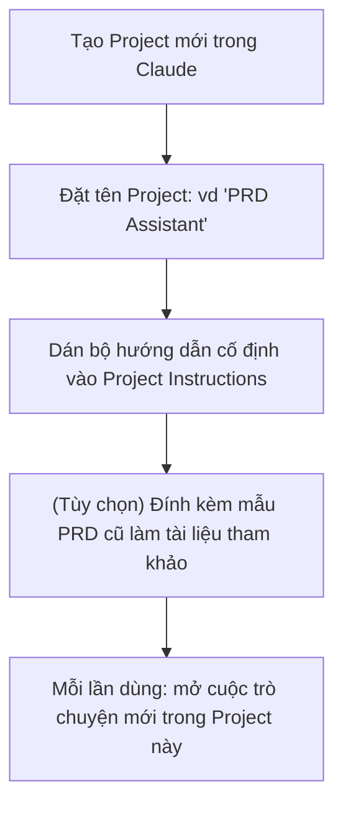

# Bài 9: Chatbot PRD Cá Nhân Chuyên Biệt Để Generate PRD Tự Động

## Mục Tiêu Bài Học

Sau bài này, bạn sẽ:

* Hiểu cách xây dựng hoặc cấu hình một **chatbot chuyên biệt** để tự động tạo PRD theo phong cách riêng của bạn.
* Biết cách dùng tính năng **Custom GPT (ChatGPT)** hoặc **Project/System Prompt (Claude)** để lưu lại quy trình tạo PRD.
* Tiết kiệm thời gian cho các dự án sau này — không cần gõ lại prompt hướng dẫn mỗi lần.

---

## 1. Vì Sao Cần Một Chatbot PRD Riêng?

Ở Bài 8, mỗi lần muốn tạo PRD bạn phải dán lại toàn bộ prompt hướng dẫn cho AI. Điều này tốn thời gian và dễ quên các yêu cầu quan trọng. Giải pháp là tạo ra **một chatbot chuyên biệt**, đã được "cài đặt sẵn" cách làm việc, để mỗi lần bạn chỉ cần đưa ý tưởng, chatbot sẽ tự hỏi và tự tổng hợp PRD theo đúng định dạng quen thuộc.

```text
Không có chatbot riêng: Mỗi lần dùng phải nhắc lại toàn bộ hướng dẫn
Có chatbot riêng: Chỉ cần đưa ý tưởng, chatbot tự biết cách làm
```

## 2. Hai Cách Tạo Chatbot PRD Cá Nhân

| Cách                          | Công cụ            | Phù hợp khi                                         |
| -------------------------------- | --------------------- | ------------------------------------------------------ |
| **Custom GPT**                   | ChatGPT (gói trả phí) | Muốn tạo một "GPT" riêng, dùng lại nhiều lần, dễ chia sẻ |
| **Project với System Prompt**    | Claude (Projects)     | Muốn nhóm các cuộc trò chuyện PRD vào một không gian riêng, có thể đính kèm tài liệu mẫu |

Cả hai cách đều dựa trên cùng nguyên lý: **lưu sẵn một "bộ hướng dẫn cố định"** để AI luôn tuân theo mỗi khi bắt đầu cuộc trò chuyện mới.

## 3. Nội Dung "Bộ Hướng Dẫn Cố Định" Cho Chatbot PRD

Đây là nội dung bạn sẽ cấu hình một lần duy nhất (trong phần Instructions của Custom GPT, hoặc System Prompt/Project Knowledge của Claude):

```text
Bạn là một Product Manager chuyên tạo PRD (Product Requirements Document)
cho các ứng dụng Vibe Coding của người dùng.

Khi người dùng đưa ra một ý tưởng app, hãy làm theo các bước sau:

1. Đặt tối đa 5 câu hỏi, mỗi lần một câu, để làm rõ:
   - Đối tượng người dùng
   - Vấn đề cần giải quyết
   - Các chức năng chính (phân biệt: phải có / nên có / có thì tốt)
   - Phong cách giao diện mong muốn
   - Nền tảng chạy app (web/mobile/desktop)

2. Sau khi có đủ thông tin, tổng hợp thành PRD theo đúng cấu trúc:
   # PRD: [Tên sản phẩm]
   ## 1. Tổng quan
   ## 2. Đối tượng người dùng
   ## 3. Vấn đề cần giải quyết
   ## 4. Danh sách chức năng
   ## 5. Yêu cầu giao diện
   ## 6. Tiêu chí hoàn thành

3. Luôn viết PRD bằng tiếng Việt, ngắn gọn, rõ ràng, không dùng thuật ngữ kỹ thuật phức tạp.

4. Sau khi đưa ra PRD, hỏi người dùng: "Bạn có muốn điều chỉnh phần nào không?"
```

## 4. Hướng Dẫn Thiết Lập Với ChatGPT (Custom GPT)



## 5. Hướng Dẫn Thiết Lập Với Claude (Projects)



## 6. Lợi Ích Khi Có Chatbot PRD Riêng

| Lợi ích                          | Giải thích                                                          |
| ------------------------------------ | ------------------------------------------------------------------------ |
| Tiết kiệm thời gian                  | Không cần gõ lại hướng dẫn mỗi lần bắt đầu dự án mới                     |
| Nhất quán về định dạng               | Mọi PRD đều theo cùng một cấu trúc, dễ so sánh và tái sử dụng            |
| Dễ mở rộng                            | Có thể thêm yêu cầu riêng (vd: luôn hỏi về ngân sách, luôn hỏi về deadline) |
| Có thể chia sẻ cho người khác dùng    | Custom GPT có thể chia sẻ link cho bạn bè, đồng nghiệp cùng sử dụng      |

## 7. Mẹo Tinh Chỉnh Chatbot Theo Thời Gian

Sau vài lần sử dụng, bạn có thể nhận ra chatbot còn thiếu sót (ví dụ: quên hỏi về nền tảng chạy app). Hãy cập nhật lại phần Instructions bất cứ khi nào phát hiện điều này — đây chính là cách "huấn luyện" chatbot cá nhân ngày càng phù hợp với cách làm việc của riêng bạn.

---

## Điều Cần Ghi Nhớ

* Chatbot PRD cá nhân giúp tự động hóa quy trình đặt câu hỏi và tổng hợp PRD.
* Có thể tạo bằng Custom GPT (ChatGPT) hoặc Project (Claude), tùy công cụ bạn đang dùng.
* Bộ hướng dẫn cố định nên quy định rõ: số câu hỏi, thứ tự hỏi, cấu trúc PRD đầu ra.
* Nên tinh chỉnh chatbot dần theo thời gian dựa trên kinh nghiệm sử dụng thực tế.

## Tóm Tắt Bài Học

Với một chatbot PRD cá nhân được cấu hình sẵn, việc biến ý tưởng thành PRD hoàn chỉnh chỉ còn mất vài phút thay vì phải hướng dẫn lại từ đầu mỗi lần. Đây là công cụ quan trọng bạn sẽ dùng xuyên suốt phần thực hành ở các module tiếp theo. Sang Module 4, bạn sẽ bắt đầu dùng chính PRD này để build những ứng dụng thật đầu tiên bằng các công cụ AI chuyên dụng.
