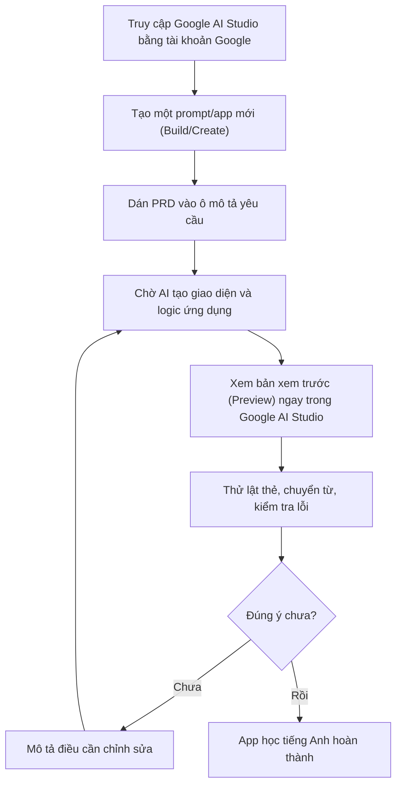

# Bài 10: Thực Hành Build English Learning App Với Google AI Studio

## Mục Tiêu Bài Học

Sau bài này, bạn sẽ:

* Biết cách dùng **Google AI Studio** để build một ứng dụng thật từ prompt.
* Tự tay tạo ra một **app học tiếng Anh** đơn giản, chạy được ngay trong trình duyệt.
* Hiểu cách Google AI Studio khác với việc chat thông thường với ChatGPT/Claude.

---

## 1. Google AI Studio Là Gì?

**Google AI Studio** là công cụ miễn phí của Google cho phép bạn build ứng dụng bằng cách mô tả yêu cầu bằng ngôn ngữ tự nhiên, và xem kết quả chạy thử ngay lập tức trong cùng giao diện — không cần cài đặt phần mềm hay biết code.

| Đặc điểm                     | Google AI Studio                                     |
| ------------------------------- | -------------------------------------------------------- |
| Chi phí                          | Miễn phí (dùng tài khoản Google)                          |
| Đầu ra                            | App chạy thử trực tiếp (preview), có thể xem code đi kèm  |
| Phù hợp                           | Build ứng dụng nhỏ, có giao diện, chạy trên trình duyệt   |
| Yêu cầu                           | Tài khoản Google, không cần cài đặt gì thêm               |

## 2. Chuẩn Bị PRD Cho App Học Tiếng Anh

Áp dụng kỹ năng đã học ở Module 3, trước tiên hãy chuẩn bị PRD ngắn gọn:

```text
# PRD: App Học Từ Vựng Tiếng Anh

## 1. Tổng quan
Ứng dụng web giúp người mới học ghi nhớ từ vựng tiếng Anh qua flashcard.

## 2. Đối tượng người dùng
Người tự học tiếng Anh cơ bản, muốn ôn từ vựng mỗi ngày.

## 3. Vấn đề cần giải quyết
Người học khó nhớ từ vựng nếu chỉ đọc qua danh sách, cần cách ôn tập tương tác.

## 4. Danh sách chức năng
- Hiển thị flashcard: mặt trước là từ tiếng Anh, mặt sau là nghĩa tiếng Việt.
- Nút "Lật thẻ" để xem nghĩa.
- Nút "Từ tiếp theo" để chuyển sang từ khác.
- Có sẵn danh sách khoảng 10-15 từ vựng chủ đề cơ bản (chào hỏi, gia đình...).

## 5. Yêu cầu giao diện
- Bố cục: thẻ flashcard ở giữa màn hình, các nút điều hướng bên dưới.
- Phong cách: đơn giản, màu sắc tươi sáng, chữ to dễ đọc.

## 6. Tiêu chí hoàn thành
- Lật được thẻ để xem nghĩa và chuyển được sang từ tiếp theo mà không lỗi.
```

## 3. Các Bước Thực Hành Trong Google AI Studio



## 4. Prompt Mẫu Để Đưa Vào Google AI Studio

```text
Dựa trên PRD dưới đây, hãy build một ứng dụng web flashcard học từ vựng tiếng Anh:

[Dán PRD từ mục 2 vào đây]

Yêu cầu kỹ thuật:
- Dùng HTML, CSS, JavaScript thuần, chạy được ngay trong trình duyệt.
- Không cần kết nối cơ sở dữ liệu, dữ liệu từ vựng để cố định trong code.
- Giao diện responsive, hiển thị tốt trên cả điện thoại và máy tính.
```

## 5. Kiểm Tra Và Tinh Chỉnh Kết Quả

Sau khi có bản xem trước, hãy kiểm tra theo đúng "Tiêu chí hoàn thành" đã ghi trong PRD:

| Việc cần kiểm tra                          | Cách xử lý nếu chưa đúng                                 |
| ---------------------------------------------- | -------------------------------------------------------------- |
| Lật thẻ có hiển thị đúng nghĩa không?            | Mô tả cụ thể: "Khi bấm Lật thẻ, nghĩa tiếng Việt không hiện ra" |
| Chuyển từ tiếp theo có hoạt động không?          | Mô tả: "Bấm 'Từ tiếp theo' nhưng thẻ không đổi sang từ mới"    |
| Giao diện có dễ đọc trên điện thoại không?       | Yêu cầu: "Hãy tăng cỡ chữ và căn giữa nội dung trên màn hình nhỏ" |

## 6. Mở Rộng App Sau Khi Hoàn Thành Phiên Bản Đầu Tiên

Sau khi có phiên bản cơ bản chạy tốt, bạn có thể tiếp tục prompt để bổ sung:

* Thêm nút "Đánh dấu đã thuộc" để loại từ đó khỏi vòng ôn tập.
* Thêm nhiều chủ đề từ vựng khác nhau (công việc, du lịch, ẩm thực...).
* Thêm âm thanh phát âm cho từng từ (nếu công cụ hỗ trợ).

---

## Điều Cần Ghi Nhớ

* Google AI Studio cho phép build và xem trước ứng dụng ngay trong một giao diện duy nhất.
* Luôn chuẩn bị PRD trước khi đưa yêu cầu vào Google AI Studio để có kết quả chính xác hơn.
* Kiểm tra kết quả theo đúng tiêu chí hoàn thành đã đặt ra trong PRD.
* Sau khi có phiên bản cơ bản, có thể tiếp tục prompt để mở rộng tính năng.

## Tóm Tắt Bài Học

Qua bài này, bạn đã tự tay build một ứng dụng học tiếng Anh hoàn chỉnh bằng Google AI Studio, áp dụng đúng quy trình PRD → Prompt → Verify → Refine đã học ở các module trước. Trong bài tiếp theo, bạn sẽ thực chiến với một dự án phục vụ mục đích thương mại: ứng dụng tối ưu hình ảnh sản phẩm.
