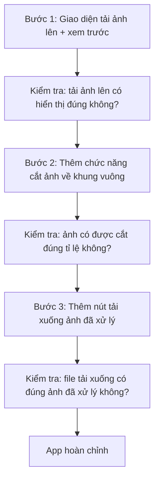

# Bài 11: Thực Chiến Vibe Coding — Tạo Ứng Dụng Tối Ưu Hình Ảnh Sản Phẩm Thương Mại

## Mục Tiêu Bài Học

Sau bài này, bạn sẽ:

* Build được ứng dụng phục vụ mục đích **thương mại thực tế**: tối ưu hình ảnh sản phẩm để bán hàng online.
* Biết cách viết PRD cho một app có xử lý ảnh — dạng bài toán phức tạp hơn flashcard hay to-do list.
* Hiểu cách chia nhỏ một tính năng lớn (xử lý ảnh) thành các bước prompt dễ kiểm soát.

---

## 1. Bài Toán Thực Tế: Vì Sao Cần App Tối Ưu Ảnh Sản Phẩm?

Người bán hàng online thường gặp vấn đề: ảnh chụp sản phẩm có nền lộn xộn, ánh sáng không đều, kích thước không đồng nhất giữa các sản phẩm khi đăng lên sàn thương mại điện tử. Một ứng dụng hỗ trợ tối ưu ảnh sản phẩm có thể giải quyết trực tiếp vấn đề này.

| Vấn đề thực tế                          | Chức năng app cần có                                  |
| -------------------------------------------- | ----------------------------------------------------------- |
| Nền ảnh lộn xộn, không chuyên nghiệp          | Xóa/thay nền ảnh sản phẩm                                    |
| Kích thước ảnh không đồng nhất                | Resize ảnh về tỉ lệ chuẩn (ví dụ vuông 1:1)                  |
| Ảnh chưa tối ưu độ sáng, độ tương phản         | Chỉnh sáng/tương phản tự động                                |

## 2. Viết PRD Cho App Tối Ưu Ảnh Sản Phẩm

```text
# PRD: Công Cụ Tối Ưu Ảnh Sản Phẩm Thương Mại

## 1. Tổng quan
Ứng dụng web giúp người bán hàng online tải ảnh sản phẩm lên và tự động
tối ưu để sẵn sàng đăng bán.

## 2. Đối tượng người dùng
Người bán hàng online (shop nhỏ, cá nhân kinh doanh) không có kỹ năng
chỉnh sửa ảnh chuyên nghiệp.

## 3. Vấn đề cần giải quyết
Ảnh sản phẩm tự chụp thường có nền lộn xộn, kích thước không đồng nhất,
làm giảm độ chuyên nghiệp khi đăng bán.

## 4. Danh sách chức năng
- Tải ảnh sản phẩm lên từ máy tính.
- Xem trước ảnh gốc trước khi xử lý.
- Tự động cắt ảnh về khung vuông 1:1 (chuẩn cho sàn thương mại điện tử).
- Nút tải xuống ảnh đã xử lý.

## 5. Yêu cầu giao diện
- Bố cục: khu vực tải ảnh lên bên trái, xem trước kết quả bên phải.
- Phong cách: tối giản, chuyên nghiệp, tông màu trung tính.

## 6. Tiêu chí hoàn thành
- Tải được ảnh lên, xem trước, và tải xuống ảnh đã được cắt về khung vuông.
```

## 3. Chia Nhỏ Bài Toán Trước Khi Prompt

Xử lý ảnh là bài toán phức tạp hơn các app trước đó. Thay vì prompt toàn bộ chức năng cùng lúc, nên **chia thành từng bước nhỏ**, prompt lần lượt và xác nhận từng bước hoạt động đúng:



## 4. Prompt Cho Từng Bước

**Bước 1 — Giao diện tải ảnh:**

```text
Hãy build phần giao diện đầu tiên của ứng dụng web tối ưu ảnh sản phẩm:
- Có nút/khu vực để kéo-thả hoặc chọn ảnh từ máy tính.
- Sau khi chọn ảnh, hiển thị ảnh xem trước ngay trên trang.
- Dùng HTML, CSS, JavaScript thuần.
```

**Bước 2 — Thêm chức năng cắt ảnh:**

```text
Dựa trên giao diện đã có, hãy thêm chức năng:
- Khi người dùng bấm nút "Cắt về khung vuông", ảnh được tự động cắt
  về tỉ lệ 1:1, lấy phần trung tâm của ảnh gốc.
- Hiển thị kết quả sau khi cắt bên cạnh ảnh gốc để so sánh.
```

**Bước 3 — Thêm chức năng tải xuống:**

```text
Hãy thêm nút "Tải ảnh xuống" để người dùng lưu ảnh đã được cắt
về máy tính dưới định dạng .jpg hoặc .png.
```

## 5. Vì Sao Nên Chia Nhỏ Thay Vì Prompt Một Lần?

| Prompt toàn bộ cùng lúc                         | Prompt theo từng bước nhỏ                              |
| ---------------------------------------------------- | ------------------------------------------------------------ |
| Khó xác định lỗi nằm ở phần nào khi có sự cố           | Dễ khoanh vùng lỗi vì mỗi bước chỉ thêm một chức năng          |
| AI dễ bỏ sót chi tiết khi yêu cầu quá dài               | AI tập trung xử lý tốt hơn với yêu cầu ngắn, rõ ràng          |
| Khó kiểm tra từng phần trước khi đi tiếp                | Kiểm tra và xác nhận từng bước trước khi sang bước kế tiếp    |

## 6. Kết Quả Mong Đợi

Sau bài thực hành này, bạn sẽ có một ứng dụng web cơ bản cho phép: tải ảnh sản phẩm lên, tự động cắt về khung vuông chuẩn, và tải ảnh đã xử lý xuống máy — sẵn sàng dùng thực tế cho việc đăng bán hàng online.

---

## Điều Cần Ghi Nhớ

* Với bài toán phức tạp hơn (như xử lý ảnh), nên viết PRD chi tiết và chia nhỏ thành từng bước prompt.
* Luôn kiểm tra từng bước hoạt động đúng trước khi chuyển sang bước tiếp theo.
* Chia nhỏ giúp dễ khoanh vùng lỗi và kiểm soát chất lượng sản phẩm tốt hơn.

## Tóm Tắt Bài Học

Bài này giúp bạn thực chiến với một bài toán thương mại thực tế và học được kỹ thuật quan trọng: chia nhỏ yêu cầu phức tạp thành các bước prompt tuần tự, dễ kiểm soát. Trong bài tiếp theo, bạn sẽ hoàn chỉnh ứng dụng này thêm các tính năng nâng cao để sẵn sàng đưa vào vận hành thực tế.
