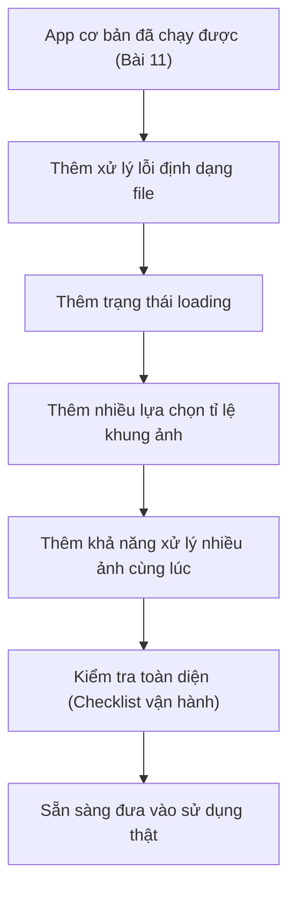

# Bài 12: Hoàn Chỉnh Ứng Dụng Tạo Ảnh Sản Phẩm AI — Sẵn Sàng Đưa Vào Vận Hành

## Mục Tiêu Bài Học

Sau bài này, bạn sẽ:

* Hoàn thiện app tối ưu ảnh sản phẩm ở Bài 11 với các tính năng nâng cao hơn.
* Biết cách đánh giá một ứng dụng đã "đủ tốt để dùng thật" hay chưa.
* Nắm được checklist cơ bản trước khi coi một sản phẩm là sẵn sàng vận hành.

---

## 1. Từ "Chạy Được" Đến "Sẵn Sàng Vận Hành"

App ở Bài 11 đã chạy được các chức năng cốt lõi: tải ảnh, cắt khung vuông, tải xuống. Nhưng "chạy được" chưa đồng nghĩa với "sẵn sàng dùng thật". Để đưa vào vận hành, app cần thêm các yếu tố:

| Yếu tố                     | Vì sao cần                                                          |
| ----------------------------- | -------------------------------------------------------------------------- |
| Xử lý lỗi cơ bản               | Người dùng có thể tải sai định dạng file, cần thông báo rõ ràng            |
| Giao diện hoàn thiện           | Có trạng thái loading, thông báo thành công/thất bại                       |
| Tối ưu cho nhiều loại ảnh      | Ảnh ngang, ảnh dọc, ảnh vuông đều cần xử lý hợp lý                          |
| Trải nghiệm mượt mà            | Không giật, phản hồi nhanh khi thao tác                                    |

## 2. Bổ Sung Tính Năng Nâng Cao

Tiếp tục từ app đã có, hãy prompt để bổ sung từng tính năng sau, theo đúng nguyên tắc chia nhỏ đã học ở Bài 11:

**Tính năng 1 — Xử lý ảnh không đúng định dạng:**

```text
Hãy thêm kiểm tra: nếu người dùng tải lên file không phải ảnh (không phải .jpg, .png),
hiển thị thông báo lỗi rõ ràng: "Vui lòng chọn file ảnh định dạng JPG hoặc PNG."
```

**Tính năng 2 — Thêm trạng thái xử lý (loading):**

```text
Khi ảnh đang được xử lý (cắt khung vuông), hãy hiển thị biểu tượng loading
hoặc dòng chữ "Đang xử lý ảnh..." để người dùng biết hệ thống đang hoạt động.
```

**Tính năng 3 — Hỗ trợ nhiều tỉ lệ khung ảnh:**

```text
Hãy thêm 3 lựa chọn tỉ lệ khung ảnh khi cắt: Vuông (1:1), Dọc (4:5), Ngang (16:9).
Người dùng chọn tỉ lệ mong muốn trước khi bấm nút "Cắt ảnh".
```

**Tính năng 4 — Xử lý nhiều ảnh cùng lúc:**

```text
Hãy nâng cấp ứng dụng để hỗ trợ tải lên nhiều ảnh cùng lúc,
xử lý và tải xuống lần lượt từng ảnh đã được cắt.
```

## 3. Quy Trình Hoàn Thiện Sản Phẩm



## 4. Checklist Trước Khi Coi Là "Sẵn Sàng Vận Hành"

| Hạng mục kiểm tra                                             | Đạt / Chưa đạt |
| ------------------------------------------------------------------ | ---------------- |
| Tải ảnh đúng định dạng hoạt động bình thường                        |                  |
| Tải sai định dạng hiển thị thông báo lỗi rõ ràng                     |                  |
| Có trạng thái loading khi đang xử lý ảnh                             |                  |
| Chọn được các tỉ lệ khung ảnh khác nhau                               |                  |
| Xử lý được nhiều ảnh liên tiếp mà không bị lỗi                       |                  |
| Giao diện hiển thị tốt trên cả điện thoại và máy tính                |                  |
| Không có lỗi hiện ra ngoài giao diện (kiểm tra bằng cách thử nhiều lần) |                  |

Nếu tất cả mục trên đều "Đạt", ứng dụng đã sẵn sàng để chuyển sang bước **deploy lên internet** ở Bài 16.

## 5. Kỹ Thuật Prompt Để "Rà Soát Lỗi Toàn Diện"

Trước khi kết thúc, bạn có thể nhờ chính AI rà soát lại code:

```text
Hãy rà soát lại toàn bộ code của ứng dụng này và chỉ ra:
1. Các trường hợp có thể gây lỗi mà chưa được xử lý.
2. Các phần giao diện có thể gây khó hiểu cho người dùng mới.
Sau đó đề xuất cách khắc phục cho từng vấn đề tìm thấy.
```

Đây là kỹ thuật hữu ích, tận dụng AI không chỉ để viết code mà còn để **tự kiểm tra lại chính sản phẩm nó vừa tạo ra**.

---

## Điều Cần Ghi Nhớ

* "Chạy được" và "sẵn sàng vận hành" là hai mức độ khác nhau — cần bổ sung xử lý lỗi và trải nghiệm người dùng.
* Luôn dùng checklist để đánh giá khách quan trước khi coi sản phẩm là hoàn thiện.
* Có thể nhờ AI tự rà soát lại code của chính nó để phát hiện thiếu sót.

## Tóm Tắt Bài Học

Bài này khép lại dự án ứng dụng tối ưu ảnh sản phẩm với đầy đủ tính năng nâng cao, xử lý lỗi cơ bản và checklist đánh giá sẵn sàng vận hành. Đây là quy trình bạn nên áp dụng cho bất kỳ ứng dụng nào trước khi coi là hoàn thành. Trong bài tiếp theo, bạn sẽ áp dụng đúng quy trình này để xây dựng một ứng dụng AI tạo Thumbnail YouTube tự động.
