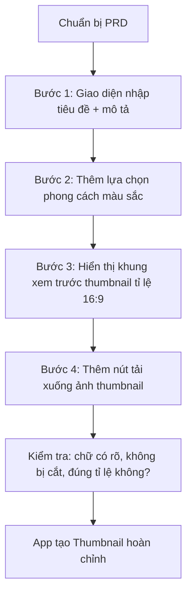

# Bài 13: Xây Dựng Ứng Dụng AI Tạo Thumbnail YouTube Tự Động Bằng Vibe Coding

## Mục Tiêu Bài Học

Sau bài này, bạn sẽ:

* Build được một ứng dụng AI tạo Thumbnail YouTube tự động — dự án có tính ứng dụng cao cho người làm nội dung.
* Biết cách kết hợp **văn bản (tiêu đề video)** và **yêu cầu hình ảnh** trong cùng một prompt.
* Hiểu cách thiết kế giao diện cho một công cụ sáng tạo nội dung.

---

## 1. Bài Toán: Vì Sao Cần App Tạo Thumbnail Tự Động?

Người làm YouTube thường tốn nhiều thời gian thiết kế thumbnail bắt mắt cho mỗi video. Một ứng dụng cho phép nhập tiêu đề video và vài mô tả ngắn, sau đó AI tự động đề xuất thumbnail, sẽ giúp tiết kiệm đáng kể thời gian sản xuất nội dung.

## 2. Viết PRD Cho App Tạo Thumbnail YouTube

```text
# PRD: Công Cụ Tạo Thumbnail YouTube Tự Động

## 1. Tổng quan
Ứng dụng web giúp nhà sáng tạo nội dung nhập tiêu đề video và nhận về
gợi ý thumbnail có chữ nổi bật, bố cục thu hút.

## 2. Đối tượng người dùng
Người làm kênh YouTube cá nhân, không có kỹ năng thiết kế đồ họa chuyên sâu.

## 3. Vấn đề cần giải quyết
Thiết kế thumbnail thủ công tốn thời gian và đòi hỏi kỹ năng thiết kế
mà nhiều nhà sáng tạo nội dung không có.

## 4. Danh sách chức năng
- Nhập tiêu đề video (dòng chữ chính sẽ xuất hiện trên thumbnail).
- Nhập mô tả ngắn về nội dung/chủ đề video để định hướng phong cách ảnh.
- Chọn phong cách màu sắc (rực rỡ, tối giản, chuyên nghiệp).
- Xem trước thumbnail theo đúng tỉ lệ chuẩn YouTube (16:9).
- Tải xuống thumbnail dưới dạng ảnh.

## 5. Yêu cầu giao diện
- Bố cục: khu vực nhập liệu bên trái, khu vực xem trước thumbnail bên phải.
- Phong cách: hiện đại, có màu sắc nổi bật phù hợp công cụ sáng tạo nội dung.

## 6. Tiêu chí hoàn thành
- Nhập tiêu đề, chọn phong cách, xem trước và tải xuống thumbnail đúng tỉ lệ 16:9.
```

## 3. Kỹ Thuật Prompt Kết Hợp Văn Bản Và Hình Ảnh

Khác với các app trước, thumbnail cần kết hợp **chữ hiển thị nổi bật** trên nền hình ảnh. Đây là kỹ thuật prompt quan trọng cần lưu ý:

```text
Khi tạo giao diện thumbnail, hãy đảm bảo:
- Tiêu đề video hiển thị bằng chữ to, đậm, có viền hoặc bóng đổ để nổi bật trên mọi nền ảnh.
- Chữ luôn nằm trong vùng an toàn (không bị cắt ở viền ảnh khi hiển thị trên YouTube).
- Màu chữ tương phản rõ với màu nền đã chọn.
```

## 4. Các Bước Thực Hành



## 5. Prompt Mẫu Cho Từng Bước

**Bước 1:**

```text
Hãy build giao diện với ô nhập "Tiêu đề video" và ô nhập "Mô tả ngắn nội dung video".
```

**Bước 2:**

```text
Hãy thêm 3 nút lựa chọn phong cách màu: "Rực rỡ" (nền cam-đỏ), "Tối giản" (nền trắng-đen),
"Chuyên nghiệp" (nền xanh dương đậm). Khi chọn, nền khung xem trước đổi màu tương ứng.
```

**Bước 3:**

```text
Hãy hiển thị khung xem trước thumbnail theo đúng tỉ lệ 16:9,
với tiêu đề video hiển thị chữ to, đậm, màu tương phản với nền, nằm ở giữa hoặc dưới khung.
```

**Bước 4:**

```text
Hãy thêm nút "Tải thumbnail" để xuất khung xem trước hiện tại thành file ảnh .png.
```

## 6. Kiểm Tra Kết Quả Theo Đặc Thù Thumbnail

| Việc cần kiểm tra                                  | Vì sao quan trọng                                       |
| ------------------------------------------------------ | -------------------------------------------------------------- |
| Chữ có bị cắt ở viền ảnh không?                          | YouTube có thể cắt viền ảnh khi hiển thị dạng nhỏ trên di động  |
| Chữ có đủ tương phản với nền không?                      | Thumbnail mờ nhạt sẽ không thu hút người xem                    |
| Tỉ lệ ảnh xuất ra có đúng 16:9 không?                    | Sai tỉ lệ sẽ bị YouTube cắt hoặc hiển thị méo                    |
| File tải xuống có đúng nội dung đã xem trước không?      | Đảm bảo tính năng tải xuống hoạt động chính xác                  |

---

## Điều Cần Ghi Nhớ

* Ứng dụng có yếu tố hình ảnh + văn bản cần lưu ý về tương phản màu và vùng an toàn hiển thị chữ.
* Vẫn áp dụng nguyên tắc chia nhỏ từng bước prompt như các bài trước.
* Luôn kiểm tra kết quả theo đúng đặc thù của loại sản phẩm (ở đây là tỉ lệ 16:9 và độ rõ của chữ).

## Tóm Tắt Bài Học

Qua bài này, bạn đã build một công cụ tạo Thumbnail YouTube tự động — một sản phẩm có giá trị thực tế cao cho người làm nội dung. Trong bài tiếp theo, bạn sẽ học cách nâng tầm giao diện của các ứng dụng đã tạo bằng công cụ thiết kế UI chuyên nghiệp: Google Stitch.
