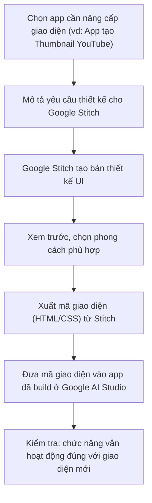

# Bài 14: Thiết Kế Giao Diện Ứng Dụng AI Chuyên Nghiệp Với Google Stitch

## Mục Tiêu Bài Học

Sau bài này, bạn sẽ:

* Biết **Google Stitch** là gì và vai trò của nó trong quy trình Vibe Coding.
* Biết cách dùng Google Stitch để thiết kế giao diện (UI/UX) chuyên nghiệp hơn cho các app đã build.
* Biết cách đưa thiết kế từ Google Stitch vào ứng dụng thực tế.

---

## 1. Google Stitch Là Gì?

**Google Stitch** là công cụ AI của Google chuyên về **thiết kế giao diện (UI/UX)** — bạn mô tả ý tưởng giao diện bằng ngôn ngữ tự nhiên, Stitch sẽ tạo ra bản thiết kế trực quan, đẹp mắt, theo đúng nguyên tắc thiết kế hiện đại.

| Điểm khác biệt                     | Google AI Studio                    | Google Stitch                            |
| -------------------------------------- | --------------------------------------- | --------------------------------------------- |
| Trọng tâm                               | Build app chạy được (logic + giao diện) | Thiết kế giao diện đẹp, chuyên nghiệp          |
| Đầu ra                                   | Ứng dụng chạy thử được ngay              | Bản thiết kế UI (có thể xuất mã giao diện)     |
| Khi nào dùng                             | Khi cần app hoạt động được               | Khi cần nâng cấp giao diện cho đẹp và chuyên nghiệp hơn |

## 2. Vì Sao Cần Thiết Kế Riêng, Không Chỉ Dựa Vào Google AI Studio?

Các app ở Bài 10–13 đã chạy tốt về mặt chức năng, nhưng giao diện có thể còn đơn giản, chưa thực sự chuyên nghiệp. Google Stitch giúp bạn:

* Có giao diện đẹp, hiện đại như sản phẩm thương mại thật.
* Áp dụng đúng nguyên tắc thiết kế (khoảng cách, màu sắc, bố cục) mà không cần học thiết kế chuyên sâu.
* Tạo sự khác biệt cho sản phẩm khi so với các app tự làm thông thường.

## 3. Quy Trình Dùng Google Stitch



## 4. Prompt Mẫu Để Thiết Kế Giao Diện Trong Google Stitch

```text
Hãy thiết kế giao diện cho một ứng dụng web tạo Thumbnail YouTube, gồm:
- Thanh điều hướng trên cùng với tên ứng dụng.
- Khu vực nhập liệu bên trái: ô nhập tiêu đề video, ô nhập mô tả, 3 nút chọn phong cách màu.
- Khu vực xem trước bên phải: khung ảnh tỉ lệ 16:9, nút "Tải thumbnail" bên dưới.
- Phong cách: hiện đại, tối giản, tông màu chính là tím và trắng, phù hợp cho nhà sáng tạo nội dung trẻ.
- Responsive: hiển thị tốt trên cả điện thoại và máy tính.
```

## 5. Kết Hợp Google Stitch Với App Đã Build

Sau khi có bản thiết kế từ Google Stitch, quy trình đưa vào app thực tế gồm hai cách:

| Cách                              | Khi nào dùng                                                     |
| ------------------------------------- | ---------------------------------------------------------------------- |
| **Xuất mã giao diện, ghép thủ công**    | Khi bạn muốn kiểm soát chính xác từng phần code được thay thế           |
| **Dùng làm tham chiếu, prompt lại AI**  | Khi muốn AI (ChatGPT/Claude/Google AI Studio) tự áp dụng thiết kế mới dựa trên mô tả từ Stitch |

Ví dụ prompt theo cách thứ hai:

```text
Đây là mô tả giao diện mới tôi muốn áp dụng cho ứng dụng hiện tại:

[Dán mô tả thiết kế đã tạo ở Google Stitch]

Hãy cập nhật giao diện của ứng dụng theo đúng mô tả trên,
nhưng giữ nguyên toàn bộ logic và chức năng hiện có, không được làm hỏng chức năng nào.
```

## 6. Nguyên Tắc Quan Trọng: Không Đánh Đổi Chức Năng Lấy Giao Diện

Khi nâng cấp giao diện, rủi ro thường gặp là AI vô tình làm hỏng logic đang hoạt động tốt. Vì vậy, luôn nhắc rõ trong prompt:

```text
Chỉ thay đổi phần giao diện (màu sắc, bố cục, khoảng cách).
Giữ nguyên 100% các chức năng và logic xử lý đã có.
```

Sau khi cập nhật giao diện, luôn **kiểm tra lại toàn bộ chức năng** một lần nữa để đảm bảo không có gì bị hỏng.

---

## Điều Cần Ghi Nhớ

* Google Stitch chuyên về thiết kế UI/UX, khác với Google AI Studio (chuyên build app chạy được).
* Có thể xuất mã giao diện từ Stitch hoặc dùng mô tả thiết kế để prompt lại cho AI build app.
* Luôn nhắc AI giữ nguyên chức năng khi chỉ muốn thay đổi giao diện.
* Sau khi nâng cấp giao diện, phải kiểm tra lại toàn bộ chức năng cũ.

## Tóm Tắt Bài Học

Google Stitch giúp các ứng dụng bạn tự build trở nên chuyên nghiệp hơn về mặt giao diện, mà không cần học thiết kế chuyên sâu. Đây là bước hoàn thiện quan trọng trước khi đưa sản phẩm ra sử dụng thật. Module 4 đã khép lại với 5 bài thực chiến xây dựng nhiều ứng dụng khác nhau. Sang Module 5, bạn sẽ tiếp tục thực hành các dự án phục vụ công việc, và học cách đưa ứng dụng lên internet để người khác có thể sử dụng thật.
