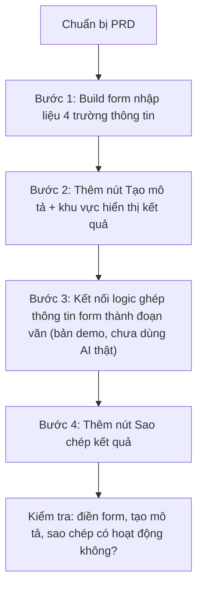

# Bài 15: Thực Hành Build App Soạn Văn Bản — Nhập Thông Tin, Xuất Văn Bản Hoàn Chỉnh

## Mục Tiêu Bài Học

Sau bài này, bạn sẽ:

* Build được một ứng dụng **nhập dữ liệu → sinh văn bản hoàn chỉnh**, dạng ứng dụng rất phổ biến trong công việc thực tế (soạn email, mô tả sản phẩm, bài đăng mạng xã hội...).
* Hiểu cách thiết kế form nhập liệu có cấu trúc để tạo ra prompt chất lượng cho AI sinh nội dung.
* Đây là bước đệm quan trọng trước khi kết nối AI API thật ở Bài 17.

---

## 1. Bài Toán: App Soạn Văn Bản Dùng Để Làm Gì?

Rất nhiều công việc hằng ngày cần soạn văn bản theo khuôn mẫu: email xin nghỉ phép, mô tả sản phẩm bán hàng, bài đăng quảng cáo... Một ứng dụng cho phép người dùng **điền thông tin vào form**, sau đó tự động tạo ra văn bản hoàn chỉnh, sẽ tiết kiệm rất nhiều thời gian.

Trong bài này, ta thực hành với ví dụ: **App soạn mô tả sản phẩm bán hàng**.

## 2. Viết PRD Cho App Soạn Văn Bản

```text
# PRD: Công Cụ Soạn Mô Tả Sản Phẩm Bán Hàng

## 1. Tổng quan
Ứng dụng web giúp người bán hàng nhập thông tin cơ bản về sản phẩm
và nhận về đoạn mô tả sản phẩm hoàn chỉnh, hấp dẫn.

## 2. Đối tượng người dùng
Người bán hàng online cần viết mô tả sản phẩm nhanh, không giỏi viết lách.

## 3. Vấn đề cần giải quyết
Viết mô tả sản phẩm hấp dẫn tốn thời gian và không phải ai cũng có kỹ năng viết tốt.

## 4. Danh sách chức năng
- Form nhập: Tên sản phẩm, Đặc điểm nổi bật (3-5 gạch đầu dòng), Đối tượng khách hàng, Tông giọng văn (vui vẻ / chuyên nghiệp / sang trọng).
- Nút "Tạo mô tả sản phẩm".
- Khu vực hiển thị kết quả văn bản đã tạo.
- Nút "Sao chép" để copy văn bản kết quả.

## 5. Yêu cầu giao diện
- Bố cục: form nhập liệu bên trái, kết quả văn bản bên phải.
- Phong cách: gọn gàng, rõ ràng, dễ điền thông tin.

## 6. Tiêu chí hoàn thành
- Điền đầy đủ form, bấm tạo, nhận được đoạn mô tả hợp lý và sao chép được kết quả.
```

## 3. Thiết Kế Form Nhập Liệu Có Cấu Trúc

Điểm mấu chốt của loại app này là **form nhập liệu phải đủ chi tiết** để prompt gửi cho AI có đầy đủ thông tin sinh văn bản chất lượng.

| Trường thông tin           | Vì sao cần thiết                                             |
| ------------------------------ | ------------------------------------------------------------------ |
| Tên sản phẩm                    | Là chủ thể chính của đoạn mô tả                                     |
| Đặc điểm nổi bật                | Nội dung cốt lõi để AI triển khai thành câu văn                     |
| Đối tượng khách hàng            | Giúp AI chọn từ ngữ, giọng văn phù hợp người đọc                    |
| Tông giọng văn                  | Quyết định phong cách: vui vẻ, trang trọng hay sang trọng           |

## 4. Các Bước Thực Hành



## 5. Prompt Mẫu Cho Từng Bước

**Bước 1:**

```text
Hãy build một form nhập liệu với 4 trường:
- Tên sản phẩm (ô nhập văn bản ngắn).
- Đặc điểm nổi bật (ô nhập văn bản nhiều dòng).
- Đối tượng khách hàng (ô nhập văn bản ngắn).
- Tông giọng văn (menu chọn: Vui vẻ / Chuyên nghiệp / Sang trọng).
```

**Bước 2 và 3 (bản demo, ghép logic đơn giản trước khi có AI thật):**

```text
Hãy thêm nút "Tạo mô tả sản phẩm". Khi bấm, hãy ghép các thông tin đã nhập
thành một đoạn mô tả mẫu theo khuôn có sẵn (chưa cần dùng AI thật ở bước này),
hiển thị kết quả trong khung bên phải, để tôi kiểm tra luồng hoạt động trước.
```

**Bước 4:**

```text
Hãy thêm nút "Sao chép" bên dưới khung kết quả,
khi bấm sẽ copy toàn bộ văn bản kết quả vào clipboard
và hiển thị thông báo ngắn "Đã sao chép!".
```

## 6. Vì Sao Làm Bản Demo (Chưa Kết Nối AI Thật) Trước?

Ở bài này, ta cố tình build phần logic sinh văn bản dưới dạng **bản demo đơn giản** (ghép câu theo khuôn có sẵn), thay vì kết nối AI thật ngay. Lý do:

* Đảm bảo **toàn bộ giao diện và luồng thao tác hoạt động đúng** trước khi thêm độ phức tạp của việc gọi AI.
* Dễ debug hơn — nếu có lỗi, biết chắc là do giao diện/logic, không lẫn với lỗi kết nối AI.
* Đây là bước đệm hợp lý trước khi học kết nối AI API Key thật ở Bài 17.

---

## Điều Cần Ghi Nhớ

* App dạng "nhập thông tin → xuất văn bản" cần form nhập liệu đủ chi tiết để có kết quả chất lượng.
* Nên build và kiểm tra luồng hoạt động bằng bản demo trước khi kết nối AI thật.
* Vẫn áp dụng nguyên tắc chia nhỏ từng bước prompt như các bài trước.

## Tóm Tắt Bài Học

Bài này giúp bạn build hoàn chỉnh giao diện và luồng hoạt động của một ứng dụng soạn văn bản tự động — dạng ứng dụng có tính ứng dụng rất cao trong công việc. Trong bài tiếp theo, bạn sẽ học cách đưa ứng dụng này (và các ứng dụng khác đã build) lên internet bằng Vercel, để có thể truy cập từ bất kỳ đâu.
