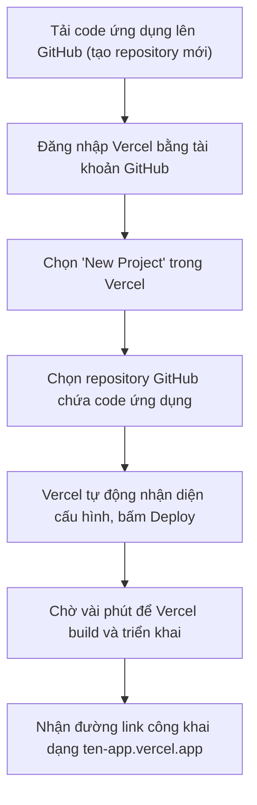
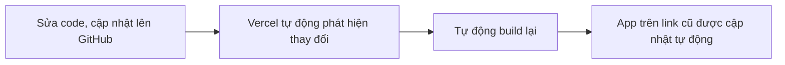

# Bài 16: Deploy To Production — Publish App Lên Vercel Miễn Phí

## Mục Tiêu Bài Học

Sau bài này, bạn sẽ:

* Hiểu **deploy (triển khai)** là gì và vì sao cần thiết để người khác dùng được app của bạn.
* Biết cách đưa ứng dụng đã build lên internet bằng **Vercel** — hoàn toàn miễn phí.
* Có được một đường link thật để chia sẻ ứng dụng cho bất kỳ ai.

---

## 1. Deploy Là Gì? Vì Sao Cần Thiết?

Cho đến nay, các ứng dụng bạn build chỉ chạy được trên máy tính của chính bạn (trong bản xem trước của công cụ AI hoặc trình duyệt cá nhân). **Deploy** là quá trình đưa ứng dụng đó lên một máy chủ trên internet, để bất kỳ ai có đường link cũng có thể truy cập và sử dụng.

```text
Chưa deploy: Chỉ bạn dùng được, trên máy của bạn
Đã deploy: Bất kỳ ai, ở bất kỳ đâu, đều dùng được qua một đường link
```

## 2. Vercel Là Gì?

**Vercel** là nền tảng cho phép deploy ứng dụng web **miễn phí**, đơn giản, không cần biết về máy chủ hay hạ tầng kỹ thuật. Đây là lựa chọn phổ biến cho các dự án cá nhân và Vibe Coding vì:

| Ưu điểm                          | Giải thích                                                        |
| ------------------------------------ | ------------------------------------------------------------------------ |
| Miễn phí cho dự án cá nhân            | Không tốn chi phí cho các ứng dụng quy mô nhỏ                             |
| Kết nối trực tiếp với GitHub          | Mỗi lần cập nhật code, app tự động cập nhật trên internet                  |
| Có đường link công khai ngay lập tức  | Nhận được URL dạng `ten-app.vercel.app` để chia sẻ                        |
| Không cần kiến thức về server         | Toàn bộ quá trình deploy chỉ qua vài cú click                              |

## 3. Chuẩn Bị Trước Khi Deploy

| Việc cần chuẩn bị          | Ghi chú                                                             |
| ------------------------------ | -------------------------------------------------------------------------- |
| Tài khoản GitHub                | Nơi lưu trữ code của ứng dụng                                              |
| Tài khoản Vercel                 | Đăng ký miễn phí, có thể đăng nhập trực tiếp bằng tài khoản GitHub          |
| Code ứng dụng hoàn chỉnh         | Đã kiểm tra chạy đúng qua checklist ở Bài 12                                |

## 4. Quy Trình Deploy Lên Vercel



## 5. Các Bước Chi Tiết

1. **Tải code lên GitHub**: Nếu chưa quen thao tác Git, có thể nhờ AI hướng dẫn từng bước cụ thể, hoặc dùng tính năng tải file trực tiếp trên giao diện web của GitHub (Upload files).
2. **Đăng nhập Vercel**: Vào [vercel.com], chọn "Continue with GitHub" để liên kết tài khoản.
3. **Tạo dự án mới**: Chọn "Add New Project", sau đó chọn đúng repository chứa code ứng dụng bạn muốn deploy.
4. **Xác nhận cấu hình**: Với ứng dụng HTML/CSS/JS thuần, Vercel thường tự nhận diện đúng cấu hình mặc định — chỉ cần bấm **Deploy**.
5. **Nhận link**: Sau khi build xong (thường vài chục giây đến vài phút), Vercel cung cấp đường link dạng `https://ten-du-an.vercel.app`.

## 6. Kiểm Tra Sau Khi Deploy

Sau khi có link, hãy kiểm tra lại toàn bộ ứng dụng **trên chính đường link đó** (không phải bản xem trước cũ), vì đôi khi có khác biệt giữa môi trường thử nghiệm và môi trường thật:

| Việc cần kiểm tra                              | Ghi chú                                                    |
| --------------------------------------------------- | ----------------------------------------------------------------- |
| Mở link trên trình duyệt máy tính                     | Kiểm tra giao diện và chức năng như bình thường                    |
| Mở link trên điện thoại                                | Đảm bảo giao diện responsive vẫn hoạt động tốt                     |
| Thử lại toàn bộ luồng thao tác chính                  | Không chỉ mở trang, mà thực sự thao tác thử từng chức năng          |
| Gửi link cho một người khác thử                       | Xác nhận người ngoài cũng truy cập và dùng được bình thường          |

## 7. Cập Nhật App Sau Khi Đã Deploy

Điểm mạnh của Vercel là khi bạn cập nhật code trên GitHub (ví dụ sửa lỗi hoặc thêm tính năng mới), Vercel sẽ **tự động build lại và cập nhật app** trên cùng một đường link, không cần deploy lại thủ công.



---

## Điều Cần Ghi Nhớ

* Deploy là bước biến app từ "chạy trên máy bạn" thành "chạy trên internet, ai cũng dùng được".
* Vercel miễn phí, kết nối trực tiếp với GitHub, không cần kiến thức về server.
* Sau khi deploy, luôn kiểm tra lại toàn bộ chức năng trên chính đường link thật.
* Mỗi lần cập nhật code trên GitHub, Vercel tự động build lại — không cần deploy thủ công lần nữa.

## Tóm Tắt Bài Học

Deploy là cột mốc quan trọng biến ứng dụng cá nhân thành sản phẩm thật mà bất kỳ ai cũng có thể truy cập. Với Vercel, quá trình này chỉ mất vài phút và hoàn toàn miễn phí. Trong bài tiếp theo, bạn sẽ học cách kết nối API Key AI thật vào ứng dụng — bước "kích hoạt não" để app có khả năng tự sinh nội dung thông minh thay vì chỉ dùng dữ liệu mẫu cố định.
