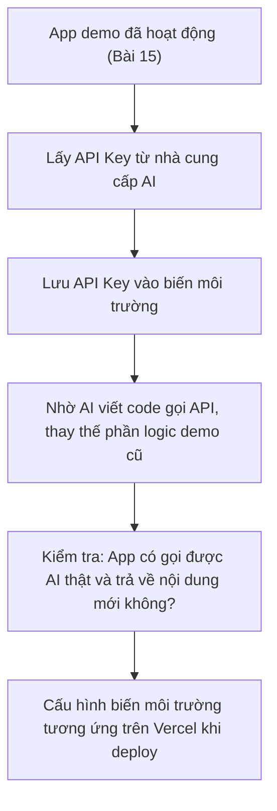
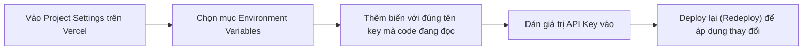

# Bài 17: Thực Hành Kết Nối AI API Key — Kích Hoạt Não Cho App

## Mục Tiêu Bài Học

Sau bài này, bạn sẽ:

* Hiểu **API Key** là gì và vì sao cần thiết để app có khả năng sinh nội dung thông minh thật sự.
* Biết cách lấy API Key từ nhà cung cấp AI và kết nối vào ứng dụng đã build.
* Biết cách bảo mật API Key đúng cách — tránh để lộ ra công khai.

---

## 1. API Key Là Gì?

**API Key** giống như một "chìa khóa" cho phép ứng dụng của bạn gửi yêu cầu đến hệ thống AI (ví dụ Claude, ChatGPT) và nhận về kết quả. Đây chính là bước biến app từ "demo dùng dữ liệu mẫu cố định" (như đã làm ở Bài 15) thành **"app thật, có khả năng tự sinh nội dung thông minh"**.

```text
Chưa có API Key: App chỉ ghép câu theo khuôn mẫu có sẵn (bản demo)
Có API Key: App gửi yêu cầu thật đến AI và nhận về nội dung được tạo mới hoàn toàn
```

## 2. Lấy API Key Từ Đâu?

| Nhà cung cấp        | Nơi lấy API Key                                   | Ghi chú                                      |
| ---------------------- | ------------------------------------------------------ | -------------------------------------------------- |
| Anthropic (Claude)      | console.anthropic.com                                    | Cần tạo tài khoản, nạp một khoản credit nhỏ để dùng thử |
| OpenAI (ChatGPT)         | platform.openai.com                                       | Tương tự, cần tài khoản riêng cho việc dùng API      |
| Google AI Studio         | aistudio.google.com                                        | Có gói miễn phí với giới hạn sử dụng nhất định        |

Lưu ý: Tài khoản dùng để **chat** (như chat.openai.com hoặc claude.ai) và tài khoản dùng để **lấy API Key** thường là hai hệ thống khác nhau, dù có thể dùng chung một tài khoản đăng nhập.

## 3. Nguyên Tắc Bảo Mật API Key — Rất Quan Trọng

API Key giống như mật khẩu — nếu lộ ra, người khác có thể dùng API Key đó và bạn phải trả tiền cho việc sử dụng của họ. Vì vậy cần tuân thủ nghiêm ngặt các nguyên tắc sau:

| Nên làm                                             | Không nên làm                                                |
| -------------------------------------------------------- | ------------------------------------------------------------------ |
| Lưu API Key trong **biến môi trường** (Environment Variables) | Gõ trực tiếp API Key vào code rồi đưa lên GitHub công khai            |
| Thêm file chứa key vào `.gitignore`                        | Chia sẻ API Key qua tin nhắn, email không mã hóa                     |
| Đặt giới hạn chi tiêu (usage limit) trên tài khoản nhà cung cấp | Dùng chung một API Key cho nhiều dự án công khai khác nhau           |

```text
Prompt gợi ý khi nhờ AI viết code kết nối API:

"Hãy viết code kết nối API [tên nhà cung cấp] theo cách an toàn:
- Đọc API Key từ biến môi trường, KHÔNG được viết cứng (hardcode) key vào trong code.
- Đảm bảo file chứa key không bị đưa lên Git khi tôi đẩy code lên GitHub."
```

## 4. Kết Nối API Key Vào App Soạn Văn Bản (Bài 15)



## 5. Prompt Mẫu Để Kết Nối API

```text
Ứng dụng hiện tại đang tạo mô tả sản phẩm bằng cách ghép câu theo khuôn mẫu cố định.

Hãy thay thế phần đó bằng việc gọi API của [tên nhà cung cấp AI], với yêu cầu:
- Gửi các thông tin người dùng đã nhập (tên sản phẩm, đặc điểm nổi bật, đối tượng khách hàng, tông giọng văn)
  thành một prompt rõ ràng gửi đến AI.
- Nhận kết quả trả về và hiển thị trong khung kết quả như cũ.
- API Key phải được đọc từ biến môi trường, không hardcode trong code.
- Xử lý trường hợp lỗi (ví dụ hết hạn mức, mất kết nối) bằng thông báo rõ ràng cho người dùng.
```

## 6. Cấu Hình Biến Môi Trường Trên Vercel

Sau khi app hoạt động tốt trên máy cá nhân, khi deploy lên Vercel (đã học ở Bài 16), cần cấu hình lại API Key trên đó vì biến môi trường trên máy cá nhân **không tự động chuyển theo** lên Vercel:



## 7. Kiểm Tra Sau Khi Kết Nối API Key

| Việc cần kiểm tra                                   | Ghi chú                                                     |
| --------------------------------------------------------- | -------------------------------------------------------------------- |
| App sinh nội dung mới mỗi lần bấm tạo (không lặp lại y hệt) | Xác nhận đang gọi AI thật, không còn dùng dữ liệu mẫu cố định          |
| Không thấy API Key xuất hiện trong code công khai trên GitHub | Kiểm tra bằng cách xem lại các file đã đẩy lên repository              |
| App trên Vercel (bản deploy) cũng gọi được AI thành công     | Xác nhận biến môi trường đã cấu hình đúng trên Vercel                  |

---

## Điều Cần Ghi Nhớ

* API Key là "chìa khóa" giúp app gọi AI thật để sinh nội dung, thay vì dùng dữ liệu mẫu cố định.
* Không bao giờ hardcode API Key trực tiếp trong code hoặc đưa lên GitHub công khai.
* Cần cấu hình lại biến môi trường riêng trên Vercel khi deploy, không tự động kế thừa từ máy cá nhân.
* Luôn kiểm tra kỹ để đảm bảo API Key không bị lộ trước khi chia sẻ code hoặc dự án cho người khác.

## Tóm Tắt Bài Học

Kết nối API Key là bước "kích hoạt não" thật sự cho ứng dụng — biến nó từ một bản demo tĩnh thành sản phẩm có khả năng tạo nội dung thông minh, linh hoạt theo từng yêu cầu của người dùng. Trong bài tiếp theo, bạn sẽ được giới thiệu về Antigravity — một AI Agent hỗ trợ việc code và tự động hóa công việc hiệu quả hơn nữa.
