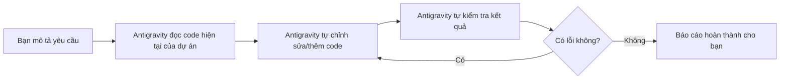

# Bài 18: Hướng Dẫn Sử Dụng AI Agent Với Antigravity

## Mục Tiêu Bài Học

Sau bài này, bạn sẽ:

* Làm quen với khái niệm **AI Agent** và cách nó khác với việc chat thông thường với AI.
* Biết cách dùng **Antigravity** để hỗ trợ code và tự động hóa các công việc lặp lại.
* Hiểu khi nào nên dùng AI Agent thay vì tiếp tục thao tác thủ công qua chat.

---

## 1. AI Agent Là Gì? Khác Gì Với Chat Thông Thường?

Khi bạn chat với ChatGPT hay Claude, AI trả lời từng câu hỏi rồi **dừng lại, chờ bạn** thực hiện bước tiếp theo (copy code, dán vào công cụ khác, kiểm tra, báo lại lỗi...). Với **AI Agent**, AI có thể **tự thực hiện nhiều bước liên tiếp** thay bạn: đọc file, sửa code, chạy thử, kiểm tra lỗi và tự sửa lại — mà không cần bạn can thiệp ở từng bước nhỏ.

| Chat thông thường                              | AI Agent (như Antigravity)                              |
| ---------------------------------------------------- | -------------------------------------------------------------- |
| Trả lời một câu hỏi, dừng lại chờ bạn                  | Tự thực hiện chuỗi hành động liên tiếp                          |
| Bạn phải copy/dán, chạy thử, báo lỗi lại thủ công       | Agent tự đọc code, tự sửa, tự kiểm tra lại                       |
| Phù hợp cho việc lên ý tưởng, viết PRD, hỏi đáp          | Phù hợp cho việc trực tiếp chỉnh sửa và hoàn thiện ứng dụng      |

## 2. Antigravity Là Gì?

**Antigravity** là công cụ AI Agent hỗ trợ lập trình, cho phép AI trực tiếp thao tác trên dự án của bạn: đọc code hiện có, chỉnh sửa, thêm tính năng mới, tự kiểm tra và sửa lỗi — dựa trên mô tả yêu cầu bằng ngôn ngữ tự nhiên.



## 3. Khi Nào Nên Dùng AI Agent Thay Vì Chat Thông Thường?

| Tình huống                                                  | Nên dùng             |
| ----------------------------------------------------------------- | ------------------------ |
| Mới lên ý tưởng, cần viết PRD, cần trao đổi để làm rõ yêu cầu        | Chat thông thường (ChatGPT/Claude) |
| Đã có PRD rõ ràng, cần trực tiếp chỉnh sửa nhiều phần trong dự án có sẵn | AI Agent (Antigravity)   |
| Cần thêm một tính năng mới vào ứng dụng đang chạy, phải sửa nhiều file liên quan | AI Agent (Antigravity)   |
| Chỉ cần hỏi nhanh một khái niệm, không cần thao tác trên code       | Chat thông thường (ChatGPT/Claude) |

## 4. Quy Trình Cơ Bản Khi Dùng Antigravity

1. **Mở dự án** đã có sẵn (ví dụ: app soạn văn bản ở Bài 15, đã kết nối API ở Bài 17) trong Antigravity.
2. **Mô tả yêu cầu** rõ ràng — càng chi tiết, Agent càng ít phải tự đoán.
3. **Để Agent tự thực hiện**: đọc code, chỉnh sửa, chạy thử.
4. **Xem lại kết quả** Agent báo cáo, kiểm tra thực tế trên ứng dụng.
5. **Yêu cầu điều chỉnh tiếp** nếu cần, giống như vòng lặp Prompt → Verify → Refine đã học.

## 5. Prompt Mẫu Khi Làm Việc Với Antigravity

```text
Dự án hiện tại là ứng dụng soạn mô tả sản phẩm, đã kết nối API AI.

Hãy thêm tính năng mới: cho phép người dùng chọn "Độ dài mô tả" (Ngắn / Trung bình / Dài)
trước khi bấm tạo. Độ dài này cần được đưa vào yêu cầu gửi tới AI khi sinh nội dung.

Sau khi chỉnh sửa xong, hãy tự kiểm tra: chọn thử cả 3 độ dài và xác nhận
kết quả trả về có độ dài tương ứng hợp lý.
```

Điểm khác biệt so với các bài trước: bạn **không cần tự copy code đi dán vào từng nơi** — Agent tự thao tác trực tiếp trên dự án.

## 6. Lưu Ý Khi Dùng AI Agent

| Lưu ý                                              | Vì sao quan trọng                                                |
| -------------------------------------------------------- | ------------------------------------------------------------------------ |
| Luôn kiểm tra lại kết quả thực tế, không chỉ tin vào báo cáo | Agent có thể báo "đã hoàn thành" nhưng thực tế còn sai sót nhỏ              |
| Nên làm việc trên bản sao/nhánh riêng nếu dự án quan trọng     | Tránh Agent chỉnh sửa nhầm và làm hỏng bản đang chạy tốt                    |
| Mô tả yêu cầu càng cụ thể càng tốt, dù Agent có thể tự suy luận | Giảm rủi ro Agent hiểu sai ý định ban đầu của bạn                          |

---

## Điều Cần Ghi Nhớ

* AI Agent (Antigravity) khác chat thông thường ở chỗ nó tự thực hiện nhiều bước liên tiếp trên dự án thật.
* Nên dùng chat thông thường để lên ý tưởng/viết PRD, dùng AI Agent để trực tiếp chỉnh sửa dự án đã có.
* Luôn kiểm tra lại kết quả thực tế sau khi Agent báo cáo hoàn thành, không chỉ tin tưởng hoàn toàn.
* Mô tả yêu cầu càng rõ ràng, Agent càng ít mắc sai sót khi tự thao tác.

## Tóm Tắt Bài Học

Antigravity đại diện cho một bước tiến xa hơn của Vibe Coding: từ việc bạn chủ động hỏi-đáp với AI, sang việc AI chủ động thao tác trực tiếp trên dự án thay bạn. Đây là công cụ hữu ích để hoàn thiện và mở rộng các ứng dụng đã build trong suốt khóa học. Module 5 đến đây đã hoàn tất — bạn đã có đầy đủ kỹ năng từ ý tưởng đến sản phẩm vận hành thật. Sang Module 6, khóa học sẽ tổng kết lại toàn bộ kiến thức và trao tặng bạn những tài nguyên bổ sung.
