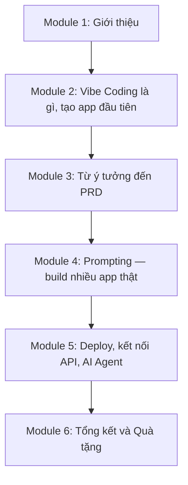

# Bài 19: Tổng Kết Và Quà Tặng

## Mục Tiêu Bài Học

Sau bài này, bạn sẽ:

* Nhìn lại toàn bộ hành trình kiến thức đã học qua 6 module của khóa học.
* Có một **quy trình hoàn chỉnh, lặp lại được** để tự tạo ra bất kỳ ứng dụng nào mình cần trong tương lai.
* Biết cách học tiếp theo sau khi kết thúc khóa học.

---

## 1. Tổng Kết Hành Trình Khóa Học

Bạn đã đi từ việc **chưa biết Vibe Coding là gì**, đến việc **tự tay build và vận hành nhiều ứng dụng thật**: app to-do list, app học tiếng Anh, công cụ tối ưu ảnh sản phẩm, công cụ tạo thumbnail YouTube, app soạn văn bản kết nối AI thật.

## 2. Quy Trình Vibe Coding Hoàn Chỉnh — Tổng Hợp Lại

Đây là quy trình bạn có thể áp dụng cho **bất kỳ ý tưởng app nào** trong tương lai, tổng hợp từ toàn bộ khóa học:

| Bước | Việc cần làm                                          | Bài học liên quan |
| ---- | -------------------------------------------------------- | -------------------- |
| 1    | Làm rõ ý tưởng: ai dùng, vấn đề gì, chức năng gì, giao diện ra sao | Bài 6                |
| 2    | Viết PRD (hoặc nhờ chatbot PRD cá nhân tạo giúp)           | Bài 7–9              |
| 3    | Build app bằng công cụ AI phù hợp (Google AI Studio...)     | Bài 10–13            |
| 4    | Nâng cấp giao diện chuyên nghiệp (Google Stitch)            | Bài 14               |
| 5    | Hoàn thiện, kiểm tra bằng checklist trước khi vận hành      | Bài 12, 15           |
| 6    | Deploy lên internet (Vercel)                                 | Bài 16               |
| 7    | Kết nối API Key để app có khả năng sinh nội dung thông minh  | Bài 17               |
| 8    | Dùng AI Agent (Antigravity) để mở rộng, bảo trì dự án         | Bài 18               |

## 3. Ba Bài Học Quan Trọng Nhất Xuyên Suốt Khóa Học

1. **Prompt càng rõ ràng, kết quả càng đúng ý ngay từ đầu** — đây là nguyên tắc vàng lặp lại ở mọi bài học.
2. **Chia nhỏ yêu cầu phức tạp thành từng bước** giúp dễ kiểm soát và khoanh vùng lỗi hơn là prompt tất cả cùng lúc.
3. **Luôn kiểm tra kết quả thực tế**, không chỉ tin vào những gì AI báo cáo — đây là kỹ năng "verify" quan trọng không kém kỹ năng "prompt".

## 4. Bạn Có Thể Làm Gì Tiếp Theo?

* **Áp dụng ngay vào công việc thực tế**: chọn một vấn đề bạn đang gặp phải, áp dụng đúng quy trình 8 bước ở trên để tự tạo công cụ giải quyết nó.
* **Xây dựng thêm nhiều app nhỏ khác** để rèn luyện phản xạ viết PRD và prompt hiệu quả.
* **Thử nghiệm các công cụ AI Agent nâng cao hơn** khi đã quen thuộc với quy trình cơ bản.
* **Chia sẻ sản phẩm đã deploy** với bạn bè, đồng nghiệp để nhận phản hồi thực tế và tiếp tục cải thiện.

---

## Điều Cần Ghi Nhớ

* Bạn đã có một quy trình 8 bước hoàn chỉnh, có thể áp dụng lặp lại cho bất kỳ ý tưởng app nào.
* Kỹ năng cốt lõi không phải là "biết code", mà là biết mô tả rõ ràng, kiểm tra và tinh chỉnh.
* Việc học không dừng lại ở đây — hãy tiếp tục thực hành với các dự án thực tế của chính bạn.

## Tóm Tắt Bài Học

Khóa học đã trang bị cho bạn đầy đủ tư duy và kỹ năng để tự mình biến bất kỳ ý tưởng nào thành ứng dụng thật, từ bước làm rõ yêu cầu, viết PRD, build sản phẩm, đến deploy và vận hành. Đây không phải là điểm kết thúc, mà là điểm khởi đầu cho hành trình tự tạo ra công cụ phục vụ chính công việc và cuộc sống của bạn. Bài học cuối cùng (Bài 20) sẽ cung cấp file quà tặng và tài nguyên bổ sung để bạn tiếp tục hành trình này.
