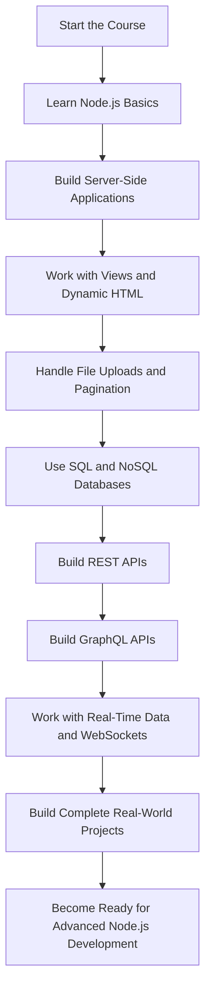

# 001 - Introduction

## Section

Introduction

## Duration

2 minutes

## Main Idea

This lesson introduces the course and explains what students can expect to learn throughout the Node.js journey. The instructor welcomes learners, outlines the major topics covered in the course, and sets the expectation that the course will move from the basics of Node.js to advanced backend development concepts.

The course is project-based, meaning students will not only learn theory but also build real applications, including a complete online shop with checkout and Stripe.js payment integration.

## Course Overview

This course focuses on **Node.js**, a powerful server-side technology used to build modern backend applications.

Students will learn how to build server-rendered applications, REST APIs, GraphQL APIs, real-time apps, and database-driven projects using both SQL and NoSQL databases.

## Learning Objectives

By the end of this lesson, you should be able to:

* Understand the overall purpose of the course.
* Identify the main technologies and backend topics that will be covered.
* Recognize that the course is both theory-based and project-based.
* Set expectations for progressing from beginner to advanced Node.js development.
* Understand that real-world projects will be used to apply the concepts.

## Key Topics Mentioned

* Node.js fundamentals
* Server-side development
* File uploads
* Pagination
* SQL databases
* NoSQL databases
* Server-rendered dynamic HTML
* RESTful APIs
* GraphQL APIs
* Real-time data
* WebSockets
* Online shop project
* Checkout and payment with Stripe.js

## Course Learning Path

## Instructor Introduction

The instructor is **Maximilian Schwarzmüller**, a freelance web developer and highly rated Udemy instructor. He has created multiple best-selling courses and designed this course to fill the gap for students who want to learn Node.js in depth.

## Why This Lesson Matters

This lesson prepares students for the structure and scope of the course. It explains that the course is not a short introduction, but a complete path from beginner-level Node.js knowledge to advanced backend application development.

Instead of only learning isolated concepts, students will apply what they learn by building real projects.

## Practical Example

A beginner might start this course knowing only basic JavaScript. After progressing through the course, they should be able to build a backend application such as an online shop.

Example final project features may include:

* Product listing
* Shopping cart
* User authentication
* File upload support
* Database storage
* Checkout flow
* Payment integration
* REST or GraphQL API
* Real-time functionality

## Review Questions

1. What is the main purpose of this Node.js course?
2. Which backend topics will be covered throughout the course?
3. Why is project-based learning important in this course?
4. What kind of real-world application will be built during the course?
5. Who is the instructor of the course?
6. What is the next important question introduced at the end of the lesson?

## Summary

This introductory lesson welcomes students to the Node.js course and gives an overview of what they will learn. The course covers everything from Node.js basics to advanced backend topics such as databases, APIs, GraphQL, WebSockets, and real-time data.

The main goal is to help students move from zero Node.js experience to being able to build real-world Node.js applications independently.
