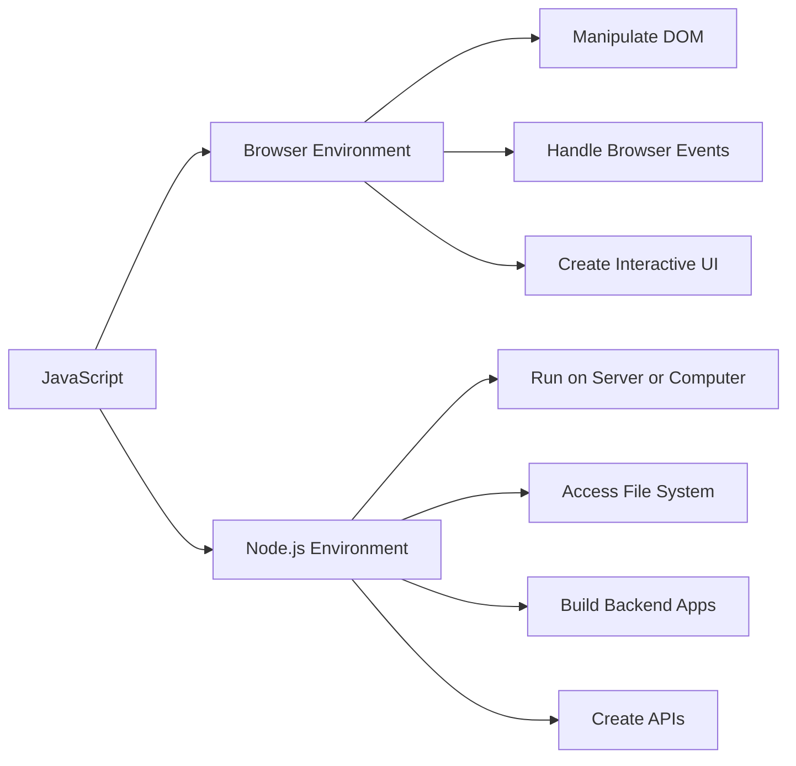
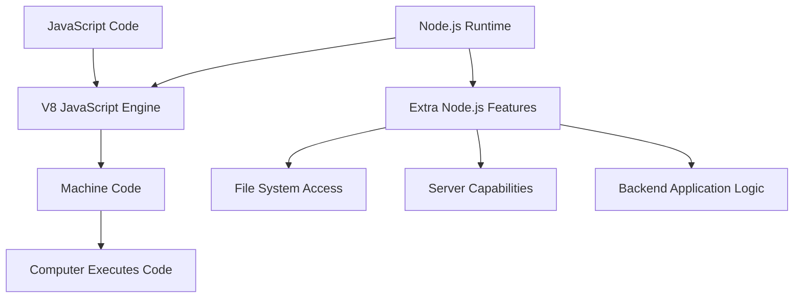

# 002 - What is Node.js?

## Section

Introduction

## Duration

5 minutes

## Main Idea

This lesson answers the core question: **What is Node.js?**

Node.js is a **JavaScript runtime** that allows JavaScript code to run outside the browser. Traditionally, JavaScript is used inside the browser to interact with web pages, manipulate the DOM, open modals, handle user interactions, and create dynamic user interfaces.

Node.js takes JavaScript into a different environment. Instead of only running inside the browser, JavaScript can now run directly on a computer or server. This makes Node.js useful for building server-side applications, backend systems, APIs, command-line tools, and other programs.

## What is Node.js?

**Node.js is a JavaScript runtime built on Google’s V8 JavaScript engine.**

In simple terms:

> Node.js lets you run JavaScript outside the browser.

This means JavaScript can be used not only for frontend browser behavior, but also for backend development.

## Browser JavaScript vs Node.js

In the browser, JavaScript can interact with the loaded web page. It can access the **Document Object Model**, also known as the **DOM**, and change HTML elements after the page has loaded.

In Node.js, there is no browser page attached to the JavaScript file. Because of that, Node.js does not provide browser-specific features like direct DOM manipulation.

However, Node.js adds other powerful features that browser JavaScript does not have, such as working with the local file system.

## Key Difference



## How Node.js Works

Node.js uses **V8**, the JavaScript engine created by Google. V8 is also used by browsers such as Google Chrome to execute JavaScript.

V8 takes JavaScript code and compiles it into machine code, which is the low-level code that computers can run efficiently.

Node.js builds on top of V8 and adds extra features that are useful outside the browser, such as:

* Reading files
* Writing files
* Deleting files
* Running scripts directly on a machine
* Building server-side applications

## Node.js Runtime Architecture



## Why Browser JavaScript Cannot Do Everything

Browser JavaScript is restricted for security reasons.

For example, a website should not be able to freely read, change, or delete files on a user’s computer. Because of this, browser JavaScript does not provide full access to the local file system.

Node.js code does not run inside the browser. It runs directly on a machine or server, so it can provide features that are not available in the browser environment.

## What Node.js Adds

Node.js extends JavaScript with server-side capabilities.

Examples include:

* Accessing the local file system
* Running JavaScript scripts from the terminal
* Creating backend servers
* Handling requests and responses
* Connecting to databases
* Building APIs
* Creating tools that run on a computer

## What Node.js Does Not Provide

Node.js does not provide browser-only features such as:

* Direct access to the DOM
* Browser window APIs
* HTML page manipulation
* Browser-based UI behavior

That is because Node.js does not run inside a web page.

## Learning Objectives

By the end of this lesson, you should be able to:

* Define Node.js as a JavaScript runtime.
* Explain that Node.js allows JavaScript to run outside the browser.
* Understand the role of the V8 JavaScript engine.
* Identify what Node.js adds to JavaScript.
* Compare browser JavaScript with Node.js JavaScript.
* Understand why Node.js is important for backend development.

## Key Points

* Node.js is not a new programming language.
* Node.js is a runtime environment for JavaScript.
* JavaScript usually runs in the browser, but Node.js allows it to run elsewhere.
* Node.js is built on the V8 JavaScript engine.
* V8 compiles JavaScript into machine code.
* Node.js adds features that are not available in the browser.
* Browser JavaScript can manipulate the DOM.
* Node.js can access server-side features such as the file system.
* Node.js is commonly used to build backend applications.

## Practical Example

In browser JavaScript, you might write code that changes text on a page:

```js
document.querySelector('h1').textContent = 'Hello from the browser!';
```

This works in the browser because the browser provides access to the DOM.

In Node.js, you might write code that reads a file:

```js
const fs = require('fs');

const text = fs.readFileSync('message.txt', 'utf8');

console.log(text);
```

This works in Node.js because Node.js provides access to the file system.

## Simple Comparison

| Feature                         | Browser JavaScript | Node.js |
| ------------------------------- | ------------------ | ------- |
| Runs in browser                 | Yes                | No      |
| Runs on server/computer         | No                 | Yes     |
| Can manipulate DOM              | Yes                | No      |
| Can access file system directly | No                 | Yes     |
| Useful for frontend UI          | Yes                | No      |
| Useful for backend apps         | Limited            | Yes     |
| Uses V8 engine                  | Often yes          | Yes     |

## Why This Lesson Matters

Understanding what Node.js is helps clarify the purpose of the entire course.

The course is not about learning a completely new language. Instead, it is about using JavaScript in a new environment: the server or local machine.

This idea is important because many backend concepts later in the course depend on the fact that Node.js can interact with files, servers, databases, and network requests.

## Review Questions

1. What is Node.js?
2. Is Node.js a programming language or a runtime?
3. What does it mean to run JavaScript outside the browser?
4. What is V8?
5. What does V8 do with JavaScript code?
6. Why can browser JavaScript not freely access the local file system?
7. What features does Node.js add to JavaScript?
8. What browser-specific feature is not available in Node.js?
9. Why is Node.js useful for backend development?
10. How is Node.js different from JavaScript running in the browser?

## Summary

Node.js is a JavaScript runtime that allows JavaScript code to run outside the browser. It is built on Google’s V8 JavaScript engine, which compiles JavaScript into machine code.

While browser JavaScript is mainly used to manipulate web pages and create interactive user interfaces, Node.js is used to build server-side applications and run JavaScript directly on a computer or server.

Node.js adds useful backend features, such as file system access, while browser-specific features like DOM manipulation are not available in Node.js. This makes Node.js a powerful tool for building modern backend applications with JavaScript.
