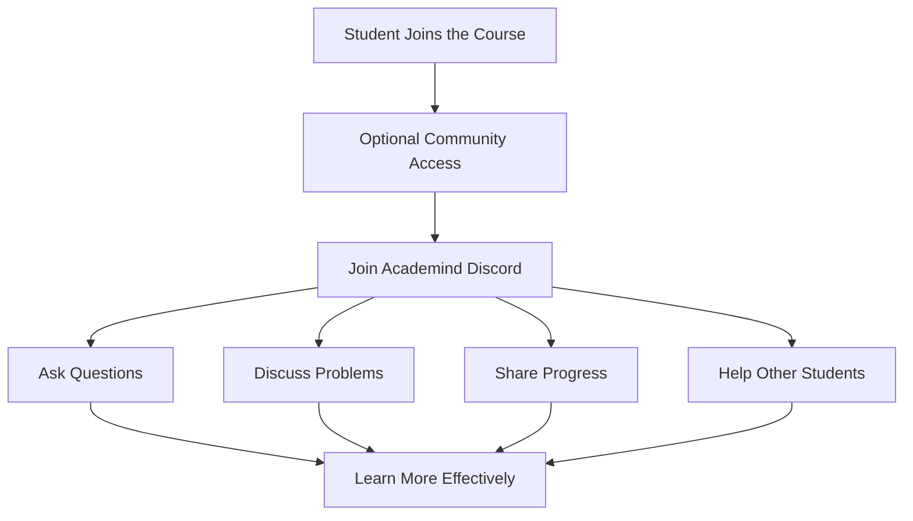

# 003 - Join our Online Learning Community

## Section

Introduction

## Duration

1 minute

## Main Idea

This lesson introduces the optional online learning community connected to the course. Students are invited to join the **Academind Community** on Discord, where they can meet other learners, ask questions, discuss problems, share progress, and support each other throughout the course.

The key message is that learning is often more effective when students do not study alone. A community can provide motivation, feedback, and collaboration while working through the Node.js course.

## Community Link

Academind Community:

```text
https://academind.com/community/
```

Joining the community is:

* Free
* Optional
* Open to course students
* Useful for discussion, support, and motivation

## Why Join the Community?

The community gives students a place to connect with others who are learning similar topics.

Students can use it to:

* Discuss course-related issues
* Ask for help when stuck
* Help other learners
* Share progress
* Celebrate successes
* Exchange ideas
* Stay motivated during the course

## Learning Community Flow



## Learning Objectives

By the end of this lesson, you should be able to:

* Understand the purpose of the online learning community.
* Recognize that community participation is optional.
* Explain how learning with others can support your progress.
* Identify ways to use the community while studying Node.js.
* Understand that the community is a complementary resource, not a required part of the course.

## Key Points

* The course includes free access to the Academind Community on Discord.
* Joining the community is completely optional.
* The community is designed for learners with similar interests.
* Students can ask questions, discuss issues, and share ideas.
* Helping others can also improve your own understanding.
* Learning with others can increase motivation and consistency.

## Practical Example

Imagine you are working on a Node.js project and encounter an error while setting up a server.

Instead of struggling alone, you could:

1. Search the course materials again.
2. Try to debug the problem yourself.
3. Ask a clear question in the community.
4. Share the error message and what you already tried.
5. Learn from the answers and suggestions from other students.

Example question you might post:

```text
I am trying to start my Node.js server, but I get an error when running npm start.
I already checked my package.json file and confirmed that the start script exists.
Has anyone faced a similar issue?
```

## How This Supports the Course

This lesson supports the broader goal of the Introduction section by showing students that they are not learning in isolation. The course provides structured lessons, but the community can provide additional support, encouragement, and discussion.

This is especially useful in a long technical course because students may face bugs, confusion, or motivation challenges along the way.

## Review Questions

1. What is the Academind Community?
2. Is joining the community required for this course?
3. Why can learning with others be helpful?
4. What kinds of things can students discuss in the community?
5. How can helping other students improve your own understanding?
6. How could you use the community when you get stuck on a Node.js problem?

## Summary

This lesson invites students to join the free and optional Academind Community on Discord. The community is a complementary resource where learners can ask questions, discuss issues, share progress, help each other, and stay motivated.

The main takeaway is that learning does not have to happen alone. A supportive community can make the Node.js learning journey more engaging and effective.
