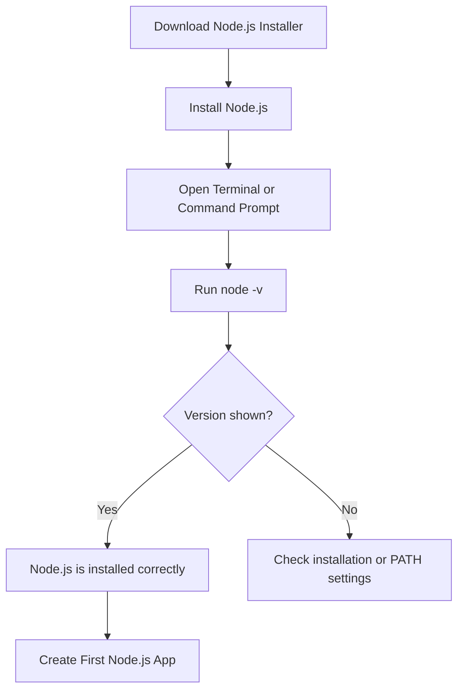
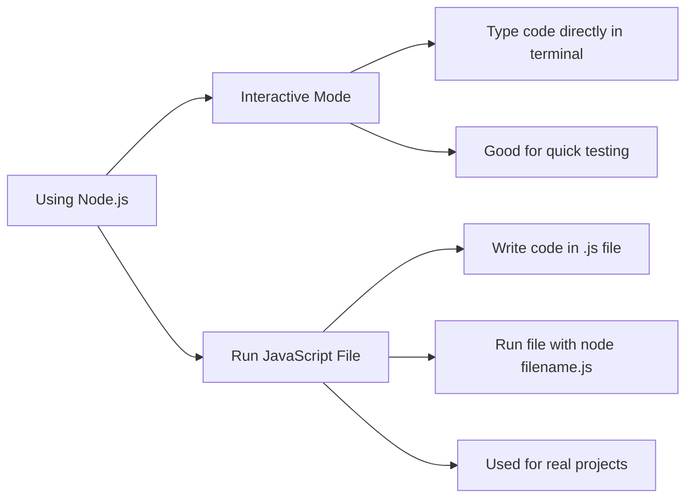
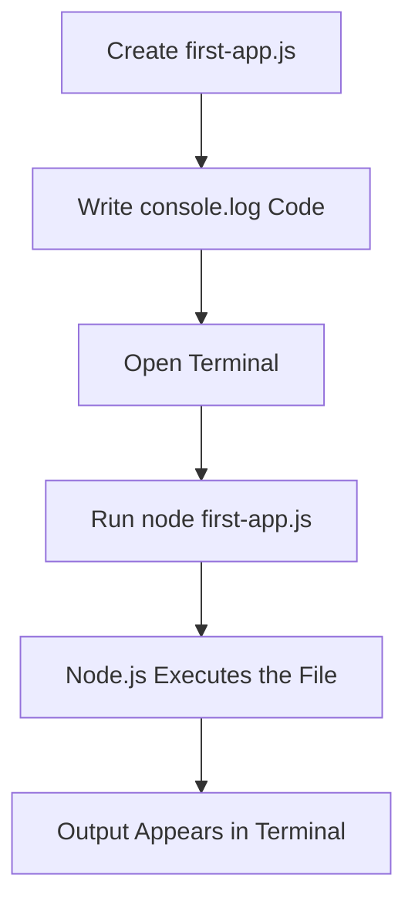
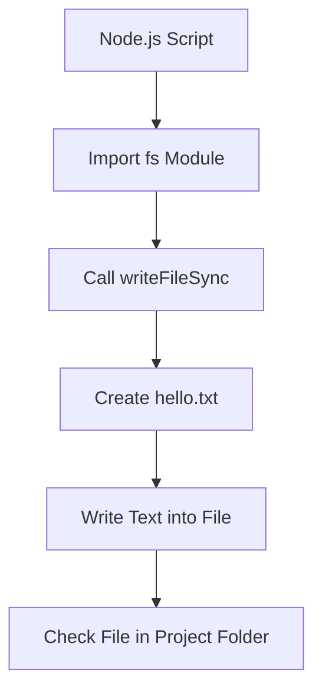

# 004 - Installing Node.js and Creating our First App

## Section

Introduction

## Duration

10 minutes

## Main Idea

This lesson shows how to install Node.js, verify that it works, set up a code editor, and create the first simple Node.js application.

The key goal is to move from theory to practice. After learning that Node.js allows JavaScript to run outside the browser, this lesson demonstrates how to actually run JavaScript code with Node.js on a local machine.

Students first install Node.js, then use the terminal to check the installed version, try the interactive Node.js mode, and finally create a JavaScript file that can be executed with Node.js.

## What This Lesson Covers

This lesson introduces the basic local development workflow for Node.js:

1. Install Node.js.
2. Verify the installation.
3. Use the Node.js interactive mode.
4. Set up a project folder.
5. Open the folder in a code editor.
6. Create a JavaScript file.
7. Run the file with Node.js.
8. Use Node.js built-in functionality to write output to a file.

## Learning Objectives

By the end of this lesson, you should be able to:

* Install Node.js on your system.
* Check whether Node.js was installed successfully.
* Understand the difference between Node.js interactive mode and running a file.
* Create a simple JavaScript file for Node.js.
* Execute a JavaScript file from the terminal.
* Use the built-in `fs` module to write content to a file.
* Understand why Node.js can do things browser JavaScript cannot do.

## Installation Step

To get started with Node.js, visit the official Node.js website and download the installer for your operating system.

```text
https://nodejs.org
```

The exact version number may change over time. That is normal because Node.js receives frequent updates, bug fixes, and optimizations.

During installation, you can usually keep the default settings.

## Verify the Installation

After installing Node.js, open your terminal or command prompt.

On macOS or Linux, open the terminal.

On Windows, open Command Prompt or PowerShell.

Run the following command:

```bash
node -v
```

This command prints the installed Node.js version.

Example output:

```bash
v14.11.0
```

The version number may be different depending on when you install Node.js.

If the command shows a version number, Node.js was installed successfully.

## Node.js Setup Flow



## Using Node.js Interactive Mode

Node.js includes an interactive mode called the **REPL**.

REPL stands for:

* Read
* Evaluate
* Print
* Loop

You can enter this mode by running:

```bash
node
```

After entering interactive mode, you can type JavaScript directly into the terminal.

Example:

```js
1 + 1
```

Output:

```text
2
```

You can also run simple JavaScript code:

```js
console.log('Hello from Node.js');
```

To exit interactive mode, you can use one of these options:

```text
Press Ctrl + C twice
Press Ctrl + D
Type .exit
```

## Interactive Mode vs File Execution



## Setting Up the Code Editor

For writing real Node.js programs, you should use a code editor.

The instructor uses **Visual Studio Code**, also known as **VS Code**.

VS Code is:

* Free
* Popular for web development
* Available on macOS, Windows, and Linux
* Suitable for JavaScript and Node.js development

You can download it here:

```text
https://code.visualstudio.com
```

You may also use any other editor or IDE you prefer.

## Optional VS Code Setup

The instructor also mentions a few optional VS Code customizations:

* Open the project folder with **File > Open Folder**
* Use **View > Appearance** to control the sidebar and activity bar
* Use **Preferences > Color Theme** to choose a theme
* Install the **Material Icon Theme** extension for file icons

These settings are optional and do not affect how Node.js works.

## Creating the First Project

Create a new empty folder for your first Node.js project.

Example folder name:

```text
node-first-app
```

Open this folder in VS Code.

Inside the folder, create a new file:

```text
first-app.js
```

The `.js` extension means the file contains JavaScript code.

## First Node.js Code

Add the following code to `first-app.js`:

```js
console.log('Hello from Node.js');
```

This code prints a message to the terminal.

## Running the First App

Open the terminal inside VS Code:

```text
Terminal > New Terminal
```

Then run:

```bash
node first-app.js
```

Expected output:

```text
Hello from Node.js
```

This proves that Node.js can execute JavaScript code from a file.

## First App Execution Flow



## Using the File System Module

Node.js can do more than print text to the console. It can also work with the local file system.

To do this, Node.js provides a built-in module called `fs`.

`fs` stands for **file system**.

Add this code to `first-app.js`:

```js
const fs = require('fs');

fs.writeFileSync('hello.txt', 'Hello from Node.js');
```

## Code Explanation

```js
const fs = require('fs');
```

This imports the built-in Node.js file system module.

```js
fs.writeFileSync('hello.txt', 'Hello from Node.js');
```

This creates a file named `hello.txt` and writes the text `Hello from Node.js` into it.

## Project Structure

After running the file, your project may look like this:

```text
node-first-app/
├── first-app.js
└── hello.txt
```

## Running the File System Example

Run the script again:

```bash
node first-app.js
```

After the command runs, Node.js creates a new file:

```text
hello.txt
```

The file should contain:

```text
Hello from Node.js
```

## File Writing Flow



## Why This Matters

This example shows one of the most important differences between browser JavaScript and Node.js.

Browser JavaScript is restricted and cannot freely access the local file system for security reasons.

Node.js runs outside the browser, so it can access server-side and machine-level features such as file reading and file writing.

This is one reason Node.js is useful for backend development.

## Browser JavaScript vs Node.js Example

| Task                                | Browser JavaScript | Node.js |
| ----------------------------------- | ------------------ | ------- |
| Print text to console               | Yes                | Yes     |
| Manipulate the DOM                  | Yes                | No      |
| Read and write local files directly | No                 | Yes     |
| Run scripts from terminal           | No                 | Yes     |
| Build backend applications          | Limited            | Yes     |

## Common Failure to Check First

If `node -v` does not work, the most common issue is that Node.js was not installed correctly or the terminal cannot find the `node` command.

Check these first:

* Restart the terminal after installation.
* Confirm that Node.js was installed.
* Reinstall Node.js with default settings.
* On Windows, check whether Node.js was added to the system PATH.

## Practice

Create a folder called:

```text
node-practice
```

Inside it, create a file:

```text
app.js
```

Add this code:

```js
const fs = require('fs');

console.log('My first Node.js practice app');

fs.writeFileSync('practice.txt', 'This file was created with Node.js');
```

Run the file:

```bash
node app.js
```

Then check whether `practice.txt` was created.

## Expected Result

After running the script, the folder should contain:

```text
node-practice/
├── app.js
└── practice.txt
```

The `practice.txt` file should contain:

```text
This file was created with Node.js
```

## Key Points

* Node.js must be installed before JavaScript files can be executed with Node.js.
* `node -v` checks the installed Node.js version.
* Running `node` alone enters interactive mode.
* Interactive mode is useful for quick experiments.
* Real Node.js programs are usually written in `.js` files.
* A file can be executed with `node filename.js`.
* `console.log()` works in Node.js and prints output to the terminal.
* Node.js includes built-in modules such as `fs`.
* The `fs` module allows Node.js to work with the file system.
* `require()` is used here to import a Node.js module.
* `writeFileSync()` can create and write content to a file.

## Review Questions

1. Why do we need to install Node.js before writing Node.js applications?
2. Which command checks the installed Node.js version?
3. What happens when you run `node` without a file name?
4. What is the Node.js REPL used for?
5. How do you exit the Node.js interactive mode?
6. Why should real applications be written in files instead of only in the REPL?
7. How do you run a JavaScript file with Node.js?
8. What does `console.log()` do in Node.js?
9. What is the purpose of the `fs` module?
10. What does `fs.writeFileSync()` do?
11. Why can Node.js write files while browser JavaScript usually cannot?
12. What file should appear after running the file system example?

## Summary

This lesson explains how to install Node.js, verify the installation, and create the first basic Node.js application.

Students learn how to use the terminal, check the Node.js version, try the interactive REPL mode, create a JavaScript file, and execute it with the `node` command.

The lesson also introduces the built-in `fs` module, which allows Node.js to write files to the local file system. This demonstrates that Node.js can do more than browser JavaScript because it runs outside the browser and has access to server-side features.
