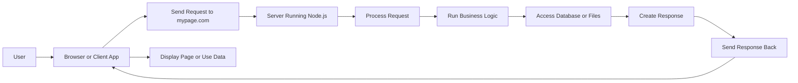
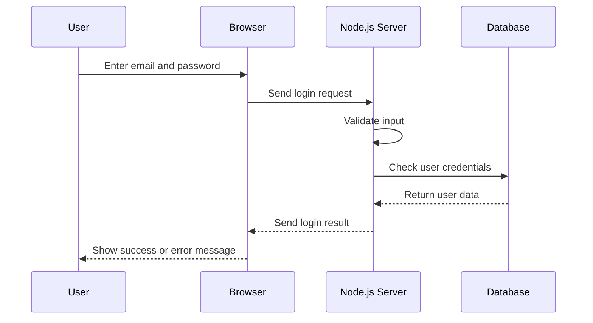
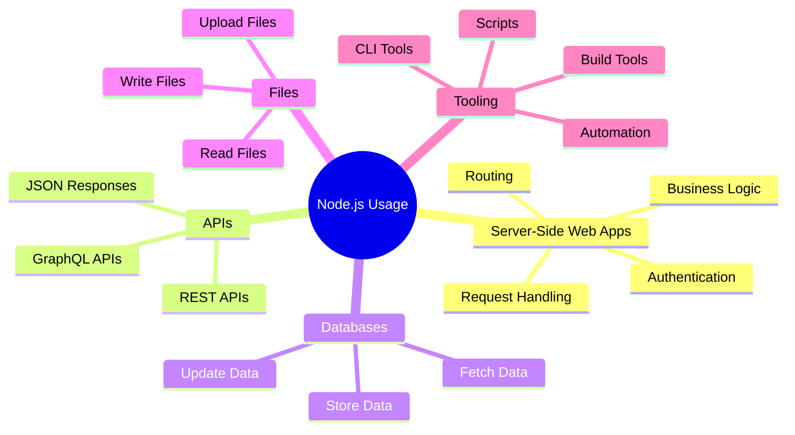
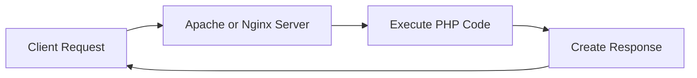
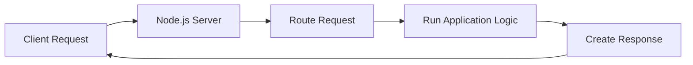
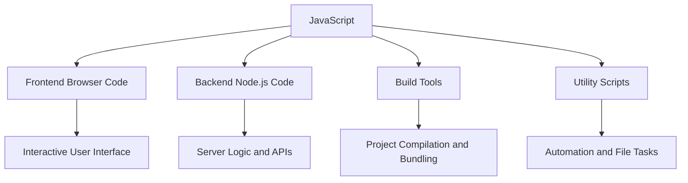
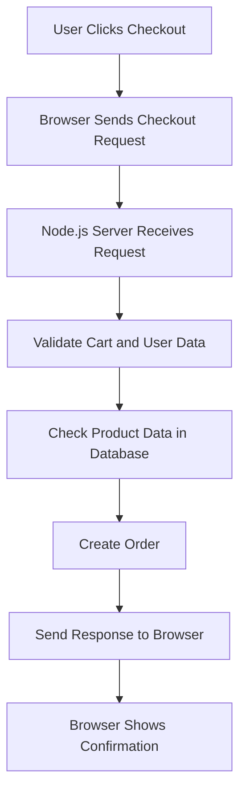

# 005 - Understanding the Role & Usage of Node.js

## Section

Introduction

## Duration

8 minutes

## Main Idea

This lesson explains where Node.js fits into modern web development and why it is commonly used for server-side code.

Node.js is usually used to run JavaScript on a server. A server receives requests from clients, processes those requests, performs important backend tasks, and sends responses back to the client.

In this course, Node.js will mainly be used to build server-side applications that handle requests, run business logic, work with databases, and send responses such as HTML pages, JSON data, or files.

## The Big Picture

A typical web application involves two main sides:

* **Client side**: The browser, mobile browser, or mobile app used by the user.
* **Server side**: A computer running somewhere on the internet that receives requests and returns responses.

The client sends a request, such as opening a URL like `mypage.com`. The server receives that request, executes code, and sends back a response.

That response may be:

* An HTML page
* A CSS file
* A JavaScript file for the browser
* JSON data
* XML data
* A file
* Some other kind of response

## Request-Response Flow



## What Node.js Does on the Server

Node.js is used to write the code that runs on the server.

This server-side code can:

* Listen for incoming requests
* Route requests to the correct logic
* Validate user input
* Authenticate users
* Connect to databases
* Read and write files
* Execute business logic
* Generate dynamic HTML pages
* Send JSON data
* Send files or other responses

## Why Server-Side Code Is Needed

Some tasks should not be done in the browser because of security, performance, or reliability reasons.

For example, the server is responsible for:

* Connecting to databases
* Storing sensitive data safely
* Handling user authentication
* Validating important user input
* Running business logic
* Protecting code and data that users should not directly access

Browser-side code can be inspected and changed by users through developer tools. Because of that, important logic should run on the server, where users cannot directly access or modify it.

## Client-Side vs Server-Side Responsibilities

| Responsibility                    | Client Side | Server Side with Node.js |
| --------------------------------- | ----------- | ------------------------ |
| Display user interface            | Yes         | Usually no               |
| Run browser JavaScript            | Yes         | No                       |
| Handle user clicks and UI updates | Yes         | No                       |
| Connect securely to databases     | No          | Yes                      |
| Validate important input          | Limited     | Yes                      |
| Authenticate users                | No          | Yes                      |
| Store sensitive business logic    | No          | Yes                      |
| Send HTML, JSON, files, or data   | No          | Yes                      |
| Listen for incoming HTTP requests | No          | Yes                      |

## Node.js in Web Development

In web development, Node.js is most commonly used to build backend applications.

A Node.js backend can receive requests from a browser or client app, process those requests, and return responses.

For example, when a user logs in:

1. The browser sends the email and password to the server.
2. Node.js receives the request.
3. Node.js validates the input.
4. Node.js checks the database.
5. Node.js creates a response.
6. The browser receives the result.

## Login Request Example Flow



## Node.js Does More Than Server-Side Code

Although Node.js is most popular for server-side web development, it is not limited to servers.

Node.js is a JavaScript runtime, so it can execute JavaScript code outside the browser in many different situations.

Node.js can also be used for:

* Local utility scripts
* Build tools
* File manipulation
* Automation tasks
* Development tooling
* Command-line tools

For example, many frontend frameworks and libraries use Node.js behind the scenes for build processes.

If you have worked with tools like React, Angular, or Vue, you may have already used Node.js indirectly through development servers, bundlers, or build tools.

## Common Uses of Node.js



## Node.js Compared to PHP

One important difference between Node.js and PHP is how the server is handled.

With PHP, tools like Apache or Nginx often handle incoming requests and then execute PHP code.

With Node.js, you can write both:

* The server that listens for incoming requests
* The application logic that handles those requests

This means Node.js gives you direct control over request handling and server behavior.

## PHP-Style Server Flow



## Node.js Server Flow



## What Node.js Handles in This Course

Throughout the course, Node.js will be used to handle both the request side and the response side of a web application.

You will learn how to:

* Start a server
* Listen for incoming requests
* Route different requests
* Process request data
* Work with files
* Connect to databases
* Render dynamic HTML
* Build REST APIs
* Build GraphQL APIs
* Send JSON responses
* Work with real-time data
* Use WebSockets

## Alternatives to Node.js

Node.js is not the only technology for backend development.

Other popular backend options include:

* Python with Flask or Django
* PHP with Laravel or plain PHP
* ASP.NET
* Ruby on Rails
* Java with Spring
* Go
* Other server-side technologies

There is no single universal winner. These technologies can often solve similar problems, but they differ in syntax, ecosystem, performance characteristics, tooling, and developer preference.

## Why Learn Node.js?

One major advantage of Node.js is that it uses JavaScript.

JavaScript is already essential in modern frontend development. By using Node.js, developers can also use JavaScript on the backend.

This means one language can be used across much of a modern web application.

## Full-Stack JavaScript Idea



## Benefits of Node.js

Node.js is popular because it is:

* Based on JavaScript
* Useful for backend development
* Suitable for APIs and web servers
* Fast and efficient for many web use cases
* Common in modern web development
* Useful for tooling and automation
* Supported by a large ecosystem
* Valuable for full-stack JavaScript development

## Practical Example

Imagine an online shop application.

The browser may handle:

* Showing the product list
* Handling button clicks
* Updating the cart UI
* Displaying forms

The Node.js server may handle:

* Loading products from a database
* Validating checkout data
* Authenticating users
* Creating orders
* Processing payment-related logic
* Sending confirmation responses

Example request flow:



## Simple Node.js Server Example

```js id="hx6la7"
const http = require('http');

const server = http.createServer((req, res) => {
  res.write('Hello from the Node.js server!');
  res.end();
});

server.listen(3000);
```

This example shows the basic idea of Node.js acting as a server.

The server listens for incoming requests on port `3000` and sends a response back to the client.

## Learning Objectives

By the end of this lesson, you should be able to:

* Explain the role of Node.js in a web application.
* Understand the request-response pattern.
* Identify why server-side code is necessary.
* Explain what kinds of tasks Node.js performs on the server.
* Understand that Node.js can also be used for scripts and build tools.
* Compare Node.js with other backend technologies.
* Understand why JavaScript on both frontend and backend can be useful.

## Key Points

* Node.js is commonly used to run server-side JavaScript.
* Clients send requests to a server.
* The server processes requests and sends responses.
* Node.js can listen for incoming requests.
* Node.js can run business logic.
* Node.js can work with databases and files.
* Node.js can send HTML, JSON, XML, files, or other response types.
* Important logic should usually run on the server for security and reliability.
* Node.js is also useful for local scripts, build tools, and automation.
* Node.js lets developers use JavaScript across both frontend and backend.
* Node.js is one of many backend technology options.

## Common Things to Inspect First

When debugging a Node.js backend feature, inspect:

* The incoming request method and URL
* The route handler
* The request body or query parameters
* The server-side validation logic
* The database query
* The response status code
* The response body sent back to the client

## Practice

Write a short explanation of what should happen when a user submits a login form.

Include:

* What the browser sends
* What the Node.js server receives
* What the server validates
* What database action may happen
* What response the server sends back

Example:

```text id="jt6y1l"
When the user submits the login form, the browser sends the email and password to the Node.js server.
The server validates the input, checks the user in the database, and sends back either a success response or an error response.
```

## Review Questions

1. What role does Node.js usually play in web development?
2. What is the difference between client-side code and server-side code?
3. Why should important business logic usually run on the server?
4. What is the request-response pattern?
5. What kinds of responses can a Node.js server send?
6. Why is user authentication usually handled on the server?
7. Why is browser-side validation not enough?
8. What can Node.js do besides running server-side applications?
9. How is Node.js different from PHP in terms of server handling?
10. What are some alternatives to Node.js?
11. Why is JavaScript a major advantage of Node.js?
12. How does Node.js support full-stack development?

## Summary

This lesson explains the role and usage of Node.js in modern web development.

Node.js is most commonly used to write server-side code. It receives requests from clients, processes those requests, runs business logic, works with files or databases, and sends responses back to the client.

Node.js is especially useful because it allows developers to use JavaScript outside the browser. This makes it possible to use JavaScript for frontend code, backend code, build tools, and utility scripts.

While there are many backend alternatives such as Python, PHP, ASP.NET, and Ruby on Rails, Node.js is a popular and powerful choice because it is fast, efficient, widely used, and based on JavaScript.
