# 006 - Course Outline

## Section

Introduction

## Duration

8 minutes

## Main Idea

This lesson gives a complete overview of the course structure and explains what students will learn throughout the Node.js course.

After introducing what Node.js is, how to install it, and where it is used, this lesson shows the learning path from basic JavaScript and Node.js fundamentals to advanced backend development topics such as Express.js, databases, authentication, file uploads, REST APIs, GraphQL, WebSockets, deployment, TypeScript, and Deno.

The goal is to help students understand where each major topic fits and what they can expect from the full course.

## Course Purpose

This course is designed to take students from the basics of Node.js to advanced backend development.

The course does not only teach isolated concepts. It builds up step by step and applies those concepts in real web applications, especially a larger shop application that includes server-rendered pages, databases, authentication, payments, APIs, and deployment.

## High-Level Course Roadmap

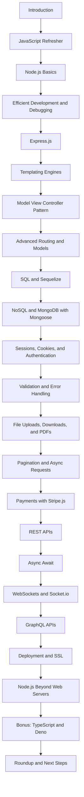

## Learning Objectives

By the end of this lesson, you should be able to:

* Understand the full structure of the Node.js course.
* Identify the major modules covered throughout the course.
* Recognize how the course moves from beginner topics to advanced backend development.
* Understand where Express.js, databases, authentication, APIs, and deployment fit into the learning path.
* See how each module builds on previous knowledge.
* Prepare for the next section, which is a JavaScript refresher.

## 1. JavaScript Refresher

The next module is a brief JavaScript refresher.

This module is intended to make sure all students are comfortable with the core JavaScript syntax and modern JavaScript features used later in the course.

Basic JavaScript knowledge is assumed, so the refresher is optional if you already feel confident.

Topics may include:

* Core JavaScript syntax
* Modern JavaScript features
* Important language concepts used in Node.js
* Syntax patterns that appear throughout the course

## 2. Node.js Basics

After the JavaScript refresher, the course moves into Node.js fundamentals.

This part explains how Node.js works and introduces core concepts needed for backend development.

Topics include:

* How Node.js works internally
* Running JavaScript outside the browser
* Working with Node.js core modules
* Handling streams of data
* Understanding Node.js-specific features

## 3. Efficient Development with Node.js

This module focuses on improving the development workflow.

Students learn how to write better Node.js code, debug problems, and handle errors more efficiently.

Topics include:

* Debugging Node.js applications
* Handling runtime errors
* Improving the development workflow
* Understanding common development problems

## 4. Express.js

The course then introduces **Express.js**, the most popular web framework for Node.js.

Express.js makes it easier to build web servers and handle routing, middleware, requests, and responses.

Even though Express.js is used, the course still teaches Node.js fundamentals because Express.js is built on top of Node.js.

## Express.js Role

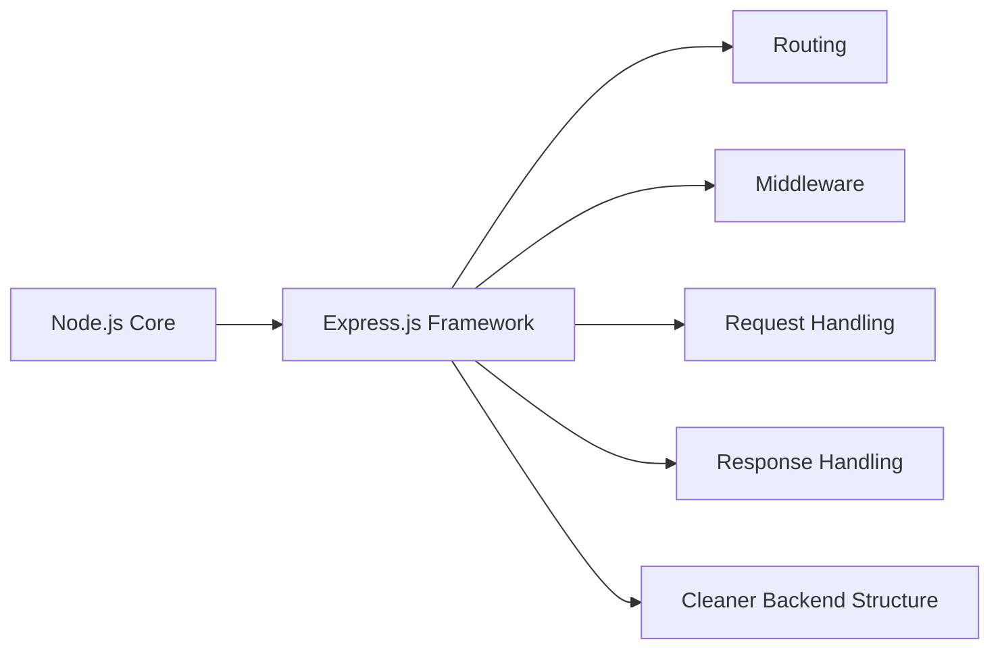

## 5. Templating Engines

Templating engines allow the server to generate dynamic HTML pages.

Instead of sending the same static HTML to every user, the server can insert dynamic data into HTML before sending it back to the browser.

Examples of what templating engines help with:

* Rendering product lists
* Showing user-specific content
* Generating dynamic pages
* Reusing layouts and partial templates

## Dynamic HTML Flow

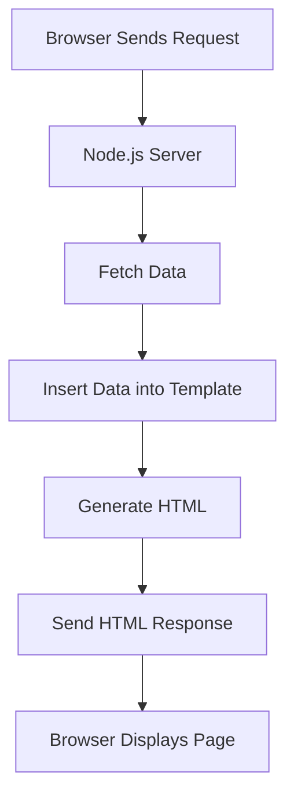

## 6. Model View Controller Pattern

The course then introduces the **Model View Controller**, or **MVC**, pattern.

MVC helps organize application code into separate responsibilities.

| Part       | Responsibility                                  |
| ---------- | ----------------------------------------------- |
| Model      | Handles data and business rules                 |
| View       | Displays the user interface or HTML output      |
| Controller | Handles requests and connects models with views |

## MVC Structure

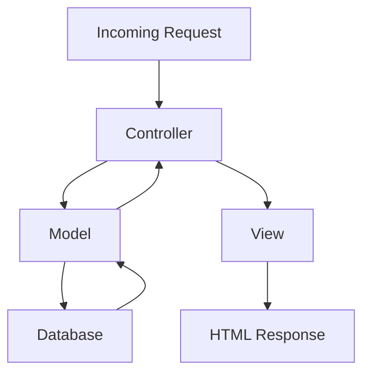

## 7. Advanced Routing and Models

After learning MVC, the course goes deeper into routing and models.

Routing determines how different URLs and HTTP methods are handled.

Models organize the data logic of the application.

This section helps students build cleaner and more maintainable backend applications.

## 8. SQL Databases and Sequelize

The course then introduces SQL databases, starting with **MySQL**.

SQL databases store structured data in tables.

After learning the basics of connecting Node.js to a SQL database, the course introduces **Sequelize**, a package that makes working with SQL databases easier.

Topics include:

* Connecting Node.js to MySQL
* Creating and querying data
* Using Sequelize
* Working with models and relationships
* Managing structured data

## 9. NoSQL Databases and Mongoose

After SQL, the course introduces NoSQL databases.

The main NoSQL database used in the course is MongoDB.

The course also uses **Mongoose**, a package that makes working with MongoDB easier in Node.js.

After this point, the course mainly continues with NoSQL for the rest of the project.

Topics include:

* Connecting to MongoDB
* Creating schemas and models
* Reading and writing documents
* Using Mongoose
* Comparing SQL and NoSQL approaches

## SQL vs NoSQL Overview

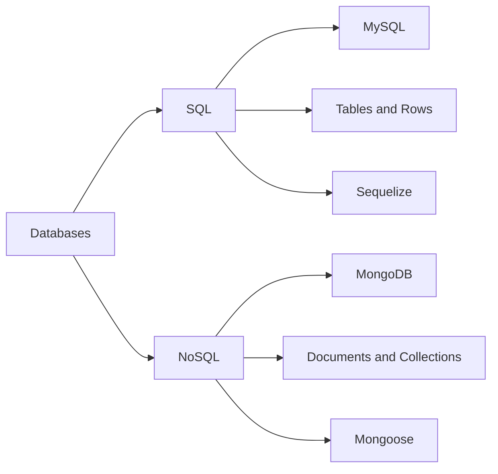

## 10. Sessions, Cookies, and Authentication

The next major part of the course focuses on user identity and login behavior.

Students learn how sessions and cookies work, then use them to build authentication features.

Topics include:

* Cookies
* Sessions
* User signup
* User login
* Password handling
* Authentication logic
* Protecting routes

## Authentication Flow

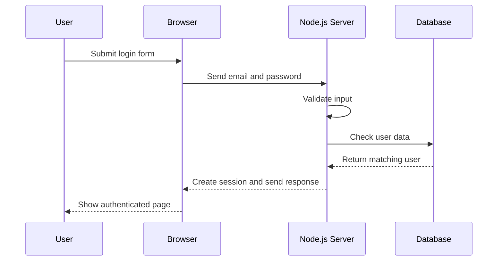

## 11. Email, Advanced Authentication, and Authorization

The course also covers sending emails from the server.

For example, an application may automatically send an email when a user signs up.

The course then moves into more advanced authentication and authorization topics.

Authentication answers:

```text id="il1ox4"
Who is the user?
```

Authorization answers:

```text id="y8xf7u"
What is the user allowed to do?
```

Example authorization rule:

```text id="xvybwi"
Only the user who created a product should be allowed to edit or delete it.
```

## 12. User Input Validation

User input validation is a crucial part of any web application.

The server must check whether user-submitted data is correct and safe.

Examples include:

* Checking whether an email address is valid
* Ensuring a password is long enough
* Confirming required fields are not empty
* Preventing invalid data from being stored
* Protecting the application from bad input

Browser-side validation is helpful, but server-side validation is essential because users can bypass or modify browser-side code.

## 13. Error Handling

Errors will happen in real applications.

The course teaches how to handle different kinds of errors in a clean and elegant way.

Examples include:

* Invalid user input
* Database errors
* Authentication failures
* Missing files
* Server-side exceptions
* Failed external service calls

## 14. File Uploads, Downloads, and PDF Generation

The course then covers working with files.

Students learn how to handle incoming files, store them, return files to users, and generate PDF documents on the server.

Topics include:

* File uploads
* File downloads
* File storage
* Serving files
* Generating PDF documents dynamically

## File Handling Flow

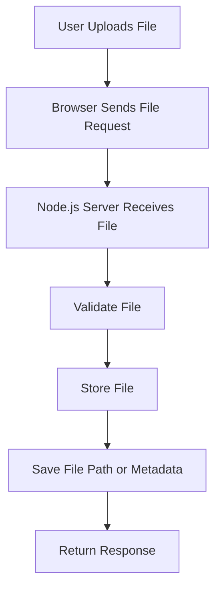

## 15. Pagination

Pagination is used to split large amounts of data into smaller chunks.

Instead of sending all data at once, the server sends only part of the data.

This improves:

* Performance
* Bandwidth usage
* User experience
* Database efficiency

Example:

```text id="qod1tq"
Instead of loading 1,000 products at once, load 10 or 20 products per page.
```

## 16. Async Requests

The course also introduces asynchronous requests.

Async requests allow the browser to communicate with the server without fully reloading the page.

This improves user experience because parts of the page can update dynamically.

## 17. Payments with Stripe.js

Since the course includes an online shop project, it also covers payment integration.

Students learn how to accept payments using **Stripe.js**.

Payment handling is an important real-world feature for ecommerce applications.

## 18. REST APIs

The course then moves into REST APIs.

REST APIs are used when the server returns data instead of full HTML pages.

This is common when building backends for frontend applications, mobile apps, or external clients.

Topics include:

* REST API structure
* JSON responses
* Authentication in APIs
* File uploads in APIs
* Pagination in APIs
* Reusing knowledge from previous modules

## Traditional App vs REST API

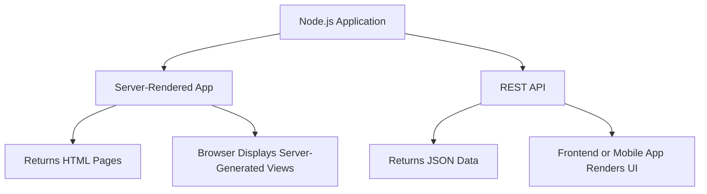

## 19. Async Await

After REST APIs, the course introduces `async` and `await`.

`async` and `await` are modern JavaScript features that make asynchronous code easier to read and manage.

This is especially useful in Node.js because backend applications often work with asynchronous tasks such as:

* Database queries
* File operations
* HTTP requests
* Authentication checks
* External API calls

## 20. WebSockets and Socket.io

The course then introduces real-time functionality with WebSockets and Socket.io.

WebSockets allow the server and client to maintain an open connection so updates can be sent instantly.

Example use cases:

* Chat applications
* Live notifications
* Real-time dashboards
* Instant updates between users

## WebSocket Example

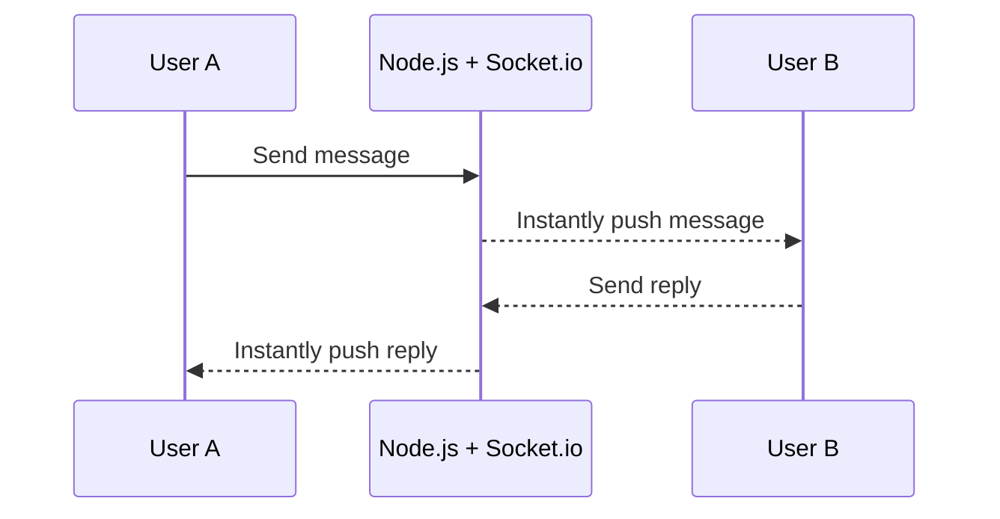

## 21. GraphQL APIs

After REST APIs, the course introduces **GraphQL**.

GraphQL is a modern API approach that allows clients to request exactly the data they need.

The course explains:

* How GraphQL differs from REST
* Advantages of GraphQL
* Disadvantages of GraphQL
* How to build a GraphQL API from scratch with Node.js

## REST vs GraphQL Overview

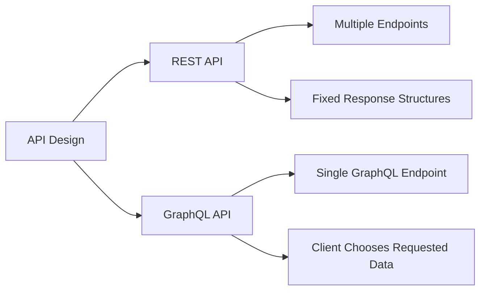

## 22. Deployment and SSL

The course later explains how to deploy a Node.js application to a real server.

Deployment means taking the application from the local development machine and making it available on the internet.

Topics include:

* Moving code to a real server
* Running the application in production
* Configuring the server
* Setting up SSL encryption
* Making the application accessible to users

## Deployment Flow

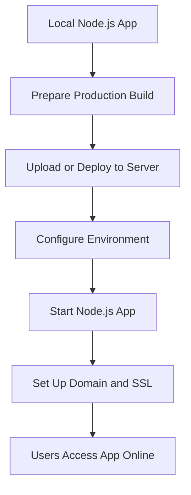

## 23. Node.js Beyond Web Servers

The course also includes a shorter module about using Node.js outside traditional web servers.

Node.js can be used for:

* Build tools
* Automation scripts
* File processing
* Command-line tools
* Local utilities

This reinforces the idea that Node.js is a general JavaScript runtime, not only a web server technology.

## 24. Bonus Modules: TypeScript and Deno

The course includes bonus modules added after the original course release.

These modules cover:

* Node.js with TypeScript
* Deno as an alternative JavaScript runtime

TypeScript adds static typing to JavaScript and is widely used in larger applications.

Deno is a Node.js alternative created by the original creator of Node.js. Node.js remains the major runtime, but Deno is useful to know as an additional modern option.

## Course Module Map

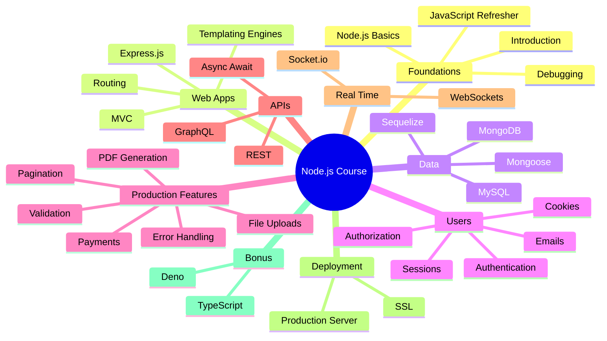

## Why This Lesson Matters

This lesson helps students understand the size and direction of the course.

Instead of seeing each module as separate, students can understand how the topics connect:

* JavaScript prepares the language foundation.
* Node.js basics explain the runtime.
* Express.js makes server development easier.
* Templates and MVC help structure web apps.
* Databases make applications persistent.
* Authentication and validation make apps secure.
* File handling, payments, APIs, and WebSockets add real-world features.
* Deployment makes the application available online.

## Practical Example

Imagine the final online shop project.

The course modules can map to real features like this:

| Course Topic         | Online Shop Feature                        |
| -------------------- | ------------------------------------------ |
| Express.js           | Handle product and cart routes             |
| Templating Engines   | Render product pages                       |
| MVC                  | Organize controllers, models, and views    |
| SQL or NoSQL         | Store products, users, and orders          |
| Sessions and Cookies | Keep users logged in                       |
| Authentication       | Allow signup and login                     |
| Authorization        | Restrict product editing                   |
| Validation           | Check form input                           |
| File Uploads         | Upload product images                      |
| Pagination           | Display products page by page              |
| Payments             | Handle checkout with Stripe                |
| REST API             | Provide data to frontend or mobile clients |
| WebSockets           | Add real-time updates                      |
| Deployment           | Publish the shop online                    |

## Learning Objectives

By the end of this lesson, you should be able to:

* Describe the full course outline.
* Explain why the course starts with JavaScript and Node.js basics.
* Understand why Express.js is introduced after Node.js fundamentals.
* Identify the role of databases, authentication, validation, and error handling.
* Understand the difference between server-rendered apps, REST APIs, and GraphQL APIs.
* Recognize why deployment is an important final step.
* See how bonus topics like TypeScript and Deno fit into the broader Node.js ecosystem.

## Key Points

* The course starts with foundations and gradually moves into advanced topics.
* A JavaScript refresher is included but optional for students who already know JavaScript well.
* Node.js basics are important before using frameworks like Express.js.
* Express.js simplifies server-side development.
* Templating engines allow dynamic HTML generation on the server.
* MVC helps organize application code.
* The course covers both SQL and NoSQL databases.
* Authentication, authorization, validation, and error handling are essential for real applications.
* File uploads, pagination, payments, APIs, and WebSockets are practical production features.
* REST and GraphQL are two different ways to build APIs.
* Deployment teaches how to put a Node.js application online.
* Bonus modules introduce TypeScript and Deno.

## Review Questions

1. Why does the course include a JavaScript refresher?
2. What are the first major Node.js topics covered after the refresher?
3. Why is Express.js introduced in the course?
4. What problem do templating engines solve?
5. What does the MVC pattern help organize?
6. Which SQL database is introduced in the course?
7. What package helps work with SQL databases?
8. Which NoSQL database is used later in the course?
9. What package helps work with MongoDB?
10. Why are sessions and cookies important?
11. What is the difference between authentication and authorization?
12. Why is user input validation important?
13. What types of errors should a Node.js app handle?
14. Why are file uploads and downloads useful in web applications?
15. What problem does pagination solve?
16. Why are payments important in the online shop project?
17. How is a REST API different from a server-rendered app?
18. What does `async/await` help with?
19. What kind of features can WebSockets support?
20. How is GraphQL different from REST?
21. Why is deployment an important part of the course?
22. What are TypeScript and Deno introduced as?

## Summary

This lesson gives an overview of the full Node.js course.

The course starts with a JavaScript refresher and Node.js fundamentals, then moves into Express.js, templating engines, MVC, routing, databases, sessions, authentication, validation, error handling, file handling, pagination, payments, APIs, WebSockets, GraphQL, deployment, and bonus topics like TypeScript and Deno.

The main takeaway is that the course is structured as a complete backend development journey. Each module builds on previous knowledge and prepares students to build real-world Node.js applications from scratch.
