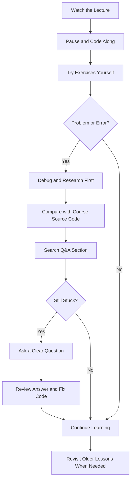
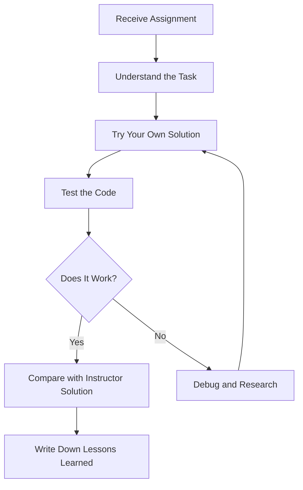
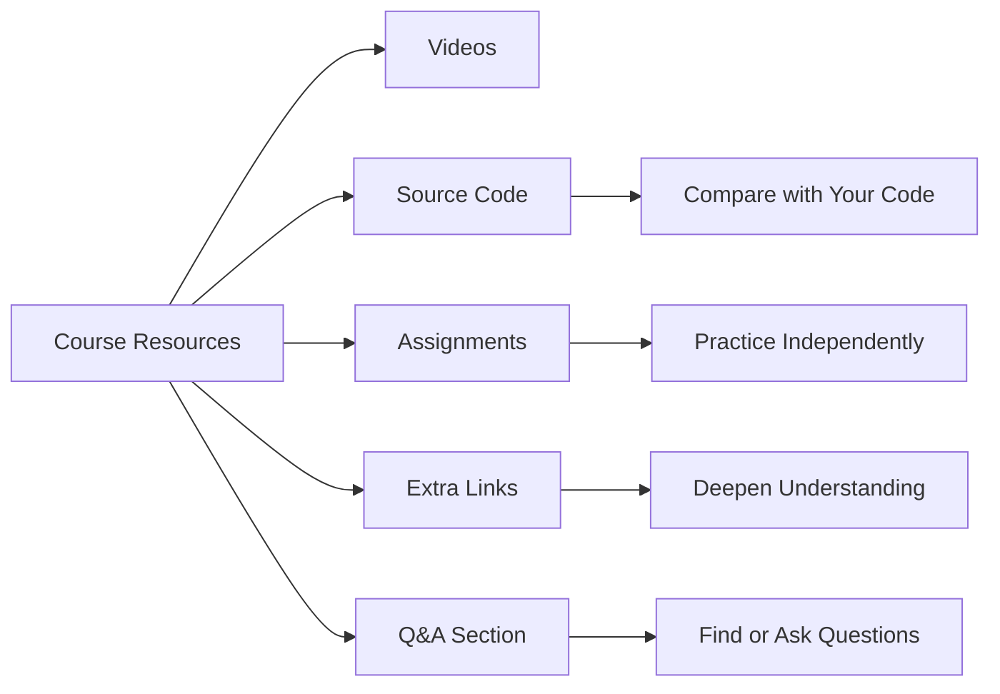
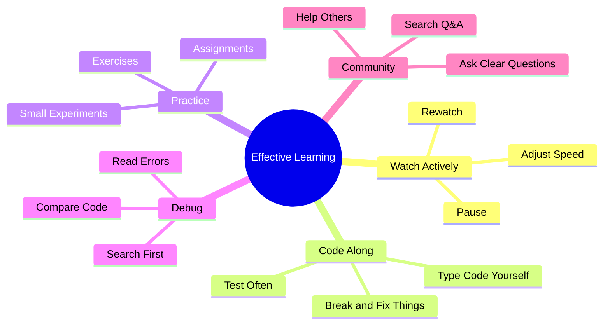

# 007 - How To Get The Most Out Of The Course

## Section

Introduction

## Duration

4 minutes

## Main Idea

This lesson explains how students can learn more effectively from the course.

The course is not meant to be watched passively. To get the best results, students should watch videos at their own pace, code along, complete exercises, use the provided resources, research problems independently, and participate in the course Q&A section.

The main message is simple: active learning produces better results than passive watching.

## Why This Lesson Matters

This course contains a lot of content, projects, assignments, and real coding work. Because of that, students need a good learning strategy.

Instead of only watching the instructor write code, students should practice, experiment, debug, and try to solve problems on their own.

This helps build real developer skills, especially problem-solving and independent learning.

## Learning Objectives

By the end of this lesson, you should be able to:

* Understand how to use the course effectively.
* Adjust the video speed based on your learning pace.
* Revisit previous lectures when needed.
* Code along actively instead of only watching.
* Complete exercises and assignments independently.
* Use course resources such as source code and extra links.
* Search for answers before asking questions.
* Use the Q&A section effectively.
* Help other students to strengthen your own understanding.

## Recommended Learning Workflow



## 1. Watch the Videos at Your Own Speed

This is an on-demand video course, so you do not need to follow the instructor’s pace exactly.

You can:

* Speed up the video if the explanation feels slow.
* Slow down the video if the topic feels difficult.
* Pause whenever you need time to think.
* Rewatch older lectures when a concept becomes unclear.
* Jump back to previous sections for review.

Learning is not always linear. It is normal to revisit earlier concepts while working through later sections.

## 2. Code Along Actively

The course includes real projects, exercises, and assignments.

You will learn much more if you actively write the code yourself instead of only watching the instructor code.

Passive learning may make the material feel familiar, but active coding helps you understand whether you can actually apply it.

## Passive vs Active Learning

| Learning Style       | What You Do                                  | Result                                  |
| -------------------- | -------------------------------------------- | --------------------------------------- |
| Passive watching     | Watch the instructor code                    | You may understand the idea temporarily |
| Active coding        | Write and test the code yourself             | You build real skill                    |
| Independent practice | Solve assignments before seeing the solution | You strengthen problem-solving ability  |
| Debugging            | Find and fix your own mistakes               | You learn how real development works    |

## 3. Try Exercises Before Watching the Solution

When the course gives an assignment or exercise, try solving it yourself first.

Even if your solution is not perfect, the attempt is valuable because it forces you to think like a developer.

Recommended process:

1. Read the task carefully.
2. Try to solve it without watching the solution.
3. Test your code.
4. Debug errors.
5. Compare your result with the instructor’s solution.
6. Note what you missed or did differently.

## Assignment Practice Flow



## 4. Research Problems Before Asking

A major part of becoming a developer is learning how to solve problems independently.

When you encounter an error, do not immediately ask for help. First, try to investigate.

You can:

* Read the error message carefully.
* Check the file and line number mentioned in the error.
* Search online for the error.
* Compare your code with the course source code.
* Review the relevant lecture again.
* Search the course Q&A section.

This does not mean you should never ask questions. It means you should first try to understand the problem yourself.

## Debugging Checklist

When something does not work, check:

* Did you save the file?
* Are you running the correct command?
* Are you in the correct project folder?
* Is the file name correct?
* Is there a typo in a variable, function, or path?
* Did you install the required package?
* Does the terminal show a useful error message?
* Is your code different from the instructor’s source code?
* Has the same question already been answered in the Q&A section?

## 5. Use All Course Resources

The course includes more than just videos.

Useful resources may include:

* Attached source code
* Final code for each module
* Additional links
* Lecture notes
* Assignments
* Q&A discussions
* External documentation references

The source code is especially useful when debugging. If your code does not work, compare it with the instructor’s version and identify the difference.

## Resource Usage Flow



## 6. Use the Q&A Section Effectively

Udemy courses include a Q&A section where students can ask questions.

Before posting a new question, search the Q&A section first. Many common problems may already have been answered.

When asking a question, make it clear and specific.

A good question should include:

* What you tried to do
* What went wrong
* The error message
* The relevant code snippet
* What you already tried
* Which lecture or section the problem belongs to

## Example of a Good Question

```text id="q5j9tp"
I am in Section 3, Lecture 12, and I am trying to run node app.js.

Expected result:
The server should start on port 3000.

Actual result:
I get this error: Cannot find module 'express'.

What I tried:
I checked the file name, restarted the terminal, and ran npm install, but the error still appears.

Could someone help me understand what I missed?
```

## 7. Help Other Students

Helping other students is also a powerful way to learn.

When you answer someone else’s question, you are forced to:

* Understand the problem
* Think through the solution
* Explain the concept clearly
* Check whether your understanding is correct

Even if your answer is not perfect, you can still learn from corrections and discussion.

Teaching is one of the best ways to strengthen your own knowledge.

## Better Learning Mindset



## Practical Example

Suppose you are learning how to create a Node.js server.

A passive approach would be:

```text id="ecl2hb"
Watch the instructor create the server and move to the next video.
```

An active approach would be:

```text id="yd49i7"
Watch the instructor create the server, then pause the video, recreate the server yourself, run it locally, change the response text, break the code intentionally, fix the error, and write down what you learned.
```

The active approach takes more effort, but it creates deeper understanding.

## How This Supports the Course

This lesson supports the broader Introduction section by preparing students for the learning process.

Since the course includes many practical backend topics, students need to develop good habits early:

* Practice regularly
* Debug patiently
* Review older topics
* Use resources
* Ask better questions
* Help others
* Learn independently

These habits are essential for becoming a stronger Node.js developer.

## Key Points

* Watch the course at your own speed.
* Use video controls to speed up, slow down, pause, or rewatch.
* Revisit older lectures when needed.
* Code along actively.
* Complete exercises and assignments yourself.
* Try to solve problems before asking for help.
* Use the attached source code to compare with your own code.
* Read additional links when you want to go deeper.
* Search the Q&A section before posting.
* Ask clear and specific questions.
* Help other students because teaching improves your own understanding.

## Practice

Choose one lecture from this section and apply this learning strategy:

1. Watch the lecture once.
2. Rewatch the most important part.
3. Write a short summary in your own words.
4. Code the example yourself.
5. Change one small part of the code.
6. Run and test it.
7. Write down one problem you encountered.
8. Try to solve the problem before asking for help.

Example note:

```text id="vbp0ax"
Lecture: Installing Node.js and Creating our First App

What I practiced:
I created first-app.js and ran it with node first-app.js.

Problem:
The terminal could not find the file.

How I fixed it:
I realized I was in the wrong folder, so I used cd to navigate into the project folder first.
```

## Review Questions

1. Why should you watch the course videos at your own speed?
2. Why is it useful to revisit older lectures?
3. Why is coding along better than only watching?
4. What should you do before watching an assignment solution?
5. Why should you research problems before asking for help?
6. Which course resources can help you debug your code?
7. Why should you compare your code with the instructor’s source code?
8. What should you do before posting in the Q&A section?
9. What makes a question clear and useful?
10. Why can helping other students improve your own learning?
11. How does active learning help you become a better developer?
12. What habit from this lesson will be most useful during the Node.js course?

## Summary

This lesson explains how to get the most value from the Node.js course.

Students should watch videos at their own pace, pause and rewatch when needed, code along actively, complete exercises, use course resources, research problems independently, and participate in the Q&A section.

The main takeaway is that real learning happens through active practice. Watching videos is useful, but writing code, debugging errors, solving exercises, asking good questions, and helping others will lead to much stronger Node.js skills.
