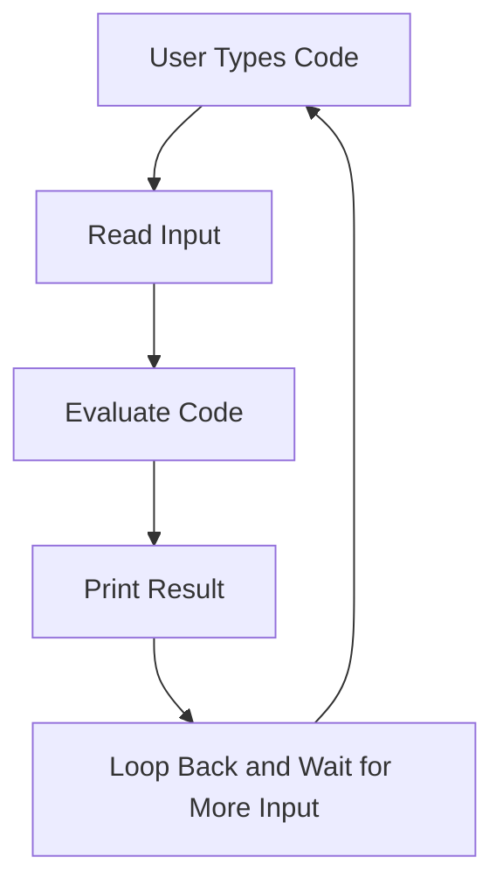
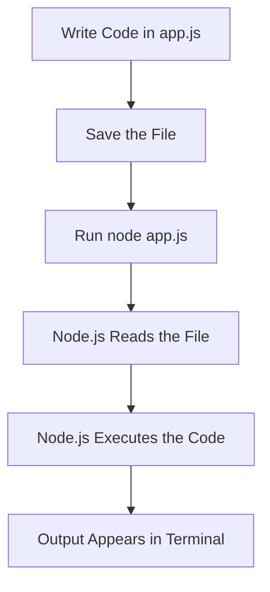
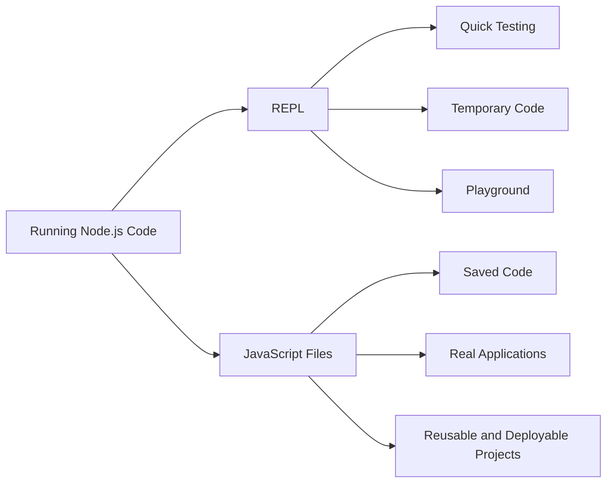

# 008 - Working with the REPL vs Using Files

## Section

Introduction

## Duration

3 minutes

## Main Idea

This lesson explains the two main ways to execute Node.js code:

1. Using the **REPL**
2. Running code from **JavaScript files**

The REPL is useful for quick experiments and testing small pieces of code directly in the terminal. However, real Node.js applications should be written in files because files can be saved, reused, shared, version-controlled, and deployed.

## What is the REPL?

**REPL** stands for:

* **Read**: Read user input
* **Eval**: Evaluate the input
* **Print**: Print the result
* **Loop**: Wait for the next input

You enter the Node.js REPL by typing:

```bash
node
```

After running this command, the terminal changes into an interactive Node.js environment.

You will usually see a prompt like this:

```text
>
```

This means Node.js is waiting for you to type JavaScript code directly.

## REPL Execution Flow



## Example: Using the REPL

Inside the REPL, you can run simple JavaScript commands:

```js
2 + 2
```

Expected output:

```text
4
```

You can also run Node.js code:

```js
console.log('Hello from the REPL');
```

Expected output:

```text
Hello from the REPL
```

You can even import Node.js core modules, such as the `fs` module:

```js
const fs = require('fs');
```

Then you can use it:

```js
fs.writeFileSync('repl-output.txt', 'Created from the Node.js REPL');
```

This works because the REPL runs real Node.js code.

## Important Limitation of the REPL

The REPL does not save your code into a file.

If you exit the REPL, the code you typed is gone unless it created some external output, such as a file.

You can exit the REPL by using:

```text
Ctrl + C twice
```

or:

```text
Ctrl + D
```

or typing:

```text
.exit
```

## Using JavaScript Files

The second way to run Node.js code is to write the code in a `.js` file and execute that file with Node.js.

Example file:

```text
app.js
```

Example code:

```js
console.log('Hello from a Node.js file');
```

Run the file with:

```bash
node app.js
```

Expected output:

```text
Hello from a Node.js file
```

## File Execution Flow



## REPL vs Files

| Feature                   | REPL                     | JavaScript Files  |
| ------------------------- | ------------------------ | ----------------- |
| How code is written       | Directly in terminal     | In `.js` files    |
| Best use case             | Quick experiments        | Real applications |
| Code is saved             | No                       | Yes               |
| Easy to rerun             | Limited                  | Yes               |
| Good for large projects   | No                       | Yes               |
| Can be shared with others | No                       | Yes               |
| Can be deployed           | No                       | Yes               |
| Used in this course       | Occasionally for testing | Main approach     |

## When to Use the REPL

Use the REPL when you want to:

* Test a small JavaScript expression
* Try a Node.js command quickly
* Experiment with a core module
* Check how a method behaves
* Use Node.js like a quick playground

Example:

```js
Math.max(5, 12, 8)
```

Expected output:

```text
12
```

## When to Use Files

Use JavaScript files when you want to:

* Build a real application
* Save your code
* Reuse your code later
* Share your code with other developers
* Organize code into multiple files
* Deploy your application
* Track changes with Git

Example project structure:

```text
node-project/
├── app.js
├── routes/
├── controllers/
├── models/
└── package.json
```

## REPL vs File-Based Development



## Why Files Are Used for Real Applications

Real applications need code that can be saved, organized, tested, shared, and deployed.

The REPL is temporary. It is useful for learning and experimentation, but it is not suitable for building complete applications.

Files allow developers to:

* Pause work and continue later
* Keep code organized
* Use version control
* Collaborate with others
* Deploy the final project to a server

## Practical Example

You might use the REPL to quickly test this:

```js
'node'.toUpperCase()
```

Expected output:

```text
'NODE'
```

But for a real application, you would create a file:

```js
const username = 'node student';

console.log(username.toUpperCase());
```

Then run it:

```bash
node app.js
```

Expected output:

```text
NODE STUDENT
```

## How This Fits Into the Course

This lesson prepares students for the coding workflow used in the rest of the course.

The REPL may appear occasionally as a quick testing tool, but most course projects will use JavaScript files.

That is because real Node.js applications require persistent code that can grow into structured projects.

## Learning Objectives

By the end of this lesson, you should be able to:

* Explain what the Node.js REPL is.
* Understand what REPL stands for.
* Start the REPL from the terminal.
* Run simple JavaScript commands inside the REPL.
* Understand why REPL code is temporary.
* Run JavaScript files with Node.js.
* Explain why files are used for real applications.
* Choose the right execution method for the situation.

## Key Points

* The REPL is an interactive Node.js environment.
* REPL stands for Read, Eval, Print, Loop.
* You enter the REPL by running `node` without a file name.
* The REPL is useful for quick testing and experimentation.
* Code written in the REPL is not saved as an application file.
* Real Node.js applications should be written in `.js` files.
* Files can be saved, reused, shared, organized, and deployed.
* In this course, most Node.js code will be written in files.

## Practice

Create a small practice file called:

```text
app.js
```

Add this code:

```js
const fs = require('fs');

fs.writeFileSync('message.txt', 'This file was created from app.js');

console.log('File created successfully!');
```

Run it:

```bash
node app.js
```

Expected result:

```text
File created successfully!
```

Your folder should now contain:

```text
project-folder/
├── app.js
└── message.txt
```

Now compare this with the REPL:

1. Run `node`.
2. Type a small expression like `2 + 2`.
3. Exit the REPL.
4. Notice that the expression was not saved anywhere.

## Review Questions

1. What does REPL stand for?
2. How do you start the Node.js REPL?
3. What kind of tasks is the REPL useful for?
4. Why is the REPL not suitable for real applications?
5. How do you exit the REPL?
6. How do you run a JavaScript file with Node.js?
7. Why are files better for real projects?
8. What is the difference between temporary code and saved code?
9. When would you use the REPL instead of a file?
10. Why will this course mainly use JavaScript files?

## Summary

This lesson explains the difference between using the Node.js REPL and running JavaScript files.

The REPL is an interactive environment where you can type and execute Node.js code directly in the terminal. It is useful as a playground for quick experiments, but the code is not saved.

JavaScript files are the better choice for real applications because they allow code to be saved, reused, organized, shared, and deployed. For the rest of the course, most Node.js code will be written in files and executed with the `node filename.js` command.
