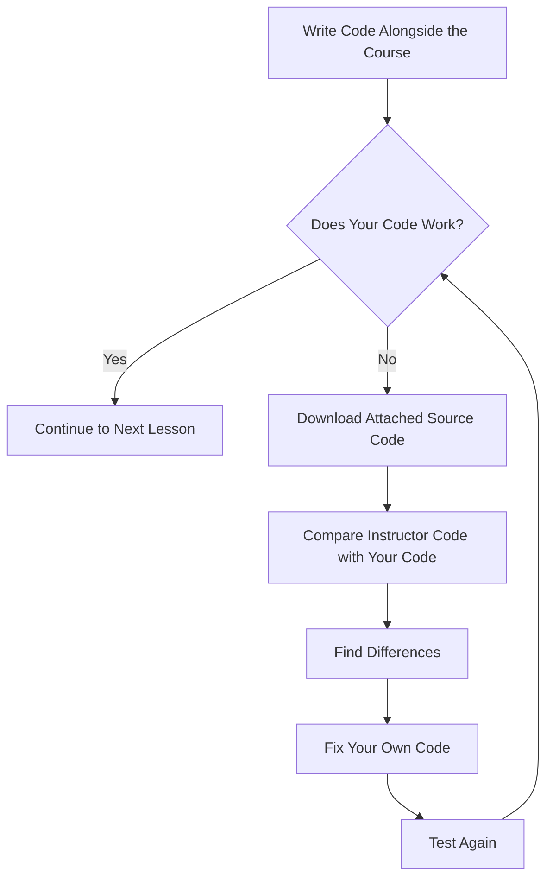
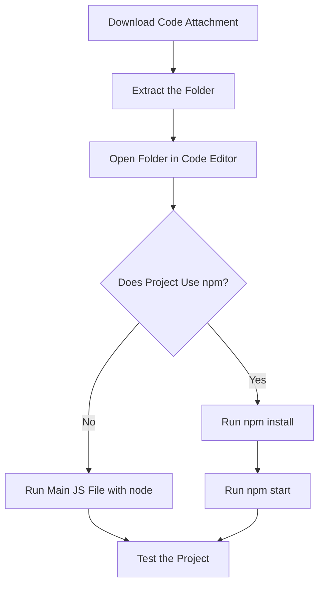

# 009 - Using the Attached Source Code

## Section

Introduction

## Duration

1 minute

## Main Idea

This lesson explains how to use the attached source code provided throughout the course.

Because the course contains a lot of coding, the instructor provides multiple code snapshots for each module. These snapshots help students compare their own code with the instructor’s code, find mistakes, fix bugs, and understand how the project should look at different stages.

The attached source code is not meant to replace learning. It is a support tool for debugging, reviewing, and recovering when your own code stops working.

## Why Source Code Is Provided

As you follow the course, you may accidentally make small mistakes such as:

* Typing a wrong file name
* Missing a semicolon or bracket
* Importing the wrong module
* Writing code in the wrong file
* Skipping a required command
* Having a different project structure

The attached source code lets you compare your version with the instructor’s version and identify what changed.

## Source Code Usage Flow



## Where to Find the Code

Throughout the course, different lectures include code snapshots.

The last lecture of each module contains all code snapshots for that module, ordered chronologically.

This means you can find the source code for different stages of the project, not only the final version.

## How to Use the Attached Code

You can use the attached code in two main ways:

1. **Compare the code**

   * Open the instructor’s code.
   * Open your own code.
   * Compare the files side by side.
   * Look for differences in file names, imports, functions, routes, and commands.

2. **Temporarily replace parts of your code**

   * Copy a small part of the instructor’s code.
   * Replace the matching part in your own project.
   * Test again.
   * Use this to narrow down where the problem is.

## Before Using npm

Before the course starts using `npm`, you can run the main JavaScript file directly with Node.js.

Example:

```bash id="4v4zgp"
node app.js
```

or:

```bash id="ufpw1e"
node first-app.js
```

At this stage, you usually do not need to install dependencies. You can simply run the main `.js` file or inspect the code manually.

## After Using npm

After the course starts using `npm`, projects usually include a `package.json` file and external dependencies.

In that case, after extracting the attached source code, run:

```bash id="8a7lrp"
npm install
```

This installs the required dependencies listed in `package.json`.

Then run:

```bash id="i3n9oz"
npm start
```

This starts the project using the configured start script.

## npm-Based Source Code Flow



## Key Difference

| Stage      | How to Run the Code             |
| ---------- | ------------------------------- |
| Before npm | `node main-file.js`             |
| After npm  | `npm install`, then `npm start` |

## Common Debugging Strategy

When your code does not work, follow this process:

1. Read the error message carefully.
2. Check the lecture and section you are in.
3. Download the matching source code snapshot.
4. Compare the relevant files.
5. Look for small differences.
6. Fix your own code.
7. Run the project again.

## What to Compare First

When comparing your code with the attached source code, inspect:

* File names
* Folder structure
* Import paths
* Function names
* Route paths
* Middleware order
* `package.json` scripts
* Installed dependencies
* Missing or extra code blocks
* Terminal commands used to run the project

## Practical Example

Imagine your server does not start and you see this error:

```text id="goivbu"
Cannot find module 'express'
```

A good debugging process would be:

1. Check whether the project uses `npm`.
2. Look for a `package.json` file.
3. Run:

```bash id="2ya8v8"
npm install
```

4. Then run:

```bash id="rqbthd"
npm start
```

If the problem continues, compare your project with the attached source code.

## Why This Lesson Matters

This lesson helps students avoid getting stuck for too long when coding along.

The attached source code gives you a reliable reference point. Instead of guessing what went wrong, you can compare your project with the instructor’s project and find the difference.

This is especially useful in a long Node.js course where each module builds on previous code.

## Learning Objectives

By the end of this lesson, you should be able to:

* Understand why attached source code is provided.
* Use code snapshots to compare your code with the instructor’s code.
* Know where to find module code snapshots.
* Run simple Node.js files before `npm` is introduced.
* Run `npm install` and `npm start` after `npm` is introduced.
* Use attached code to debug and recover from coding mistakes.

## Key Points

* The course provides multiple code snapshots per module.
* The final lecture of each module contains all snapshots for that module.
* Attached source code helps you compare and debug your own code.
* Before using `npm`, run the main JavaScript file with `node`.
* After using `npm`, run `npm install` before running `npm start`.
* Source code should be used as a learning and debugging tool, not as a shortcut to skip practice.
* Comparing code carefully helps you become better at finding mistakes.

## Practice

Choose one attached source code snapshot from a module and use it for comparison practice.

Steps:

1. Open your own project folder.
2. Open the instructor’s source code snapshot.
3. Compare the main files.
4. Find at least three differences.
5. Decide whether each difference matters.
6. Run your own project again after fixing any issue.

Example note:

```text id="ukyhc5"
Problem:
My app did not start.

What I checked:
I compared my package.json with the attached source code.

What I found:
My start script was missing.

Fix:
I added the correct start script and ran npm start again.
```

## Review Questions

1. Why does the course provide attached source code?
2. Where can you find all code snapshots for a module?
3. How can source code snapshots help you debug?
4. Should you replace your whole project immediately when something breaks?
5. How do you run code before `npm` is introduced?
6. What command should you run first after extracting an npm-based project?
7. What does `npm install` do?
8. What does `npm start` usually do?
9. Which files should you compare first when debugging?
10. Why is comparing code better than copying blindly?

## Summary

This lesson explains how to use the attached source code throughout the course.

The instructor provides multiple code snapshots so students can compare their own code with the official version, find mistakes, and fix problems. Before `npm` is introduced, students can usually run the main JavaScript file directly with `node`. After `npm` is introduced, students should run `npm install` first and then use `npm start`.

The main takeaway is that attached source code is a debugging and learning resource. It helps you understand what changed, recover from errors, and continue learning without getting stuck.
