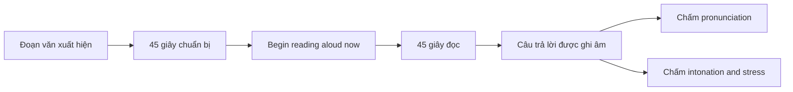
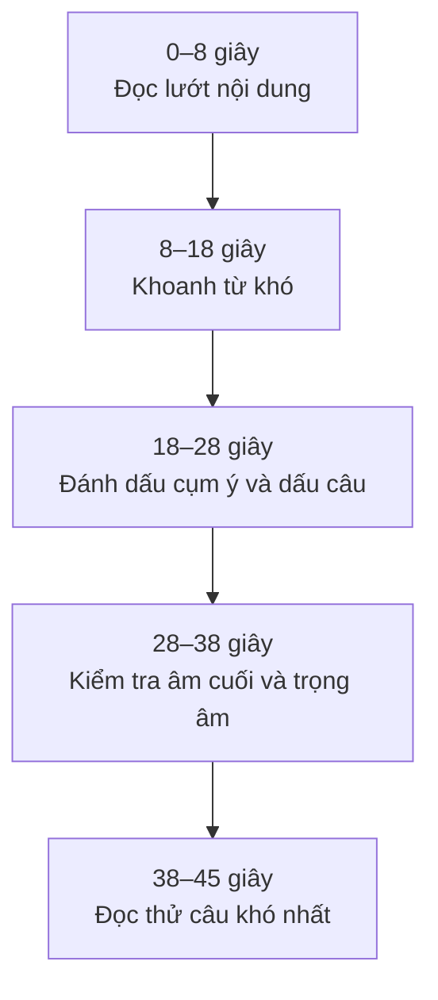
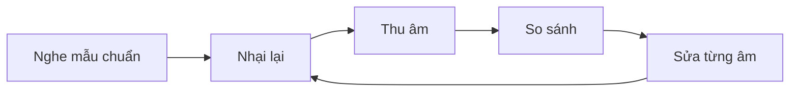
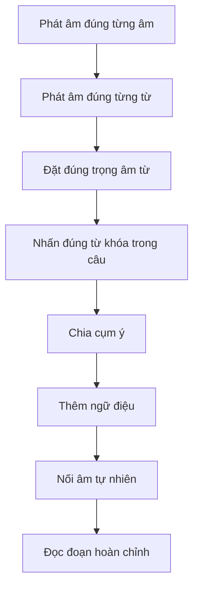

# 001 — Introduction

| Thuộc tính            | Nội dung                                                          |
| --------------------- | ----------------------------------------------------------------- |
| **Phần**              | Phần I — TOEIC Speaking                                           |
| **Module**            | Module 01 — Questions 1–2: Read a Text Aloud                      |
| **Bài học**           | Introduction                                                      |
| **Mã bài gốc**        | Video 01                                                          |
| **Chủ đề chính**      | Giới thiệu dạng bài đọc to đoạn văn                               |
| **Kỹ năng trọng tâm** | Pronunciation, word stress, sentence stress, pauses và intonation |

> **Lưu ý thuật ngữ:** Tên chính xác của dạng bài là **Read a Text Aloud**, nghĩa là đọc to một đoạn văn. Không viết là *Read a Text Allow*.

## Mục lục

1. [Mục tiêu bài học](#1-mục-tiêu-bài-học)
2. [Nội dung chính](#2-nội-dung-chính)
3. [Chiến lược làm bài và kỹ thuật đọc](#3-chiến-lược-làm-bài-và-kỹ-thuật-đọc)
4. [Bài tập thực hành](#4-bài-tập-thực-hành)
5. [Lưu ý và lỗi thường gặp](#5-lưu-ý-và-lỗi-thường-gặp)
6. [Tóm tắt](#6-tóm-tắt)

---

## 1. Mục tiêu bài học

Sau bài học này, người học có thể:

* Hiểu cấu trúc và quy trình làm **Questions 1–2: Read a Text Aloud**.
* Biết cách tận dụng **45 giây chuẩn bị** và **45 giây đọc**.
* Hiểu hai tiêu chí chấm điểm:

  * **Pronunciation**
  * **Intonation and Stress**
* Nhận biết các yếu tố cần đánh dấu trong đoạn văn:

  * Từ khó và danh từ riêng.
  * Trọng âm từ.
  * Từ mang nội dung chính.
  * Âm cuối.
  * Vị trí ngắt nghỉ.
  * Ngữ điệu lên và xuống.
  * Nối âm.
* Biết cách tự thu âm, nghe lại và đánh giá phần đọc.
* Hoàn thành các bài đọc mô phỏng cấu trúc TOEIC Speaking.

---

## 2. Nội dung chính

### 2.1. Cấu trúc Questions 1–2

TOEIC Speaking hiện gồm **11 câu hỏi**, kéo dài khoảng **20 phút**. Questions 1–2 thuộc dạng **Read a Text Aloud**. Hai câu này được đánh giá theo **pronunciation** và **intonation and stress**. ([ETS][1])

Quy trình của mỗi câu như sau:



| Nội dung                   |                Quy định |
| -------------------------- | ----------------------: |
| Số câu                     |                   2 câu |
| Dạng bài                   |       Read a Text Aloud |
| Thời gian chuẩn bị mỗi câu |                 45 giây |
| Thời gian đọc mỗi câu      |                 45 giây |
| Cách trả lời               | Đọc trực tiếp vào micro |
| Tiêu chí 1                 |           Pronunciation |
| Tiêu chí 2                 |   Intonation and Stress |

Trong phòng thi, phần hướng dẫn và đoạn văn xuất hiện trên màn hình. Hệ thống đọc phần hướng dẫn; thí sinh chỉ cần đọc **đoạn văn cần trả lời** sau khi nghe tín hiệu **“Begin reading aloud now.”** ([ETS][2])

Nội dung bài giảng gốc cũng nhấn mạnh rằng thí sinh không nên đọc quá nhanh hoặc quá chậm; cần đọc với tốc độ vừa phải, to, rõ ràng và chính xác. Bài học tập trung vào phát âm, trọng âm, ngữ điệu, ngắt nghỉ và nối âm. 

---

### 2.2. Hai tiêu chí chấm điểm

Mỗi câu Read a Text Aloud nhận **hai điểm thành phần riêng biệt**, mỗi tiêu chí được chấm từ **0 đến 3**. ([ETS][2])

#### A. Pronunciation — Phát âm

|  Điểm | Mô tả dễ hiểu                                                                                   |
| ----: | ----------------------------------------------------------------------------------------------- |
| **3** | Phần đọc rất dễ hiểu; có thể vẫn xuất hiện một vài lỗi nhỏ hoặc ảnh hưởng nhẹ từ tiếng mẹ đẻ.   |
| **2** | Nhìn chung dễ hiểu nhưng có một số lỗi phát âm hoặc ảnh hưởng từ tiếng mẹ đẻ.                   |
| **1** | Chỉ dễ hiểu ở một số thời điểm; lỗi phát âm làm ảnh hưởng đáng kể đến việc truyền tải đoạn văn. |
| **0** | Không trả lời, không sử dụng tiếng Anh hoặc câu trả lời hoàn toàn không liên quan.              |

Điểm 3 không yêu cầu thí sinh phải có giọng giống người bản ngữ. Điều quan trọng nhất là người nghe có thể hiểu rõ nội dung, dù phần đọc vẫn có thể chứa một vài lỗi nhỏ. ([ETS][2])

#### B. Intonation and Stress — Ngữ điệu và trọng âm

|  Điểm | Mô tả dễ hiểu                                                                               |
| ----: | ------------------------------------------------------------------------------------------- |
| **3** | Nhấn từ, ngắt nghỉ và sử dụng cao độ lên xuống phù hợp với đoạn văn.                        |
| **2** | Nhìn chung phù hợp nhưng vẫn có một số vị trí nhấn hoặc ngắt chưa tự nhiên.                 |
| **1** | Trọng âm, khoảng dừng và ngữ điệu không phù hợp, làm phần đọc thiếu tự nhiên hoặc khó hiểu. |
| **0** | Không trả lời, không sử dụng tiếng Anh hoặc câu trả lời hoàn toàn không liên quan.          |

Trong tiêu chí này, **intonation and stress** bao gồm cách sử dụng:

* **Emphases:** sự nhấn mạnh.
* **Pauses:** khoảng dừng.
* **Rising pitch:** cao độ đi lên.
* **Falling pitch:** cao độ đi xuống. ([ETS][2])

---

### 2.3. Nội dung đoạn văn thường gặp

Các đoạn Read a Text Aloud thường được đặt trong bối cảnh đời sống hoặc công việc quen thuộc. Bài thi không yêu cầu kiến thức kinh doanh chuyên sâu. ([ETS][2])

Những dạng văn bản phổ biến gồm:

| Dạng văn bản    | Ví dụ chủ đề                                 |
| --------------- | -------------------------------------------- |
| Quảng cáo       | Khách sạn, cửa hàng, nhà hàng, sản phẩm      |
| Thông báo       | Lịch bảo trì, thay đổi giờ làm, sự kiện      |
| Lời chào        | Chào đón nhân viên hoặc khách hàng           |
| Hướng dẫn       | Quy định an toàn, cách sử dụng dịch vụ       |
| Bản tin         | Giao thông, thời tiết, lịch trình            |
| Giới thiệu      | Doanh nghiệp, địa điểm du lịch, chương trình |
| Tin nhắn ghi âm | Thời gian làm việc, thông tin liên hệ        |

Bộ đề mẫu chính thức của ETS sử dụng một đoạn quảng bá địa điểm lưu trú, thể hiện rõ phong cách văn bản thực tế, ngắn gọn và liên quan đến hoạt động hằng ngày. ([ETS][3])

---

## 3. Chiến lược làm bài và kỹ thuật đọc

### 3.1. Quy trình chuẩn bị trong 45 giây

Không nên cố gắng đọc đi đọc lại toàn bộ đoạn văn nhiều lần. Hãy chia 45 giây thành các nhiệm vụ cụ thể:



#### Giai đoạn 1: 0–8 giây — Hiểu văn cảnh

Xác định nhanh:

* Ai đang nói?
* Đoạn văn là quảng cáo, thông báo hay lời chào?
* Giọng đọc nên thân thiện, nghiêm túc hay hào hứng?
* Câu cuối mang mục đích thông báo hay kêu gọi hành động?

Ví dụ:

```text
Good morning, and welcome to Berwick Industries.
```

Đây là lời chào đón nhân viên, vì vậy giọng đọc nên:

* Tích cực.
* Thân thiện.
* Rõ ràng.
* Không quá nhanh hoặc lạnh lùng.

---

#### Giai đoạn 2: 8–18 giây — Tìm từ khó

Ưu tiên kiểm tra:

1. **Danh từ riêng**

```text
Berwick Industries
Lakewood Convention Center
Alexander Avenue
The Harrison Museum
```

Không nên dừng quá lâu vì một danh từ riêng. Hãy đọc chậm, chia âm tiết và giữ sự tự tin.

2. **Số và thời gian**

```text
8:30 A.M.
September 15
Room 204
$27.50
555-7364
```

3. **Từ dài**

```text
representative
announcement
cooperation
maintenance
registration
approximately
```

4. **Động từ bất quy tắc hoặc từ dễ đọc sai**

```text
read
written
scheduled
provided
received
required
```

---

### 3.2. Phát âm chính xác

#### A. Học âm thay vì chỉ nhìn mặt chữ

Một từ được tạo thành từ các âm riêng lẻ. Ví dụ:

```text
sun → /s/ + /ʌ/ + /n/
sheep → /ʃ/ + /iː/ + /p/
teacher → /t/ + /iː/ + /tʃ/ + /ər/
```

Tiếng Anh có hệ thống âm được biểu diễn bằng **IPA — International Phonetic Alphabet**. Tuy nhiên, người mới học có thể áp dụng phương pháp ngắn hơn:



Quy trình luyện một từ:

1. Nghe từ trong từ điển.
2. Không nhìn phiên âm trong lần đầu.
3. Nhại lại đúng âm thanh đã nghe.
4. Thu âm bằng điện thoại.
5. Nghe mẫu và bản thu luân phiên.
6. Sửa một lỗi mỗi lần.
7. Đặt từ đó vào câu hoàn chỉnh.

---

#### B. Không nuốt âm cuối

Âm cuối giúp người nghe phân biệt từ và nhận biết cấu trúc ngữ pháp.

| Từ        | Âm cần chú ý             |
| --------- | ------------------------ |
| business  | Âm cuối `/s/`            |
| choice    | Âm cuối `/s/`            |
| work      | Âm cuối `/k/`            |
| lights    | Cụm âm cuối `/ts/`       |
| finished  | Cụm âm cuối              |
| documents | Cụm âm cuối số nhiều     |
| asked     | Âm cuối của dạng quá khứ |

Ví dụ:

```text
Please make sure the lights are turned off before you leave.
```

Các từ dễ bị nuốt âm:

```text
make
sure
lights
turned
off
before
leave
```

> Không cần bật âm cuối quá mạnh. Chỉ cần tạo đủ âm để người nghe nhận ra từ.

---

#### C. Cách đọc đuôi `-s` và `-es`

| Cách đọc | Trường hợp thường gặp           | Ví dụ             |
| -------- | ------------------------------- | ----------------- |
| `/s/`    | Sau âm vô thanh                 | works, stops      |
| `/z/`    | Sau nguyên âm hoặc âm hữu thanh | rooms, provides   |
| `/ɪz/`   | Sau âm xuýt                     | services, offices |

Ví dụ luyện đọc:

```text
The company provides services to several local businesses.
```

---

#### D. Cách đọc đuôi `-ed`

| Cách đọc | Trường hợp                | Ví dụ             |
| -------- | ------------------------- | ----------------- |
| `/t/`    | Sau phần lớn âm vô thanh  | worked, finished  |
| `/d/`    | Sau phần lớn âm hữu thanh | cleaned, serviced |
| `/ɪd/`   | Sau `/t/` hoặc `/d/`      | wanted, needed    |

Ví dụ:

```text
The air-conditioning system will be serviced this weekend.
```

---

### 3.3. Trọng âm từ — Word Stress

Trong một từ có nhiều âm tiết, một âm tiết thường được nhấn mạnh hơn.

```text
DOCument
MANager
anNOUNCEMENT
deLAY
aMAzing
TECHnical
PROfessor
disCUSsion
aVOID
rePORT
ANswer
```

Khi luyện từ, có thể viết âm tiết được nhấn bằng chữ in hoa:

```text
coOPERation
repreSENtative
regisTRAtion
opporTUnity
mainTEnance
```

#### Một số xu hướng cơ bản

* Danh từ hai âm tiết thường nhấn âm đầu:

```text
MANager
OFfice
DOCtor
```

* Động từ hai âm tiết thường nhấn âm sau:

```text
deLAY
rePORT
aVOID
```

* Các hậu tố như `-ment`, `-ness` hoặc `-ship` thường không nhận trọng âm chính:

```text
anNOUNCE → anNOUNCEMENT
SCHOLar → SCHOLarship
HAPpy → HAPpiness
```

> Đây là xu hướng hỗ trợ phán đoán, không phải quy tắc đúng với mọi từ. Khi có thời gian học ở nhà, hãy kiểm tra từ điển.

---

### 3.4. Trọng âm câu — Sentence Stress

Không nên nhấn tất cả các từ với lực giống nhau.

#### Content words — từ mang nội dung

Thường cần được nhấn:

* Danh từ.
* Động từ chính.
* Tính từ.
* Trạng từ.
* Số liệu.
* Từ phủ định.

#### Function words — từ chức năng

Thường đọc nhẹ hơn:

* Mạo từ: `a`, `an`, `the`.
* Giới từ ngắn: `at`, `of`, `to`, `for`.
* Đại từ.
* Trợ động từ.
* Liên từ ngắn.

Ví dụ:

```text
The INCREASE in TRAFFIC was CAUSED by an AUTOMOBILE ACCIDENT.
```

Những từ được nhấn truyền tải nội dung chính:

```text
INCREASE — TRAFFIC — CAUSED — AUTOMOBILE — ACCIDENT
```

Cách đọc không hiệu quả:

```text
THE INCREASE IN TRAFFIC WAS CAUSED BY AN AUTOMOBILE ACCIDENT.
```

Đọc tất cả các từ mạnh như nhau sẽ khiến câu:

* Cứng.
* Đều đều.
* Thiếu trọng tâm.
* Khó nghe hơn.

---

### 3.5. Chia cụm ý và ngắt nghỉ

Ký hiệu luyện đọc:

| Ký hiệu     | Ý nghĩa                        |
| ----------- | ------------------------------ |
| `/`         | Nghỉ ngắn                      |
| `//`        | Nghỉ dài hơn hoặc kết thúc câu |
| **Chữ đậm** | Từ cần nhấn                    |
| `↗`         | Lên giọng                      |
| `↘`         | Xuống giọng                    |
| `‿`         | Nối âm                         |

Ví dụ:

```text
During the weekend, / the air-conditioning system will be serviced. //
```

Khoảng nghỉ tham khảo:

* Dấu phẩy: khoảng **¼–½ giây**.
* Dấu chấm: khoảng **½–1 giây**.

Không ngắt giữa các cụm gắn chặt với nhau:

```text
the new manager
at the front desk
our customer service team
a cup of coffee
to complete the form
```

Sai:

```text
Please contact / our / customer service / representative.
```

Tự nhiên hơn:

```text
Please contact our customer service representative. //
```

---

### 3.6. Ngữ điệu — Intonation

#### A. Falling intonation — Xuống giọng `↘`

Dùng ở:

* Câu trần thuật.
* Câu mệnh lệnh.
* Câu hỏi có từ để hỏi.
* Cuối một đoạn thông báo.

```text
The manager is absent today. ↘
```

```text
Please send me that package. ↘
```

```text
What are you waiting for? ↘
```

---

#### B. Rising intonation — Lên giọng `↗`

Dùng phổ biến ở:

* Câu hỏi Yes/No.
* Câu hỏi đuôi khi người nói chưa chắc chắn.

```text
Did you attend the meeting yesterday? ↗
```

```text
She is an intern, isn't she? ↗
```

---

#### C. Ngữ điệu liệt kê

Các mục ở giữa thường lên nhẹ; mục cuối đi xuống:

```text
She asked me to bring her a cup of coffee, ↗
some documents, ↗
and a chair. ↘
```

---

#### D. Câu lựa chọn

```text
Is she coming today ↗ or tomorrow? ↘
```

---

#### E. Câu điều kiện

Vế điều kiện thường lên nhẹ; vế chính thường xuống:

```text
If you have any questions, ↗
feel free to contact me. ↘
```

Không cần cố tình nâng hoặc hạ giọng quá mạnh. Mục tiêu là làm rõ cấu trúc thông tin, không phải “diễn” quá mức.

---

### 3.7. Nối âm — Linking

#### A. Phụ âm cuối gặp nguyên âm đầu

```text
look‿at
turn‿off
an‿office
work‿on
take‿a
```

Ví dụ:

```text
Don't look‿at me like that.
```

```text
Please turn‿off all personal devices.
```

---

#### B. Hai phụ âm giống nhau gặp nhau

Không cần phát âm hai lần tách biệt:

```text
red dress
business services
big group
```

`red dress` nên được đọc liền, nhưng vẫn giữ đủ độ dài để người nghe nhận ra cả hai từ.

---

#### C. Hai phụ âm có vị trí phát âm gần nhau

```text
need to
used to
want to
```

Không nên ép nối quá mạnh khi chưa phát âm chính xác từng từ. Ưu tiên theo thứ tự:

```text
Đúng âm → rõ từ → đúng nhịp → nối tự nhiên
```

---

### 3.8. Công thức đọc một đoạn hoàn chỉnh



Không nên bắt đầu bằng việc cố đọc nhanh toàn bộ đoạn. Hãy luyện theo thứ tự:

1. Từ.
2. Cụm từ.
3. Câu.
4. Hai câu liền nhau.
5. Toàn bộ đoạn.
6. Toàn bộ đoạn trong giới hạn 45 giây.

---

## 4. Bài tập thực hành

> Các đoạn dưới đây được **tự biên soạn theo cấu trúc và chủ đề tương tự TOEIC Speaking**, không phải câu hỏi chính thức của ETS.

### 4.1. Hướng dẫn chung

```text
Directions: In this part of the test, you will read aloud the text on the screen.
You will have 45 seconds to prepare.
Then you will have 45 seconds to read the text aloud.
```

---

## Practice Test 1

### Question 1 — Office Announcement

```text
Attention, all employees. The maintenance department will inspect the air-conditioning system this Saturday. During the inspection, the main office will be closed from nine in the morning until two in the afternoon. Employees who need to enter the building should contact their department manager in advance. Please remove all personal items from your desk before leaving on Friday. We appreciate your patience and cooperation while this important work is being completed.
```

#### Từ cần chú ý

```text
attention
employees
maintenance
air-conditioning
inspection
department
in advance
cooperation
completed
```

#### Bản đánh dấu luyện đọc

```text
**Attention**, all **employees**. //

The **maintenance department** / will inspect the **air-conditioning system** /
this **Saturday**. //

During the inspection, / the main office will be **closed** /
from **nine in the morning** / until **two in the afternoon**. //

Employees who need to enter the building /
should contact their **department manager** / in advance. //

Please remove all **personal items** / from your desk /
before leaving on **Friday**. //

We appreciate your **patience** and **cooperation** /
while this important work is being completed. ↘
```

---

### Question 2 — Restaurant Promotion

```text
Looking for a convenient place to enjoy lunch with your coworkers? Visit the Green Garden Café on Madison Street. Our weekday lunch menu includes fresh salads, homemade soup, grilled sandwiches, and a selection of desserts. Customers who order before eleven thirty will receive a free cup of coffee or tea. The café also provides private rooms for business meetings and group celebrations. Call today to make a reservation for your next event.
```

#### Từ cần chú ý

```text
convenient
coworkers
Madison Street
weekday
homemade
grilled
selection
private
reservation
```

#### Ngữ điệu đáng chú ý

```text
fresh salads, ↗
homemade soup, ↗
grilled sandwiches, ↗
and a selection of desserts. ↘
```

```text
Call today to make a reservation for your next event. ↘
```

---

## Practice Test 2

### Question 1 — Welcome Message

```text
Good morning, and welcome to Brighton Technologies. We are pleased to have you join our customer support team. Your orientation program will begin in Conference Room B at ten o'clock. During the program, you will meet your supervisors, review company policies, and receive information about employee benefits. Please bring your identification card and the forms that were sent to you by email. We hope you have a successful first day with us.
```

#### Từ cần chú ý

```text
Brighton Technologies
customer support
orientation
Conference Room B
supervisors
policies
employee benefits
identification
successful
```

---

### Question 2 — Museum Information

```text
The Harrison Museum invites you to explore its new exhibition on the history of transportation. The exhibition features early bicycles, classic automobiles, and photographs of the city's first railway station. Guided tours are available every weekday at eleven and three. Visitors may purchase tickets online or at the information desk near the main entrance. Children under twelve can enter free of charge when accompanied by an adult. We look forward to welcoming you soon.
```

#### Cụm liệt kê

```text
early bicycles, ↗
classic automobiles, ↗
and photographs of the city's first railway station. ↘
```

#### Từ cần chú ý

```text
Harrison Museum
exhibition
transportation
bicycles
automobiles
railway
available
purchase
accompanied
```

---

## Practice Test 3

### Question 1 — Transportation Update

```text
Passengers traveling on the North Valley train line should be aware of a schedule change this weekend. Because of construction near Central Station, trains will operate every thirty minutes instead of every fifteen minutes. Passengers are advised to allow additional travel time and check the updated schedule before leaving home. Free shuttle buses will also run between Central Station and Riverside Park. We apologize for the inconvenience and thank you for your understanding.
```

#### Từ cần chú ý

```text
passengers
North Valley
schedule
construction
Central Station
operate
additional
updated
shuttle
Riverside Park
inconvenience
```

---

### Question 2 — Community Event

```text
Join us this Sunday for the annual Riverdale Community Festival. The event will take place in Westwood Park from ten in the morning until six in the evening. Activities will include live music, games for children, local food, and an outdoor art market. Admission is free, but visitors are encouraged to bring a canned food item for the community donation program. In case of heavy rain, the festival will be moved to the Riverdale Sports Center.
```

#### Câu điều kiện

```text
In case of heavy rain, ↗
the festival will be moved to the Riverdale Sports Center. ↘
```

#### Từ cần chú ý

```text
annual
Riverdale
Community Festival
Westwood Park
activities
admission
encouraged
canned
donation
Sports Center
```

---

## Practice Test 4 — Bài luyện bổ sung

### Question 1 — Hotel Notice

```text
Welcome to the Sunrise Harbor Hotel. Breakfast is served in the Ocean View Restaurant from six thirty until ten every morning. Guests who are leaving before breakfast hours may request a takeaway meal at the front desk. The fitness center and indoor swimming pool are located on the third floor and remain open until eleven at night. For assistance with transportation, restaurant reservations, or local tours, please speak with our guest services team.
```

### Question 2 — Store Advertisement

```text
This week, Parker Office Supply is offering special discounts on selected desks, chairs, and filing cabinets. Customers who spend more than two hundred dollars will receive free delivery within the city. Our experienced staff can also help you select furniture for a home office or a large workplace. Visit our showroom on King Street from Monday through Saturday, or browse our complete product catalog online. The sale ends this Sunday, so shop early for the best selection.
```

---

### 4.2. Bài tập nhận diện phát âm

Chọn từ có phần được nhấn mạnh phát âm khác với hai từ còn lại.

#### Question 1

```text
A. file
B. skip
C. mind
```

**Đáp án:** B

* `file`: nguyên âm đôi `/aɪ/`
* `mind`: nguyên âm đôi `/aɪ/`
* `skip`: nguyên âm ngắn `/ɪ/`

---

#### Question 2

```text
A. floor
B. food
C. spoon
```

**Đáp án:** A

* `food`, `spoon`: `/uː/`
* `floor`: nguyên âm khác

---

#### Question 3

```text
A. chair
B. choice
C. school
```

**Đáp án:** C

* `chair`, `choice`: bắt đầu bằng `/tʃ/`
* `school`: không có âm `/tʃ/`

---

#### Question 4

```text
A. filled
B. fined
C. asked
```

**Đáp án:** C

* `filled`, `fined`: `-ed` được đọc `/d/`
* `asked`: `-ed` được đọc `/t/`

---

#### Question 5

```text
A. wake
B. well
C. late
```

**Đáp án:** B

* `wake`, `late`: có nguyên âm đôi `/eɪ/`
* `well`: có nguyên âm `/e/`

---

### 4.3. Bài tập trọng âm

Chọn từ có trọng âm khác với hai từ còn lại.

#### Question 1

```text
A. document
B. manager
C. announcement
```

**Đáp án:** C

```text
DOCument
MANager
anNOUNCEMENT
```

---

#### Question 2

```text
A. delay
B. meeting
C. traffic
```

**Đáp án:** A

```text
deLAY
MEETing
TRAFfic
```

---

#### Question 3

```text
A. amazing
B. technical
C. colorful
```

**Đáp án:** A

```text
aMAzing
TECHnical
COLorful
```

---

#### Question 4

```text
A. understand
B. interview
C. recommend
```

**Đáp án:** B

```text
underSTAND
INterview
recomMEND
```

---

#### Question 5

```text
A. avoid
B. report
C. answer
```

**Đáp án:** C

```text
aVOID
rePORT
ANswer
```

---

#### Question 6

```text
A. professor
B. scholarship
C. discussion
```

**Đáp án:** B

```text
proFESsor
SCHOLarship
disCUSsion
```

---

### 4.4. Bài tập xác định ngữ điệu

Đánh dấu `↗` hoặc `↘`.

#### Câu 1

```text
If you need to speak to a representative, /
please stay on the line.
```

**Gợi ý:**

```text
If you need to speak to a representative, ↗
please stay on the line. ↘
```

---

#### Câu 2

```text
Please stay seated at all times during the show.
```

**Gợi ý:**

```text
Please stay seated at all times during the show. ↘
```

---

#### Câu 3

```text
Starry Hotel offers breakfast, lunch, and dinner every weekend.
```

**Gợi ý:**

```text
Starry Hotel offers breakfast, ↗
lunch, ↗
and dinner every weekend. ↘
```

---

#### Câu 4

```text
For a pair of good shoes at a fair price, visit our store today.
```

**Gợi ý:**

```text
For a pair of good shoes at a fair price, ↗
visit our store today. ↘
```

---

#### Câu 5

```text
If you are looking for a car, we have the perfect vehicle for you.
```

**Gợi ý:**

```text
If you are looking for a car, ↗
we have the perfect vehicle for you. ↘
```

---

#### Câu 6

```text
Please make sure you have collected all your belongings.
```

**Gợi ý:**

```text
Please make sure you have collected all your belongings. ↘
```

---

#### Câu 7

```text
What are you waiting for? Try our new menu today.
```

**Gợi ý:**

```text
What are you waiting for? ↘
Try our new menu today. ↘
```

---

#### Câu 8

```text
Have you visited any of the amazing sights of Vietnam?
```

**Gợi ý:**

```text
Have you visited any of the amazing sights of Vietnam? ↗
```

---

### 4.5. Bài luyện đọc câu

Đọc từng câu ba lần:

* Lần 1: chậm và chính xác.
* Lần 2: thêm trọng âm và ngắt nghỉ.
* Lần 3: đọc ở tốc độ thi thật.

#### Sentence 1

```text
All personal items will be removed from the floor when you finish work.
```

Bản đánh dấu:

```text
All **personal items** / will be **removed** from the floor /
when you **finish work**. ↘
```

---

#### Sentence 2

```text
During the weekend, the air-conditioning system will be serviced.
```

Bản đánh dấu:

```text
During the **weekend**, /
the **air-conditioning system** / will be **serviced**. ↘
```

---

#### Sentence 3

```text
Please make sure the lights are turned off before you leave.
```

Bản đánh dấu:

```text
Please make sure / the **lights** are turned‿off /
before you **leave**. ↘
```

---

#### Sentence 4

```text
Thank you for your cooperation.
```

Bản đánh dấu:

```text
Thank you / for your **cooperation**. ↘
```

---

### 4.6. Bảng tự chấm sau khi thu âm

| Tiêu chí                                   |  0  |  1  |  2  |  3  |
| ------------------------------------------ | :-: | :-: | :-: | :-: |
| Người nghe có hiểu rõ từng từ không?       |  ☐  |  ☐  |  ☐  |  ☐  |
| Có đọc đúng từ khó và danh từ riêng không? |  ☐  |  ☐  |  ☐  |  ☐  |
| Có giữ đủ âm cuối không?                   |  ☐  |  ☐  |  ☐  |  ☐  |
| Trọng âm từ có chính xác không?            |  ☐  |  ☐  |  ☐  |  ☐  |
| Có nhấn các content words không?           |  ☐  |  ☐  |  ☐  |  ☐  |
| Có ngắt theo cụm ý không?                  |  ☐  |  ☐  |  ☐  |  ☐  |
| Ngữ điệu có phù hợp với văn cảnh không?    |  ☐  |  ☐  |  ☐  |  ☐  |
| Có hoàn thành trong 45 giây không?         |  ☐  |  ☐  |  ☐  |  ☐  |

#### Cách tự đánh giá gần với tiêu chí thi

```text
Pronunciation:        ___ / 3
Intonation and Stress: ___ / 3
```

Sau mỗi lần thu âm, chỉ chọn **hai lỗi quan trọng nhất** để sửa. Không nên cố sửa đồng thời mọi lỗi.

---

## 5. Lưu ý và lỗi thường gặp

### 5.1. Đọc quá nhanh

#### Biểu hiện

* Nuốt âm cuối.
* Dính các từ không đúng vị trí.
* Đọc sai từ dài.
* Không dừng ở dấu câu.
* Câu nghe gấp gáp và khó hiểu.

#### Cách sửa

* Ưu tiên rõ ràng hơn tốc độ.
* Dừng đúng ở dấu phẩy và dấu chấm.
* Giảm tốc độ ở danh từ riêng và số liệu.
* Không tăng tốc chỉ vì đồng hồ đang chạy.

---

### 5.2. Đọc quá chậm

#### Biểu hiện

* Không hoàn thành đoạn trong 45 giây.
* Dừng giữa các từ thuộc cùng một cụm.
* Mỗi từ được đọc như một đơn vị riêng biệt.
* Nhịp câu bị đứt đoạn.

Sai:

```text
The / customer / service / department / will / contact / you.
```

Tự nhiên hơn:

```text
The customer service department / will contact you. //
```

---

### 5.3. Dành toàn bộ thời gian chuẩn bị cho từ đầu tiên

Khi gặp một danh từ riêng khó, nhiều người dừng lại quá lâu và không xem phần còn lại.

Cách xử lý:

1. Chia từ thành các phần có thể đọc được.
2. Chọn một cách phát âm hợp lý.
3. Đánh dấu từ đó.
4. Tiếp tục kiểm tra cả đoạn.
5. Khi đọc thật, giữ tốc độ ổn định và không xin lỗi.

---

### 5.4. Cố tạo giọng bản ngữ

Mục tiêu không phải là bắt chước hoàn toàn giọng Mỹ hoặc Anh. Tiêu chí chính thức tập trung vào khả năng **dễ hiểu**, cách nhấn, khoảng dừng và cao độ phù hợp; ngay cả mức điểm cao vẫn có thể chấp nhận một vài lỗi nhỏ hoặc ảnh hưởng từ ngôn ngữ khác. ([ETS][2])

Ưu tiên:

```text
Clarity > Accent imitation
```

---

### 5.5. Nhấn mọi từ như nhau

Sai:

```text
THE COMPANY WILL OPEN A NEW OFFICE NEXT MONTH.
```

Tự nhiên hơn:

```text
The **COMPANY** will **OPEN** a new **OFFICE** next **MONTH**.
```

---

### 5.6. Dừng sai vị trí

Không dừng giữa:

* Mạo từ và danh từ.
* Tính từ và danh từ.
* Đại từ sở hữu và danh từ.
* Giới từ và cụm danh từ ngắn.
* Động từ nguyên mẫu có `to`.
* Cụm động từ.
* Tên riêng.

Sai:

```text
Please contact the / customer service representative.
```

Đúng:

```text
Please contact / the customer service representative.
```

---

### 5.7. Bỏ âm số nhiều hoặc quá khứ

Những từ dễ mất âm cuối:

```text
guest → guests
room → rooms
service → services
work → worked
schedule → scheduled
provide → provided
```

Bỏ âm cuối có thể khiến người nghe hiểu sai số lượng hoặc thời của câu.

---

### 5.8. Lên giọng ở cuối mọi câu

Việc lên giọng ở cuối mọi câu làm thông báo nghe thiếu chắc chắn.

Ví dụ câu trần thuật:

```text
The office will close at five. ↘
```

Không nên đọc:

```text
The office will close at five? ↗
```

---

### 5.9. Nối âm trước khi phát âm đúng

Nối âm không phải là đọc lướt hoặc nuốt chữ.

Thứ tự luyện đúng:

```text
Phát âm từng từ chính xác
        ↓
Đọc đúng cụm từ
        ↓
Giữ nhịp câu
        ↓
Nối âm tự nhiên
```

---

### 5.10. Không thu âm khi luyện tập

Khi đang nói, người học thường không nhận ra:

* Mình đọc nhanh đến mức nào.
* Âm cuối có thực sự phát ra hay không.
* Khoảng dừng có quá dài không.
* Giọng có đều đều không.
* Từ nào người nghe không thể nhận biết.

Quy trình luyện hiệu quả:

```text
Nghe mẫu → đọc → thu âm → nghe lại → ghi lỗi → đọc lại
```

---

## 6. Tóm tắt

### Kiến thức quan trọng

* Questions 1–2 yêu cầu đọc to hai đoạn văn.
* Mỗi câu có:

  * **45 giây chuẩn bị**.
  * **45 giây đọc**.
* Mỗi câu được chấm riêng theo:

  * **Pronunciation: 0–3**
  * **Intonation and Stress: 0–3**
* Không cần có giọng giống người bản ngữ.
* Phần đọc cần:

  * Dễ hiểu.
  * Đúng phát âm.
  * Không nuốt âm cuối.
  * Đúng trọng âm từ.
  * Nhấn các content words.
  * Ngắt theo cụm ý.
  * Có ngữ điệu phù hợp.
  * Hoàn thành trong thời gian cho phép.

### Công thức 45 giây chuẩn bị

```text
Đọc lướt văn cảnh
        ↓
Khoanh từ khó và danh từ riêng
        ↓
Đánh dấu dấu câu và cụm ý
        ↓
Kiểm tra trọng âm và âm cuối
        ↓
Đọc thử câu khó nhất
```

### Công thức luyện tập tại nhà

```text
Từ → Cụm từ → Câu → Đoạn văn → Thu âm → Tự chấm → Sửa lỗi
```

### Checklist trước khi bắt đầu đọc

* [ ] Tôi đã xác định loại văn bản.
* [ ] Tôi đã nhìn thấy các danh từ riêng.
* [ ] Tôi đã kiểm tra số, ngày và giờ.
* [ ] Tôi đã đánh dấu các từ dài.
* [ ] Tôi biết vị trí cần ngắt.
* [ ] Tôi biết những từ cần nhấn.
* [ ] Tôi nhớ bật các âm cuối.
* [ ] Tôi sẽ đọc rõ ràng thay vì đọc thật nhanh.
* [ ] Tôi sẽ tiếp tục đọc bình tĩnh nếu mắc một lỗi nhỏ.
* [ ] Tôi sẽ hạ giọng tự nhiên ở cuối đoạn.

[1]: https://www.eu.ets.org/toeic/about/speaking-writing.html "TOEIC Speaking and Writing Tests"
[2]: https://www.ets.org/content/dam/ets-org/pdfs/toeic/toeic-speaking-writing-examinee-handbook.pdf "TOEIC Examinee Handbook Speaking and Writing Tests "
[3]: https://www.ets.org/content/dam/ets-org/pdfs/toeic/toeic-speaking-writing-sample-tests.pdf "TOEIC® Speaking and Writing Sample Tests"
