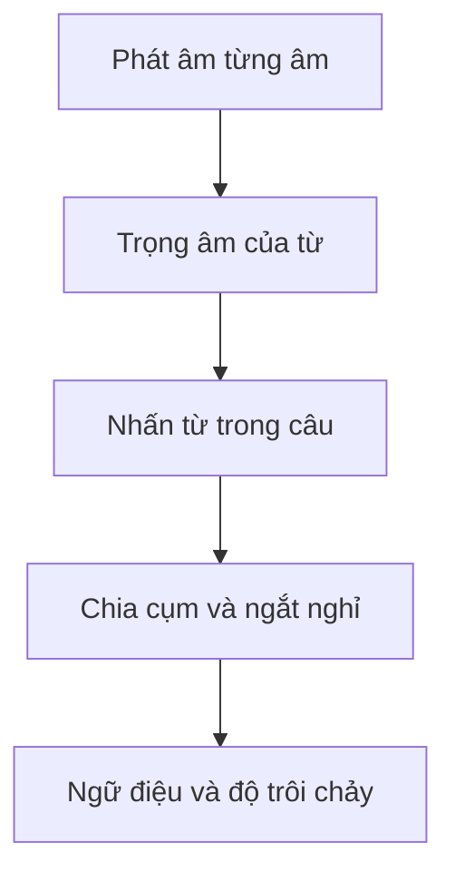
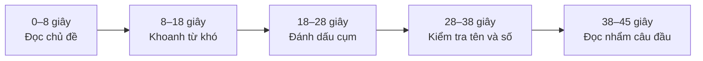

# 003 — Read a Text Aloud (2)


*Ảnh minh họa một biển quảng cáo “Clearance Sale”, phù hợp với chủ đề luyện đọc quảng cáo bán hàng trong bài.* ([Evan Evans][1])

| Thuộc tính       | Nội dung                                                                |
| ---------------- | ----------------------------------------------------------------------- |
| **Phần**         | Phần I — TOEIC Speaking                                                 |
| **Module**       | Module 01 — Questions 1–2: Read a Text Aloud                            |
| **Bài học**      | Read a Text Aloud (2)                                                   |
| **Mã bài gốc**   | Video 03                                                                |
| **Chủ đề chính** | Luyện đọc to đoạn văn — phần 2                                          |
| **Trọng tâm**    | Phát âm, trọng âm, ngắt nghỉ, nối âm và ngữ điệu                        |
| **Dạng văn bản** | Quảng cáo, thông báo công cộng, hướng dẫn tham quan, giới thiệu sự kiện |

> [!NOTE]
> Nội dung dưới đây được biên tập từ transcript của Video 03. Bản chép tự động có một số lỗi nhận dạng âm thanh, đặc biệt ở tên riêng; các câu và từ chắc chắn theo ngữ cảnh đã được chuẩn hóa.
>
> Trong TOEIC Speaking, Questions 1–2 yêu cầu thí sinh đọc to văn bản trên màn hình. Mỗi câu có **45 giây chuẩn bị** và **45 giây đọc**, được đánh giá riêng về **pronunciation** và **intonation and stress**. 

---

## Mục lục

1. [Mục tiêu bài học](#1-mục-tiêu-bài-học)
2. [Nội dung chính](#2-nội-dung-chính)
3. [Chiến lược làm bài và mẫu câu](#3-chiến-lược-làm-bài-và-mẫu-câu)
4. [Bài tập thực hành](#4-bài-tập-thực-hành)
5. [Lưu ý và lỗi thường gặp](#5-lưu-ý-và-lỗi-thường-gặp)
6. [Tóm tắt](#6-tóm-tắt)

---

# 1. Mục tiêu bài học

Sau khi hoàn thành bài học, người học có thể:

* Hiểu chính xác yêu cầu và tiêu chí chấm điểm của Questions 1–2.
* Sử dụng hiệu quả 45 giây chuẩn bị trước khi thu âm.
* Phát âm rõ nguyên âm, phụ âm và các âm cuối quan trọng.
* Xác định đúng trọng âm của từ nhiều âm tiết.
* Nhấn đúng từ mang nội dung trong câu.
* Chia một câu dài thành các cụm ý tự nhiên.
* Nối âm mà không làm mất âm cuối.
* Sử dụng ngữ điệu lên, xuống phù hợp với câu hỏi, thông báo và lời hướng dẫn.
* Đọc rõ tên riêng, địa chỉ, thời gian, số điện thoại và phần trăm.
* Luyện tập theo trình tự **từ → câu → đoạn văn**.

Hai câu đầu được xem là phần dễ tiếp cận nhất của TOEIC Speaking, nhưng người mới học vẫn có thể mất điểm vì phát âm sai, bỏ âm cuối hoặc đọc đều đều. Transcript nhấn mạnh rằng mục tiêu là đọc **to, rõ ràng và chính xác**, chứ không chỉ đọc hết văn bản. 

---

# 2. Nội dung chính

## 2.1. Cấu trúc Questions 1–2

| Nội dung                     | Quy định                                     |
| ---------------------------- | -------------------------------------------- |
| **Số câu**                   | 2 câu                                        |
| **Nhiệm vụ**                 | Đọc to đoạn văn xuất hiện trên màn hình      |
| **Thời gian chuẩn bị**       | 45 giây cho mỗi đoạn                         |
| **Thời gian đọc**            | 45 giây cho mỗi đoạn                         |
| **Tiêu chí 1**               | Pronunciation — phát âm                      |
| **Tiêu chí 2**               | Intonation and Stress — ngữ điệu và trọng âm |
| **Thang điểm từng tiêu chí** | 0–3                                          |

ETS quy định mỗi bài đọc nhận hai điểm riêng: một điểm cho **pronunciation**, một điểm cho **intonation and stress**. Điểm 3 không đòi hỏi giọng hoàn toàn giống người bản ngữ; bài đọc vẫn có thể có một vài lỗi nhỏ miễn là rõ và dễ hiểu. ([ETS][2])

### Bảng diễn giải điểm

|  Điểm | Pronunciation                                                                 | Intonation and Stress                                                     |
| ----: | ----------------------------------------------------------------------------- | ------------------------------------------------------------------------- |
| **3** | Phát âm rất dễ hiểu; có thể có vài lỗi nhỏ hoặc ảnh hưởng nhẹ từ tiếng mẹ đẻ. | Nhấn từ, ngắt nghỉ và cao độ lên xuống phù hợp với văn bản.               |
| **2** | Nhìn chung dễ hiểu nhưng còn một số lỗi phát âm.                              | Nhìn chung phù hợp nhưng đôi lúc nhấn hoặc lên xuống giọng chưa tự nhiên. |
| **1** | Chỉ dễ hiểu ở một số chỗ; lỗi phát âm cản trở đáng kể việc nghe hiểu.         | Cách nhấn, ngắt và sử dụng cao độ phần lớn chưa phù hợp.                  |
| **0** | Không trả lời, không sử dụng tiếng Anh hoặc trả lời không liên quan.          | Không trả lời, không sử dụng tiếng Anh hoặc trả lời không liên quan.      |

---

## 2.2. Năm tầng kỹ năng cần xây dựng



### Tầng 1 — Phát âm từng âm

Người đọc cần phát âm đủ:

* Nguyên âm ngắn và dài.
* Phụ âm đầu.
* Phụ âm cuối.
* Các cụm phụ âm như `/kt/`, `/ndʒd/`, `/sts/`.
* Đuôi số nhiều và động từ quá khứ.

### Tầng 2 — Trọng âm của từ

Các từ nhiều âm tiết phải có một âm tiết nổi bật hơn:

| Từ             | Cách chia âm tiết | Trọng âm           |
| -------------- | ----------------- | ------------------ |
| seasonal       | sea–son–al        | **SEA**sonal       |
| advantage      | ad–van–tage       | ad**VAN**tage      |
| amazing        | a–ma–zing         | a**MA**zing        |
| opportunity    | op–por–tu–ni–ty   | oppor**TU**nity    |
| regular        | reg–u–lar         | **REG**ular        |
| appreciate     | ap–pre–ci–ate     | ap**PRE**ciate     |
| competition    | com–pe–ti–tion    | compe**TI**tion    |
| transportation | trans–por–ta–tion | transpor**TA**tion |

### Tầng 3 — Nhấn từ trong câu

Thông thường, các từ mang nội dung được nhấn:

* Danh từ.
* Động từ chính.
* Tính từ.
* Trạng từ.
* Số liệu.
* Từ phủ định.

Các từ chức năng thường nhẹ hơn:

* Mạo từ: *a, an, the*.
* Giới từ ngắn: *of, at, to*.
* Trợ động từ.
* Đại từ không mang ý đối lập.

Ví dụ:

> Our seasonal **CLEARANCE SALE** will **START** next **FRIDAY**.

> All of our **PRODUCTS** are **MARKED DOWN** by **TEN PERCENT**.

### Tầng 4 — Chia cụm và ngắt nghỉ

Không nên đọc từng từ rời rạc. Hãy nhóm những từ cùng tạo thành một ý:

> After some tough bargaining, / we finally agreed on a deal. //

> If you need more information, / visit our information desk. //

Transcript hướng dẫn người học bắt đầu từ đơn vị nhỏ rồi mới mở rộng: luyện **từng từ**, sau đó **từng câu**, cuối cùng mới đọc **cả đoạn văn**. 

### Tầng 5 — Ngữ điệu

| Loại câu                           | Ngữ điệu thường dùng   |
| ---------------------------------- | ---------------------- |
| Câu trần thuật                     | Xuống giọng `↘`        |
| Câu mệnh lệnh                      | Xuống giọng rõ `↘`     |
| Câu hỏi Yes/No                     | Thường lên giọng `↗`   |
| Câu hỏi Wh-                        | Thường xuống giọng `↘` |
| Danh sách chưa kết thúc            | Nhẹ lên hoặc giữ giọng |
| Mục cuối của danh sách             | Xuống giọng            |
| Câu cảm ơn hoặc kết thúc thông báo | Xuống giọng nhẹ        |

Ví dụ trong bài:

> May I have your attention, please? `↗`

> Traffic was heavy this morning because of the national holiday. `↘`

> Thank you. `↘`

Bài học phân biệt rõ câu hỏi thường sử dụng ngữ điệu lên, trong khi câu trần thuật thường kết thúc bằng ngữ điệu xuống. 

---

## 2.3. Các hiện tượng phát âm trọng tâm

### A. Âm cuối

| Từ           | Phiên âm           | Điểm cần chú ý                                   |
| ------------ | ------------------ | ------------------------------------------------ |
| feed         | `/fiːd/`           | Không bỏ `/d/`.                                  |
| path         | `/pæθ/`            | Đưa đầu lưỡi nhẹ giữa hai hàm răng để tạo `/θ/`. |
| products     | `/ˈprɑːdʌkts/`     | Giữ cụm cuối `/kts/`.                            |
| changed      | `/tʃeɪndʒd/`       | Không đọc thành “change”.                        |
| services     | `/ˈsɜːrvɪsɪz/`     | Đuôi `-es` đọc `/ɪz/`.                           |
| performances | `/pərˈfɔːrmənsɪz/` | Không bỏ âm tiết cuối.                           |
| district     | `/ˈdɪstrɪkt/`      | Giữ `/kt/` ở cuối.                               |

Transcript đặc biệt nhấn mạnh việc đọc rõ âm cuối của *feed*, *path*, các từ có đuôi `-ed` và danh từ số nhiều. Đọc hơi chậm nhưng đủ âm sẽ tốt hơn đọc nhanh rồi nuốt âm.  

### B. Cách đọc `-ed`

| Âm cuối của động từ gốc | `-ed` được đọc | Ví dụ              |
| ----------------------- | -------------- | ------------------ |
| `/t/` hoặc `/d/`        | `/ɪd/`         | supported, located |
| Âm vô thanh khác `/t/`  | `/t/`          | marked             |
| Âm hữu thanh khác `/d/` | `/d/`          | changed, pleased   |

* **marked** → `/mɑːrkt/`
* **supported** → `/səˈpɔːrtɪd/`
* **located** → `/ˈloʊkeɪtɪd/`
* **changed** → `/tʃeɪndʒd/`
* **pleased** → `/pliːzd/`

### C. Cách đọc `-s` và `-es`

| Âm cuối của từ gốc          | Đuôi số nhiều | Ví dụ             |
| --------------------------- | ------------- | ----------------- |
| Âm vô thanh                 | `/s/`         | cups, paths       |
| Âm hữu thanh hoặc nguyên âm | `/z/`         | deals, trains     |
| `/s, z, ʃ, ʒ, tʃ, dʒ/`      | `/ɪz/`        | services, changes |

### D. Nối âm

Khi một từ kết thúc bằng phụ âm và từ sau bắt đầu bằng nguyên âm, hai từ có thể nối nhẹ:

* all‿of
* take‿advantage
* located‿on
* because‿of
* stay‿on
* show‿your
* lack‿of

> Nối âm không có nghĩa là bỏ âm. Hãy phát âm âm cuối rồi chuyển ngay sang nguyên âm tiếp theo.

### E. Danh sách

Với các danh sách, mỗi mục đầu thường giữ hoặc hơi lên giọng; mục cuối xuống giọng:

> glasses `↗`, coffee cups `↗`, and tea sets `↘`

> kids `↗`, teenagers `↗`, and adults `↘`

> city leaders `↗`, urban planners `↗`, and ordinary citizens `↘`

---

## 2.4. Từ mới có ảnh minh họa

> Các ảnh trong bảng dưới đây sử dụng biểu tượng SVG để có thể hiển thị trực tiếp trong Markdown.

### Nhóm 1 — Quảng cáo và thông báo bán hàng

Danh sách này được giới thiệu ở phần đầu bài học và được vận dụng trong các câu về giảm giá, thương hiệu, địa điểm và quầy thông tin. 

| Ảnh                                                                                            | Từ mới                | Phiên âm và nghĩa                               |
| ---------------------------------------------------------------------------------------------- | --------------------- | ----------------------------------------------- |
|               | **seasonal**          | `/ˈsiːzənəl/` — theo mùa                        |
|                  | **clearance**         | `/ˈklɪrəns/` — sự thanh lý                      |
|       | **mark down**         | `/mɑːrk daʊn/` — giảm giá                       |
|                  | **brand name**        | `/ˈbrænd neɪm/` — tên thương hiệu               |
|        | **take advantage of** | `/teɪk ədˈvæntɪdʒ əv/` — tận dụng               |
|                    | **amazing**           | `/əˈmeɪzɪŋ/` — tuyệt vời                        |
|                  | **deal**              | `/diːl/` — thỏa thuận; ưu đãi                   |
|              | **located**           | `/ˈloʊkeɪtɪd/` — tọa lạc                        |
|          | **boulevard**         | `/ˈbʊləvɑːrd/` — đại lộ                         |
|              | **attention**         | `/əˈtenʃən/` — sự chú ý                         |
|  | **national holiday**  | `/ˈnæʃənəl ˈhɑːlədeɪ/` — ngày nghỉ lễ toàn quốc |
|            | **service**           | `/ˈsɜːrvɪs/` — dịch vụ                          |
|                  | **regular**           | `/ˈreɡjələr/` — thông thường; định kỳ           |
|                     | **resume**            | `/rɪˈzuːm/` — tiếp tục, hoạt động trở lại       |
|    | **information desk**  | `/ˌɪnfərˈmeɪʃən desk/` — quầy thông tin         |

### Nhóm 2 — Thiên nhiên và môi trường sống


*Ảnh minh họa một con đường tham quan trong rừng nhiệt đới.* ([Singapore Tickets][3])

Các từ này được sử dụng trong phần luyện đọc về khu bảo tồn động vật và các quy tắc dành cho khách tham quan. 

| Ảnh                                                                                | Từ mới         | Phiên âm và nghĩa                  |
| ---------------------------------------------------------------------------------- | -------------- | ---------------------------------- |
|        | **wildlife**   | `/ˈwaɪldlaɪf/` — động vật hoang dã |
|        | **habitat**    | `/ˈhæbɪtæt/` — môi trường sống     |
|            | **tour**       | `/tʊr/` — chuyến tham quan         |
|   | **rainforest** | `/ˈreɪnfɔːrɪst/` — rừng nhiệt đới  |
|  | **woodland**   | `/ˈwʊdlənd/` — vùng đất có rừng    |
|       | **wetland**    | `/ˈwetlənd/` — vùng đất ngập nước  |
|           | **feed**       | `/fiːd/` — cho ăn                  |
|     | **animal**     | `/ˈænɪməl/` — động vật             |
|     | **dangerous**  | `/ˈdeɪndʒərəs/` — nguy hiểm        |
|           | **path**       | `/pæθ/` — đường mòn                |
|  | **disturb**    | `/dɪˈstɜːrb/` — làm phiền          |
|    | **appreciate** | `/əˈpriːʃieɪt/` — đánh giá cao     |

### Nhóm 3 — Sự kiện cộng đồng và cuộc thi


*Ảnh minh họa một cuộc thi khiêu vũ dành cho cộng đồng và thanh thiếu niên.* ([Community Event Funding][4])

Nhóm từ này xuất hiện trong đoạn giới thiệu một cuộc thi khiêu vũ trên toàn thành phố. 

| Ảnh                                                                                         | Từ mới               | Phiên âm và nghĩa                                 |
| ------------------------------------------------------------------------------------------- | -------------------- | ------------------------------------------------- |
|      | **community**        | `/kəˈmjuːnəti/` — cộng đồng                       |
|               | **event**            | `/ɪˈvent/` — sự kiện                              |
|                | **update**           | `/ˈʌpdeɪt/` — thông tin cập nhật                  |
|               | **academy**          | `/əˈkædəmi/` — học viện                           |
|           | **host**             | `/hoʊst/` — tổ chức; đăng cai                     |
|                | **citywide**         | `/ˈsɪtiwaɪd/` — trên toàn thành phố               |
|           | **competition**      | `/ˌkɑːmpəˈtɪʃən/` — cuộc thi                      |
|         | **age**              | `/eɪdʒ/` — tuổi                                   |
|               | **category**         | `/ˈkætəɡɔːri/` — hạng mục                         |
|                | **adult**            | `/əˈdʌlt/` — người trưởng thành                   |
|  | **solo performance** | `/ˈsoʊloʊ pərˈfɔːrməns/` — tiết mục biểu diễn đơn |
|             | **venue**            | `/ˈvenjuː/` — địa điểm tổ chức                    |
|           | **support**          | `/səˈpɔːrt/` — sự ủng hộ                          |
|                  | **talent**           | `/ˈtælənt/` — tài năng                            |

### Nhóm 4 — Giao thông, thảo luận và trung tâm thể thao

Các từ này nằm ở phần luyện tập cuối bài, liên quan đến giao thông công cộng và thông báo khai trương một chi nhánh phòng tập. 

| Ảnh                                                                                               | Từ mới                 | Phiên âm và nghĩa                               |
| ------------------------------------------------------------------------------------------------- | ---------------------- | ----------------------------------------------- |
|                      | **transit**            | `/ˈtrænzɪt/` — hệ thống vận chuyển công cộng    |
|             | **panel discussion**   | `/ˈpænəl dɪˈskʌʃən/` — cuộc thảo luận chuyên đề |
|                 | **transportation**     | `/ˌtrænspərˈteɪʃən/` — giao thông; vận tải      |
|                      | **topic**              | `/ˈtɑːpɪk/` — chủ đề                            |
|                  | **lack**               | `/læk/` — sự thiếu hụt                          |
|                 | **issue**              | `/ˈɪʃuː/` — vấn đề                              |
|                  | **join**               | `/dʒɔɪn/` — tham gia                            |
|                 | **leader**             | `/ˈliːdər/` — lãnh đạo                          |
|                 | **urban planner**      | `/ˈɜːrbən ˈplænər/` — nhà quy hoạch đô thị      |
|           | **ordinary citizen**   | `/ˈɔːrdəneri ˈsɪtɪzən/` — người dân bình thường |
|                   | **fitness**            | `/ˈfɪtnəs/` — thể dục; thể trạng                |
|             | **pleased**            | `/pliːzd/` — vui mừng, hân hạnh                 |
|                  | **announce**           | `/əˈnaʊns/` — thông báo                         |
|               | **branch**             | `/bræntʃ/` — chi nhánh                          |
|  | **business district**  | `/ˈbɪznəs ˈdɪstrɪkt/` — khu thương mại          |
|                    | **facility**           | `/fəˈsɪləti/` — cơ sở vật chất                  |
|                       | **feature**            | `/ˈfiːtʃər/` — có, cung cấp; đặc trưng          |
|                    | **equipment**          | `/ɪˈkwɪpmənt/` — thiết bị                       |
|                       | **court**              | `/kɔːrt/` — sân thể thao                        |
|    | **membership**         | `/ˈmembərʃɪp/` — tư cách hoặc gói thành viên    |
|             | **golden opportunity** | `/ˈɡoʊldən ˌɑːpərˈtuːnəti/` — cơ hội quý giá    |
|                | **improve**            | `/ɪmˈpruːv/` — cải thiện                        |

---

# 3. Chiến lược làm bài và mẫu câu

## 3.1. Quy trình sử dụng 45 giây chuẩn bị



|      Thời gian | Việc cần làm                                                            |
| -------------: | ----------------------------------------------------------------------- |
|   **0–8 giây** | Xác định đây là quảng cáo, thông báo, hướng dẫn hay giới thiệu sự kiện. |
|  **8–18 giây** | Tìm từ dài, từ lạ và động từ có đuôi `-ed`.                             |
| **18–28 giây** | Đánh dấu `/` ở dấu phẩy và ranh giới cụm ý.                             |
| **28–38 giây** | Kiểm tra tên riêng, địa chỉ, phần trăm, giờ và số điện thoại.           |
| **38–45 giây** | Đọc nhẩm câu đầu và xác định câu nào cần lên giọng.                     |

Transcript đặc biệt khuyên người học tận dụng thời gian chuẩn bị để lướt nhanh toàn đoạn, phát hiện từ khó, tên riêng và số liệu trước khi bắt đầu thu âm. 

---

## 3.2. Bộ ký hiệu đánh dấu bài đọc

| Ký hiệu     | Ý nghĩa            |
| ----------- | ------------------ |
| `/`         | Nghỉ rất ngắn      |
| `//`        | Kết thúc câu       |
| `↗`         | Lên giọng          |
| `↘`         | Xuống giọng        |
| **CHỮ ĐẬM** | Từ cần nhấn        |
| `‿`         | Nối âm             |
| `(t)`       | Âm cuối cần bật rõ |

Ví dụ:

> May I have your **ATTENTION**, please? `↗` //

> Because‿of the **NATIONAL HOLIDAY** today, / our station’s hours‿of **SERVICE** have been **CHANGED**. `↘` //

---

## 3.3. Công thức luyện một đoạn văn

### Bước 1 — Đọc riêng các từ khó

> seasonal → clearance → marked → products → boulevard

### Bước 2 — Ghép thành cụm

> seasonal clearance sale

> all of our products

> marked down by fifty percent

> located on Northern Highland Boulevard

### Bước 3 — Đọc từng câu

Đọc chậm, đúng âm trước. Chưa cần cố tạo giọng quá biểu cảm.

### Bước 4 — Đọc cả đoạn

Duy trì tốc độ ổn định, không tăng tốc ở câu cuối.

### Bước 5 — Nghe lại bản thu

Kiểm tra theo thứ tự:

1. Có bỏ âm cuối không?
2. Có nhấn sai từ dài không?
3. Có nghỉ giữa chủ ngữ và động từ không?
4. Có đọc câu hỏi giống câu kể không?
5. Có vấp ở tên riêng hoặc số không?

Bài học khuyến khích phương pháp nghe mẫu rồi nói lại nhiều lần. Đây được xem là hoạt động cốt lõi để hình thành phản xạ nói và ngữ điệu. 

---

## 3.4. Mẫu câu thường gặp

### A. Quảng cáo giảm giá

```text
Our seasonal clearance sale will start next Friday.
All items are marked down by thirty percent.
Take advantage of this amazing opportunity.
For further information, call us at...
```

### B. Thông báo công cộng

```text
May I have your attention, please?
Because of the national holiday, our hours of service have changed.
Regular service will resume tomorrow.
Thank you for your cooperation.
```

### C. Hướng dẫn khách tham quan

```text
Thank you for visiting...
Please do not feed the animals.
Stay on the path at all times.
Avoid disturbing the wildlife.
```

### D. Giới thiệu sự kiện

```text
This weekend, the academy is hosting a citywide competition.
The age categories are...
There will be solo and group performances.
Come out and show your support for local talent.
```

### E. Thông báo khai trương

```text
We are pleased to announce the opening of our new branch.
The facility features...
Memberships are available on a monthly or yearly basis.
Do not miss this golden opportunity.
```

---

# 4. Bài tập thực hành

## 4.1. Đề minh họa chính thức của ETS

Tài liệu mẫu chính thức của ETS đưa ra một đoạn quảng cáo về kỳ nghỉ tại một nhà nghỉ bên hồ. Phần mở đầu là:

> “If you’re shopping, sightseeing and running around every minute, your vacation can seem like hard work.”

Người thi có 45 giây chuẩn bị và 45 giây đọc. Bài mẫu chính thức có thể xem trong tài liệu *TOEIC Speaking and Writing Sample Tests*. 

### Bài mô phỏng cùng dạng

> Looking for a relaxing place to spend your next holiday? The Green Harbor Hotel offers comfortable rooms, beautiful ocean views, and a wide variety of outdoor activities. Guests can enjoy our swimming pool, fitness center, and complimentary breakfast. To make a reservation, visit our website or call the front desk at 555-0184. We look forward to welcoming you.

#### Đánh dấu gợi ý

> **LOOKING** for a **RELAXING PLACE** / to spend your next **HOLIDAY**? `↗` //
> The **GREEN HARBOR HOTEL** offers comfortable **ROOMS**, / beautiful **OCEAN VIEWS**, / and a wide variety of outdoor **ACTIVITIES**. //
> Guests can enjoy our **SWIMMING POOL**, / **FITNESS CENTER**, / and complimentary **BREAKFAST**. //
> To make a reservation, / visit our **WEBSITE** / or call the front desk at **FIVE FIVE FIVE — ZERO ONE EIGHT FOUR**. //
> We look forward to **WELCOMING YOU**. `↘` //

---

## 4.2. Luyện đọc từng câu

### Nhóm A — Quảng cáo

1. Our seasonal clearance sale will start next Friday.
2. All of our products are marked down by ten percent.
3. Car makers spend heavily to promote their brand names.
4. Take advantage of this amazing opportunity.
5. After some tough bargaining, we finally agreed on a deal.
6. Our store is located on Northern Highland Boulevard.

### Nhóm B — Thông báo

7. May I have your attention, please?
8. Traffic was heavy this morning because of the national holiday.
9. We are proud of our services.
10. Our regular working hours have recently been changed.
11. There is no sign of the peace talks resuming.
12. If you need more information, visit our information desk.

### Nhóm C — Thiên nhiên

13. The rainforest is home to a wealth of wildlife.
14. The panda’s natural habitat is a bamboo forest.
15. These ancient woodlands are under threat from new road developments.
16. We will also visit some wetland areas.
17. Do not feed these monkeys.
18. Those animals are in danger of extinction.
19. Many snakes are dangerous.
20. Remember to stay on the path.
21. Avoid disturbing these animals.
22. We appreciate your cooperation.

### Nhóm D — Sự kiện

23. The local community supported us from the start.
24. Is the city ready to host such a major sporting event?
25. They will send you regular updates by email.
26. She trained at the Royal Academy of Music.
27. They held a citywide antismoking campaign.
28. Hundreds of schools entered the competition.
29. Children must be accompanied by an adult.
30. There will also be solo performances.
31. Please note the change of venue for this event.
32. Please show your support by coming to the event.
33. The festival showcases the talent of young musicians.

---

## 4.3. Đoạn luyện 1 — Seasonal Clearance Sale


### Bản đọc

> Carla’s Kitchen Collection is having a seasonal clearance sale starting next Thursday. All glasses, coffee cups, and tea sets are marked down by fifty percent, and brand-name pots are thirty percent off. Take advantage of these amazing deals at Carla’s Kitchen Collection, located on Northern Highland Boulevard. For further information, call us at 555-4263.

### Bản đánh dấu

> **CARLA’S KITCHEN COLLECTION** is having a **SEASONAL CLEARANCE SALE** / starting next **THURSDAY**. //
> All **GLASSES**, / **COFFEE CUPS**, / and **TEA SETS** are marked down by **FIFTY PERCENT**, / and brand-name **POTS** are **THIRTY PERCENT OFF**. //
> Take‿advantage‿of these **AMAZING DEALS** / at **CARLA’S KITCHEN COLLECTION**, / located‿on **NORTHERN HIGHLAND BOULEVARD**. //
> For further **INFORMATION**, / call us at **FIVE FIVE FIVE — FOUR TWO SIX THREE**. `↘` //

### Từ khó

* seasonal
* clearance
* marked
* percent
* brand-name
* advantage
* located
* boulevard
* further information

### Yêu cầu

* Đọc trong tối đa 45 giây.
* Không bỏ âm `/t/` trong *marked*.
* Xuống giọng ở số điện thoại.
* Không dừng giữa *seasonal clearance sale*.

Đây là một trong các đoạn luyện chính của transcript, dùng để luyện tên riêng, phần trăm, địa chỉ và số điện thoại. 

---

## 4.4. Đoạn luyện 2 — Subway Service Notice

<p align="center">
  
</p>

### Bản đọc

> May I please have your attention? Because of the national holiday today, our station’s hours of service have been changed. Trains on all subway lines will run from 9:00 A.M. to 4:00 P.M. only. Regular subway service will resume tomorrow. If you have any questions about the change, please visit the information desk next to the café. Thank you.

### Bản đánh dấu

> May I please have your **ATTENTION**? `↗` //
> Because‿of the **NATIONAL HOLIDAY** today, / our station’s hours‿of **SERVICE** have been **CHANGED**. //
> **TRAINS** on all **SUBWAY LINES** / will run from **NINE A.M.** to **FOUR P.M.** only. //
> Regular subway **SERVICE** will **RESUME TOMORROW**. //
> If you have any **QUESTIONS** about the change, / please visit the **INFORMATION DESK** / next to the **CAFÉ**. //
> **THANK YOU**. `↘` //

### Điểm phát âm

* attention → trọng âm âm tiết thứ hai.
* changed → phát âm đủ `/d/`.
* trains → có âm `/z/` cuối.
* services → đuôi `/ɪz/`.
* resume → `/rɪˈzuːm/`, nhấn âm thứ hai.

Transcript lưu ý rằng đoạn này không nên đọc quá nhanh; cần ưu tiên âm cuối, trọng âm và độ rõ. 

---

## 4.5. Đoạn luyện 3 — Wildlife Habitat


### Bản đọc

> Thank you for visiting the Redwood Wildlife Habitat. This morning, we will tour the rainforest, woodland, and wetland areas. Please do not feed the animals, since many of them are dangerous. Also, stay on the path at all times to avoid disturbing the wildlife. We appreciate your cooperation.

### Bản đánh dấu

> Thank you for visiting the **REDWOOD WILDLIFE HABITAT**. //
> This **MORNING**, / we will tour the **RAINFOREST** `↗`, / **WOODLAND** `↗`, / and **WETLAND AREAS** `↘`. //
> Please do not **FEED** the animals, / since many‿of them are **DANGEROUS**. //
> Also, / stay‿on the **PATH** at all times / to avoid disturbing the **WILDLIFE**. //
> We ap**PRE**ciate your coope**RA**tion. `↘` //

### Điểm phát âm

* wildlife là một từ ghép, không đọc tách thành *wide life*.
* feed phải giữ `/d/`.
* path phải phát âm `/θ/`.
* dangerous nhấn âm đầu.
* appreciate nhấn âm thứ hai.
* cooperation nhấn vào âm tiết `-ra-`.

Đoạn này xuất hiện trong phần luyện về rừng nhiệt đới, vùng đất có rừng, vùng đất ngập nước và quy tắc không làm phiền động vật. 

---

## 4.6. Đoạn luyện 4 — Community Dance Competition


### Bản đọc

> This is Leslie Clark with a community events update. This weekend, the Nashville Dance Academy is hosting a citywide dance competition. The age categories are kids, teenagers, and adults, and there will be solo as well as group performances. The venue is Shelby Hall. Come out and show your support for local talent.

> [!WARNING]
> Các tên riêng trong đoạn trên đã được chuẩn hóa theo ngữ cảnh của transcript. Người học nên đối chiếu lại chữ viết xuất hiện trong video gốc trước khi học thuộc.

### Bản đánh dấu

> This is **LESLIE CLARK** / with a community events **UPDATE**. //
> This **WEEKEND**, / the **NASHVILLE DANCE ACADEMY** is hosting a **CITYWIDE DANCE COMPETITION**. //
> The age categories are **KIDS** `↗`, / **TEENAGERS** `↗`, / and **ADULTS** `↘`, / and there will be **SOLO** as well as **GROUP PERFORMANCES**. //
> The **VENUE** is **SHELBY HALL**. //
> Come out / and show your **SUPPORT** for local **TALENT**. `↘` //

### Chiến lược với tên riêng

1. Đọc riêng từng tên trong thời gian chuẩn bị.
2. Không đoán quá nhiều cách phát âm khác nhau.
3. Chọn một cách phát âm hợp lý và đọc tự tin.
4. Không dừng lại sửa tên nhiều lần trong lúc thu âm.

Transcript cho thấy tên riêng là một trong những chướng ngại lớn nhất của đoạn này và cần được ưu tiên trong thời gian chuẩn bị. 

---

## 4.7. Đoạn luyện 5 — Transportation Panel Discussion

<p align="center">
  
</p>

### Bản đọc

> Welcome to the Springfield Transit Authority’s panel discussion on our local transportation system. Today’s topic is the lack of public transportation options. This issue will be discussed by the ten speakers who have joined us today. They include city leaders, urban planners, and ordinary citizens. Please give them your attention.

### Bản đánh dấu

> **WELCOME** to the **SPRINGFIELD TRANSIT AUTHORITY’S PANEL DISCUSSION** / on our local transportation **SYSTEM**. //
> Today’s **TOPIC** / is the lack‿of public transportation **OPTIONS**. //
> This **ISSUE** will be discussed / by the **TEN SPEAKERS** who have joined‿us today. //
> They include city **LEADERS** `↗`, / urban **PLANNERS** `↗`, / and ordinary **CITIZENS** `↘`. //
> Please give them your **ATTENTION**. `↘` //

### Từ khó

* authority
* panel discussion
* transportation
* options
* issue
* speakers
* urban planners
* ordinary citizens

---

## 4.8. Đoạn luyện 6 — Fitness Center Opening

<p align="center">
  
</p>

### Bản đọc

> Fitness Factory is pleased to announce the opening of its St. Louis branch, located in the city’s business district. This facility features modern exercise equipment, game courts, and swimming pools. For a limited time only, Fitness Factory is offering a thirty-day membership for the low price of ninety-nine dollars. Do not miss this golden opportunity to improve your health.

### Bản đánh dấu

> **FITNESS FACTORY** is pleased‿to an**NOUNCE** / the **OPENING** of its **ST. LOUIS BRANCH**, / located‿in the city’s **BUSINESS DISTRICT**. //
> This fa**CIL**ity features modern exercise e**QUIP**ment `↗`, / game **COURTS** `↗`, / and swimming **POOLS** `↘`. //
> For a limited time only, / Fitness Factory is offering a **THIRTY-DAY MEMBERSHIP** / for the low price‿of **NINETY-NINE DOLLARS**. //
> Do not **MISS** this **GOLDEN OPPORTUNITY** / to improve your **HEALTH**. `↘` //

### Điểm cần chú ý

* pleased → âm cuối `/zd/`.
* announce → nhấn âm thứ hai.
* branch → giữ cụm âm cuối `/ntʃ/`.
* district → giữ `/kt/`.
* facility → nhấn âm thứ hai.
* equipment là danh từ không đếm được; không thêm `-s`.
* opportunity → nhấn âm tiết thứ ba.

Phần luyện cuối của transcript sử dụng hai chủ đề chính là giao thông công cộng và thông báo khai trương trung tâm thể thao. 

---

## 4.9. Bài tập đánh dấu ngắt nghỉ

Thêm `/`, `//`, `↗` hoặc `↘` vào các câu sau:

1. May I have your attention please?
2. If you need more information visit our information desk.
3. This morning we will tour the rainforest woodland and wetland areas.
4. The age categories are kids teenagers and adults.
5. The facility features exercise equipment game courts and swimming pools.

<details>
<summary><strong>Đáp án tham khảo</strong></summary>

1. May I have your **ATTENTION**, please? `↗` //
2. If you need more **INFORMATION**, / visit our information **DESK**. `↘` //
3. This **MORNING**, / we will tour the **RAINFOREST** `↗`, / **WOODLAND** `↗`, / and **WETLAND AREAS** `↘`. //
4. The age categories are **KIDS** `↗`, / **TEENAGERS** `↗`, / and **ADULTS** `↘`. //
5. The facility features exercise **EQUIPMENT** `↗`, / game **COURTS** `↗`, / and swimming **POOLS** `↘`. //

</details>

---

## 4.10. Bài tập âm cuối

Đọc từng cặp từ và bảo đảm hai từ nghe khác nhau:

| Không có âm cuối | Có âm cuối |
| ---------------- | ---------- |
| fee              | feed       |
| change           | changed    |
| mark             | marked     |
| service          | services   |
| product          | products   |
| court            | courts     |
| pool             | pools      |
| member           | membership |

### Câu luyện

1. The products are marked down.
2. Our services have changed.
3. The facility features game courts.
4. Regular subway services will resume tomorrow.
5. We appreciate your cooperation.

---

## 4.11. Phiếu tự chấm bản thu

| Tiêu chí                                 |  0  |  1  |  2  |
| ---------------------------------------- | :-: | :-: | :-: |
| Đọc hết đoạn trong thời gian quy định    |  ☐  |  ☐  |  ☐  |
| Phát âm rõ từ quan trọng                 |  ☐  |  ☐  |  ☐  |
| Không bỏ âm cuối                         |  ☐  |  ☐  |  ☐  |
| Nhấn đúng từ nhiều âm tiết               |  ☐  |  ☐  |  ☐  |
| Chia câu thành cụm hợp lý                |  ☐  |  ☐  |  ☐  |
| Câu hỏi có ngữ điệu lên phù hợp          |  ☐  |  ☐  |  ☐  |
| Câu kể và câu kết thúc có ngữ điệu xuống |  ☐  |  ☐  |  ☐  |
| Tốc độ ổn định                           |  ☐  |  ☐  |  ☐  |
| Không dừng quá lâu khi gặp tên riêng     |  ☐  |  ☐  |  ☐  |
| Âm lượng rõ và đều                       |  ☐  |  ☐  |  ☐  |

**Tổng điểm tự đánh giá:** `____ / 20`

---

# 5. Lưu ý và lỗi thường gặp

## 5.1. Đọc quá nhanh

### Biểu hiện

* Nuốt âm cuối.
* Bỏ từ.
* Nói dính cả câu.
* Hết hơi giữa câu.
* Càng về cuối càng nhanh.

### Cách sửa

Giảm tốc độ khoảng 10–15%, nhưng giữ nhịp đều. Một bài đọc hơi chậm mà rõ thường hiệu quả hơn một bài đọc nhanh nhưng khó hiểu.

Transcript trực tiếp khuyên người học không cần đọc quá nhanh; sự rõ ràng của âm cuối và trọng âm quan trọng hơn tốc độ. 

---

## 5.2. Đọc từng từ rời rạc

### Sai

> All / of / our / products / are / marked / down...

### Tốt hơn

> All‿of our **PRODUCTS** / are **MARKED DOWN** / by **TEN PERCENT**. //

---

## 5.3. Nghỉ sai vị trí

Không nên nghỉ giữa:

* Mạo từ và danh từ: *the / station*.
* Tính từ và danh từ: *national / holiday*.
* Trợ động từ và động từ: *will / resume*.
* Cụm động từ: *take / advantage*.
* Tên riêng: *Northern Highland / Boulevard*.

Nên nghỉ:

* Sau dấu phẩy.
* Giữa hai mệnh đề.
* Trước phần kết luận.
* Giữa các mục dài trong danh sách.

---

## 5.4. Bỏ âm cuối

Các âm cuối có thể nhỏ nhưng không được biến mất:

* fee**d**
* marke**d**
* change**d**
* produc**ts**
* service**s**
* cour**ts**
* pa**th**

---

## 5.5. Nhấn sai từ

| Cách sai            | Cách đúng          |
| ------------------- | ------------------ |
| `SEA-so-NAL`        | **SEA**sonal       |
| `AD-van-tage`       | ad**VAN**tage      |
| `A-ma-zing`         | a**MA**zing        |
| `OP-por-tu-ni-ty`   | oppor**TU**nity    |
| `AP-pre-ci-ate`     | ap**PRE**ciate     |
| `COM-pe-ti-tion`    | compe**TI**tion    |
| `TRANS-por-ta-tion` | transpor**TA**tion |

---

## 5.6. Đọc câu hỏi như câu kể

### Câu hỏi Yes/No

> Is the city ready to host such a major sporting event? `↗`

### Câu yêu cầu lịch sự mang hình thức câu hỏi

> May I have your attention, please? `↗`

Không cần lên giọng quá cao. Chỉ cần phần cuối cao hơn nhẹ so với phần trước.

---

## 5.7. Cố bắt chước giọng bản ngữ

Mục tiêu không phải là xóa hoàn toàn giọng Việt. Mục tiêu là:

* Dễ hiểu.
* Đúng âm quan trọng.
* Nhấn đúng.
* Có nhịp và ngữ điệu phù hợp.
* Không khiến người nghe phải đoán.

Transcript cũng lưu ý rằng người thi không nhất thiết phải có accent giống người bản ngữ; đọc đúng và rõ mới là ưu tiên. 

---

## 5.8. Dừng lại để sửa lỗi nhiều lần

Nếu đọc sai nhẹ:

* Không quay lại cả câu.
* Không nói “sorry”.
* Không phát ra tiếng do dự kéo dài.
* Tiếp tục câu với tốc độ ổn định.

Nếu từ sai làm thay đổi hoàn toàn nghĩa, có thể sửa nhanh một lần rồi tiếp tục.

---

## 5.9. Không kiểm tra tên riêng và số

Trong 45 giây chuẩn bị, hãy ưu tiên:

1. Tên người.
2. Tên địa điểm.
3. Tên tổ chức.
4. Số điện thoại.
5. Giá tiền.
6. Phần trăm.
7. Ngày và giờ.

### Cách đọc số điện thoại

`555-4263`

* five five five, four two six three
* five double five, four two six three

Cả hai cách đều có thể hiểu được nếu đọc rõ và nhất quán.

---

# 6. Tóm tắt

## Công thức cốt lõi

```text
Đọc đúng âm
    ↓
Nhấn đúng từ
    ↓
Chia đúng cụm
    ↓
Lên xuống giọng phù hợp
    ↓
Duy trì tốc độ ổn định
```

## Checklist trước khi thu âm

* [ ] Tôi đã xác định loại văn bản.
* [ ] Tôi đã khoanh từ khó.
* [ ] Tôi đã kiểm tra tên riêng và số.
* [ ] Tôi đã đánh dấu các vị trí nghỉ.
* [ ] Tôi biết câu nào cần lên giọng.
* [ ] Tôi sẽ không đọc quá nhanh.
* [ ] Tôi sẽ bật rõ các âm cuối.
* [ ] Nếu mắc lỗi nhỏ, tôi sẽ tiếp tục bình tĩnh.

## Ba ưu tiên quan trọng nhất

1. **Pronunciation:** phát âm rõ và đủ âm.
2. **Stress:** nhấn đúng âm tiết và từ mang nội dung.
3. **Intonation:** sử dụng ngữ điệu phù hợp với ý nghĩa.

Bài học kết luận rằng người học cần nghe mẫu, đọc theo và luyện lặp lại nhiều lần để cải thiện khả năng nói. Các đoạn quảng cáo, thông báo, hướng dẫn tham quan và giới thiệu sự kiện trong bài cung cấp nền tảng từ vựng cần thiết cho kỳ thi. 

[1]: https://www.evanevans.com.au/products/retail-a-frame-sign-clearance-and-eofy "Retail A-Frame Signs for Clearance & EOFY Sales | Custom Signage – Evan Evans"
[2]: https://www.in.ets.org/content/dam/ets-india/pdfs/toeic/toeic-speaking-writing-examinee-handbook.pdf "Examinee Handbook TOEIC Bridge™ Test"
[3]: https://www.singapore-tickets.com/mandai-wildlife-reserve/rainforest-wild-asia/ "Rainforest Wild Asia Tickets | Explore Singapore's Newest Wildlife Park​"
[4]: https://www.communityeventfund.nz/blog/post/127928/hip-hop-dance-competition-projects-positive-experiences-for-youth-on-stage/ "Hip hop dance competition projects positive experiences for youth on stage | Tauranga Western Bay Community Event Fund"
