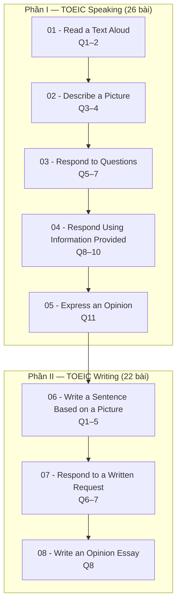

# TOEIC Speaking & Writing

Khóa học luyện thi TOEIC Speaking & Writing, bám sát từng dạng câu hỏi trong đề thi thật — từ đọc to đoạn văn, mô tả tranh, trả lời câu hỏi, đến viết câu theo tranh, trả lời email và viết luận nêu quan điểm.

- **Số module:** 8 (5 Speaking + 3 Writing)
- **Số bài video:** 48
- **Tài liệu PDF:** 8 bộ (mỗi module 1 bộ)
- **Nguồn:** thư mục Google Drive của khóa học

## Tổng quan

| Phần | Số module | Số bài video | Tài liệu PDF |
|---|---:|---:|---:|
| TOEIC Speaking | 5 | 26 | 5 |
| TOEIC Writing | 3 | 22 | 3 |
| **Tổng cộng** | **8** | **48** | **8** |

## Cấu trúc khóa học

### Phần I — TOEIC Speaking

| Module | Dạng câu hỏi | Số bài | Drive |
|---|---|---:|---|
| [01](01 - Questions 1-2 - Read a Text Aloud/README.md) | Questions 1–2: Read a Text Aloud | 4 | [📁](https://drive.google.com/drive/folders/1DlbhNXNHK8hf0lBII6LoknJ2Gv0RrSSo) |
| [02](02 - Questions 3-4 - Describe a Picture/README.md) | Questions 3–4: Describe a Picture | 5 | [📁](https://drive.google.com/drive/folders/1xelTSuK11OEAsfKgD0V-dFQLh5ClNBIh) |
| [03](03 - Questions 5-7 - Respond to Questions/README.md) | Questions 5–7: Respond to Questions | 5 | [📁](https://drive.google.com/drive/folders/1XSX5Ggh88kvytjrOWoHOcS3j16Jpkrs0) |
| [04](04 - Questions 8-10 - Respond to Questions Using Information Provided/README.md) | Questions 8–10: Respond to Questions Using Information Provided | 6 | [📁](https://drive.google.com/drive/folders/1dUtpBvPQ_cEJIBFZ1xrOkZe0WNFXL7Ld) |
| [05](05 - Question 11 - Express an Opinion/README.md) | Question 11: Express an Opinion | 6 | [📁](https://drive.google.com/drive/folders/1yomrlloNuFdyNHUEATH0jBIkv1FcYyoF) |

### Phần II — TOEIC Writing

| Module | Dạng câu hỏi | Số bài | Drive |
|---|---|---:|---|
| [06](06 - Questions 1-5 - Write a Sentence Based on a Picture/README.md) | Questions 1–5: Write a Sentence Based on a Picture | 6 | [📁](https://drive.google.com/drive/folders/1NTxk7dKCrzQXzTy0CSE5nCc8Feq9TPJn) |
| [07](07 - Questions 6-7 - Respond to a Written Request/README.md) | Questions 6–7: Respond to a Written Request | 9 | [📁](https://drive.google.com/drive/folders/1iQCfl4pfIvyn_YT8QYVsZyj7XFRyjnJ9) |
| [08](08 - Question 8 - Write an Opinion Essay/README.md) | Question 8: Write an Opinion Essay | 7 | [📁](https://drive.google.com/drive/folders/1H_VMfsFP-fEG1W8OptayKrsEZdKFMPic) |

## Lộ trình học

## Cách sử dụng thư mục ghi chú này

- Mỗi module có `README.md` liệt kê danh sách bài học, mã bài gốc và liên kết thư mục Drive.
- Mỗi bài học là một file `NNN - Tên bài.md` với khung 6 phần: **Mục tiêu bài học → Nội dung chính → Chiến lược làm bài & mẫu câu → Bài tập thực hành → Lưu ý & lỗi thường gặp → Tóm tắt**.
- **Đánh số:** file dùng số liên tục `001–048` theo thứ tự học. Số hiệu gốc trong Drive (`Video 01–26` cho Speaking, `Unit 01–25` cho Writing) được giữ trong ô **Mã bài gốc** ở đầu mỗi file.
- **Trạng thái:** toàn bộ 48 bài hiện ở dạng khung (tiêu đề + mục lục), nội dung sẽ được điền khi học.

## Ghi chú về nguồn

- Thư mục Drive gốc **không có Unit 07–09** — khóa học chuyển thẳng từ Unit 06 (Module 06) sang Unit 10 (Module 07). Đánh số liên tục `001–048` trong repo đã bỏ qua khoảng trống này.
- Các tệp quảng cáo, ảnh QR nhóm Zalo và tệp giới thiệu website trong Drive đã được loại khỏi danh sách bài học.
- 8 file PDF đi kèm nằm trong thư mục Drive tương ứng của từng module, không được lưu trong repo này.

## Tiến độ ghi chú

- [ ] Module 01 — Read a Text Aloud (001–004)
- [ ] Module 02 — Describe a Picture (005–009)
- [ ] Module 03 — Respond to Questions (010–014)
- [ ] Module 04 — Respond Using Information Provided (015–020)
- [ ] Module 05 — Express an Opinion (021–026)
- [ ] Module 06 — Write a Sentence Based on a Picture (027–032)
- [ ] Module 07 — Respond to a Written Request (033–041)
- [ ] Module 08 — Write an Opinion Essay (042–048)
