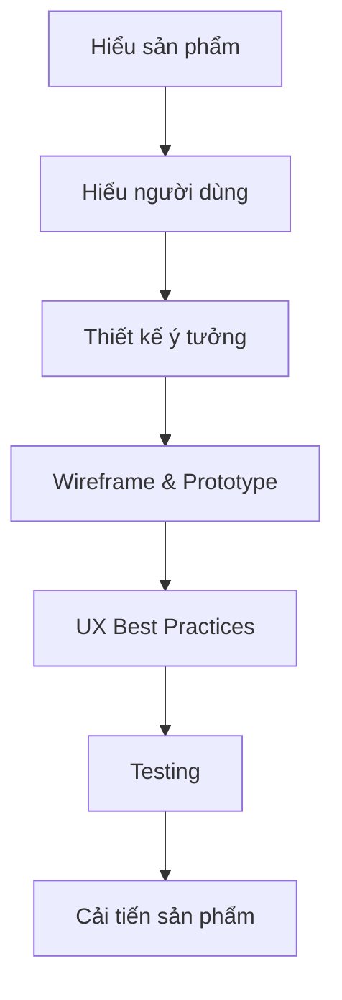

# 003 - Quy trình UX tổng quát

**Module:** Module 01 - Tổng quan UX Design
**Nhóm nội dung:** UX foundation
**Nguồn roadmap:** UX Design Roadmap
**Thứ tự trong module:** 003
**Thời lượng gợi ý:** 35-45 phút

---

## 1. Tóm tắt
Bài này tập trung vào **Quy trình UX tổng quát** trong lộ trình UX Design. Sau bài học, bạn nên hiểu ý nghĩa của khái niệm, biết khi nào dùng nó và tạo được một artifact nhỏ để áp dụng vào project cuối khóa.

## 2. Mục tiêu học tập
- Giải thích được **Quy trình UX tổng quát** bằng ngôn ngữ đơn giản.
- Nhận biết vai trò của bài học trong quy trình UX tổng quát.
- Tạo một ghi chú hoặc ví dụ nhỏ để áp dụng vào project cuối khóa.

## 3. Nội dung roadmap

## 4. Bài tập thực hành
- Tóm tắt bài học trong 5 dòng bằng lời của bạn.
- Tạo một ví dụ áp dụng vào app học tập cá nhân trong project cuối khóa.
- Ghi lại một câu hỏi hoặc giả định cần kiểm chứng bằng user research/testing.

## 5. Artifact nên tạo
- Study note
- Example flow
- UX vocabulary list

## 6. Câu hỏi tự kiểm tra
- Tôi có thể giải thích **Quy trình UX tổng quát** cho một người mới học UX không?
- Khái niệm này ảnh hưởng đến hành vi, cảm xúc, luồng thao tác hoặc kết quả kinh doanh nào?
- Nếu áp dụng vào app học tập cá nhân, tôi sẽ thay đổi màn hình hoặc flow nào trước?

## 7. Tổng kết
**Quy trình UX tổng quát** là một mảnh trong quy trình UX từ hiểu người dùng đến đo lường tác động. Hãy gắn bài học với một artifact cụ thể để kiến thức không dừng ở lý thuyết.
