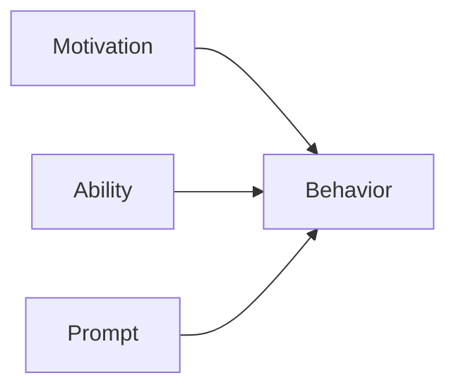

# 002 - BJ Fogg’s Behavior Model

**Module:** Module 02 - Human Decision Making
**Nhóm nội dung:** Behavioral UX
**Nguồn roadmap:** UX Design Roadmap
**Thứ tự trong module:** 002
**Thời lượng gợi ý:** 35-45 phút

---

## 1. Tóm tắt
Bài này tập trung vào **BJ Fogg’s Behavior Model** trong lộ trình UX Design. Sau bài học, bạn nên hiểu ý nghĩa của khái niệm, biết khi nào dùng nó và tạo được một artifact nhỏ để áp dụng vào project cuối khóa.

## 2. Mục tiêu học tập
- Giải thích được **BJ Fogg’s Behavior Model** trong bối cảnh ra quyết định của người dùng.
- Nhận biết motivation, ability, prompt, cue hoặc reward trong một luồng sản phẩm.
- Đề xuất một thay đổi UX nhỏ giúp hành vi mong muốn dễ xảy ra hơn.

## 3. Nội dung roadmap
Mô hình BJ Fogg cho rằng một hành vi xảy ra khi có đủ 3 yếu tố:

### 3 yếu tố chính

* **Motivation**: Người dùng có đủ động lực không?
* **Ability**: Người dùng có dễ thực hiện hành động không?
* **Prompt**: Có lời nhắc hoặc tín hiệu đúng lúc không?

Ví dụ:

* Muốn người dùng đăng ký tài khoản:

  * Tạo động lực: nêu lợi ích.
  * Tăng khả năng: form ngắn, dễ điền.
  * Prompt: nút “Đăng ký miễn phí”.

## 4. Bài tập thực hành
- Chọn một màn hình app quen thuộc và xác định cue, motivation, ability, prompt hoặc reward.
- Đề xuất một thay đổi nhỏ làm hành động chính dễ hơn nhưng không ép buộc người dùng.
- Ghi lại giả thuyết UX có thể kiểm thử sau này.

## 5. Artifact nên tạo
- Behavior analysis note
- UX hypothesis
- Prompt/cue checklist

## 6. Câu hỏi tự kiểm tra
- Tôi có thể giải thích **BJ Fogg’s Behavior Model** cho một người mới học UX không?
- Khái niệm này ảnh hưởng đến hành vi, cảm xúc, luồng thao tác hoặc kết quả kinh doanh nào?
- Nếu áp dụng vào app học tập cá nhân, tôi sẽ thay đổi màn hình hoặc flow nào trước?

## 7. Tổng kết
**BJ Fogg’s Behavior Model** là một mảnh trong quy trình UX từ hiểu người dùng đến đo lường tác động. Hãy gắn bài học với một artifact cụ thể để kiến thức không dừng ở lý thuyết.
