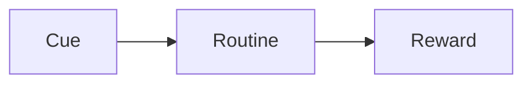

# 004 - Cue Routine Reward Model

**Module:** Module 03 - Behavior Change Strategies
**Nhóm nội dung:** Behavioral UX
**Nguồn roadmap:** UX Design Roadmap
**Thứ tự trong module:** 004
**Thời lượng gợi ý:** 35-45 phút

---

## 1. Tóm tắt
Bài này tập trung vào **Cue Routine Reward Model** trong lộ trình UX Design. Sau bài học, bạn nên hiểu ý nghĩa của khái niệm, biết khi nào dùng nó và tạo được một artifact nhỏ để áp dụng vào project cuối khóa.

## 2. Mục tiêu học tập
- Giải thích được **Cue Routine Reward Model** trong bối cảnh ra quyết định của người dùng.
- Nhận biết motivation, ability, prompt, cue hoặc reward trong một luồng sản phẩm.
- Đề xuất một thay đổi UX nhỏ giúp hành vi mong muốn dễ xảy ra hơn.

## 3. Nội dung roadmap
Mô hình thói quen gồm:

Ví dụ:

* Cue: thấy thông báo.
* Routine: mở điện thoại.
* Reward: nhận thông tin mới.

Ứng dụng:

* Muốn thay đổi thói quen, có thể thay routine nhưng giữ cue và reward.

## 4. Bài tập thực hành
- Chọn một màn hình app quen thuộc và xác định cue, motivation, ability, prompt hoặc reward.
- Đề xuất một thay đổi nhỏ làm hành động chính dễ hơn nhưng không ép buộc người dùng.
- Ghi lại giả thuyết UX có thể kiểm thử sau này.

## 5. Artifact nên tạo
- Behavior analysis note
- UX hypothesis
- Prompt/cue checklist

## 6. Câu hỏi tự kiểm tra
- Tôi có thể giải thích **Cue Routine Reward Model** cho một người mới học UX không?
- Khái niệm này ảnh hưởng đến hành vi, cảm xúc, luồng thao tác hoặc kết quả kinh doanh nào?
- Nếu áp dụng vào app học tập cá nhân, tôi sẽ thay đổi màn hình hoặc flow nào trước?

## 7. Tổng kết
**Cue Routine Reward Model** là một mảnh trong quy trình UX từ hiểu người dùng đến đo lường tác động. Hãy gắn bài học với một artifact cụ thể để kiến thức không dừng ở lý thuyết.
