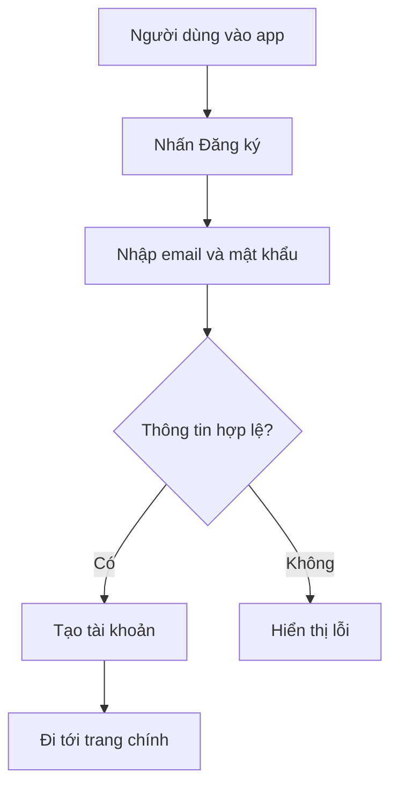

# 005 - Simple Flowchart

**Module:** Module 05 - Conceptual Design
**Nhóm nội dung:** Conceptual design
**Nguồn roadmap:** UX Design Roadmap
**Thứ tự trong module:** 005
**Thời lượng gợi ý:** 35-45 phút

---

## 1. Tóm tắt
Bài này tập trung vào **Simple Flowchart** trong lộ trình UX Design. Sau bài học, bạn nên hiểu ý nghĩa của khái niệm, biết khi nào dùng nó và tạo được một artifact nhỏ để áp dụng vào project cuối khóa.

## 2. Mục tiêu học tập
- Chuyển **Simple Flowchart** thành yêu cầu, user story hoặc flow rõ ràng.
- Kết nối nhu cầu người dùng với tính năng và kết quả sản phẩm.
- Tạo artifact đủ rõ để team có thể thảo luận trước khi thiết kế giao diện.

## 3. Nội dung roadmap
Ví dụ flow đăng ký tài khoản:

## 4. Bài tập thực hành
- Viết 3-5 user stories hoặc tạo một flowchart nhỏ cho chức năng liên quan.
- Đánh dấu điểm người dùng có thể bị kẹt, rối hoặc thiếu thông tin.
- Chuyển flow thành checklist cần xác nhận trước khi wireframe.

## 5. Artifact nên tạo
- Product backlog
- User stories
- User flow hoặc flowchart

## 6. Câu hỏi tự kiểm tra
- Tôi có thể giải thích **Simple Flowchart** cho một người mới học UX không?
- Khái niệm này ảnh hưởng đến hành vi, cảm xúc, luồng thao tác hoặc kết quả kinh doanh nào?
- Nếu áp dụng vào app học tập cá nhân, tôi sẽ thay đổi màn hình hoặc flow nào trước?

## 7. Tổng kết
**Simple Flowchart** là một mảnh trong quy trình UX từ hiểu người dùng đến đo lường tác động. Hãy gắn bài học với một artifact cụ thể để kiến thức không dừng ở lý thuyết.
