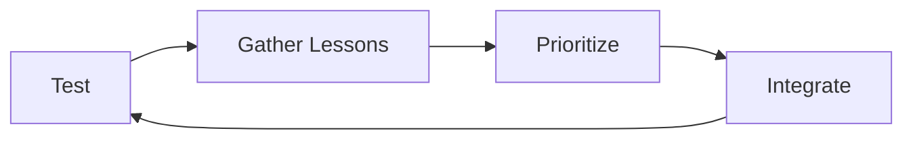

# 004 - Gather Lessons, Prioritize & Integrate

**Module:** Module 09 - Measuring the Impact
**Nhóm nội dung:** UX measurement
**Nguồn roadmap:** UX Design Roadmap
**Thứ tự trong module:** 004
**Thời lượng gợi ý:** 35-45 phút

---

## 1. Tóm tắt
Bài này tập trung vào **Gather Lessons, Prioritize & Integrate** trong lộ trình UX Design. Sau bài học, bạn nên hiểu ý nghĩa của khái niệm, biết khi nào dùng nó và tạo được một artifact nhỏ để áp dụng vào project cuối khóa.

## 2. Mục tiêu học tập
- Đo được tác động của **Gather Lessons, Prioritize & Integrate** thay vì chỉ dựa vào cảm giác.
- Chọn metric, giả thuyết và phương pháp test phù hợp.
- Ưu tiên bài học từ dữ liệu rồi tích hợp lại vào sản phẩm.

## 3. Nội dung roadmap
Sau khi test:

* Thu thập bài học.
* Ưu tiên thay đổi quan trọng.
* Tích hợp vào sản phẩm.
* Tiếp tục đo lường.

## 4. Bài tập thực hành
- Viết giả thuyết test theo format: nếu thay X, metric Y sẽ thay đổi vì Z.
- Chọn metric chính, metric phụ và điều kiện dừng test.
- Ghi lại cách ưu tiên bài học sau khi có kết quả.

## 5. Artifact nên tạo
- A/B test plan
- Metric tree
- Learning backlog

## 6. Câu hỏi tự kiểm tra
- Tôi có thể giải thích **Gather Lessons, Prioritize & Integrate** cho một người mới học UX không?
- Khái niệm này ảnh hưởng đến hành vi, cảm xúc, luồng thao tác hoặc kết quả kinh doanh nào?
- Nếu áp dụng vào app học tập cá nhân, tôi sẽ thay đổi màn hình hoặc flow nào trước?

## 7. Tổng kết
**Gather Lessons, Prioritize & Integrate** là một mảnh trong quy trình UX từ hiểu người dùng đến đo lường tác động. Hãy gắn bài học với một artifact cụ thể để kiến thức không dừng ở lý thuyết.
