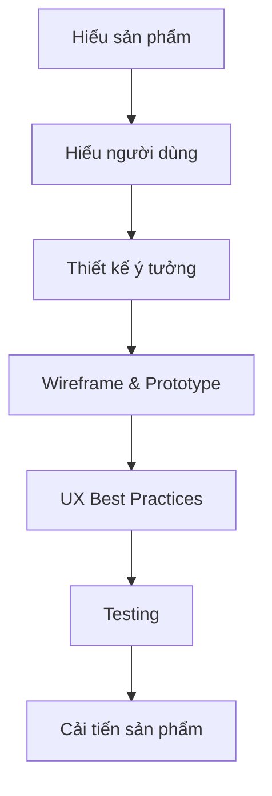
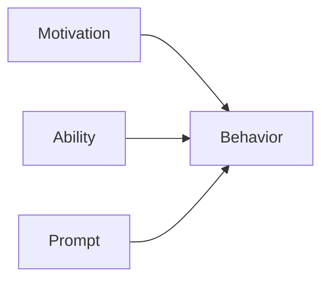
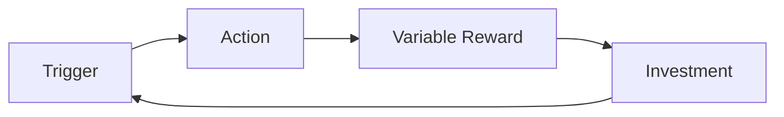
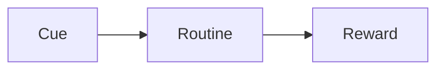
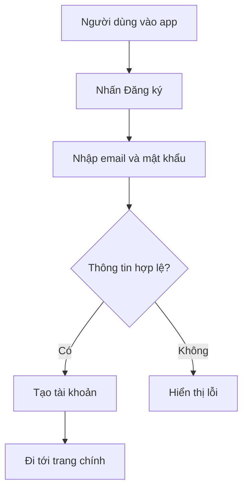
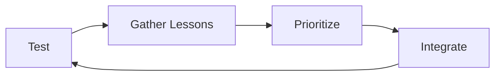

Dưới đây là dữ liệu đã cào và chuẩn hóa từ roadmap **UX Design**. Roadmap gốc có 1 trang, gồm các nhánh chính: **Human Decision Making, Behavior Change Strategies, Understanding the Product, Conceptual Design, Prototyping, UX Best Practices, Measuring the Impact**. 

# Khóa học UX Design theo roadmap.sh

## Module 1: Tổng quan UX Design

### Bài 1. UX Design là gì?

* UX Design là quá trình thiết kế trải nghiệm người dùng khi họ tương tác với sản phẩm.
* Mục tiêu không chỉ là giao diện đẹp mà còn phải dễ dùng, rõ ràng, hiệu quả và tạo giá trị cho người dùng.

### Bài 2. Vai trò của UX Designer

* Hiểu người dùng.
* Phân tích hành vi.
* Thiết kế luồng trải nghiệm.
* Tạo wireframe, prototype.
* Kiểm thử và cải tiến sản phẩm.

### Bài 3. Quy trình UX tổng quát



---

# Module 2: Human Decision Making

## Bài 1. Các thuật ngữ cần biết

### Nudge Theory

* Lý thuyết “thúc đẩy nhẹ”.
* Thiết kế môi trường để người dùng dễ đưa ra quyết định tốt hơn mà không ép buộc họ.

Ví dụ:

* Đặt nút “Tiếp tục” nổi bật hơn.
* Mặc định chọn phương án tốt hơn cho người dùng.

### Persuasive Technology

* Công nghệ thuyết phục người dùng thực hiện hành động.
* Ví dụ: app học tập nhắc học mỗi ngày, app sức khỏe nhắc uống nước.

### Behavior Design

* Thiết kế sản phẩm dựa trên hành vi người dùng.
* Mục tiêu là giúp người dùng hình thành hành vi mới hoặc thay đổi hành vi cũ.

### Behavioral Science

* Khoa học hành vi.
* Nghiên cứu cách con người suy nghĩ, quyết định và hành động.

### Behavioral Economics

* Kinh tế học hành vi.
* Phân tích cách con người ra quyết định trong điều kiện không hoàn toàn lý trí.

---

## Bài 2. BJ Fogg’s Behavior Model

Mô hình BJ Fogg cho rằng một hành vi xảy ra khi có đủ 3 yếu tố:



### 3 yếu tố chính

* **Motivation**: Người dùng có đủ động lực không?
* **Ability**: Người dùng có dễ thực hiện hành động không?
* **Prompt**: Có lời nhắc hoặc tín hiệu đúng lúc không?

Ví dụ:

* Muốn người dùng đăng ký tài khoản:

  * Tạo động lực: nêu lợi ích.
  * Tăng khả năng: form ngắn, dễ điền.
  * Prompt: nút “Đăng ký miễn phí”.

---

## Bài 3. CREATE Action Funnel

CREATE Action Funnel giúp phân tích quá trình người dùng đi từ nhận thức đến hành động.

Một hành động thường cần:

* Cue: tín hiệu kích hoạt.
* Reaction: phản ứng ban đầu.
* Evaluation: đánh giá có nên làm không.
* Ability: khả năng thực hiện.
* Timing: đúng thời điểm.
* Experience: trải nghiệm sau hành động.

---

## Bài 4. Dual Process Theory

Dual Process Theory chia tư duy con người thành 2 hệ:

| Hệ tư duy | Đặc điểm                   | Ví dụ trong UX                           |
| --------- | -------------------------- | ---------------------------------------- |
| System 1  | Nhanh, cảm tính, trực giác | Người dùng bấm nút vì màu sắc nổi bật    |
| System 2  | Chậm, lý trí, phân tích    | Người dùng đọc kỹ bảng giá trước khi mua |

Ứng dụng trong UX:

* Thiết kế rõ ràng cho System 1.
* Cung cấp thông tin đầy đủ cho System 2.

---

## Bài 5. Spectrum of Thinking Interventions

Đây là nhóm kỹ thuật can thiệp vào suy nghĩ người dùng:

* Giúp người dùng chú ý.
* Giúp người dùng suy nghĩ kỹ hơn.
* Giúp người dùng tránh quyết định sai.
* Giúp người dùng hành động đúng lúc.

---

# Module 3: Behavior Change Strategies

## Bài 1. Classifying Behavior

Trước khi thay đổi hành vi, cần phân loại hành vi:

| Loại hành vi      | Ý nghĩa                   |
| ----------------- | ------------------------- |
| New Behavior      | Hành vi mới cần tạo       |
| Existing Behavior | Hành vi đã có             |
| Habit Change      | Thay đổi thói quen        |
| Conscious Action  | Hành động có ý thức       |
| Automatic Action  | Hành động tự động/lặp lại |

---

## Bài 2. BJ Fogg’s Behavior Grid

Behavior Grid giúp phân loại hành vi theo:

* Hành vi mới.
* Hành vi quen thuộc.
* Hành vi cần tăng.
* Hành vi cần giảm.
* Hành vi cần dừng lại.

Ví dụ:

* App học tiếng Anh muốn người dùng học mỗi ngày.
* Hành vi cần tạo: mở app mỗi sáng.
* Hành vi cần duy trì: làm bài luyện tập.
* Hành vi cần giảm: bỏ học giữa chừng.

---

## Bài 3. Nir Eyal’s Hook Model

Hook Model gồm 4 bước:



### Giải thích

* **Trigger**: Tín hiệu kích hoạt.
* **Action**: Người dùng thực hiện hành động.
* **Variable Reward**: Phần thưởng thay đổi, tạo sự tò mò.
* **Investment**: Người dùng đầu tư thời gian, dữ liệu, công sức.

Ví dụ:

* Mạng xã hội:

  * Trigger: thông báo.
  * Action: mở app.
  * Reward: xem lượt thích/bình luận.
  * Investment: đăng bài, theo dõi người khác.

---

## Bài 4. Cue Routine Reward Model

Mô hình thói quen gồm:



Ví dụ:

* Cue: thấy thông báo.
* Routine: mở điện thoại.
* Reward: nhận thông tin mới.

Ứng dụng:

* Muốn thay đổi thói quen, có thể thay routine nhưng giữ cue và reward.

---

## Bài 5. Các chiến lược thay đổi hành vi

### Cheating

Các kỹ thuật giúp người dùng hành động dễ hơn:

* Defaulting: đặt mặc định có lợi.
* Making it incidental: biến hành động thành việc phụ, ít tốn công.
* Automate the act of repetition: tự động hóa hành động lặp lại.

### Make or Change Habits

* Giúp người dùng tránh cue xấu.
* Thay routine cũ bằng routine mới.
* Dùng ý thức để can thiệp.
* Dùng mindfulness để tránh hành động theo cue.
* Crowd out old habit with new behavior: thay thói quen cũ bằng hành vi mới.

### Support Conscious Action

* Educate & Encourage User: giáo dục và khuyến khích người dùng.
* Help User think about their Action: giúp người dùng suy nghĩ kỹ trước khi hành động.

---

# Module 4: Understanding the Product

## Bài 1. Clarify Product

Trước khi thiết kế UX, cần làm rõ sản phẩm:

| Thành phần     | Câu hỏi cần trả lời              |
| -------------- | -------------------------------- |
| Target Outcome | Sản phẩm muốn đạt kết quả gì?    |
| Target Actor   | Ai là người thực hiện hành động? |
| Target Action  | Người dùng cần làm hành động gì? |

Ví dụ:

* Sản phẩm: app học tiếng Anh.
* Target Outcome: người dùng học đều mỗi ngày.
* Target Actor: sinh viên, người đi làm.
* Target Action: hoàn thành 1 bài luyện tập mỗi ngày.

---

## Bài 2. Define Target Users

Cần xác định:

* Người dùng là ai?
* Họ có vấn đề gì?
* Họ đang dùng giải pháp nào?
* Họ có động lực gì?
* Họ sợ điều gì?
* Họ dùng sản phẩm trong bối cảnh nào?

---

## Bài 3. Create User Personas

Persona là chân dung đại diện cho nhóm người dùng.

Ví dụ persona:

| Mục         | Nội dung                                |
| ----------- | --------------------------------------- |
| Tên         | Minh                                    |
| Tuổi        | 22                                      |
| Nghề nghiệp | Sinh viên IT                            |
| Mục tiêu    | Học UX để làm sản phẩm tốt hơn          |
| Nỗi đau     | Không biết bắt đầu từ đâu               |
| Hành vi     | Thường học qua video và thực hành Figma |

---

## Bài 4. Business Model

### Existing Business Model

Nếu sản phẩm đã có mô hình kinh doanh:

* Phân tích Business Model Canvas.
* Phân tích Lean Canvas.
* Xác định giá trị cốt lõi.
* Xác định phân khúc khách hàng.

### New Business Model

Nếu là sản phẩm mới:

* Dùng Business Model Inspirator.
* Phân tích đối thủ.
* Dùng Five Forces Model.
* Dùng SWOT Analysis.

---

## Bài 5. Competitor Analysis

Phân tích đối thủ giúp biết:

* Đối thủ đang làm gì tốt?
* Điểm yếu của họ là gì?
* Người dùng phàn nàn điều gì?
* Sản phẩm của mình khác biệt ở đâu?

---

## Bài 6. Five Forces Model

5 lực lượng cạnh tranh:

* Đối thủ hiện tại.
* Đối thủ mới gia nhập.
* Sản phẩm thay thế.
* Quyền lực của khách hàng.
* Quyền lực của nhà cung cấp.

---

## Bài 7. SWOT Analysis

| Thành phần    | Ý nghĩa           |
| ------------- | ----------------- |
| Strengths     | Điểm mạnh         |
| Weaknesses    | Điểm yếu          |
| Opportunities | Cơ hội            |
| Threats       | Rủi ro/thách thức |

---

# Module 5: Conceptual Design

## Bài 1. Product Backlog

Product Backlog là danh sách các tính năng, yêu cầu, cải tiến cần làm.

Ví dụ:

* Đăng ký tài khoản.
* Đăng nhập.
* Tạo hồ sơ người dùng.
* Lưu tiến độ học.
* Nhắc học mỗi ngày.

---

## Bài 2. User Stories

User Story mô tả nhu cầu dưới góc nhìn người dùng.

Cấu trúc:

```text
As a [người dùng],
I want to [hành động],
So that [lợi ích].
```

Ví dụ:

```text
As a learner,
I want to receive daily reminders,
So that I can maintain my study habit.
```

---

## Bài 3. Nguyên tắc viết User Story

Roadmap nhấn mạnh:

* Giữ ngắn gọn, đơn giản.
* Dễ hiểu.
* Dễ hoàn thành.
* Tiến độ phải rõ ràng với người dùng.
* Tiến độ phải có ý nghĩa để tạo động lực.
* Kết quả hoàn thành phải được hiển thị rõ.

---

## Bài 4. Deliverables trong Conceptual Design

Các deliverables quan trọng:

* Customer Experience Map by Mel Edwards.
* Simple Flowchart.
* Event-driven Process Chain Model, viết tắt EPC.
* Business Process Model & Notation, viết tắt BPMN.

---

## Bài 5. Simple Flowchart

Ví dụ flow đăng ký tài khoản:



---

# Module 6: Prototyping

## Bài 1. Prototyping là gì?

Prototype là bản mô phỏng sản phẩm trước khi code thật.

Mục tiêu:

* Kiểm tra ý tưởng.
* Kiểm tra luồng người dùng.
* Lấy feedback sớm.
* Giảm rủi ro khi phát triển.

---

## Bài 2. Good Layout Rules

Một layout tốt cần:

* Rõ ràng.
* Có phân cấp thị giác.
* Dễ đọc.
* Khoảng cách hợp lý.
* Ít gây rối mắt.
* Người dùng biết phải làm gì tiếp theo.

---

## Bài 3. Wireframing

Wireframe là bản thiết kế khung giao diện.

Có thể gồm:

* Vị trí nút.
* Vị trí text.
* Vị trí ảnh.
* Luồng chuyển trang.
* Cấu trúc nội dung.

---

## Bài 4. Công cụ thiết kế UX/UI

Theo roadmap, các công cụ nổi bật gồm:

* Figma.
* Adobe XD.
* Sketch.
* Balsamiq.

### Gợi ý học

* Bắt đầu với Figma vì phổ biến, dễ dùng và có bản miễn phí.
* Dùng Balsamiq cho wireframe nhanh.
* Dùng Adobe XD hoặc Sketch nếu môi trường làm việc yêu cầu.

---

# Module 7: UX Patterns

## Bài 1. Khi attention của người dùng ít và dễ mất

Các pattern nên dùng:

* Call to Action.
* Status Reports.
* How-to Tips.
* Reminders & Planning Prompts.

Ví dụ:

* Nút “Bắt đầu ngay”.
* Thanh tiến độ.
* Gợi ý “Bạn chỉ cần 3 phút để hoàn thành”.
* Nhắc người dùng quay lại học.

---

## Bài 2. Khi có nhiều cơ hội ảnh hưởng người dùng

Các pattern nên dùng:

* Decision-Making Support.
* Behavior Change Games.
* Gamification.
* Planners.
* Reminders.
* Social Sharing.
* Goal Trackers.
* Tutorials.

Ví dụ:

* App học tập có streak.
* App fitness có goal tracker.
* App tài chính có planner.
* App cộng đồng có social sharing.

---

# Module 8: UX Best Practices

## Bài 1. Getting Users Attention

Cách thu hút sự chú ý:

* Tell user what the action is and ask for it.
* Clear the page of distractions.
* Make it clear where to act.

Ví dụ:

* Trang thanh toán chỉ nên tập trung vào hành động thanh toán.
* Nút chính cần nổi bật.
* Không đặt quá nhiều lựa chọn phụ.

---

## Bài 2. Getting Positive Intuitive Reaction

Cách tạo phản ứng trực giác tích cực:

* Make UI professional and beautiful.
* Deploy strong authority on subject.
* Be authentic and personal.
* Deploy social proof.

Ví dụ:

* Giao diện đẹp và đáng tin.
* Có đánh giá từ người dùng thật.
* Có chuyên gia hoặc tổ chức uy tín xác nhận.

---

## Bài 3. Get a Favorable Conscious Evaluation

Cách giúp người dùng đánh giá có lợi:

* Prime user-relevant associations.
* Avoid direct payments.
* Avoid choice overload.
* Leverage loss-aversion.
* Use peer comparisons.
* Use competition.
* Avoid cognitive overhead.

Ví dụ:

* Không đưa quá nhiều gói giá.
* Làm rõ lợi ích.
* So sánh với người dùng tương tự.
* Giảm lượng thông tin người dùng phải xử lý.

---

## Bài 4. Creating Urgency to Act Now

Cách tạo sự khẩn cấp:

* Frame text to avoid temporal myopia.
* Remind of prior commitment to act.
* Make commitment to friends.
* Make reward scarce.

Ví dụ:

* “Ưu đãi kết thúc trong hôm nay”.
* “Bạn đã cam kết học 20 phút mỗi ngày”.
* “Chia sẻ mục tiêu với bạn bè”.
* “Chỉ còn 3 suất miễn phí”.

---

## Bài 5. Make sure Users can do it Easily

Cách giúp người dùng hành động dễ dàng:

* Elicit implementation intentions.
* Default everything.
* Lessen the burden of action/info.
* Deploy peer comparisons.

Ví dụ:

* Tự động điền thông tin nếu có thể.
* Mặc định chọn phương án phổ biến.
* Chia form dài thành nhiều bước nhỏ.
* Hiển thị “80% người dùng chọn gói này”.

---

# Module 9: Measuring the Impact

## Bài 1. Vì sao phải đo lường UX?

UX không chỉ dựa vào cảm giác. Cần đo để biết:

* Người dùng có hoàn thành mục tiêu không?
* Họ có bị rối không?
* Tính năng mới có cải thiện hành vi không?
* Thiết kế có tạo ra kết quả kinh doanh không?

---

## Bài 2. Incremental A/B Testing

A/B Testing là so sánh 2 phiên bản.

Ví dụ:

* Phiên bản A: nút “Đăng ký”.
* Phiên bản B: nút “Bắt đầu miễn phí”.
* Đo xem phiên bản nào có tỉ lệ click cao hơn.

---

## Bài 3. Multivariate Testing

Multivariate Testing kiểm tra nhiều yếu tố cùng lúc.

Ví dụ:

* Màu nút.
* Tiêu đề.
* Hình ảnh.
* Vị trí CTA.

Mục tiêu là tìm tổ hợp hiệu quả nhất.

---

## Bài 4. Gather Lessons, Prioritize & Integrate

Sau khi test:

* Thu thập bài học.
* Ưu tiên thay đổi quan trọng.
* Tích hợp vào sản phẩm.
* Tiếp tục đo lường.



---

# Lộ trình học đề xuất trong 8 tuần

| Tuần   | Nội dung                                          |
| ------ | ------------------------------------------------- |
| Tuần 1 | Tổng quan UX Design, Human Decision Making        |
| Tuần 2 | Behavior Design, BJ Fogg Model, Hook Model        |
| Tuần 3 | Understanding the Product, Target Users, Personas |
| Tuần 4 | Business Model, Competitor Analysis, SWOT         |
| Tuần 5 | Conceptual Design, Product Backlog, User Stories  |
| Tuần 6 | Flowchart, Customer Journey, BPMN/EPC             |
| Tuần 7 | Wireframe, Figma, Prototyping                     |
| Tuần 8 | UX Best Practices, A/B Testing, cải tiến sản phẩm |

---

# Project thực hành cuối khóa

## Đề bài

Thiết kế UX cho một app học tập cá nhân.

## Yêu cầu

* Xác định target user.
* Tạo user persona.
* Viết 10 user stories.
* Vẽ user flow.
* Tạo wireframe.
* Làm prototype bằng Figma.
* Áp dụng ít nhất 5 UX best practices.
* Đề xuất 3 A/B tests.

## Deliverables

* Persona.
* Customer Journey Map.
* Flowchart.
* Wireframe.
* Prototype.
* Testing plan.
* UX improvement report.
